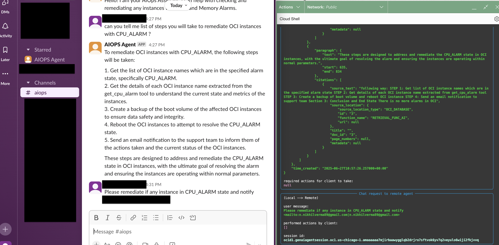
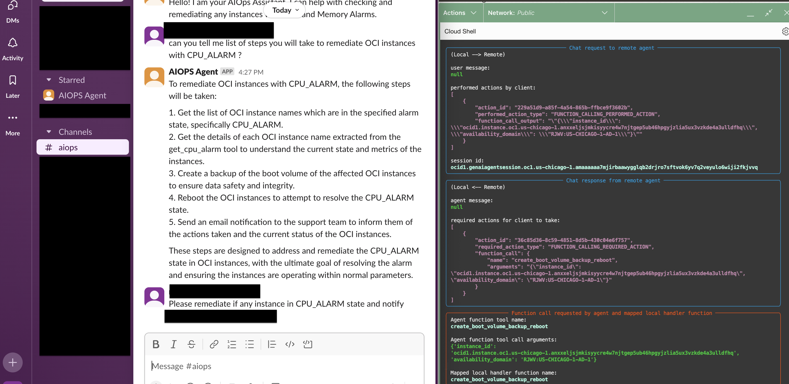
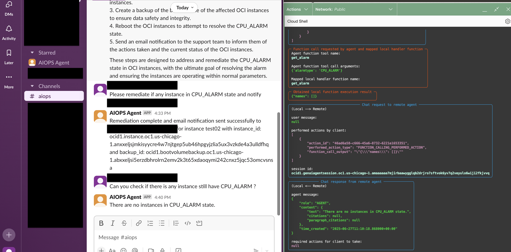

# Test and Validate the AIOps Agent

## Introduction

In this Lab, we will test our AIOPS Agent that we deployed in Lab 6.

Estimated Time: 10 minutes

### Prerequisites

This lab assumes you have:

* All previous labs successfully completed

## Task 1: Initialize Slack App

1. You have to initialize Slack App, this allows communication between Slack, Local Client functions and Remote Generative AI Agent.

2. Create Slack Channel and Add AIOPS app in this channel.

## Task 2: Test the AIOPS Agent

1. Query1 : **Hi**

2. Query2: **can you tell me list of steps you will take to remediate OCI instances with CPU_ALARM ?**

3. Query3: **Please remediate if any instance in CPU_ALARM state and notify <n.nikhilverma89@gmail.com>.**

Identified test02 instance in **CPU_ALARM** state.

Get all instance details like **instance_id** and **availability domain**

Backup and reboot initiated

Email Notification triggered

4. Query4: **Can you check if there is any instance still have CPU_ALARM ?**
Identified no instance in CPU_ALARM state.

## Task 2: Validate OCI Instance

Let's validate OCI Instance for all steps execution.
Full Backup completed by Agent.

Checked CPU metric and CPU utilization dropped to 10%.

Email Notification received

Alarm status showing no alarms

In this way you can integrate OCI Generative AI Agents with your Runbooks and maximize efficienct in IT operations.

## Acknowledgements

* **Author**
    **Nikhil Verma**, Principal Cloud Architect, NACIE
