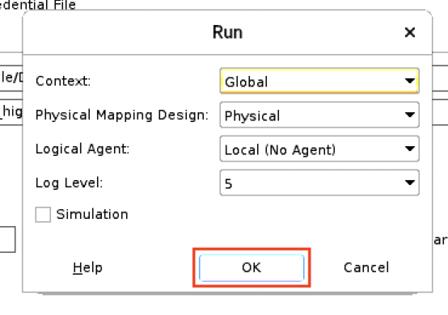

# Configure Integrations and load data into ADW using ODI

## Introduction

In this lab, you will configure and run the ODI integrations. For the EBS data source, you will use smart import in ODI and use an available mapping. For the ADW data source, you will create the mapping between the source and destination databases.  

Estimated Lab Time: 60 minutes

### Objectives

- Use Smart Import to create an integration that moves data from your EBS to the destination data warehouse.
- Create mappings to move data from database to ADW.
- Run integrations.

### Prerequisites

- Credentials and details of the EBS database, the source ADW, the target ADW and the ODI repositories.

## Task 1: Use Smart Import to import mappings and other objects

1. Click on the **Designer** tab. Press the dropdown in the top right of the **Designer** pane as shown in the image below. Then, select **Import**.

    
    
2.	In the menu that opens, select **Smart Import** and click on **OK**.

    
    
3.	Click on the magnifying glass icon to select the path to the **EBS_ODI_ADW.xml** file. You downloaded it to the home folder of the oracle user earlier. Hence, the path should be **/home/oracle/EBS_ODI_ADW.xml**. After finding the file, click on the **Next** button.

    

    
    
    

4.	Validate that the **Smart Import – Step 2 of 3** gets prompted with no issues. If yes, then click on **Next** and in the next window click on **Finish**. This will begin the smart import. The import should take around 5 minutes.

    
    
    
    
    
    
5.	Close the report that is displayed, once the process is complete.

    

## Task 2: Update EBS Source Configuration

A data server stores information according to specific technical logic which is declared into **physical schemas** attached to the data server itself. Every database server or group of flat files that is used in Data Integrator, must be declared as a data server. Smart Import allowed you to import a couple of data servers, but they need to be configured to point to the EBS instance that you created and the ADW you intend to use as target.

1. On the **Topology** tab, first hit the **Refresh** icon and then under **Physical Architecture**, expand **Technologies** and scroll down till you find **Oracle**. Expand **oracle** to find the 2 data servers that were just imported.

    
    
    
    
2. **Right click** on **EBS_SRC** and select **Open**.

    
    
3. In the **Definition** tab, enter the **User** and **Password** as **apps**. 

    
    
4. Click on **JDBC** and replace the IP address in the JDBC URL with the IP address of your EBS instance. Select **Test Connection**. Hit **Test** in the dialog box that appears. A prompt stating **Successful Connection** should appear, if everything has been set up correctly. 

    
    
    
    
    
    
**Note:** In case the connection is not successful, ssh into the EBS instance as the oracle user and execute the following commands:  
    
    ```bash
    <copy>  
    sudo su - oracle

    export ORACLE_HOME=/u01/install/APPS/12.1.0

    export ORACLE_SID=ebsdb

    export PATH=$ORACLE_HOME:$ORACLE_HOME/bin:$PATH
    
    sqlplus

    </copy>
    ```    
        
Now, try logging in as the **apps** user. If you are successfully able to login, test the connection again. If not then you might have to debug the issue.

## Task 3: Update Target Configuration

1. Similar to how you opened **EBS_SRC** in step 2, **right click** on **ADWC_TRG** and select **Open**. An error will appear complaining about missing credentials. Click on **OK** to close the dialog. Here you will be entering the details of the ADW that was created as part of the stack. On the **Definition** tab, enter the details of the **ADMIN** user. Click on the **magnifying glass** icon to select the ADW wallet file that you had secure copied (scp) onto the Desktop and select **Open**.

    

    

2.  Then select the high connection from the connection details dropdown and save the connection by clicking on the **Save** button, right under the **Edit** menu. Click on the **Test Connection** button.

    

    
    
3. Hit **Test** in the dialog box that opens. If everything is correct, you will see a successful connection dialog box. Click on **OK** to close it.
    
    
    
    
    
4. Expand the **ADWC_TRG** data server and double click on the physical schema. 

    
    
5. Make sure that both the schema dropdowns, point to the **ADMIN** schema. If not, then select **ADMIN** and save the change.
    
    
    
    
    
**Note:** Secure copying the ADW wallet onto the ODI instance is one of the easiest ways in which you can make the credential file of an ADW available to ODI. This method works for any ADW instance regardless of whether it is in the same compartment as the ODI instance or not. We will show an even easier method in Step 5, but it is applicable only to the ADW instances that share the compartment with the ODI instance.

## Task 4: Configure and run the integration

1.  Return to the **Designer** tab and click on the refresh button. A project name **EBS_ADWC_Data_Migration** will appear.

    
    
2. Expand the project and the **First Folder** inside, to unveil **Packages**, **Mappings** and **Procedures**. Expand the **Mappings**.

    

3. **Right click** on the mapping **m_Full_d_V_MTL_CAT_B_KFV** and then click on ** Run** to execute the mapping. Press **OK** in the dialog box that appears. After a few seconds, another dialog box stating that the session has started will appear. Press **OK** again. This has to be repeated for the following 2 packages: **m_Full_d_V_PO_VENDORS**, **m_Full_d_V_PO_VENDOR_SITES**.

    
    
    
    
    
    
4. You can monitor the status of each mapping execution by navigating to the **Operator** tab, expanding **Date** and the day of your integration.

    
    
5. Return to the **Designer** tab and expand **Packages**. **Right click** on a package and then click on ** Run** to execute the package. Press **OK** in the dialog box that appears. After a few seconds, another dialog box stating that the session has started will appear. Press **OK** again. This has to be repeated for each of the packages, one-by-one.
    
    
    
    
    
    
    
6. You can monitor the status of each package execution, similar to how you monitored the execution of the mappings by navigating to the **Operator** tab. If you can't see the status of the package executions, hit **Refresh**.

    
    
7. On the **Designer** tab, expand **Procedures**. **Right click** on **CREATE_VIEW_ADW** procedure and then click on ** Run** to execute it. Press **OK** in the dialog box that appears. After a few seconds, another dialog box stating that the session has started will appear. Press **OK** again. You can monitor the status of the execution to know when it is complete.
    
    
    
    
    
    
    
    
    
**Note:** With the completion of this step, you have successfully executed an integration and moved data from EBS onto the target ADW. In addition, you have also created some views on top of the tables. We encourage EBS users to explore the data in the tables and views in the next lab.

## Task 5: Set up another Data Server

1.  On the **Topology** tab, under **Physical Architecture**, expand **Technologies** and scroll down till you find **Oracle**. Right click on it and then choose **New Data Server**.

    
    
    
    
2. Click on the **Discover ADBs**, next to the **Test Connection**. This will detect all ADBs in the same compartment as the ODI instance, which is why you were asked to create the source ADW in the same compartment.

    
    
3. Now, select the ebs database. The **Data Server** screen will now be updated to use the Credential file for the ADW. Fill in the required details including: Connection Name, User (ADMIN), Password and select the high connection. Test the connection and save it, as well.

    
    
    

4. **Right Click** on the newly created **Data Server** and click on **New Physical Schema** to create a **Physical schema**. Choose the schema containing the tables that have to be transferred.

    
    
    

5. Click on the **Context** tab and configure a logical schema. Click on the **+** sign, under **Context**, select **Global** and then type **Source** as the name for your logical schema. Hit **Save**.

    
    
## Task 6: Set up the Destination Data Server

1.  Right click on the **ADWC_TRG** data server and then click on **New Physical Schema** to create one. Choose the **EBS** schema, since that is where you have created the empty target tables.

    
    
    

2. Click on the **Context** tab and configure the second logical schema. Click on the **+** sign, under **Context**, select **Global** and then type **Destination** as the name for your logical schema. Hit **Save**.

    
    
## Task 7: Create Models for Source and Destination Schemas

You will now create models based on the created logical schema. 

1. Click on the **Designer** tab. Go down to the **Models** panel. Click on the **Folder Icon** to the right of **Models** and select **New Model**.

    

2. Give the model a name, choose **Oracle** as the **Technology**, select **Source** as the **Logical Schema** and choose **Oracle Default** as the **Action Group**. Save the model and click on **Reverse Engineer**. The Reverse Engineering should be complete in a matter of seconds.

    
    
3. Repeat this step for the Destination Model. This time set the **Logical Schema** to **Destination**. Reverse Engineering should take just a few seconds, here as well.

    

## Task 8: Set up another Integration Project

Now that you have configured your connections to your source and destination, you will create the mapping and move the data between the two systems. An integration project is composed of several components. These components include organizational objects, such as folders, and development objects such as mappings or variables.

1. Under **Designer**, click **New Project** in the toolbar of the **Projects** section. Enter a Name for the project, and hit **Save**.

    
    
    

**Note:** For more about ODI integration projects, click [here](https://docs.oracle.com/middleware/1212/odi/ODIDG/projects.htm#ODIDG311).

## Task 9: Design your Mapping and Run the Integration

1. Go back to the **Projects** section and expand your project. Under **First Folder**, **right click** on **Mappings** and create a new mapping with a name of your choosing. Make sure to deselect **Create Empty Data Set**.

    
    
    
    
2. Go to the **Models** section, expand the **Source** model and drag your tables to the mapping interface.
    
    

3. Similarly, drag over the tables from the destination model and place the source and their destination counterparts side-by-side. 

    
    
4. One-by-one connect the different counterparts together by name. **By name** matches the names of the source to the target. Leave everything as it is and select **OK**.

    
    
    

5. Click on the **Physical** tab and select the icon between the source and destination tables for each of the combinations and change the **Loading Knowledge Module** property to **LKM Oracle to Oracle (Built-In) GLOBAL**.

    

6. You are now ready to run the integration. Click on the green start button to run your integration. Click **OK** on the prompt(s) that appear.

    
    
    

7. You can monitor the status of the integration by navigating to the **Operator** tab. Upon successfully completion, your data should be in the target table.

    

You may now proceed to Lab 6.

## Acknowledgements
- **Authors** - Yash Lamba, Senior Cloud Engineer, Massimo Castelli, Senior Director Product Management, April 2021
- **Contributor** - Srinidhi Koushik
- **Last Updated By/Date** - Yash Lamba, March 2023

