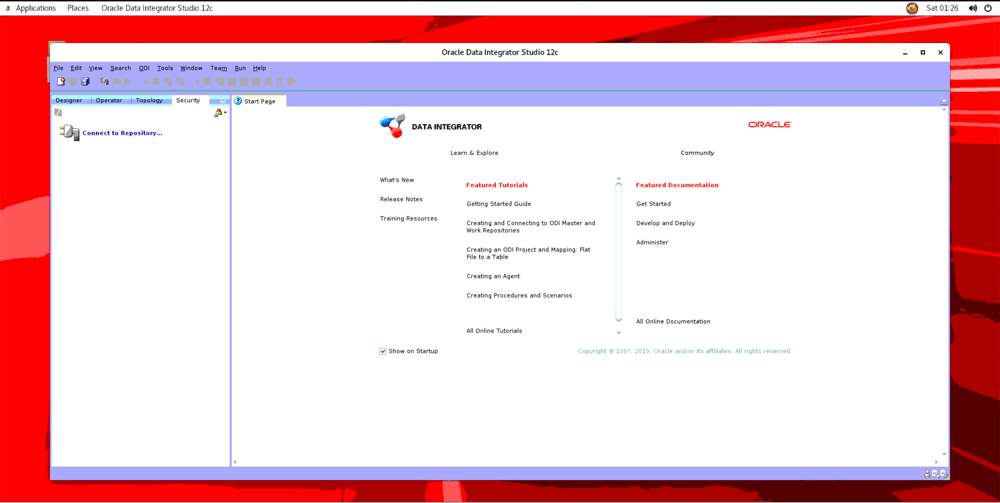

# Connect to Oracle Data Integrator

## Introduction

In this lab, you will connect to the Data Integrator that we provisioned in Lab 1, using VNC Viewer. The stack we provisioned in Lab 1 created the Data Integrator instance in a private subnet, which is a good practice from a security standpoint. However, because of it being in a private subnet, the only way to connect to the instance is through the bastion instance that was created in the public subnet. Hence, we will create an SSH tunnel and use that to connect to ODI using VNC viewer.

**Note:** Below you will find instructions on how to establish the connection if you are using a terminal in Unix/Linux. If you are using a program such as Putty on Windows, please make sure that you perform the same operations, accordingly.

Estimated Lab Time: 15 minutes

### Objectives

- Create SSH tunnel to the Data Integrator instance.
- Establish a VNC connection to ODI via VNC Viewer.
- Copy ADW wallet file on to ODI instance.

### Prerequisites

- Terminal on Unix/Linux or Putty on Windows
- IP address of the Bastion instance and the private IP of the ODI instance.
- The private SSH key.
- ADW wallet file downloaded in Lab 1.
- VNC Viewer or any similar application.

## Task 1: SSH into Bastion Node, connect to ODI instance and secure copy ADW wallet file onto it

1. Open a Terminal and alter the permissions of the private key file to make it read-only for the current user. Assuming the key file is saved as **odi\_adw\_oac** in a folder named **odi-adw-oac** in the current working directory, run the following command:

        chmod 400 odi-adw-oac/odi_adw_oac
    
2. Retrieve the Public IP of the bastion host that we asked you to note down in the previous lab. Now, scp the wallet file on to the bastion node by using the following command:

        scp -i odi-adw-oac/odi_adw_oac odi-adw-oac/Wallet_<datawarehouse_name>.zip opc@<bastion_host_public_ip>: 

3. Now, create an SSH Tunnel from your local machine to the bastion host by running the following command:
    
        ssh -i odi-adw-oac/odi_adw_oac -L 5901:localhost:5901 opc@<bastion_host_public_ip>
        
**Note:** Since, this is your first time logging into the the machine, you might be asked if you want to continue. In this case, type yes and hit enter to continue.
        
4. You should find yourself logged into the bastion instance with part of the tunnel created. Now, in the bastion machine, create a file and store the private key in the file. If are using nano to create the file, use the command given below to create a new file and paste the key in the file. Then, press **Ctrl+O** to write the contents of the file and press **Ctrl+X** to exit.

        nano odi_adw_oac
        
5. Assuming you have saved the file as odi\_adw\_oac, run chmod to set the appropriate permissions for this file, as well. 

        chmod 400 odi_adw_oac
        
6. Now, let us scp the wallet file onto the ODI instance. You will need the private IP of the ODI node for this. 

        scp -i odi_adw_oac Wallet_<datawarehouse_name>.zip opc@<odi_node_private_ip>:

7. Now, let us create the second part of the tunnel. You will again need the private IP of the ODI node to establish the tunnel.

        ssh -4 -i odi_adw_oac -L 5901:localhost:5901 opc@<odi_node_private_ip>
        
8. In the ODI node, move the wallet file to the Oracle folder from the OPC folder, as follows:

        sudo mv Wallet_<datawarehouse_name>.zip /home/oracle/Desktop/
        
9. At this juncture, we will download another file to the ODI node. We will be using this file in Lab 5. 

        sudo su - oracle
        
        wget https://objectstorage.us-ashburn-1.oraclecloud.com/p/VEKec7t0mGwBkJX92Jn0nMptuXIlEpJ5XJA-A6C9PymRgY2LhKbjWqHeB5rVBbaV/n/c4u04/b/livelabsfiles/o/data-management-library-files/modern-data-warehouse/EBS_ODI_ADW.xml
        
## Task 2: Access ODI Studio

1. Start VNC Viewer on your local machine. Since, we have a tunnel from the local machine to the ODI node, we will use the IP **localhost:1** as the URL.  **Enter** or click on **Connect** depending on the application you are using.

    
    
2. The application will prompt you to enter the VNC password that we had provided while provisioning the stack. Enter that password.
    
    
    
3. If this is the first time you have logged in, the Operating System might take you through a few setup steps. Make the appropriate selections and skip the ones not needed.
    
    
    
    
    
    
    
    
    
    
    
4. Now, click on **Applications** on the menu bar at the top. Go to programming and select **ODI Studio**.
    
    
    
5. If prompted to import preferences, just click **No**. You have successfully connected to the ODI instance and started ODI.

    
    
    

You may now proceed to Lab 4.

## Acknowledgements
- **Author** - Yash Lamba, Cloud Native Solutions Architect, Massimo Castelli, Senior Director Product Management, January 2021
- **Last Updated By/Date** - Yash Lamba, May 2021

