# Connect to Oracle Data Integrator

## Introduction

In this lab, you will connect to the Data Integrator that you provisioned in Lab 1, using VNC Viewer. The stack provisioned in Lab 1 created the Data Integrator instance in a private subnet, which is a good practice from a security standpoint. However, because of it being in a private subnet, the only way to connect to the instance is through the bastion instance that was created in the public subnet. Hence, you will create an SSH tunnel and use that to connect to ODI using VNC viewer.

**Note:** Below you will find instructions on how to establish the connection if you are using a terminal in Unix/Linux. If you are using a program such as Putty on Windows, please make sure that you perform the same operations, accordingly.

Estimated Time: 15 minutes

### Objectives

- Create SSH tunnel to the Data Integrator instance.
- Establish a VNC connection to ODI via VNC Viewer.
- Copy ADW wallet file on to ODI instance.

### Prerequisites

- Terminal on Unix/Linux or Putty on Windows
- IP address of the Bastion instance and the private IP of the ODI instance.
- The private SSH key.
- ADW wallet file downloaded in Lab 1.
- VNC Viewer or any similar application.

## Task 1: Connect to the ODI instance and Secure copy ADW wallet file onto it

1. Open a Terminal and alter the permissions of the private key file to make it read-only for the current user. Assuming the key file is saved as **odi-adw-oac** in a folder named **odi-adw-oac** in the home directory, run the following command:
    
	```bash
	<copy>
	chmod 400 odi-adw-oac/odi-adw-oac
	</copy>
	```

2. Retrieve the Public IP of the bastion host and the Private IP of the ODI node, both of which we asked you to note down in the previous lab. Now edit the **ssh config file** on your local machine. Please enter the path to the file on your machine, in case it is different. 

	```bash
	<copy>
	vim ~/.ssh/config
	</copy>
	```

	```
	<copy>
	Host jump-box
		HostName <bastion_host_public_ip>
		User opc
		IdentityFile odi-adw-oac/odi-adw-oac

	# Target machine with private IP address
	Host target-box
		HostName <odi_node_private_ip>
		User opc
		IdentityFile odi-adw-oac/odi-adw-oac
		ProxyJump jump-box
	</copy>
	```

3. Now, scp the wallet file on to the bastion node by using the following command:

	```bash
	<copy>
	scp odi-adw-oac/Wallet_<datawarehouse_name>.zip target-box: 
	</copy>
	```

**Note:** Since, this is your first time connecting to the machine, you might be asked if you want to continue. In this case, type yes and hit enter to continue.

4. Now, create an SSH Tunnel from your local machine to the ODI instance by running the following command:

	```bash
	<copy>
	ssh target-box -L 5901:localhost:5901
	</copy>
	```

5. In the ODI node, move the wallet file to the Oracle folder from the OPC folder, as follows:

	```bash
	<copy>
	sudo mv Wallet_<datawarehouse_name>.zip /home/oracle/Desktop/
	</copy>
	```

6. At this juncture, you will download another file to the ODI node. You will be using this file while configuring the integration. 

	```bash
	<copy>
	sudo su - oracle
	
	wget https://objectstorage.us-ashburn-1.oraclecloud.com/p/VEKec7t0mGwBkJX92Jn0nMptuXIlEpJ5XJA-A6C9PymRgY2LhKbjWqHeB5rVBbaV/n/c4u04/b/livelabsfiles/o/data-management-library-files/modern-data-warehouse/EBS_ODI_ADW.xml
	</copy>
	```
	
## Task 2: Access ODI Studio

1. Start VNC Viewer on your local machine. Since you have a tunnel from the local machine to the ODI node, you will use the IP **localhost:1** as the URL.  **Enter** or click on **Connect** depending on the application you are using. In case you get an unencrypted connection warning, click on **Continue**.

    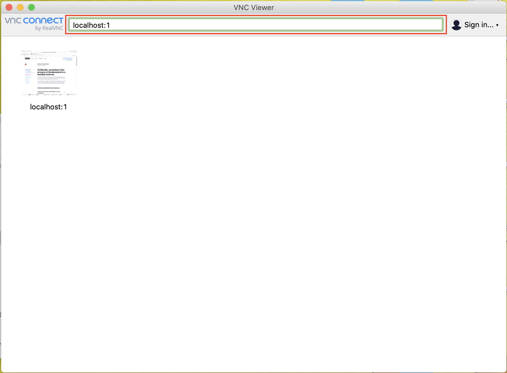

    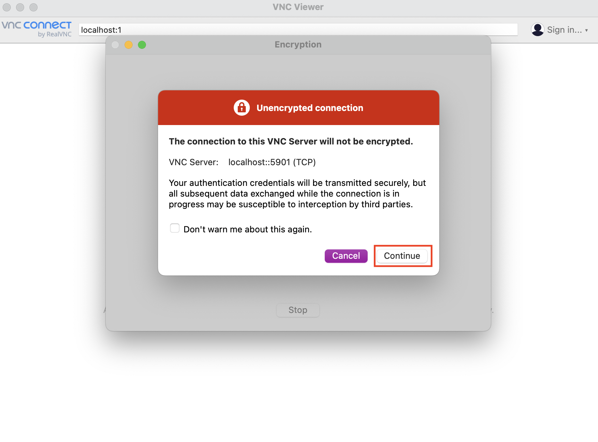

2. The application will prompt you to enter the VNC password that you had provided while provisioning the stack. Enter that password.
    
    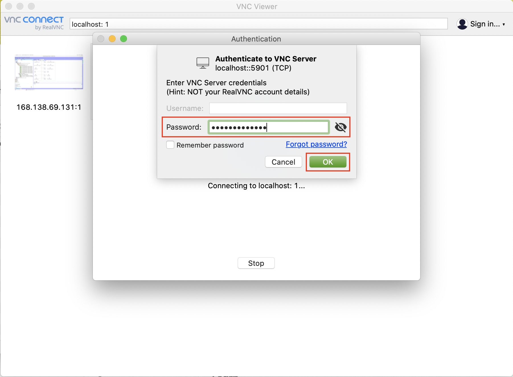
    
3. If this is the first time you have logged in, the Operating System might take you through a few setup steps. Make the appropriate selections and skip the ones not needed.
    
    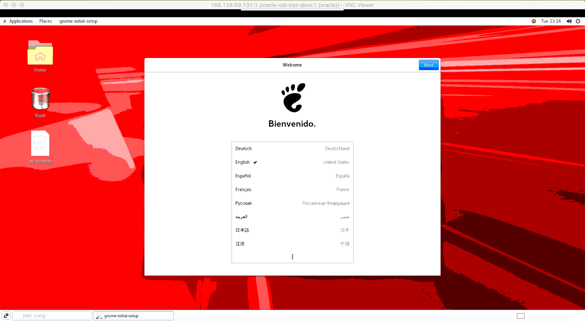
    
    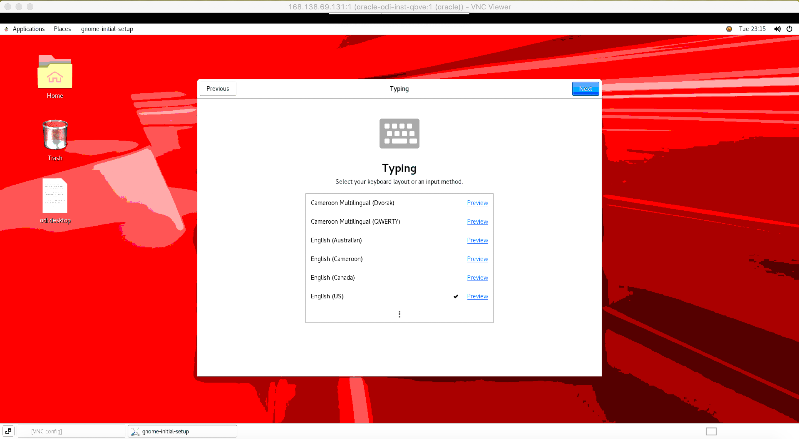
    
    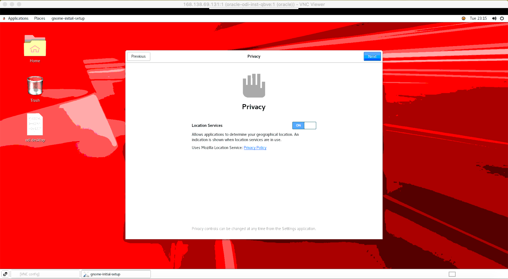
    
    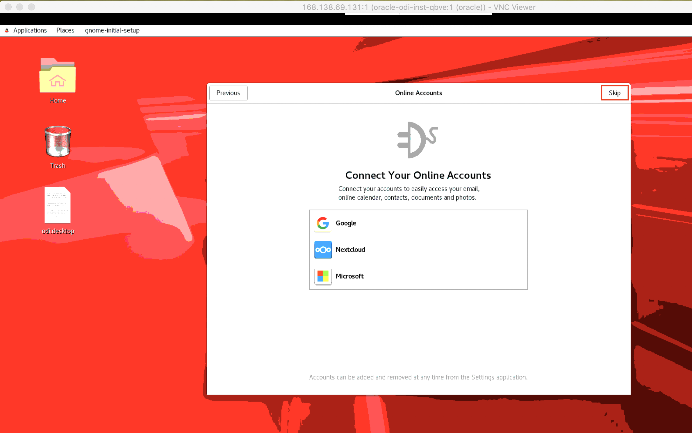
    
    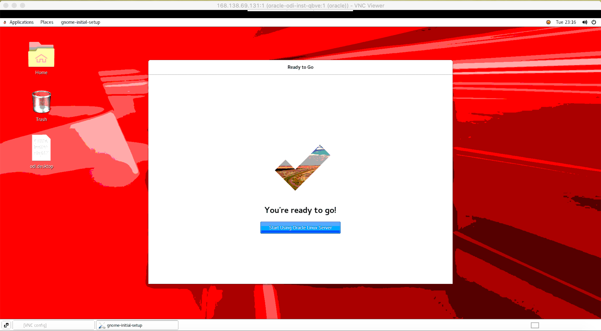
    
4. Now, click on **Applications** on the menu bar at the top. Go to programming and select **ODI Studio** or **ADVANCED**.
    
    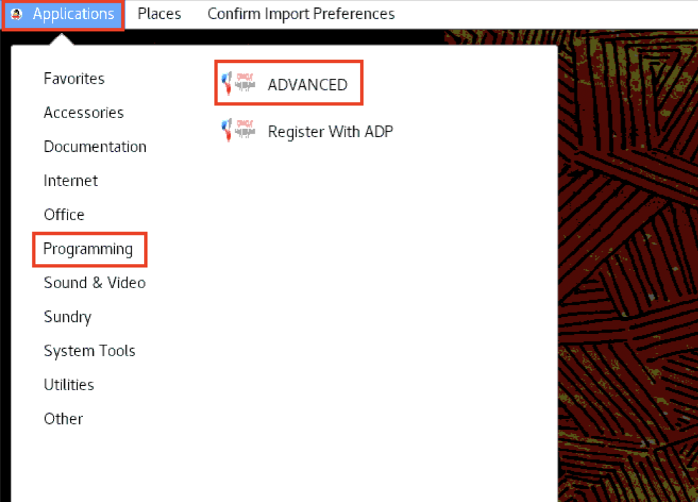
    
5. If prompted to import preferences, just click **No**. You have successfully connected to the ODI instance and started ODI.

    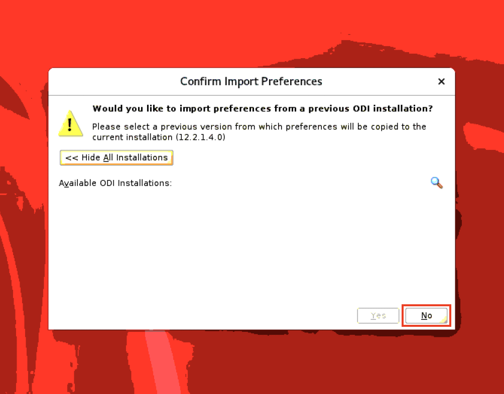
    
    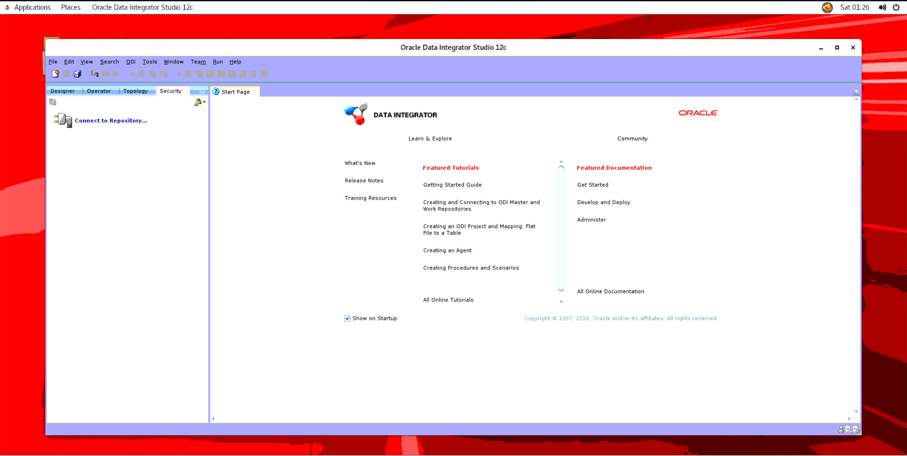

You may now **proceed to the next lab**.

## Acknowledgements
- **Authors** - Yash Lamba, Senior Cloud Engineer; Massimo Castelli, Senior Director Product Management. January 2021
- **Last Updated By/Date** - Yash Lamba, March 2023

