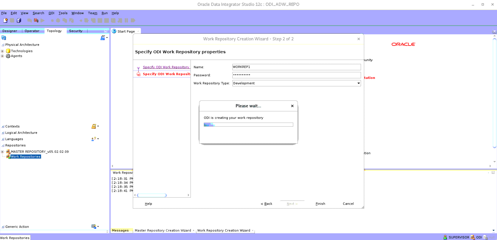

# Create and Connect to ODI Repository

## Introduction

In this lab, you will create a master and a work repository, both of which are needed to run data integrations. After creating the work repository, you will connect to it. 

Estimated Time: 30 minutes

### Objectives

- Create and connect to master and work repositories in ODI. 

### Prerequisites

- ADW and ODI instance created in Lab 1.
- ADW wallet file downloaded in Lab 1.
- Access to the following file: 
    - [ModernDW\_Schema.sql](https://objectstorage.us-ashburn-1.oraclecloud.com/p/VEKec7t0mGwBkJX92Jn0nMptuXIlEpJ5XJA-A6C9PymRgY2LhKbjWqHeB5rVBbaV/n/c4u04/b/livelabsfiles/o/data-management-library-files/modern-data-warehouse/ModernDW_Schema.sql)
    
## Task 1: Create Empty Target Tables and ODI Schema in Autonomous Data Warehouse

1. Connect to the Autonomous Data Warehouse that you had created as part of the ODI-ADW-OAC stack as the ADMIN user via SQL Developer. You downloaded the wallet to the local machine in Lab 1.

2. Run the commands below to create a schema for the metadata repository. You will call this schema **ODI**. Replace **MyPassword** in the first command with a password of your choosing.
    
    ```sql
    <copy>
    create user ODI identified by MyPassword;

    grant DWROLE to ODI;

    grant unlimited tablespace to ODI;

    grant PDB_DBA to ODI; 
    </copy>
    ```  

3. Now, run the following commands to create **EBS** schema for the target tables. Replace **MyPassword** in the first command with a password of your choosing.

    ```sql
    <copy>
    create user EBS identified by MyPassword;

    grant DWROLE to EBS;

    grant unlimited tablespace to EBS;

    grant PDB_DBA to EBS;   
    </copy>
    ```  
    
4. Connect to the ADW instance, again, but this time as the EBS user and execute the **ModernDW\_Schema.sql** script to create empty target tables for our integration under the EBS schema. 
   
## Task 2: Create ODI Master Repository

In order to use ODI, you need to create a master and a work repository. For this, you are going to continue using the same Autonomous Data Warehouse.

1. Return to ODI Studio.

    
    
2. Click on **File**, then **New**.

    
    
3. Select **Create a New Master Repository** and press **OK**.

    
    
4. From the **Technology** drop down, select **Oracle**. Select the **Use Credential File** option and click on the magnifying glass icon in front of the **Credential File** field. The file should be in **/home/Oracle/Desktop**. Thereafter, choose the high connection in the **Connection Details** drop down. The JDBC URL will get auto-populated. Now, enter **ODI** as the user and provide the password for the ODI schema. The DBA User would be ADMIN. Please enter its password, as well.

    
    
5. Click on **Test Connection**. If everything was done correctly, you should see a **Successful Connection** message. If not, then please fix the error and proceed. Now, click on **Next**.

    
    
6. On the **Authentication** page, enter **SUPERVISOR** as the **Supervisor User**, please provide the supervisor password and confirm it. Then, hit **Next**. Click on **Finish** on the final page.

    
    
    
    
7. ODI Studio will take 3-5 minutes to create the repository. Once it is done, you will see a prompt telling you that the creation was successful.

    
    
    

## Task 3: Connect to Master Repository

1. Click on **Connect To Repository** and create a wallet password to secure the ODI and repository credentials.

    

    

2. Click on the pencil sign in the login prompt to edit the displayed login information. 
    
    
    
**Note:** In case a login profile is not displayed then click on the **+** button to create a new one.


2. Provide a name to the login and enter **SUPERVISOR** as the user and provide the password for **SUPERVISOR**. In the Database Connection section, enter ODI as the user and provide the password to the ODI schema. From the driver list drop down, select **Oracle JDBC Driver** and select the **Use Credential File** check box. As done previously, select the ADW wallet in the credential file selector and choose the high connection. 

    
    
3. Test the connection and make sure that it is successful, fixing any errors encountered along the way.

    

4. Now, select the **Login Name** that you just created. Enter **SUPERVISOR** in the user field and enter the password. Click on **OK**. You may be prompted to enter the ADW wallet's password. If so, then provide the password, click **OK** and you will find yourself logged into the Master Repository.

    
    
    
    
## Task 4: Create a Work Repository

1. Click on the **Topology** tab. Expand the repositories section. Under the master repository, you will find Work Repositories. Right click and select **New Work Repository**.

    

2. In the connection properties, set the **Technology** drop down to **Oracle** and check the **Use Credential File** checkbox. Now, select the ADW wallet as the **Credential File** and choose the high connection. Finally, set **User** to ODI and provide the password to the ODI schema. Then, click **Next**.

    

3. Give the work repository a name of your choosing and set a password. You can leave the repository type set to **Development**. Hit **Finish** to get a confirmation dialog and agree to creating a login with a **Yes**.

    
    
    

4. Give a login name and select **OK**. This will lead to a prompt asking for the ADW wallet's password. Provide the password and click on **OK**.

    
    
    

**Note:** The repository should be up and running in a couple of minutes.



## Task 5: Connect to the Work Repository

1. Select the **Designer** tab and then disconnect from the master repository.
    
    

2. Click on **Connect to Repository**, enter the wallet password and then choose the Work Repository in the **login name** drop down.

    

    
    
3. Enter **SUPERVISOR** as the user and provide its credentials. Click on **OK** to get connected to the work repository.

    

    

You may now **proceed to the next lab**.

## Acknowledgements
- **Author** - Yash Lamba, Senior Cloud Engineer, January 2021
- **Last Updated By/Date** - Yash Lamba, March 2023
