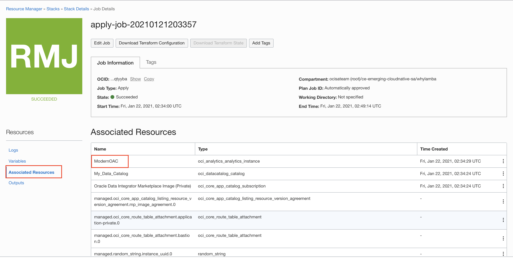
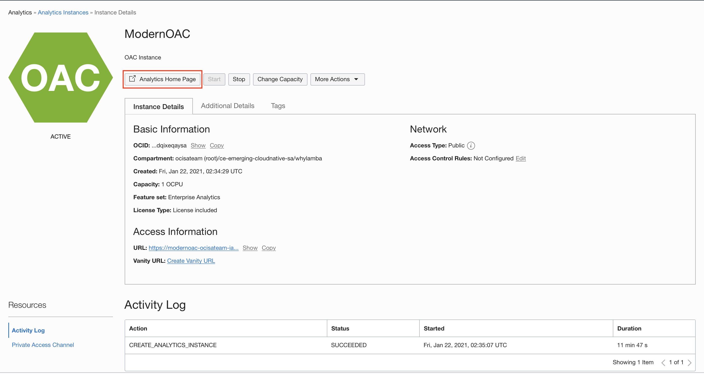
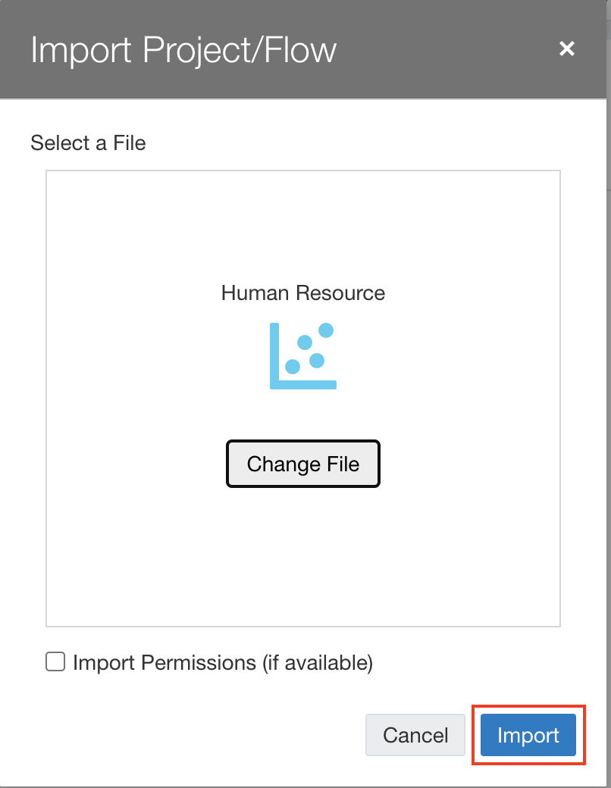
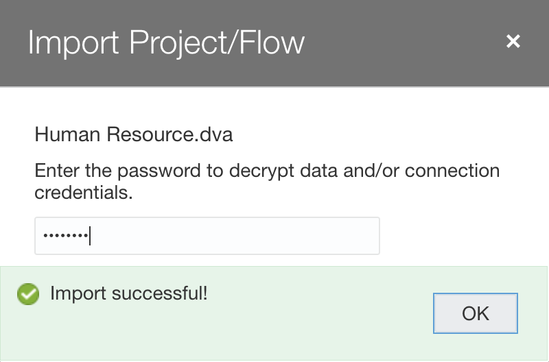
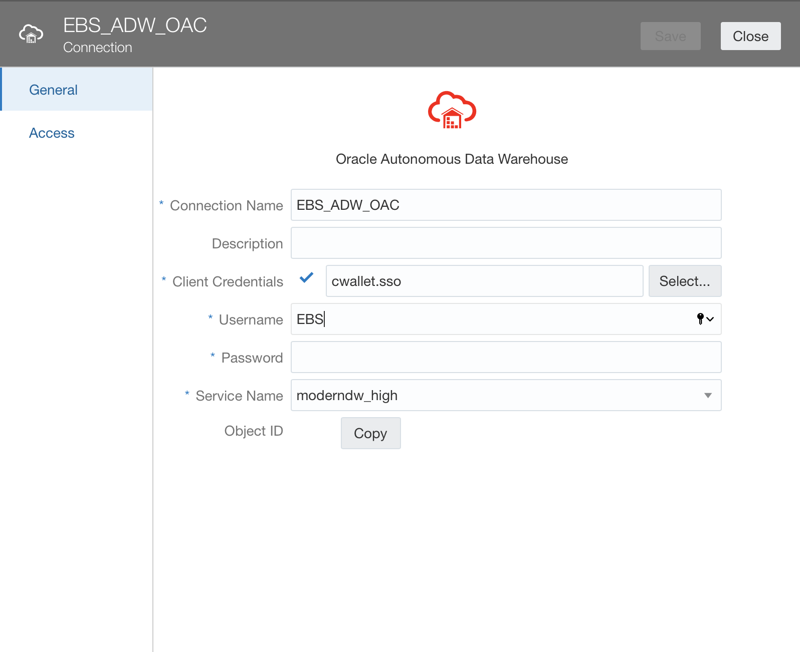

# Run Analytics - Create Dashboards

## Introduction

In this lab, you will use a DVA file to get started with the analysis of the EBS data in Oracle Analytics Cloud.

Estimated Lab Time: 10 minutes

### Objectives

- Create connection to ADW  
- Upload DVA file and refresh the data flowing through the connection
- View analysis.

### Prerequisites

- The destination Autonomous Data Warehouse (ADW) and Analytics Cloud (OAC) instance.
- Access to the ModernDW file needed to recreate this demo. 
    - [ModernDW.dva](https://objectstorage.us-ashburn-1.oraclecloud.com/p/wNan67ma5LtOoO2y_BGjMWVD6xj-LzNQNRZ8BX9qgsAdv14U2XCiSCPHoTfzLpCT/n/oradbclouducm/b/bucket-20200907-1650/o/ModernDW.dva)

Note: Please download the file above before continuing.

## Task 1: Setting up the EBS Analytics Project in OAC

As previously mentioned, when you spin up the stack the links to some resources do not show up in the **Associated Resources** tab. In our case, we want to get to our Analytics Cloud instance, but the link is not provided.

1. Click the **Navigation Menu** in the upper left, navigate to **Analytics & AI**, and select **Analytics Cloud**. 
	
	

2. Choose the right compartment and then select your analytics instance. In the page that opens up, click on **Analytics Home Page** to login to the analytics cloud instance.

    

    

3. Click on the ellipses menu in the top right, select **Import Project/Flow**. Then, click on **Select File** and choose the ModernDW.dva file.

    
    
    

3.  Import the file into OAC by clicking on **Import**. The password is **Admin123**. Hit **OK** to close the dialog. 

    
    
    

4. Click on the navigation menu icon in the top left. Go to **Data** and open the **Connections** tab. You should see a connection named 'EBS\_ADW\_OAC'. 

    
    
    

5. Click on the ellipses menu on the extreme right of the connection’s name and select inspect.

     

6. Click on the **Select** button in front of Client Credentials and select the wallet to your ADW instance. Let the username be **EBS** and provide the schema password. Click **Save**.

    

7. We will now refresh our data sets to utilize our connection. Select the **Data Sets** tab and you will see all the tables appear below. Go ahead and reload each data set by clicking on the ellipses menu to the right of the data set's name and selecting **Reload Data**.

    

8. Now, proceed to the hamburger menu and select **Catalog** and open your project. The visualizations should load, but click **Refresh Data** if needed, to refresh the visuals.

    
    
    

We will now leave it up to your imagination to analyse the data sets that have been provided to you.

*Congratulations! You have successfully completed the lab*.

## Acknowledgements
- **Author** - Yash Lamba, Cloud Native Solutions Architect, Massimo Castelli, Senior Director Product Management, January 2021
- **Last Updated By/Date** - Yash Lamba, January 2021

