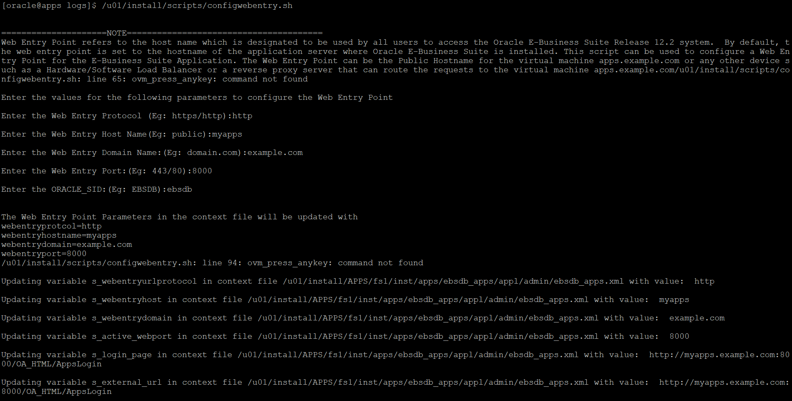

# Provision and Configure EBS, and Prepare All Data Sources

## Introduction

In this lab, you will provision an EBS instance and the associated networking resources. Thereafter, you will configure the EBS instance and insert data into the EBS database. You will also provision an Autonomous Database and load data into it.

Estimated Time: 60 minutes

### Objectives

- Provision an EBS instance on OCI from OCI Marketplace.
- Connect to the EBS instance, configure it and then load data into EBS.
- Provision an Autonomous Database to act as a data source and load data into it.

### Prerequisites

- Terminal on Unix/Linux or Putty on Windows.
- Access to the following files:
    - [etl\_audit\_tbl.sql](https://objectstorage.us-ashburn-1.oraclecloud.com/p/VEKec7t0mGwBkJX92Jn0nMptuXIlEpJ5XJA-A6C9PymRgY2LhKbjWqHeB5rVBbaV/n/c4u04/b/livelabsfiles/o/data-management-library-files/modern-data-warehouse/etl_audit_tbl.sql)
    - [controlling\_project\_expenditure.sql](https://objectstorage.us-ashburn-1.oraclecloud.com/p/VEKec7t0mGwBkJX92Jn0nMptuXIlEpJ5XJA-A6C9PymRgY2LhKbjWqHeB5rVBbaV/n/c4u04/b/livelabsfiles/o/data-management-library-files/modern-data-warehouse/controlling_project_expenditure.sql)
    
**Note:** Please download the files above before continuing.

## Task 1: Create a new security list and a public subnet in VCN

In order to keep the ODI instance and the EBS instance that you are about to provision in separate subnets, you will create a new public subnet in the virtual cloud network (VCN) that was created in the previous lab.

1. Return to the **Job Resources** tab of the Stack to get to the VCN. In our case, the VCN is on page 2, so we navigate to page 2 and then open the VCN's page in a new tab.

    
    
    
    
    
    
2. In the **Resources** panel on the left side of the screen, click on **Security Lists** and then click on the **Create Security List** button.
    
    
    
    
    
3. In the form that is displayed, provide a name to the security list, let the compartment stay unchanged and then click on **Another Ingress Rule** button.
    
    
    
4. Create two ingress rules as shown in the images below. 

    
    
    
    
5. Similarly, click on the **Another Egress Rule** button and add the egress rule as shown in the image below.

    

    

6. Now, hit the **Create Security List** button. Once the form closes, click on **Subnets** in the panel on the left. Thereafter, click on the **Create Subnet** button.

    
    
    
    
    
    
7. In the panel that opens, give a name to the subnet. Use the same compartment that you have been using for this lab. For the **CIDR Block** enter **10.0.10.0/24** or any other non-overlapping CIDR range. Choose the public-route-table as the route table for the subnet. Now, scroll down and select the security list that you created a few minutes ago to associate it with the subnet. Finally, click on the **Create Subnet** button.
    
    
    
    
    
    
    
## Task 2: Provision EBS on OCI
    
1. Go to navigation menu using the menu button in the top left. Scroll down to the **Solutions and Platform** section. Under **Marketplace**, select **All Applications**.
    
    

2. Once on the marketplace home page, type **Oracle E-Business Suite** in the search bar and click on the search button. Thereafter, select an **Oracle E-Business Suite Demo Install Image**. At the time of writing, versions 12.2.8 and 12.2.9 were available and 12.2.8 was selected.

    
    
3. Let the default version be selected in the **Version** dropdown in the panel on the top right. Keep using the same compartment. Agree to the **Oracle Terms and Restrictions** by clicking on the check box. Now, select **Launch Instance**.

    

4. Provide a name to the instance and set the compartment. Leave the **Availability Domain**, **Image** and **Shape** as they are. 

    

5. In the **Networking section**, make sure the **Select existing virtual cloud network** option is selected. Choose the VCN that was created by the stack. Now, select the ebs subnet that you created earlier in this lab. Make sure that the **Assign a public IP address** option is selected.
	
    

6. For the SSH keys, you may choose to use your own ssh keys or you could use ask OCI to generate a pair for you. We will upload our public key and proceed. After this, check the **Specify a custom boot volume size** checkbox and enter 375 for the **Boot volume size**. Now, click on **Create**.

    
    
7. The instance will be provisioned in a few minutes. Please make a note of the public IP address for future reference. 

    

## Task 3: SSH into the EBS instance and configure EBS

1. Open a terminal and scp the **etl\_audit\_tbl.sql** file onto the EBS instance with the following command:

    ```bash
    <copy>
    scp -i &lt;path_to_private_key&gt; &lt;path_to_etl_audit_tbl.sql&gt; opc@&lt;ebs_instance_public_ip&gt;:
    </copy>
    ```

2. Login to the EBS instance as the opc user using the following command:
    
    ```bash
    <copy>
    ssh -i <path_to_private_key> opc@<ebs_instance_public_ip>
    </copy>
    ```
        
3. Now, switch to the root user and move the **etl\_audit\_tbl.sql** file into the home directory of the **oracle** user and make oracle user the owner of the file. The file will be used towards the end of this lab. 

    ```bash
    <copy>    
    sudo su
        
    mv /home/opc/etl_audit_tbl.sql /home/oracle/etl_audit_tbl.sql
        
    chown oracle /home/oracle/etl_audit_tbl.sql
    </copy>
    ```
        
4. As the root user, execute the updatehosts.sh script.

    ```bash
    <copy>        
    sh /u01/install/scripts/updatehosts.sh
    </copy>
    ```
        
    
    
5. Use **vi** to add the public IP address of the EBS instance against the hostname in the hosts file, as shown in the image below. The vi keyboard command to edit is **i**. After the edit, save the file by pressing **escape + :wq**. 
    
    ```bash
    <copy>
    vi /etc/hosts
    </copy>
    ```

    
    
6. Update all the installed packages to their latest available versions using the yum command. You will be asked to agree to the download in a couple of minutes. Enter **y** to agree to the download. The entire process should take approximately 20 minutes. While you wait, you can proceed to Step 4 and Step 5 of this lab. If you choose to do so, please remember to come back and finish the rest of Step 3.
        
    ```bash
    <copy>    
    yum update
    </copy>
    ```

    
    
    
    
7. After the update, restart the machine. You will have to ssh back into the machine.

    ```bash
    <copy>
    shutdown -r
    </copy>
    ```

    ```bash
    <copy>
    ssh -i <path_to_private_key> opc@<ebs_instance_public_ip>
    </copy>
    ```
    
8. Now, execute the following commands in the order given below.

    ```bash
    <copy>
    sudo su - oracle

    cd /u01/install/APPS
    
    ./scripts/startdb.sh
    
    </copy>
    ```

    ```
    <copy>
    chmod 744 EBSapps.env
    
    ./EBSapps.env run
    </copy>
    ```

    ```
    <copy>
    mkdir -p ~/logs

    cd  ~/logs
    </copy>
    ```
        
    
    
9. Execute the following command and when prompted for a password, enter a password of your choosing for the SYSADMIN user.

    ```bash
    <copy>    
    sh /u01/install/APPS/scripts/enableSYSADMIN.sh
    </copy>
    ```

    
  
10. Similar to the previous command, execute the following command and when prompted for a password, enter a password of your choosing for the DEMO user.

     ```bash
    <copy>  
    sh /u01/install/APPS/scripts/enableDEMOusers.sh
    </copy>
    ```
        
    
 
11. Now, execute the following command and enter the values given below for the prompted questions. The entire process will take approximately 5 minutes.

    ```bash
    <copy>  
    sh /u01/install/scripts/configwebentry.sh
    </copy>
    ```
        
        Enter the Web Entry Protocol (Eg: https/http): http
        Enter the Web Entry Host Name(Eg: public): apps
        Enter the Web Entry Domain Name:(Eg: example.com): example.com
        Enter the Web Entry Port:(Eg: 443/80): 8000 
        Enter the ORACLE_SID:(Eg: EBSDB): ebsdb 
        Running AutoConfig to complete the configuration
        Enter the APPS user password:  apps
    
      

12. Use the exit command to logout from the oracle user.

13. Now, switch to the root user and execute the given commands.

     ```bash
    <copy>  
    sudo su root
        
    iptables -F
        
    firewall-cmd --permanent --zone=public --add-port=1521/tcp
        
    exit
    </copy>
    ```  

    
        
14. As the oracle user, execute the following commands:

    ```bash
    <copy>  
    sudo su - oracle

    export ORACLE_HOME=/u01/install/APPS/12.1.0

    export ORACLE_SID=ebsdb

    export PATH=$ORACLE_HOME:$ORACLE_HOME/bin:$PATH
    </copy>
    ``` 
    
15. Login to the database as the **apps** user using sqlplus. You should be able to access the database and connect to it.

    ```
    <copy>
    sqlplus
    </copy>
    ```

        Enter user Name: **apps**
        Enter Password : **apps**
        
    

16. Execute the SQL script **etl\_audit\_tbl.sql** to create the required tables. 
    
    
    ```sql
    <copy>
        @/home/oracle/etl_audit_tbl.sql
    </copy>
    ```

    
    
## Task 4: Provision Autonomous Data Warehouse

1. Click on the **Navigation Menu** in the upper left, navigate to **Oracle Database**, and select **Autonomous Data Warehouse**.
    
	

2. Click on the **Create Autonomous Database** button.

    

3. Choose the same compartment as that of the ODI stack. This is a must because a few of our instructions in the later labs depend on this, so please make sure you use the same compartment. Enter the **Display Name** and also enter a name for the **Database**. Leave everything else set to the default values.

    

4. Scroll down and provide a password for the administrator.

    

5. Choose an appropriate licence type and thereafter, hit **Create Autonomous Database**.

    

6. The database should be up and running in a couple of minutes. 

    

7. Click on the **Database Connection** button. In the panel that appears, click on **Download Wallet**. You will be prompted to enter a password for the wallet file. Feel free to choose any password. This password has no relation to any of the passwords that you provided while provisioning the stack. Hit **Download**.

    
    
    
    
    
        
## Task 5: Creating Tables in Database

1. Use SQL Developer to connect to your newly created Autonomous Database. Instructions for connecting to an Autonomous Database via SQL Developer can be found [here](https://docs.oracle.com/en/cloud/paas/autonomous-data-warehouse-cloud/user/connect-sql-dev182.html#GUID-14217939-3E8F-4782-BFF2-021199A908FD).

2. Now, go ahead and run the **controlling\_project\_expenditure.sql** script to create the tables.

3. The following tables should be visible: COST, COUNTRY\_FORECAST, PPM\_BUDGET\_VS\_ACTUAL, PPM\_ROLLED\_UP, STEEL\_TARIFF, STEEL\_TOTAL\_COST\_FORECAST.

**Note:** If you haven't completed step 3, please return and complete it now.

You may now **proceed to the next lab**.

## Acknowledgements
- **Author** - Srinidhi Koushik, Manager, Technology Hub, April 2021
- **Contributors** - Yash Lamba, Massimo Castelli, March 2023
- **Last Updated By/Date** - Yash Lamba, March 2023
