# Provision Data Integrator, Autonomous Data Warehouse and Analytics Cloud

## Introduction

In this lab, you will provision Data Integrator, Autonomous Data Warehouse, Oracle Analytics and all of the required networking components that are needed to complete this workshop.

Estimated Lab Time: 30 minutes

### Objectives

- Provision a stack comprising of Data Integrator, Autonomous Data Warehouse and an Analytics Cloud instance.

### Prerequisites

- Ability to obtain IDCS Access Token to provision an analytics instance as part of the stack.
- Necessary permissions and quota to provision the stack in a compartment.

## Task 1: Obtain IDCS Access Token

1. Click the **Navigation Menu** in the upper left, navigate to **Identity & Security** and select **Federation**.

		

3. Click on the link to the **OracleIdentityCloudService**.

    

4. In the page that opens, click on the Service Console URL.

    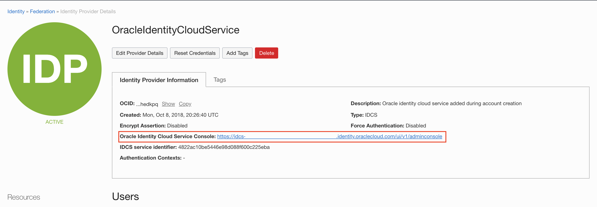

5. In the Identity Cloud Service Console, click on the user icon in the top right corner and select **My Access Tokens**.

    

6. If you have access to the relevant APIs, you should be able to select them, under the **Invokes Identity Cloud Service** radio button. Thereafter, enter the duration of validity of the token in minutes and click on the **Download Token** button.

    

7. Open the **token.tok** file that you just downloaded. Keep it handy because in a few minutes you will need to copy the contents of this file.

    

8. You may now close the Identity Cloud Service Console.

**Note:** You may follow the video [here](https://objectstorage.us-ashburn-1.oraclecloud.com/p/OVQA-GCUjlO9VwEdWqHSre02rNj4K6wZ3VsacpzsXNg/n/oradbclouducm/b/bucket-20200907-1650/o/mdw%20-%20idcs.mp4), if you are unsure of the steps above.

## Task 2: Provision the Stack

1. On the OCI architecture centre's page for [Departmental data warehousing - an EBS integration](https://docs.oracle.com/en/solutions/oci-ebs-analysis/index.html#GUID-A8644D8A-54F2-4015-90F1-7727C68E40CD), click on **Deploy to Oracle Cloud** under the **deploy** section. This should take you to the stack creation page. If you are prompted to login to OCI instead, then login to proceed.

    

2. On the next screen, review and accept the Oracle Terms of Use by selecting the check box. Doing so will auto-populate the description section and select the terraform version. Provide a name for the stack and choose a compartment for it. Then, hit **Next**.

    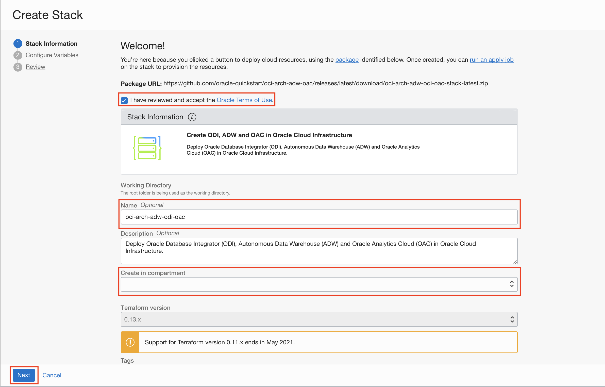

3. On the **Configure Variables** screen, enter the passwords you wish to use for ADW, ODI database, VNC connection to the ODI compute instance, ODI database schema and the previously downloaded IDCS access token. Select the check box to reveal the advanced options.

    

    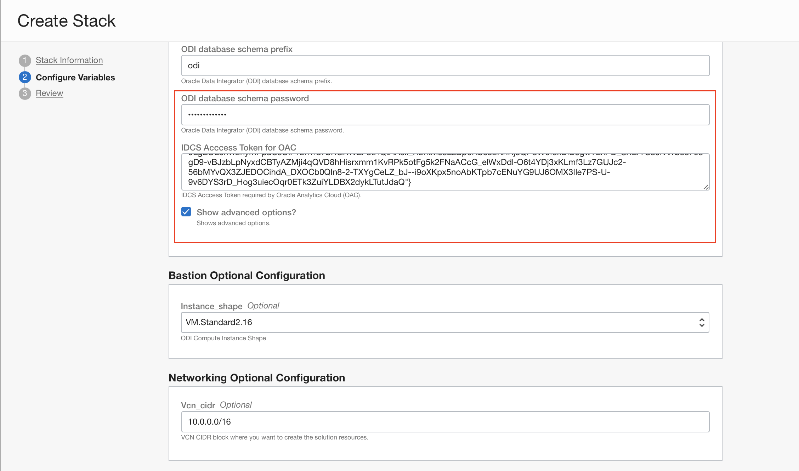

4. Enter an appropriate display name and database name for the ADW instance. We also recommend checking the **Auto Scaling** box to enable auto-scaling of the database. Enabling this is optional, but recommended. You can leave everything else, as it is.

    
    
5. Scroll down and provide a name for the analytics instance. Now, hit **Next**.

    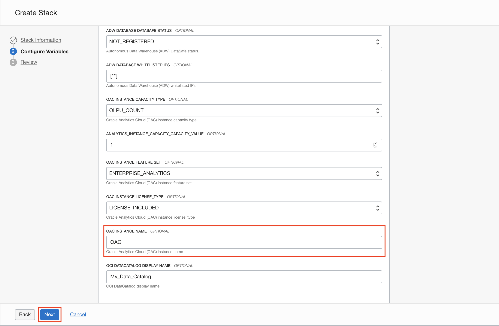

6. Review all the details and click on the **Create** button.

    
    
7. Now that the stack has been created, click on **Terraform Actions** and select **Apply**. In the panel that appears, click on **Apply**, again.

    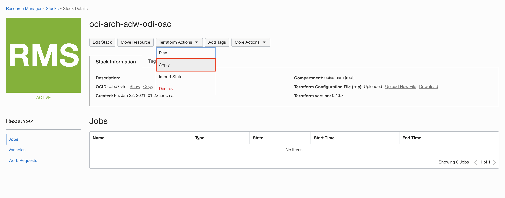
    
    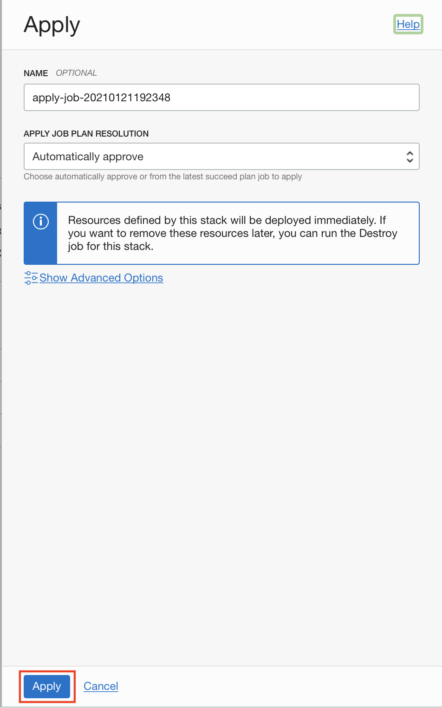
    
    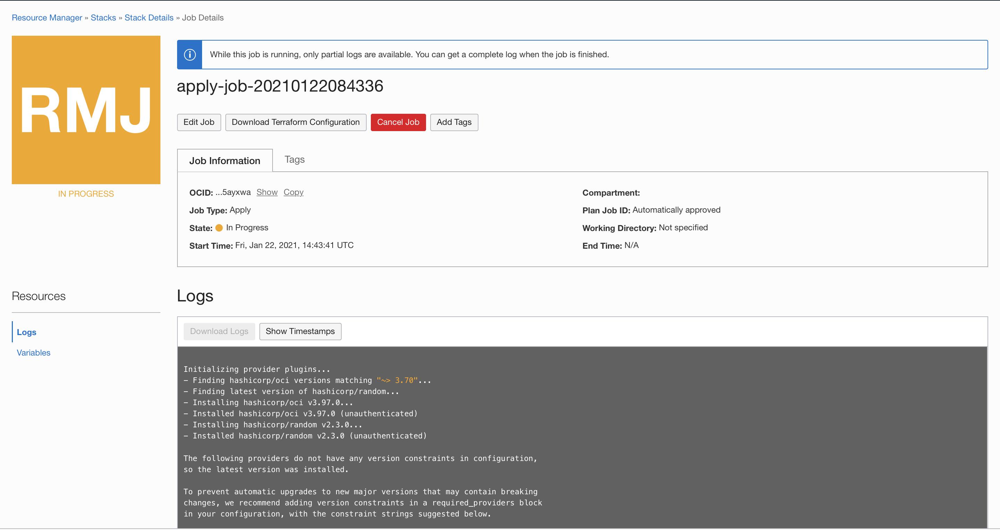

**Note:**  If you have followed the steps above the job should succeed without any issues. Keep an eye on the logs to monitor the progress. If the job fails, please fix the issues and proceed. To do so, click on **Stack Details** at the top of the page. Then, click on **Edit Stack** to get to the stack configuration page. Thereafter, you need to fix the errors and save the changes.

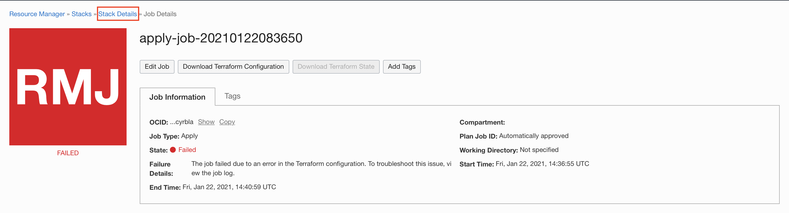
    

8. If everything goes to plan, the status of the job will change to **SUCCEEDED** and you will see the following message at the bottom of the logs.

    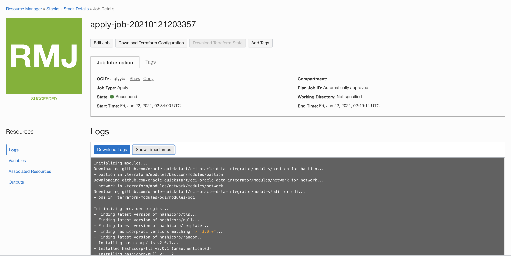
    
    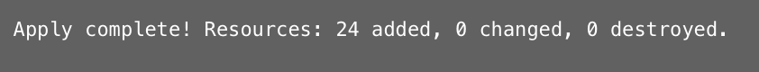

9. On the same page, you will find **Outputs** and **Associated Resources** under the **Resources** menu. Click on **Outputs**. Make a note of all the outputs marked in red in the image below. You will need all of them in the coming labs. Also copy the ssh\_private\_key and save it in a file. You will need the file to ssh into both, the bastion and the ODI instance. Save this key as **odi\_adw\_oac** in a folder named **odi-adw-oac**.

    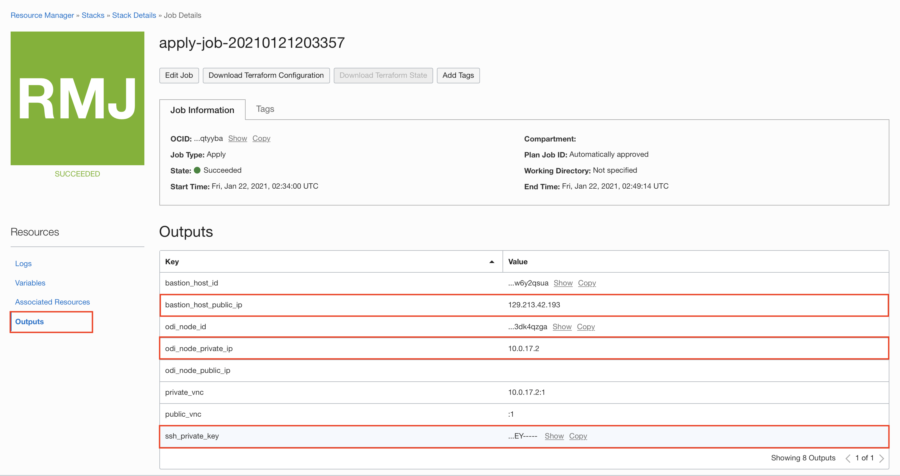
    
**Note:** You may use any names for the files and folders. We will be using the names that we mentioned above.

## Task 3: Download Autonomous Data Warehouse wallet file

1. Go to the **Associated Resources** tab to get the links to the provisioned resources.

    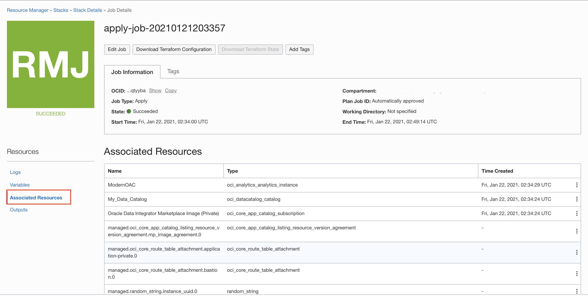

2. Scroll down to moderndw and open the page in a new tab, since you would need access to the current page from time-to-time.

    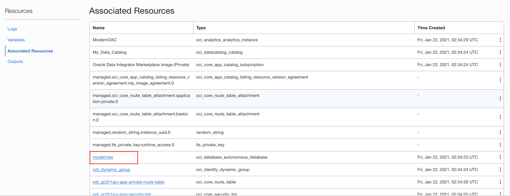
  
3. Click on the **DB Connection** button. In the panel that appears, click on **Download Wallet**. You will be prompted to enter a password for the wallet file. Feel free to choose any password. This password has no relation with any of the passwords that you provided while provisioning the stack. Hit **Download**.

    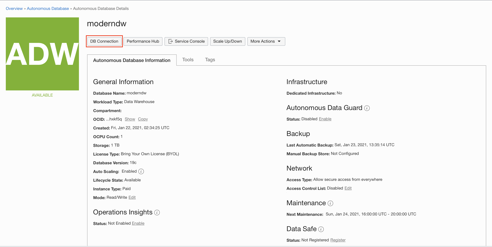
    
    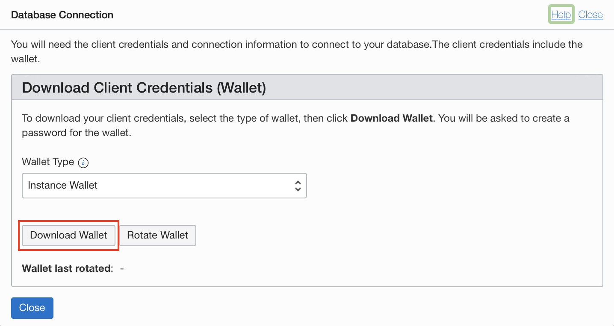
    
    

4. Move the downloaded file to the **odi-adw-oac** folder, as well.

**Note:** In the **Associated Resources** tab, clicking on the links to the resources takes you to their respective pages. However, there could be some resources that do not have links. To get to those resources, you will have to use the navigation menu. The instructions will be provided when needed. 

You may now proceed to Lab 2.

## Acknowledgements
- **Author** - Yash Lamba, Cloud Native Solutions Architect, Massimo Castelli, Senior Director Product Management, January 2021
- **Last Updated By/Date** - Yash Lamba, May 2021
