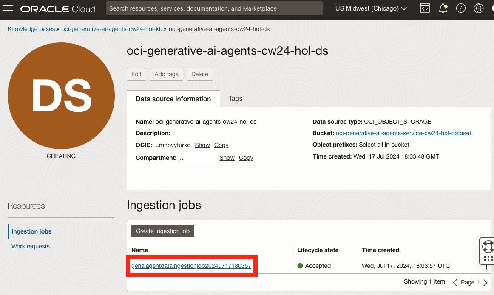

# Create a knowledge base

## Introduction

In this lab we are going to create a knowledge base which will consist of the text files we've uploaded to the storage bucket.
A Knowledge Base maintains information about the Data Source (where the data comes from, for example, text files in storage bucket) as well as metadata for accessing that data and in certain cases, it would also manage indexing and vector storage for the data.
Creating a Knowledge Base lets the OCI Generative AI Agents service know where our data is stored and what format it is stored in. Using this information, the service will be able to ingest the data, understand it and index it for fast retrieval later.
A single knowledge base can be used for multiple Agents.

Estimated Time: 10 minutes

### Objectives

In this lab, you will:

* Create a knowledge base.
* Monitor the ingestion job.

### Prerequisites

This lab assumes you have:

* An Oracle Cloud account
* All previous labs successfully completed

## Task 1: Create a knowledge base

1. From the OCI Generative AI Agents service overview page, click the **Knowledge Bases** link on the left.

1. Make sure that the root compartment is selected in the **Compartment** list under the **List scope** section on the left.

1. Click the **Create knowledge base** button at the top of the **Knowledge bases** table.

  

1. Provide a name for the Knowledge base (for example: oci-generative-ai-agents-cw24-hol-kb)

1. Make sure that the root compartment is selected in the **Compartment** list.

1. Make sure that the **Object storage** option is selected in the **Data Store type** list.

1. Click the **Enable hybrid search** option to enhance the results of the search.

1. Click the **Specify data source** button at the top of the **Data sources** table.

1. In the **Specify data source** pane, provide a name for the data source (for example: oci-generative-ai-agents-cw24-hol-ds)

1. In the **Data bucket** section, make sure that the root compartment is selected. If not, click the **Change compartment** link and select the root compartment.

1. Select the storage bucket into which you've uploaded the dataset text files in the previous lab.

1. Select the **Select all in bucket** option.

1. Click the **Create** button at the bottom of the pane.

  

1. Make sure that the **Automatically start ingestion job for above data sources** option is checked.

1. Click the **Create** button at the bottom of the page.

  

If everything went to plan, your Knowledge Base will be created. This can take a few minutes.

Please wait until the **Lifecycle state** shows the **Active** state before moving on to the next lab.

  

  

## Task 2: Monitor the ingestion job

When a Knowledge Base is created, an Ingestion Job is automatically created in order to process the information contained in the Data Source.
This job might take a while to complete and the Knowledge Base will not be set to Active until it is done.
Here are the steps to monitor the Ingestion Job's progress.

1. From the OCI Generative AI Agents service overview page, click the **Knowledge Bases** link on the left.

1. Make sure that the root compartment is selected in the **Compartment** list under the **List scope** section on the left.

1. Click the Knowledge Base we've just created in the previous task in the **Knowledge bases** table.

  

1. In the Knowledge Base details page, click the Data Source we've created in the previous task in the **Data sources** table.

  

1. In the Data Source details page, click the Ingestion Job which was automatically created (should only be one) in the **Ingestion jobs** table.

  

1. In the Ingestion job details page you'll be able to see the job progress under the **Work requests** table by observing the **State** and **Percent complete** columns. Initially the it will look like this:

  

  When the Ingestion Job is complete, it should look this:

  

  As you can see, details page displays information such as: **Number of ingested files**, **Number of failed files**, **Job duration** and more. When the job is complete, the **Percent complete** column should show 100% and the **State** column should indicate **Succeeded**. At this point you can continue to the next lab.

## Acknowledgements

* **Author** - Anshuman Panda, Principal Generative AI Specialist, Alexandru Negrea, AI and App Integration Specialist Leader

* **Last Updated By/Date** - Vlad Man, Digital Adoption Manager - AI Initiatives, April 2025