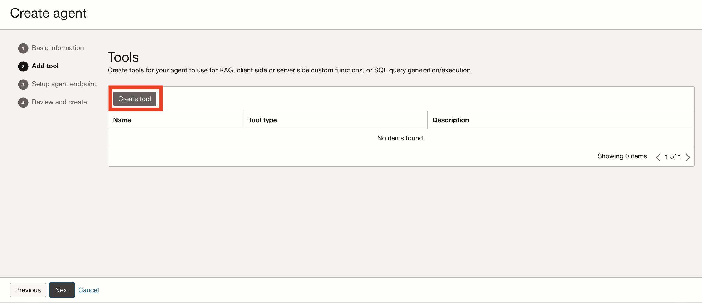
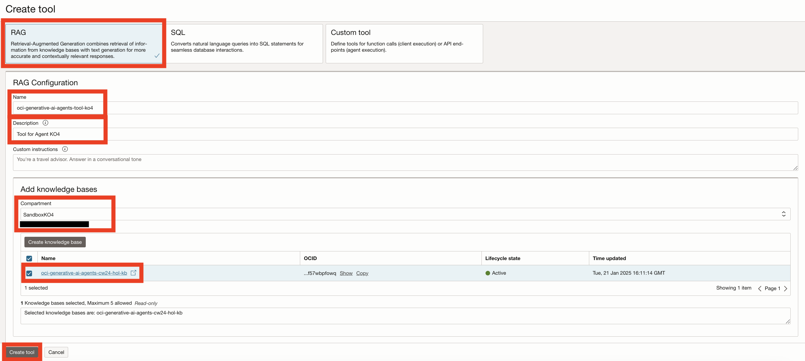
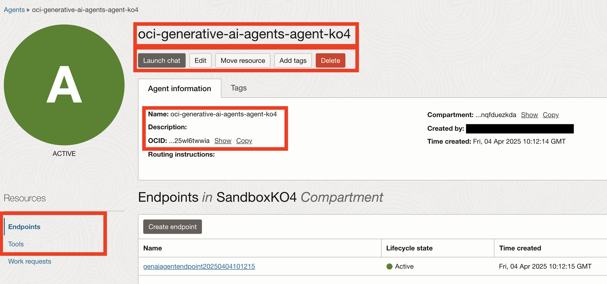

# Create an Agent

## Introduction

In the OCI Generative AI Agents service, an Agent holds a set of configuration which specifies the knowledge bases (can be more than one), a greeting preamble (more on this later) and an endpoint (a network access point which allows for communication with the Agent).
After an Agent is created, you will be able to chat with it and also make API calls against it's endpoint.

Estimated Time: 10 minutes

### Objectives

In this lab, you will:

* Create an Agent.
* Observe Agent metadata.

### Prerequisites

This lab assumes you have:

* An Oracle Cloud account
* All previous labs successfully completed

## Task 1: Create an Agent

1. From the OCI Generative AI Agents service overview page, click the **Agents** link on the left.

1. Make sure that the root compartment is selected in the **Compartment** list under the **List scope** section on the left.

1. Click the **Create agent** button at the top of the **Agents** table.

  

1. Provide a name for the Agent (for example: oci-generative-ai-agents-agent-ko4)

1. Make sure that the root compartment is selected in the **Compartment** list.

1. Optionally, provide a **Welcome message** for the Agent to display at the start of a new conversation (also called the `Preamble`, for example: Hello, i'm the OCI Generative AI documentation helper! How can i help you today?).

1. Click the **Next** button on the bottom of the page.

  

1. On the next page click on **Create tool**.

  

1. In the next page select **RAG** as tool type.

1. Provide a name for the tool (for example: oci-generative-ai-agents-tool-ko4) and a description. This description is important for the agent, it outlines the purpose of this tool. In case you have multiple tools, it is recommended to have a good and specific description which allows to differentiate clearly between them. For example, as "bad practice", a tool description should not be "Tool description 1". A proper name would be "Tool contains knowledge about the following topic: Leave policies".

1. In the **Add knowledge bases** section, select the right compartment and then click on the knowledge base we created earlier.

1. You can finish this step by clicking the **Create tool** button.

  

1. After the tool is created, proceed to the next step by clicking **Next**

  

1. For the **Setup agent endpoint** section we can have a lot of options for configuration.

1. First select the **Automatically create an endpoint for this agent** option.

1. For this laboratory, make sure that the **Enable human in the loop** option is **Disabled**.

1. We can proceed by configuring **Guardrails**, which are safety measures for our agent. The recommended option for each of them is the middle one, which aims to **Block** malicious intents.

1. First we select the Guardrails for **Content moderation**. You can click the options in there to select a specific level.

  

1. Scroll down the page and you will find **Prompt injection (PI) protection** and **Personally identifiable information (PII) protection**.

1. Select **Block** for all the options.

1. To finish this step, click the **Next** button.

  

1. For the final step, review the **Basic information**, **Tools** and **Endpoint configuration** and the click on the **Create agent** button.

  

If everything went to plan, your Agent will be created. This can take a few minutes.

Please wait until the **Lifecycle state** shows the **Active** state before moving on to the next lab.

  

  

## Task 2: Observe Agent metadata

1. After the Agent was created and we've confirmed that it's **Lifecycle state** is **Active**, click the Agent name in the **Agents** table.

  

1. Notable information on the Agent details page:

    1. Agent **name**.
    2. Agent **OCID**.
    3. **Tools** associated with the Agent.
    4. **Endpoints** which can be used to access the Agent programmatically (a default one was created when we created the Agent).

    > In addition, you can **Launch a chat** session with the Agent as well as **Edit**, **Move** and **Delete** the Agent.

  

## Acknowledgements

* **Author** - Anshuman Panda, Principal Generative AI Specialist, Alexandru Negrea, AI and App Integration Specialist Leader

* **Last Updated By/Date** - Vlad Man, Digital Adoption Manager - AI Initiatives, April 2025