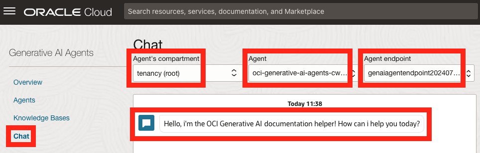
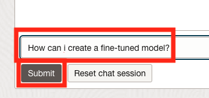
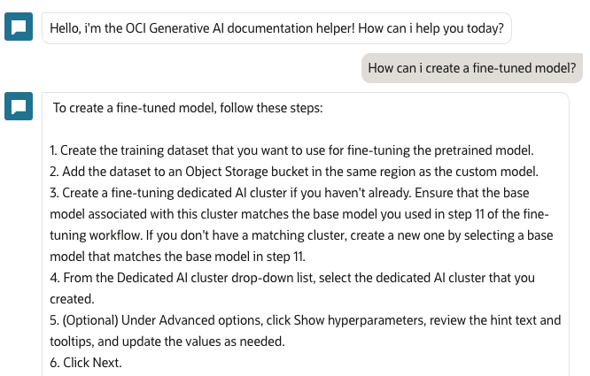
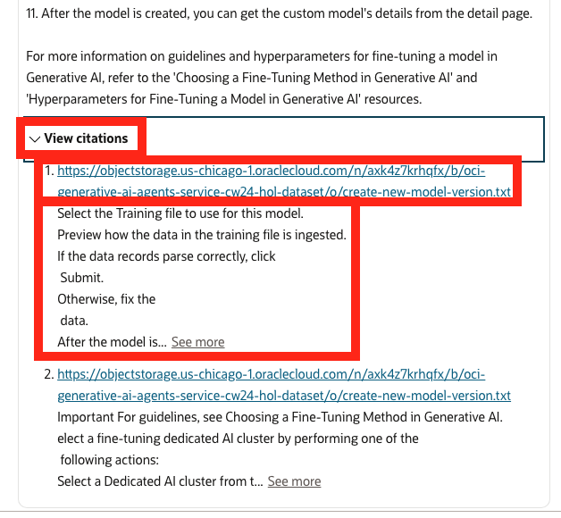
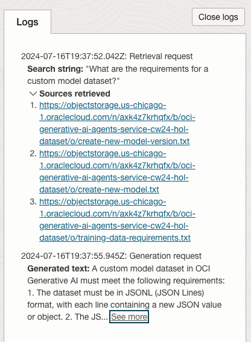

# Have a conversation with your data

## Introduction

Our provisioning work is now complete. It is now time to enjoy the fruits of our labor.
In the previous labs we have created the proper permissions, uploaded our dataset to a storage bucket, created a knowledge base which drives it's data from the text files in our dataset and lastly, we've created an Agent which will interact with the data defined in the knowledge base.
Part of the Agent creation process, the OCI Generative AI Agents service created an Endpoint. We will now use this endpoint to communicate with the Agent.

Estimated Time: 10 minutes

### Objectives

In this lab, you will:

* Use the Agent to answer questions about our data.

### Prerequisites

This lab assumes you have:

* An Oracle Cloud account
* All previous labs successfully completed

## Task 1: Have a conversation with your data

1. Click the **Chat** link on the left.

1. Make sure that the root compartment is selected in the **Agent's compartment** list on the top of the page.

1. Select the Agent we have created in the previous lab in the **Agent** list.

1. Select the **Agent endpoint** (there should be only one which was automatically created for us when the Agent was created).

1. You should see the greeting message we've entered during the Agent creation displayed in the chat section.

  

1. At this point, we can start asking our Agent questions about the data we provided and get intelligent answers as well as references to the original data that the answers are based on.

Let's type the following question into the chat: "How can i create a fine-tuned model?" and click the **Submit** button.

  

1. The Agent will scan the data for relevant information and compose a similar to the following:

  

1. The Agent can also provide a direct reference to the data in our dataset where the answer was extracted from. 

  Scroll down to the end of the answer text and click **View citations** to expand the citations section. This section will provide one or more references to our text files which include a link to the file and an excerpt from the file where the answer was extracted from.

  Providing citations makes sure that the Agent bases it's responses on our data and decreases the chances for hallucinations or made up answers.

  

  In addition to citations, you can also observe the log section on the right of the screen to which search query the Agent is using as well as which data files were found to have relevant answers and the text generated for the response.

  

Feel free to experiment and ask the Agent additional questions related to your uploaded document.

## Acknowledgements

* **Author** - Anshuman Panda, Principal Generative AI Specialist, Alexandru Negrea, AI and App Integration Specialist Leader
