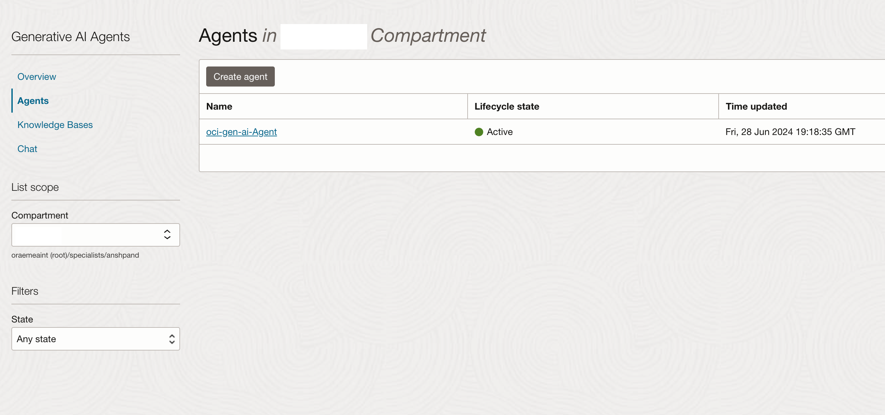
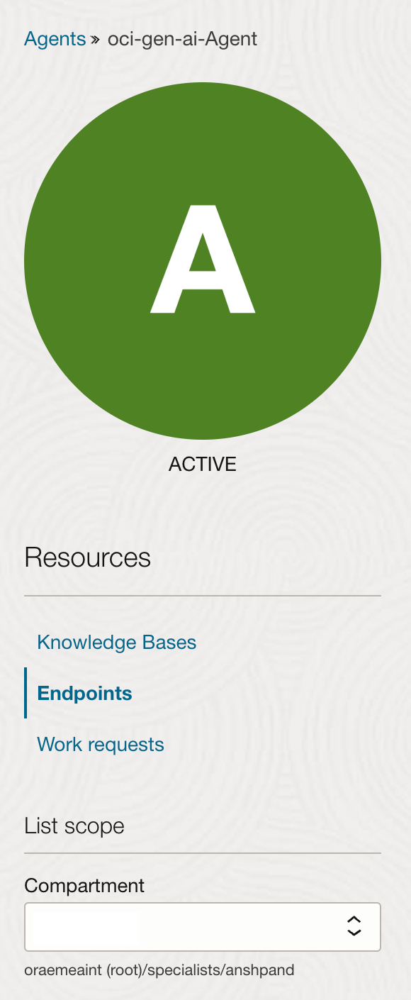
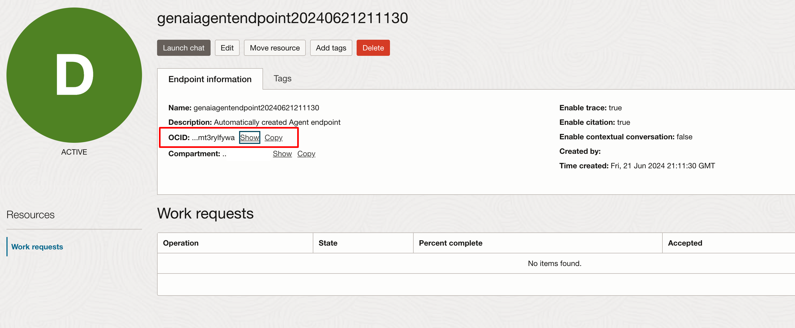

# Exposing Gen AI Agents via Oracle Digital Assistant

## Introduction

In this lab, we will learn how to expose Gen AI Agents via Oracle Digital Assistant (ODA). This involves retrieving the Agent Endpoint ID and configuring the Digital Assistant to interact with the Gen AI Agent.

Estimated Time: 20 minutes

### Objectives

In this lab, you will:
- Retrieve the Agent Endpoint ID.
- Configure a Digital Assistant to interact with the Gen AI Agent.

### Prerequisites

This lab assumes you have:
- Access to the Gen AI Agent dashboard.
- An Oracle Digital Assistant instance.

## Task 1: Retrieve the Agent Endpoint ID

1. Open your Gen AI Agent dashboard and go to the **Agents** tab.

    

2. Click on the agent you created and select the **Endpoints** tab on the left-hand side.

    

3. In the **Endpoints** tab, you will see the list of endpoints.

    

4. Click on the endpoint to open it.

    

5. The OCID value shown here will be your **agentEndpointId** which we will use in the next steps.

## Task 2: Configure a Digital Assistant

1. Open your Oracle Digital Assistant instance.
2. Click the hamburger menu on the left-hand corner and go to **Settings > API Services**.

    

3. Press the **Add Services** button to add the REST service to connect to the Gen AI Agent from ODA.

    

    > **Note:** We need two APIs:
    > 1. Create a Session API (called once to get the session ID).
    > 2. Execute API (to get the response from Gen AI Agents using the session ID and agent ID).

4. Let's create the Create Session API first. Fill in the details and press **Create**.

    - **Name:** genAiAgentCreateSession
    - **Endpoint:** `https://agent-runtime.generativeai.us-chicago-1.oci.oraclecloud.com/20240531/agentEndpoints/{agentEndpointId}/sessions`
    - **Method:** POST

    

5. Once the API is created, select **OCI Resource Principal** as the authentication type.

    

    In the **Body** section, add:
    ```json
    {
      "idleTimeoutInSeconds": 3600
    }
    ```

    In the **Parameters** section, add the parameter `agentEndpointId`.

    

    You can test the API using the **Test Request** button and note the id(session Id) which we will use to test the other api.

    

    You can also download the API from [here](https://objectstorage.eu-frankfurt-1.oraclecloud.com/n/frpj5kvxryk1/b/genAiAgents/o/RESTService-genAiAgentCreateSession.yaml) and import it.

6. Now, let's create the Execute API. Fill in the details and press **Create**.

    - **Name:** genAiAgentExecute
    - **Endpoint:** `https://agent-runtime.generativeai.us-chicago-1.oci.oraclecloud.com/20240531/agentEndpoints/{agentEndpointId}/sessions/{sessionId}/actions/execute`
    - **Method:** POST

    

7. Once the API is created, select **OCI Resource Principal** as the authentication type.

    

    In the **Body** section, add:
    ```json
    {
      "userMessage": "Your question related to the agent created",
      "shouldStream": false
    }
    ```

    In the **Parameters** section, add the parameters `agentEndpointId` and `sessionId`( which you got from the previous api call).

    

    You can test the API using the **Test Request** button.

    

    You can also download the API from [here](https://objectstorage.eu-frankfurt-1.oraclecloud.com/n/frpj5kvxryk1/b/genAiAgents/o/RESTService-genAiAgentexecute.yaml) and import it.

## Task 3: Create a Skill in Digital Assistant

1. Go to **Development > Skills** from the hamburger menu.

    

2. Download the skill from [this link](https://objectstorage.eu-frankfurt-1.oraclecloud.com/n/frpj5kvxryk1/b/genAiAgents/o/genAiAgentsSkill(1.0).zip). Click on **Import Skills** in the right-hand corner and import the skill named **genAiAgentsSkill**.

3. Once the skill is imported, open it and go to the **Settings** button on the left-hand side as shown in the image below.

    

4. Go to the **Configuration** tab under Settings.

    

5. Scroll down to **Custom Parameters**.

    

6. Select the parameter `agentEndpointId`, press the edit button, and change the value field to your specific endpoint ID. Press **OK**.

    

7. Now, select the **Preview** button on the top right corner of your screen and type ‘hi’ in the bot tester. You will receive a welcome message.

    

8. Type your question to the agent and get the reply.

## Learn More

- [Gen AI Agent Documentation](https://docs.oracle.com/en-us/iaas/Content/genAI/getting-started.htm)
- [Oracle Digital Assistant Documentation](https://docs.oracle.com/en-us/iaas/digital-assistant/getting-started.htm)

## Acknowledgements

* **Author** - Anshuman Panda, Principal Generative AI Specialist, Alexandru Negrea, AI and App Integration Specialist Leader
