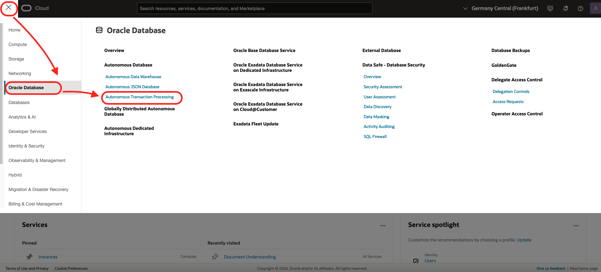
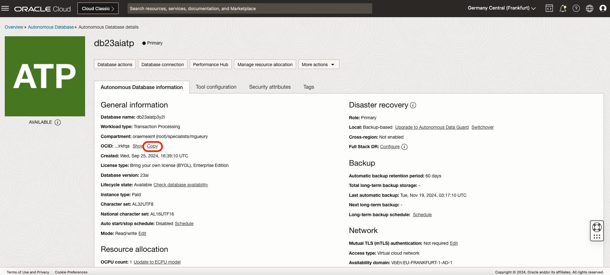
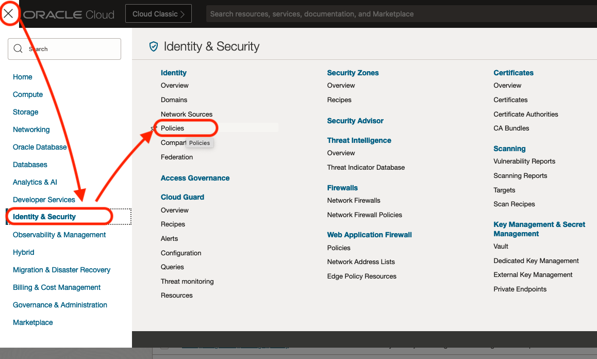
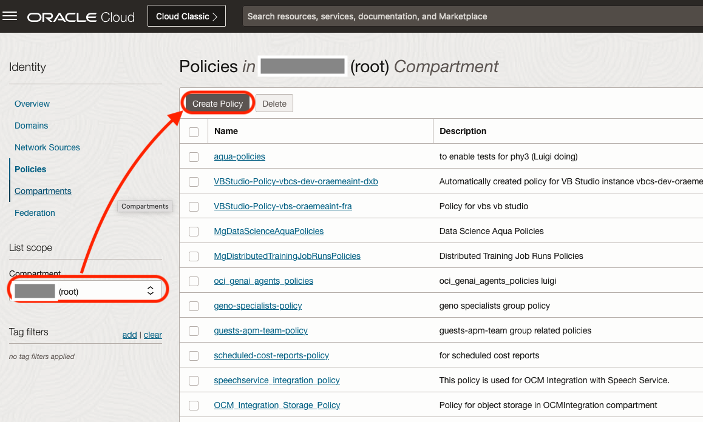
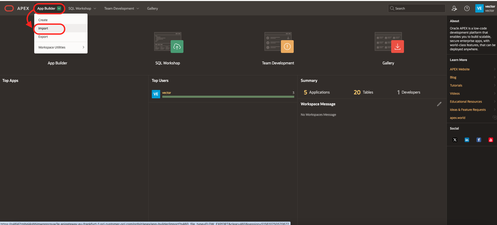
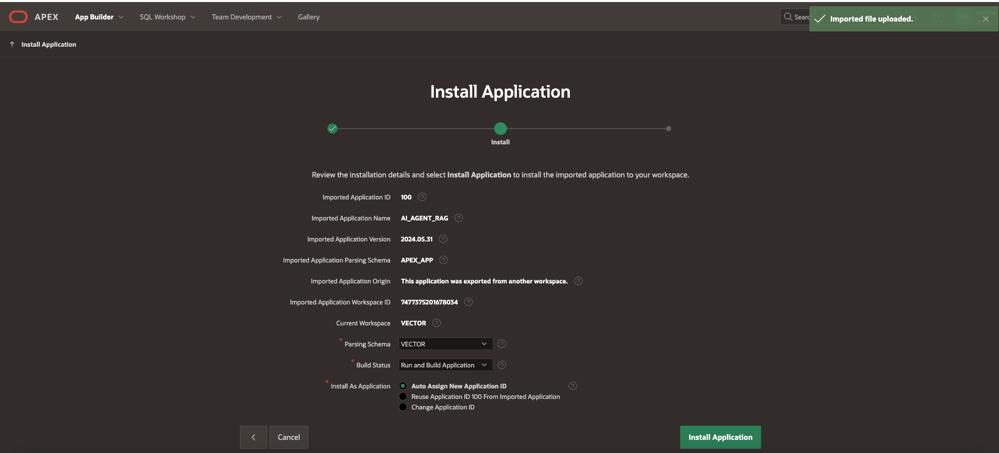
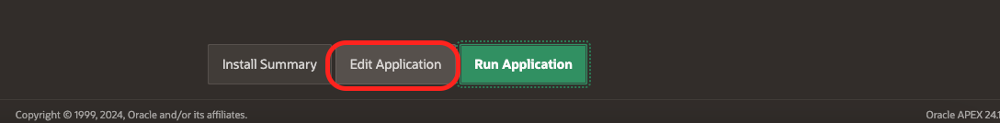
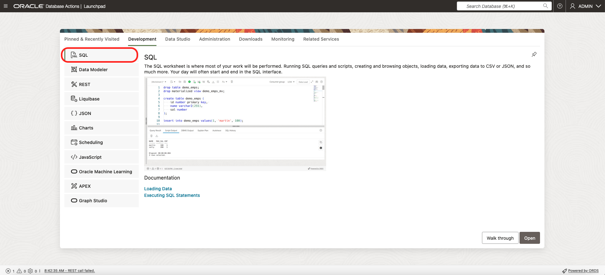
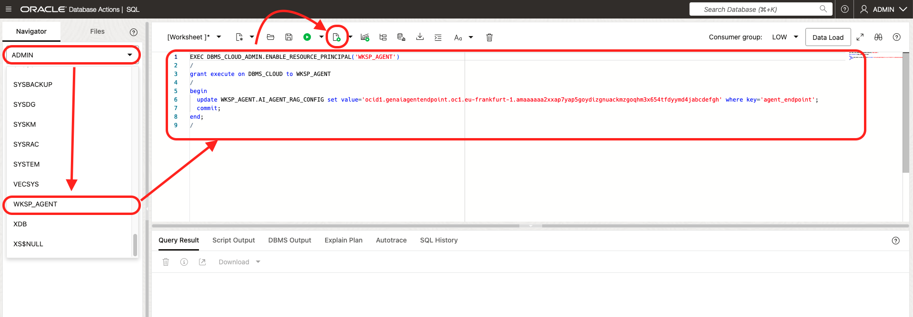
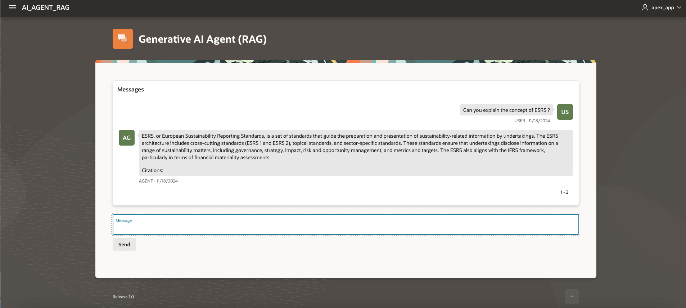

# Connect APEX with GenAI Agent
## Introduction

In this lab, we will learn how to expose Gen AI Agents via Oracle APEX. This involves retrieving the Agent Endpoint ID and configuring APEX to interact with the Gen AI Agent.

Estimated Time: 20 minutes

### Objectives

In this lab, you will:
- Install a APEX application that connect to OCI GenAI Agent.

### Prerequisites

This lab assumes you have:
- Access to the Gen AI Agent dashboard.
- You have already an Autonomous Database with his Admin password ##DB_PASSWORD##
- GenAI Agent Endpoint OCID. See Lab: Connect ODA with GenAI Agent - Task 1
- [Download the APEX app, here](https://raw.githubusercontent.com/mgueury/oci-genai-agent-apex/refs/heads/main/apex_app.sql). In your browser, File / Save (File) As. Then store the file on your laptop

Note: The lab should work also with any Database 19c+ with APEX and DBMS_CLOUD. Here, we use Autonomous database since both are preinstalled. 

### Your Notes

Keep a file to keep the details:

````

Autonomous OCID:     (sample) ocid1.autonomousdatabase.oc1.eu-frankfurt-1.abcdefghj....
DB Password:         (sample) ##YOUR_PASSWORD##
Agent Endpoint OCID: (sample) ocid1.genaiagentendpoint.oc1.eu-frankfurt-1.abcdefghj....

WorkSpace Name:      (sample) agent
WorkSpace User:      (sample) agent
WorkSpace Password:  (sample) ##YOUR_PASSWORD##
````

## Task 1: Policies

1. Click the hamburger menu on the left-hand corner and go to **Oracle Database > Autonomous Transaction Processing**.

    

2. Click on the Autonomous Database name (or create a new one with all default) and find the OCID (something like ocid1.autonomousdatabase.oc1.eu-frankfurt-1.abcdefghj..)

    

3. Click the hamburger menu on the left-hand corner and go to **Identity and Security > Policies**.

    

4. Change to the root compartment. Create a policy with rules like this one (use your OCID found above)

    

    ```
    allow any-user to manage genai-agent-family in tenancy where request.principal.id='ocid1.autonomousdatabase.oc1.eu-frankfurt-1.abcdefghj...'
    allow any-user to read object-family in tenancy where request.principal.id='ocid1.autonomousdatabase.oc1.eu-frankfurt-1.abcdefghj...'
    allow any-user to manage object-family in tenancy where ALL { request.principal.id='ocid1.autonomousdatabase.oc1.eu-frankfurt-1.abcdefghj...', request.permission = 'PAR_MANAGE' }
    ```   

## Task 2: Configure APEX 

1. Click the hamburger menu on the left-hand corner and go to **Oracle Database > Autonomous Transaction Processing**.

    

2. Click on your database name   
3. Click on the button **Database Actions / View All Database Actions**

    

4. Choose **APEX**. Click **Open**
5. If you have already an existing APEX workspace, go to next step. If not, create one with APEX Administration Services.
    - Log into the Administration Service, enter you Admin ##DB_PASSWORD##.
    - In Welcome to Oracle APEX!, click **Create Workspace**
    - Choose **New Schema**
    - In Create Workspace dialog enter for ex: (Keep note of it!)
         - Workspace Name: AGENT
         - Workspace Username: AGENT
         - Workspave Password: ##YOUR_PASSWORD##
         - Click **Create Workspace** 
    - Your workspace is created. Click the top/left, icon **Admin**. The Sign Out. Then return to signin page.

6. Log in your APEX workspace. Ex:
    - Workspace: AGENT
    - USER: AGENT
    - Password: ##YOUR_PASSWORD##
    - Click **Sign In**

6. Click **Application Builder / Import**. Choose the APEX app that your downloaded above (apex_app.sql). Then **Next**.

    

7. Click **Install Application**

    

8. Click **Install Supporting Objects**
    This will fail with **Supporting Objects Install Error**.
    We fix that in the next steps.

9. When the installation is done, click **Edit Application**.

    

10. Keep this tab opened. We will fix the import issue first.

## Task 3: Configure Database Rights

1. In a second browser tab, go back to the OCI Console, again to Autonomous Database 
2. Click the hamburger menu on the left-hand corner and go to **Oracle Database > Autonomous Transaction Processing**.

    

3. Click on your database name   
3. Click on the button **Database Actions / View All Database Actions**
4. Choose **SQL**. Click **Open**

    

5. (Optional) Login as ADMIN
6. In Database Actions / SQL
     - Look for the name of your Workspace user. If you created it manually, the name starts with WKSP. 
     - In the below command, replace with your value of:
         - WKSP\_XXXX ( ex: WKSP\_AGENT )
         - ##YOUR\_AGENT\_ENDPOINT## ( ex: ocid1.genaiagentendpoint.oc1.eu-frankfurt-1.abcdefghj.... )
     - Run the following commands
   
     ```
     <copy>
     EXEC DBMS_CLOUD_ADMIN.ENABLE_RESOURCE_PRINCIPAL('WKSP_XXXX')
     /
     grant execute on DBMS_CLOUD to WKSP_XXXX
     /
     begin
       update WKSP_XXXX.AI_AGENT_RAG_CONFIG set value='##YOUR_AGENT_ENDPOINT##' where key='agent_endpoint';
       commit;
     end;
     /     
     </copy>
     ```

     


## Task 4: Test the application

1. Back on your APEX tab of Task 2. Now, click Run **Application**
2. Login
    - User: AGENT (=your workspace user)
    - Password: ##YOUR_PASSWORD##
3. Type your question in message. Then Send

    

4. Check the response. Hover the mouse to see the citations of the original documents.
5. Click on the link of the original document to see it.

## Known issues

### Error: ORA-20404: Object not found - https://agent-runtime.generativeai.eu-frankfurt-1.oci.oraclecloud.com/20240531/agentEndpoints/ocid1.genaiagentendpoint.oc1.eu-frankfurt-

- You have an issue in the OCID of your AGENT_ENDPOINT_ID. Check the format.
- Or the Policy (Task 1) is incorrect

## Learn More

- [Gen AI Agent Documentation](https://docs.oracle.com/en-us/iaas/Content/genAI/getting-started.htm)
- [Autonomous Database Documentation](https://docs.oracle.com/en-us/iaas/digital-assistant/getting-started.htm)

## Acknowledgements

* **Author** - Anshuman Panda, Marc Gueury, Alexandru Negrea

* **Last Updated By/Date** - Marc Gueury - Nov 2024
