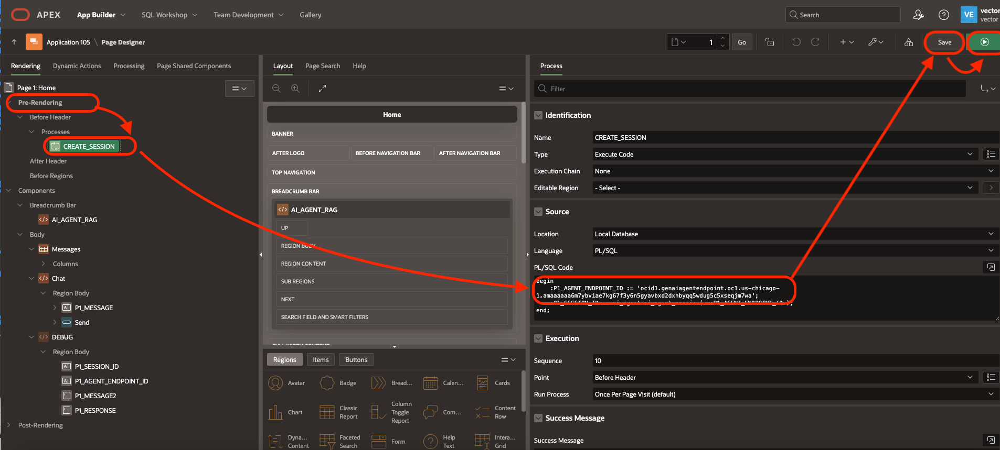

# Connect APEX with GenAI Agent
## Introduction

In this lab, we will learn how to expose Gen AI Agents via Oracle APEX. This involves retrieving the Agent Endpoint ID and configuring APEX to interact with the Gen AI Agent.

Estimated Time: 20 minutes

### Objectives

In this lab, you will:
- Retrieve the Agent Endpoint ID.
- Configure a Digital Assistant to interact with the Gen AI Agent.

### Prerequisites

This lab assumes you have:
- Access to the Gen AI Agent dashboard.
- GenerativeAI Agent Endpoint ID. See Lab: Connect ODA with GenAI Agent - Task 1
- [Download the APEX app, here](https://objectstorage.eu-frankfurt-1.oraclecloud.com/n/frpj5kvxryk1/b/genAiAgents/o/apex_ai_agent_2024_11_19.sql)

Note: The lab should work also with any Database 19c+ with APEX and DBMS_CLOUD. Here, we use Autonomous database since both are preinstalled. 

## Task 1: Policies

1. Click the hamburger menu on the left-hand corner and go to **Oracle Database > Autonomous Transaction Processing**.

    

2. Click on the Autonomous Database name (or create a new one with all default) and find the OCID (something like ocid1.autonomousdatabase.oc1.eu-frankfurt-1.abcdefghj..)

    

3. Click the hamburger menu on the left-hand corner and go to **Identity and Security > Policies**.

    

4. Change to the root compartment. Create a policy with rules like this one (use your OCID found above)

    

    ```
    allow any-user to manage genai-agent-family in tenancy where request.principal.id='ocid1.autonomousdatabase.oc1.eu-frankfurt-1.abcdefghj...'
    allow any-user to read object-family in tenancy where request.principal.id='ocid1.autonomousdatabase.oc1.eu-frankfurt-1.abcdefghj...'
    allow any-user to manage object-family in tenancy where ALL { request.principal.id='ocid1.autonomousdatabase.oc1.eu-frankfurt-1.abcdefghj...', request.permission = 'PAR_MANAGE' }
    ```   

## Task 2: Configure Autonomous Database 

1. Click the hamburger menu on the left-hand corner and go to **Oracle Database > Autonomous Transaction Processing**.

    

2. Click on your database name   
3. Click on the button **Database Actions / View All Database Actions**

    

4. Choose **APEX**. Click **Open**
5. If you have already an existing APEX workspace, log in it. If not, create one with Administration Services.
6. Click **Application Builder / Import**. Choose the APEX app that your downloaded above (apex_ai_agent_xx.sql). Then **Next**.

    

7. Click **Install Application**

    

8. Click **Install Supporting Objects**
9. When the installation is done, click **Edit Application**.

    

10. Click on page 1
11. Open Pre-rendering / CREATE_SESSION
12. Edit the agent endpoint id. Save and Run
    
 
 ## Task 3: Test the application

1. Type your question in message. Then Send

    

2. Check the response. Hover the mouse to see the citations of the original documents.
3. Click on the link of the original document to see it.

## Learn More

- [Gen AI Agent Documentation](https://docs.oracle.com/en-us/iaas/Content/genAI/getting-started.htm)
- [Autonomous Database Documentation](https://docs.oracle.com/en-us/iaas/digital-assistant/getting-started.htm)

## Acknowledgements

* **Author** - Anshuman Panda, Marc Gueury, Alexandru Negrea

* **Last Updated By/Date** - Marc Gueury - Nov 2024