# Get Started: Sign Up for your Oracle Cloud Free Tier

## Introduction

Before you get started, you will need an Oracle Cloud account. This 5-minute lab walks you through the Tasks of getting an Oracle Cloud Free Tier account and signing in.

### Existing Cloud Accounts

If you already have access to an Oracle Cloud account, including an Oracle Cloud account using Oracle Universal Credits, skip to Task 2 to sign in to your cloud tenancy.

### Two Cloud Offers in One

Oracle Cloud Free Tier allows you to sign up for an Oracle Cloud account which provides a number of Always Free services and a Free Trial with US$300 of free credit to use on all eligible Oracle Cloud Infrastructure services for up to 30 days. The Always Free services are available for an unlimited period of time. The Free Trial services may be used until your US$300 of free credits are consumed or the 30 days has expired, whichever comes first.

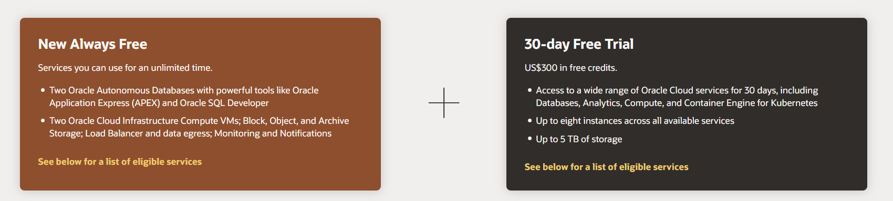

### What you will need

 - A valid email address
 - Ability to receive SMS text verification (only if your email isn't recognized)

## Task 1: Create Your Free Trial Account

If you already have a cloud account, skip to Task 2.

### **Task 1.1:**

 Open up a web browser to access the Oracle Cloud account registration form at [oracle.com/cloud/free.](http://bit.ly/34TzwGf)
        
 You will be presented with a registration page. 

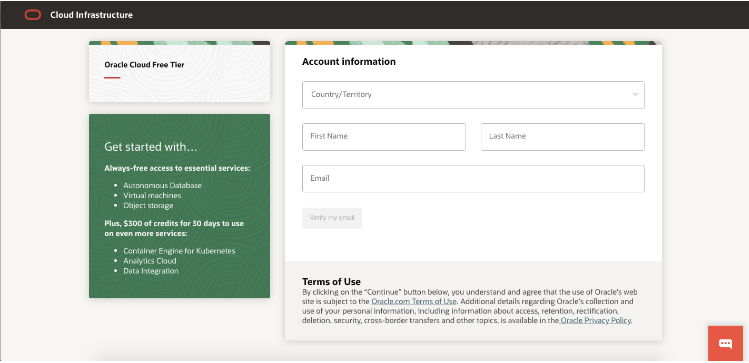

### **Task 1.2:**

Enter the following information to create your Oracle Cloud Free Tier account.

  - Choose your **Country**
  - Enter your **Name** and **Email**.

### **Task 1.3:**

Once you have entered a valid email address, select the **Verify my email** button. The screen will appear as follows after you select the button: 

### **Task 1.4:**

Go to your email. You will see an account validation email from Oracle in your inbox. The email will be similar to the following: 

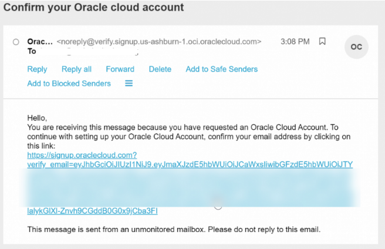

### **Task 1.5:**

Select the link (if possible) or copy and paste the link into your browser.

### **Task 1.6:**

Enter the following information to create your Oracle Cloud Free Tier account.

-  Choose a **Password**
-  Enter your **Company Name**
-  Your **Cloud Account Name** will generate automatically based on your inputs, you can change that name by entering a new value. Remember what you wrote. You'llneed this name later to sign in.
- Choose a **Home Region**. Your Home Region cannot be changed once you sign-up. Note: Based on the current design of the workshop and resource availability, it is recommended not to use the London region for this workshop at this time.
- Click **Continue**
    
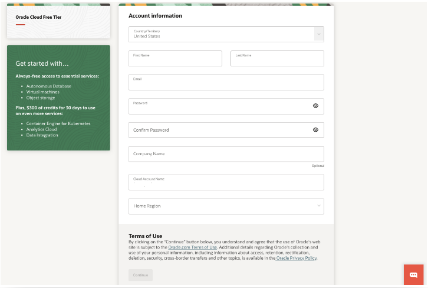

### **Task 1.7:**

Enter your **Address** information. Click **Continue**. 

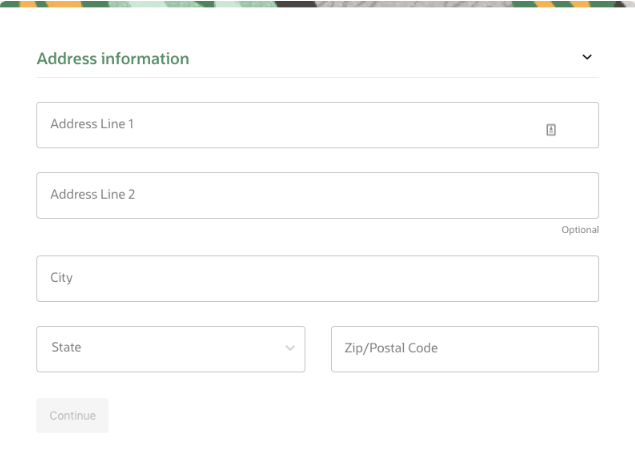

### **Task 1.8:**

Choose your country and enter a mobile number for verification. Click the **Text me a code** button.

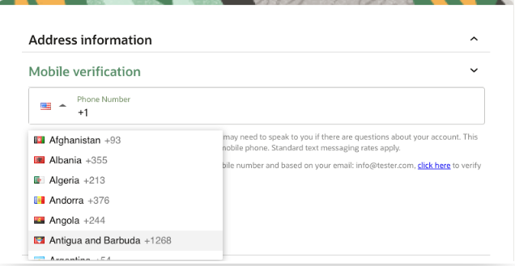

### **Task 1.9:**

Once you receive your code, enter it and click **Verify My Code**. 

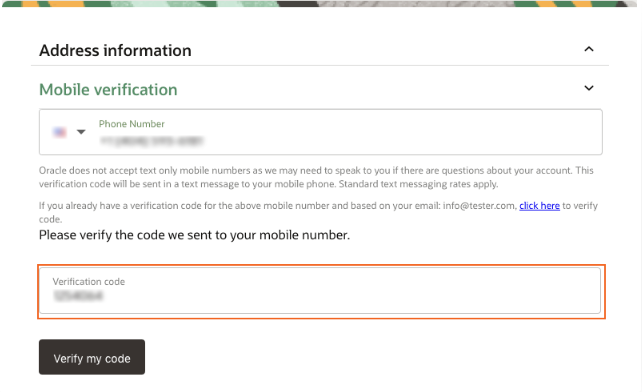

### **Task 1.10:**

Click the **Add payment verification method** button. 

### **Task 1.11:**

Choose the verification method. In this case, click the **Credit Card** button. Enter your information and payment details. 

_Note: This is a free credit promotion account. You will not be charged unless you elect to upgrade the account._

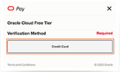

### **Task 1.12:**

Once your payment verification is complete. Review and accept the agreement by clicking the check box. Click the **Start my free trial** button.

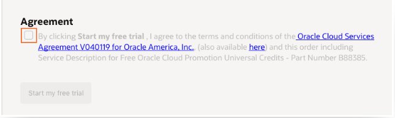

### **Task 1.13:**

Your account is provisioning and should be available soon! You might want to log out as you wait for your account to be provisioned. You'll receive two emails from Oracle. One email will be the initial notification that provisioning is underway. The other email will be notification that provisioning is complete. Here is a copy of the final notification: 

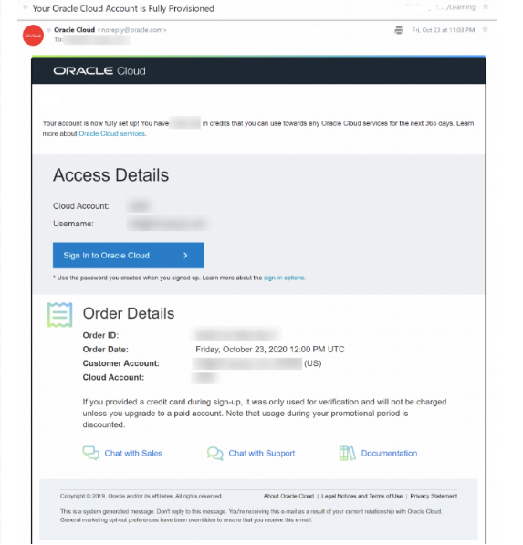

## Task 2: Sign in to Your Account

### **Task 2.1:** 

Go to **[cloud.oracle.com](https://www.oracle.com/cloud/sign-in.html?redirect_uri=https%3A%2F%2Fcloud.oracle.com%2F)**. Enter your Cloud Account Name and click **Next**. This is the name you chose while creating your account in the previous section. It's NOT your email address. If you've forgotten the name, see the confirmation email.

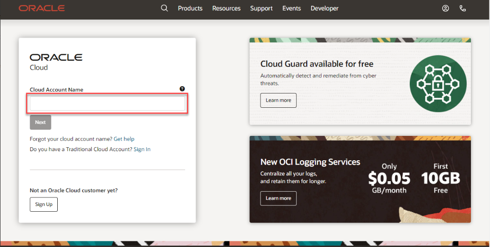

### **Task 2.2:** 

Click **Continue** to sign in using the _"oraclecloudidentityservice"_.

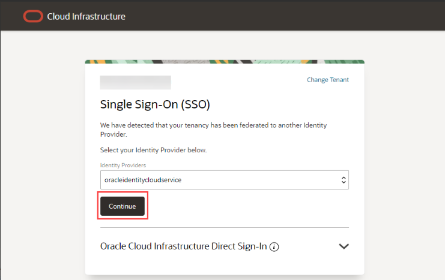

When you sign up for an Oracle Cloud account, a user is created for you in Oracle Identity Cloud Service with the username and password you selected at sign up. You can use this single sign-on option to sign in to Oracle Cloud Infrastructure and then navigate to other Oracle Cloud services without reauthenticating. This user has administrator privileges for all the Oracle Cloud services included with your account.

### **Task 2.3:** 

Enter your Cloud Account credentials and click **Sign In**. Your username is your email address. The password is what you chose when you signed up for an account.

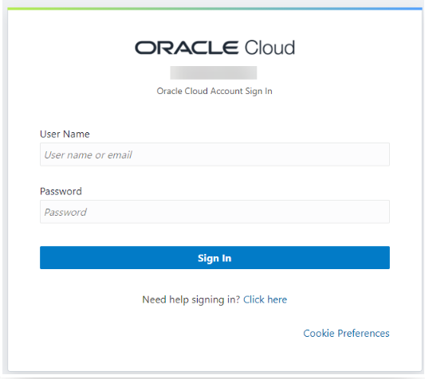

### **Task 2.4:** 

You are now signed in to Oracle Cloud!

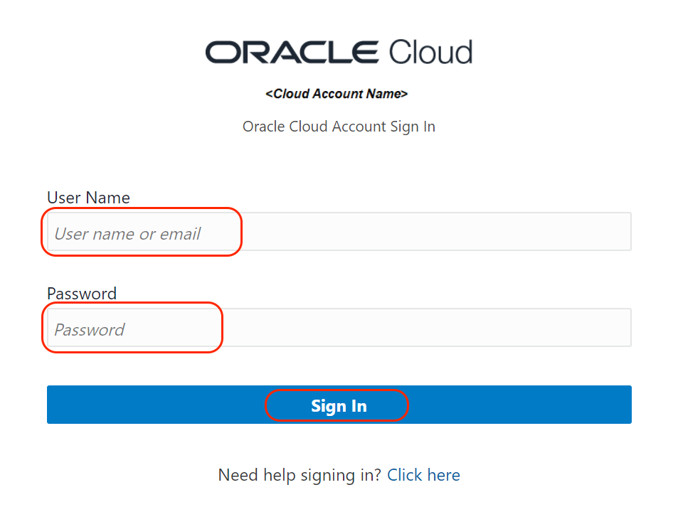

You may now proceed to the next lab.

## **Acknowledgements**
- **Created By/Date** - Kay Malcolm, Database Product Management, March 2020
- **Contributors** -  John Peach, Kamryn Vinson, Rene Fontcha, Kay Malcolm
- **Last Updated By/Date** -