# Create Data Integration Instance


## Introduction

This Lab walks you through the steps to get started using **Data Integration** on Oracle Cloud Infrastructure (OCI). You will provision a new instance in just a few minutes.

**OCI Data Integration** is a fully managed, serverless, native cloud service that helps you with common **extract, load, and transform (ETL)** tasks such as ingesting data from different sources, cleansing, transforming, and reshaping that data, and then efficiently loading it to target data sources on OCI.

[](youtube:0BN8Ws2qJGQ)

Estimated Time: 30 minutes.

### Objectives

In this section, you will:

- Create Your OCI Data Integration Instance.
- Create the Data Assets.

### Prerequisites

- All previous sections have been successfully completed.

## Task 1: Create Your OCI Data Integration Instance

1. We need to create some **policies** to allow the Data Integration service to use other services within OCI.

2. Go to **Identity & Security** and then click **Policies**.

   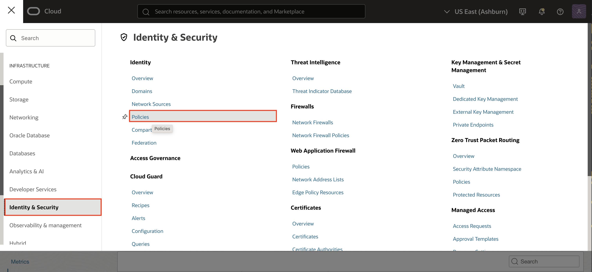

3. Click **Create Policy**.

   Make sure you are in the `root` compartment.

   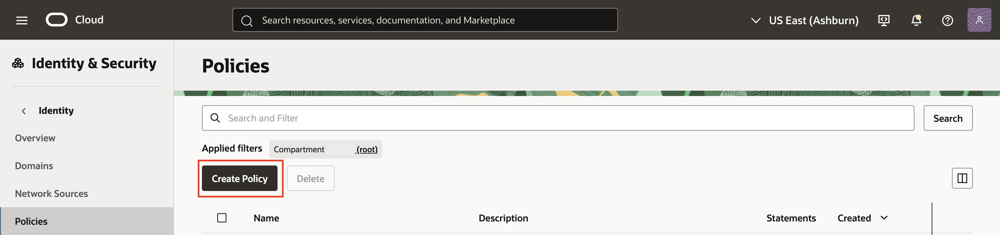

4. Create a new policy:

      - Name: `dataintegration`
      ```
      <copy>dataintegration</copy>
      ```
      - Description: `Allow Data Integration Service to use VCN`
      ```
      <copy>Allow Data Integration Service to use VCN</copy>
      ```
      - Toggle: `Show manual editor`
      - Policy Builder:
      ```
      <copy>allow service dataintegration to use virtual-network-family in tenancy</copy>
      ```

   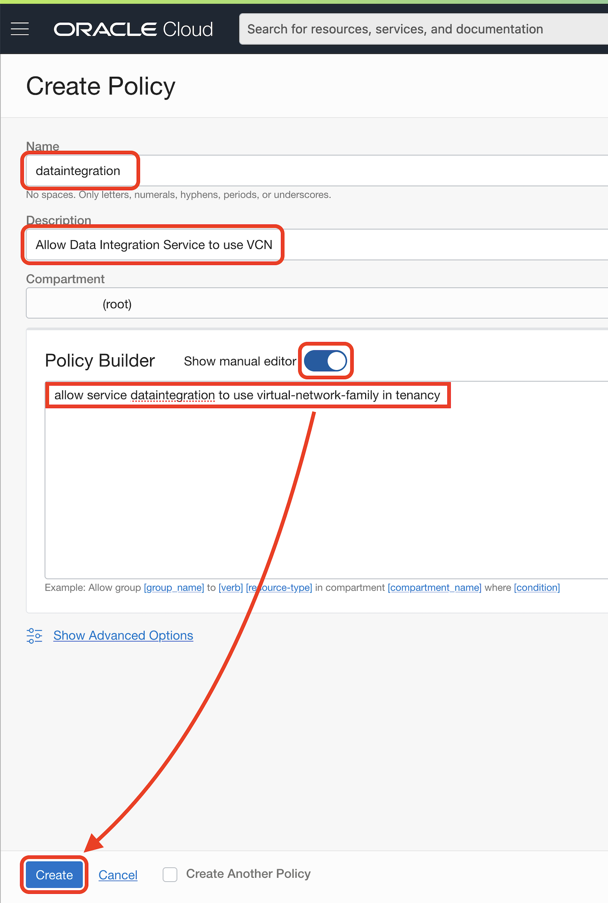

   > Note: If you have created an Oracle Cloud Account to do the workshop, you are already the Administrator. **You DO NOT NEED TO DO THIS STEP**.
   >
   > In case you are a Non-admin user, you will need to set up some more policies to allow the group you belong to. Ask your administrator.
   >
   >```
   <copy>allow group <group-name> to manage dis-workspaces in compartment <compartment-name></copy>
   ```
   
   >```
    <copy>allow group <group-name> to manage dis-work-requests in compartment <compartment-name></copy>
    ```
   
   >```
    <copy>allow group <group-name> to use virtual-network-family in compartment <compartment-name></copy>
    ```
   
   >```
    <copy>allow group <group-name> to manage tag-namespaces in compartment <compartment-name></copy>
    ```

5. Go to **Menu**, **Analytics & AI** and then click **Data Integration**.

   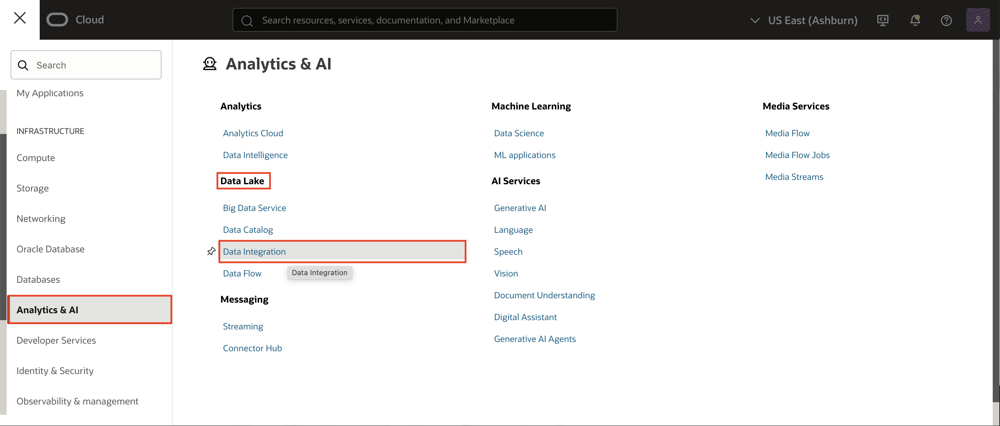

6. Click in the **Workspaces** section in the left part of the screen. At the moment we are on the Overview page.

   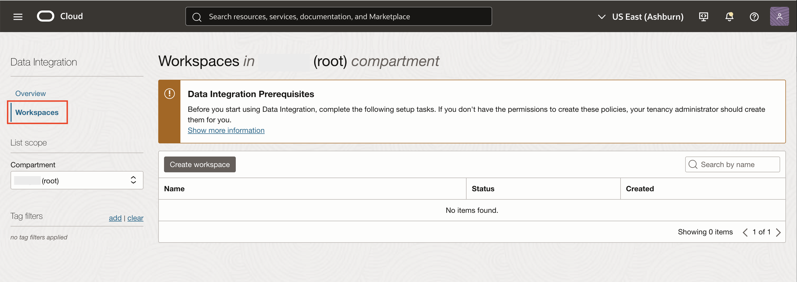

7. Click **Create Workspace**.

   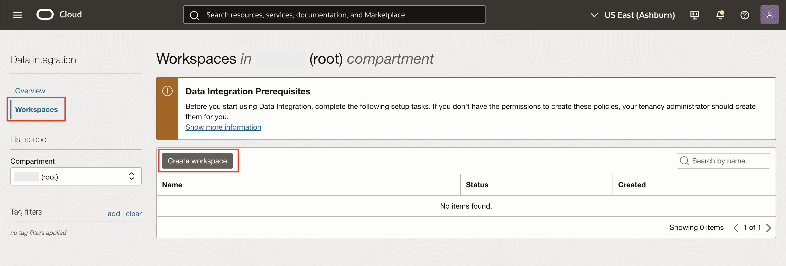

8. **Modify** the following fields, leave the rest as default:

      - Name: `Workspace Nature`
      ```
      <copy>Workspace Nature</copy>
      ```
      - VCN: `nature`
      - Subnet: `Private subnet-nature`
   Be sure you have select the correct compartment, `root` in the workshop case. As soon as you select the compartment, you will be capable of selecting VCN and Subnet.

9. Click **Create**.

   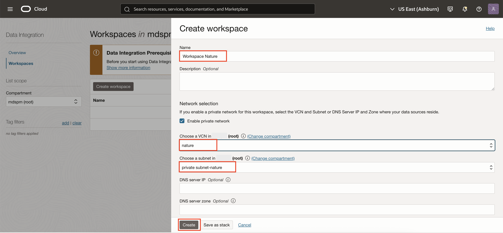

10. While the Workspace is created, click the **three dots contextual menu**.

   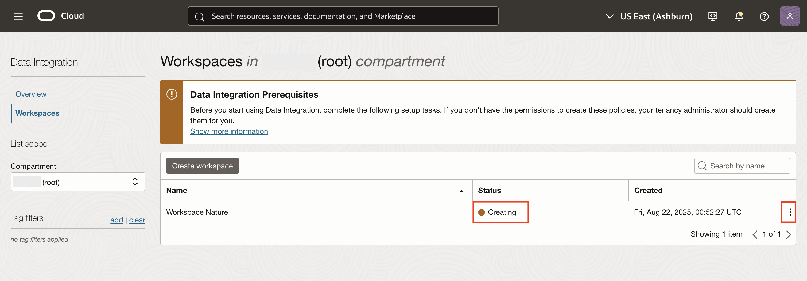

11. Then click **Copy OCID**.

   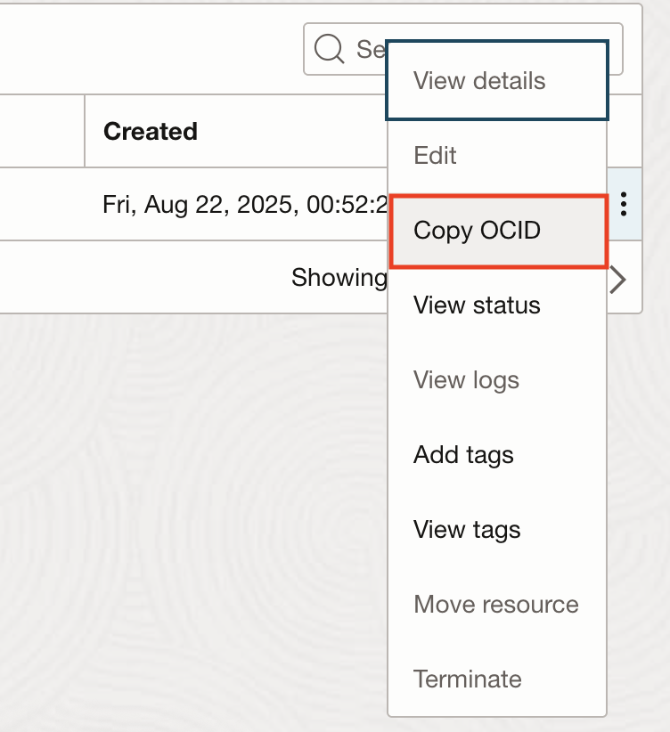

12. Go to **Identity & Security** and then click **Policies**. We are going to add new **Policies** for our new Workspace.

   

13. **Click** on the `dataintegration` policy name.

   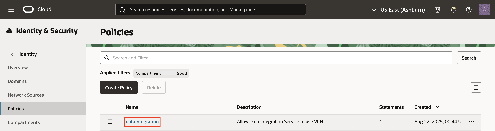

14. Click **Edit Policy Statements**.

   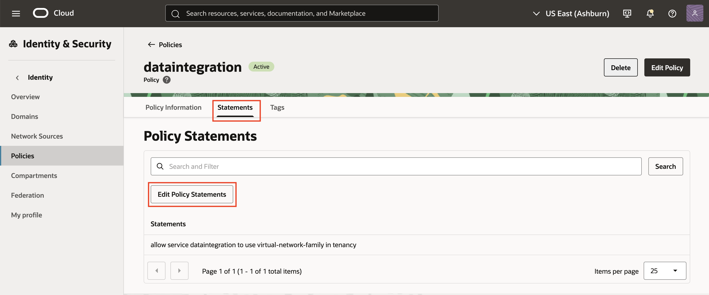

15. Click **+ Another Statement**.
   
   

16. Add **two more statements** and make sure you replace `DATA_INTEGRATION_WORKSPACE_OCID` with the Workspace OCID:

      - The first statement:
      
      ```
      <copy>allow any-user to use buckets in tenancy where ALL {request.principal.type='disworkspace', request.principal.id='DATA_INTEGRATION_WORKSPACE_OCID'}</copy>
      ```
      
      - The second statement:
      
      ```
      <copy>allow any-user to manage objects in tenancy where ALL {request.principal.type='disworkspace',request.principal.id='DATA_INTEGRATION_WORKSPACE_OCID'}</copy>
      ```

17. Click **Save Changes**.

   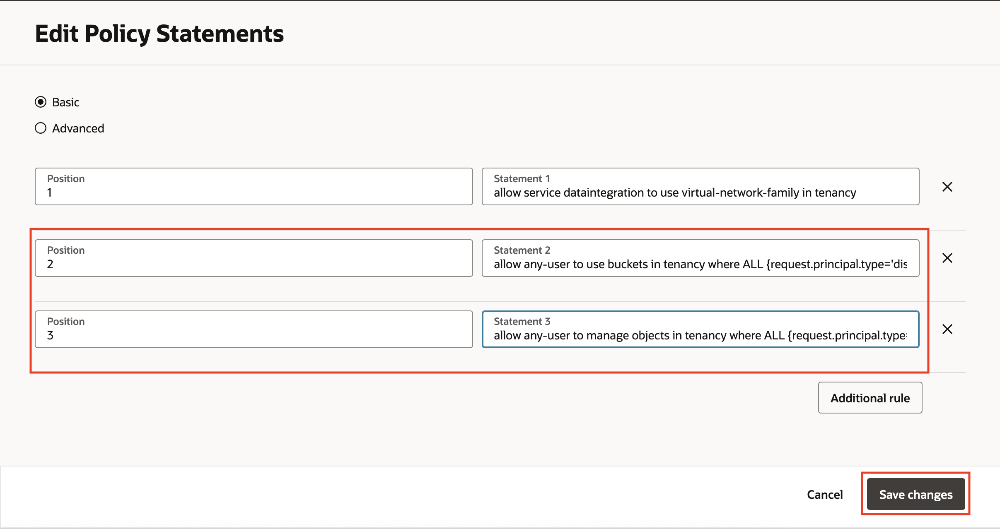

18. Come back to **Data Integration** under **Analytics & AI**, click **Menu**, **Analytics & AI** and then click **Data Integration**.

   

19. Go to **Workspaces** page, at the moment you are on **Overview**.Second tab on the left side of the menu. Check the **Data Integration Workspace** is `Active` and click the link.

   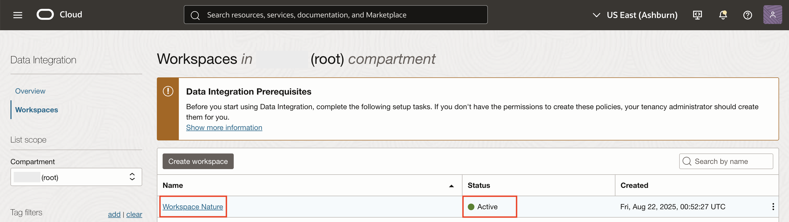

---

## Task 2: Create the Data Assets

We are going to need the **Object Storage URL** and **Tenancy ID**.

1. ### Keep the Object Storage URL that you copied previously at hand

   You have this URL from Lab number 1, Underlying Infrastructure. The URL depends on the region you are doing the workshop.

   Some examples for different URLs depending on the region are, check yours:

   | Region    | Object Storage URL                                     |
   | --------- | ------------------------------------------------------ |
   | Frankfurt | `https://objectstorage.eu-frankfurt-1.oraclecloud.com` |
   | London    | `https://objectstorage.uk-london-1.oraclecloud.com`    |
   | Zurich    | `https://objectstorage.eu-zurich-1.oraclecloud.com`    |
   | Dubai     | `https://objectstorage.me-dubai-1.oraclecloud.com`     |
   | Jeddah    | `https://objectstorage.me-jeddah-1.oraclecloud.com`    |
   | Amsterdam | `https://objectstorage.eu-amsterdam-1.oraclecloud.com` |
   | Mumbai    | `https://objectstorage.ap-mumbai-1.oraclecloud.com`    |
   | Cardiff   | `https://objectstorage.uk-cardiff-1.oraclecloud.com`   |
   | Ashburn   | `https://objectstorage.us-ashburn-1.oraclecloud.com`   |
   | Phoenix   | `https://objectstorage.us-phoenix-1.oraclecloud.com`   |
   | Hyderabad | `https://objectstorage.ap-hyderabad-1.oraclecloud.com` |

   Check for more in the Official documentation: [Object Storage Service API](https://docs.oracle.com/en-us/iaas/api/#/en/objectstorage/20160918/).

2. ### Get Tenancy OCID

   Go to **Profile** on the top-right corner.
   Click on **Tenancy**.

   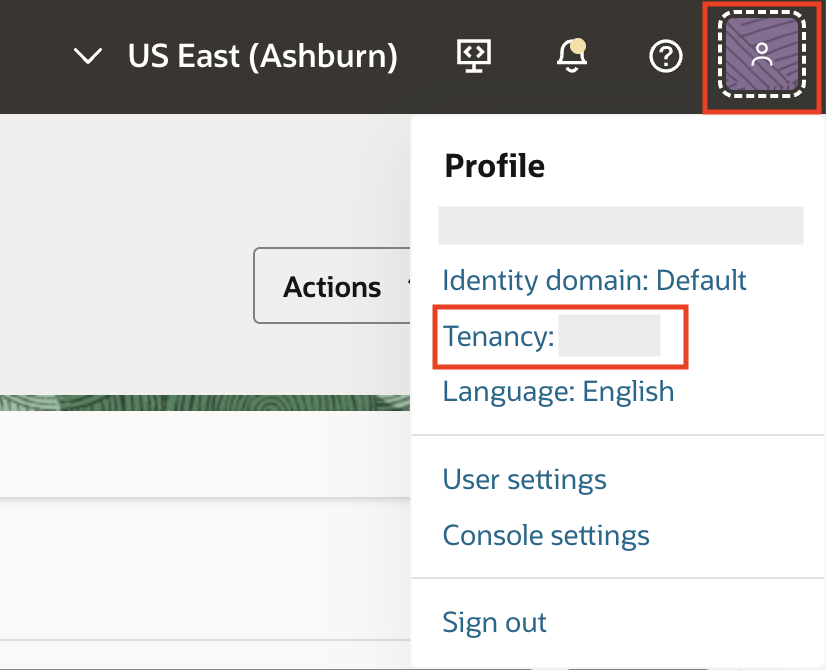

   **Tenancy** details contain a lot of interesting information, among others:

      - Your **Home** Region.
      - Your **CSI number** for creating support tickets.
      - Also, your **Object Storage Namespace**.

   At this point, we are interested in the **Tenancy OCID**. Copy the OCID by clicking on **Copy**. Write it down for the next step.

   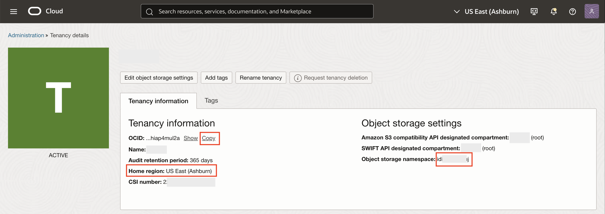

   > Note: You can see that the **Object Storage Namespace** is here, too, in case you need it in the future.

3. Let's create the **Data Asset** now. Go back to Your **Data Integration Workspace**.

   Go to **Menu**, **Analytics & AI** and then click **Data Integration**:

   

4. Click on **Workspace Nature**.

   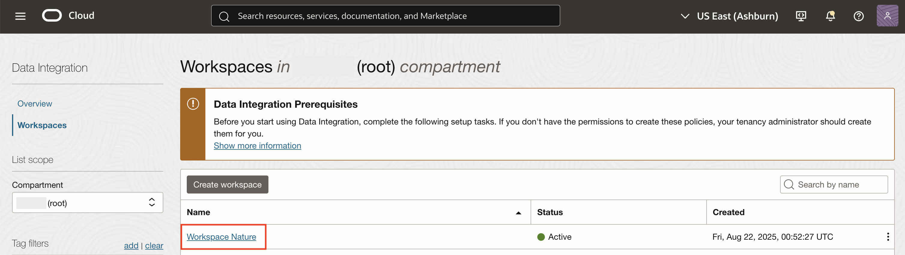

   You can see that by default, there are a `Default Application` and a default project, `My First Project`.

   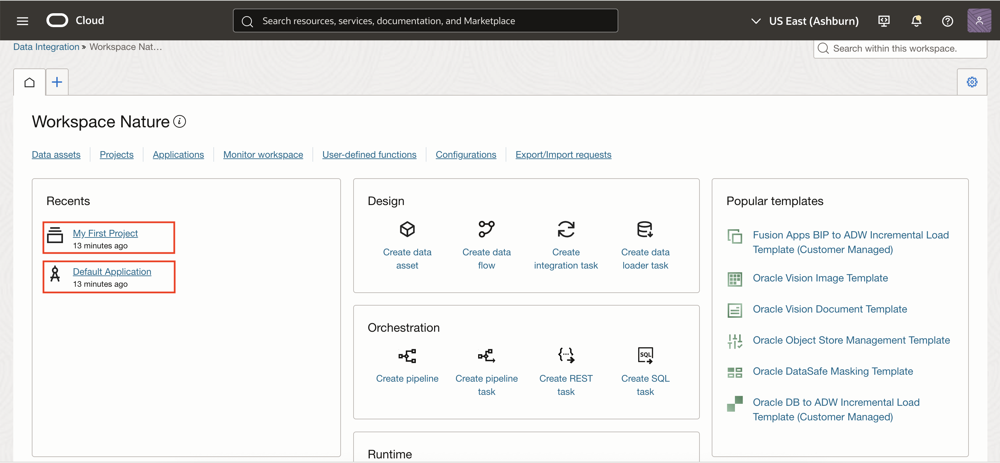

   The first task is to create the data assets that represent the source and target for the data integration. In our case, the data source is an Object Storage bucket, and the target is our MySQL database.

5. Click **Create Data Asset**.

   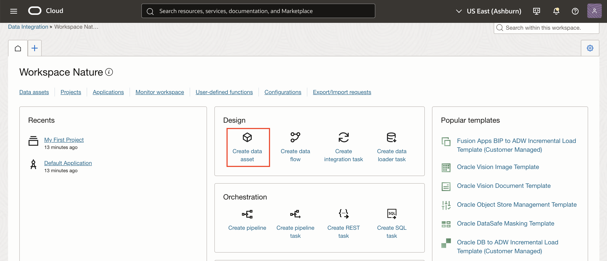

6. **Fill** the fields as follows:

      - Name: `bucket-study`
      ```
      <copy>bucket-study</copy>
      ```
      - Description: `Object Storage Bucket with fish survey`
      ```
      <copy>Object Storage Bucket with fish survey</copy>
      ```
      - Type: `Oracle Object Storage`
      - Tenancy OCID: `ocid1.tenancy.oc1..<unique_ID>`

      Click outside the **Tenancy OCID** field, and after few seconds, and **Namespace** will be retrieved automatically.

      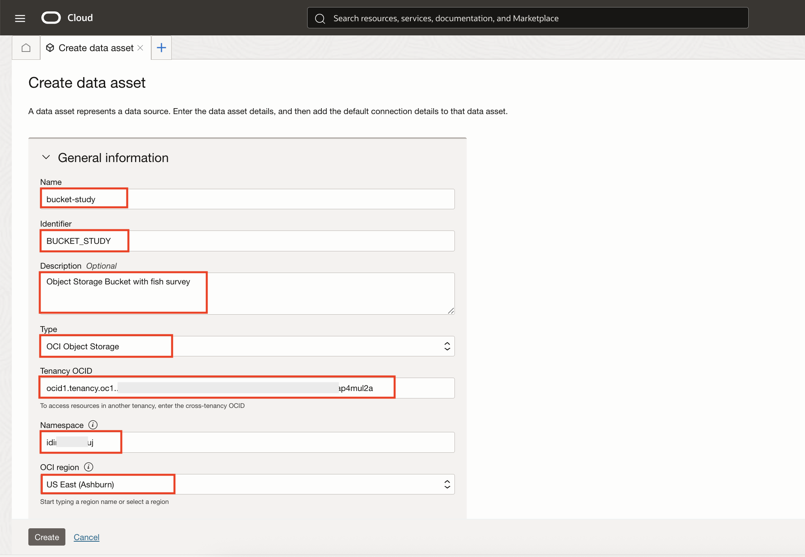
    
      - OCI region: `eu-frankfurt-1`. You can find this information as part of the Object Storage URL that we copied on Lab 1, Task 3, Step 12. You can copy the OCI region, from the summary table of Object Srotage regions URLs on Step 1 of this Task, if you know which region you are using.

      - Default connection information: Leave the connection paratemers as they are.

7. You can test the **connection**.

      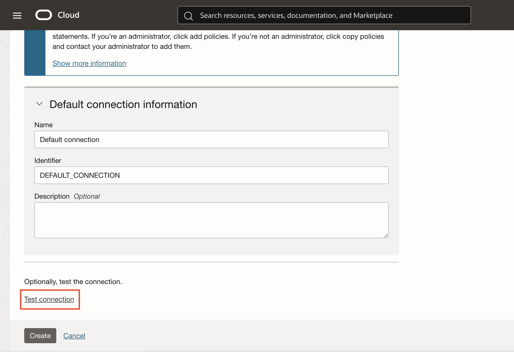

8. After you get a **successful** test, click **Create**.

   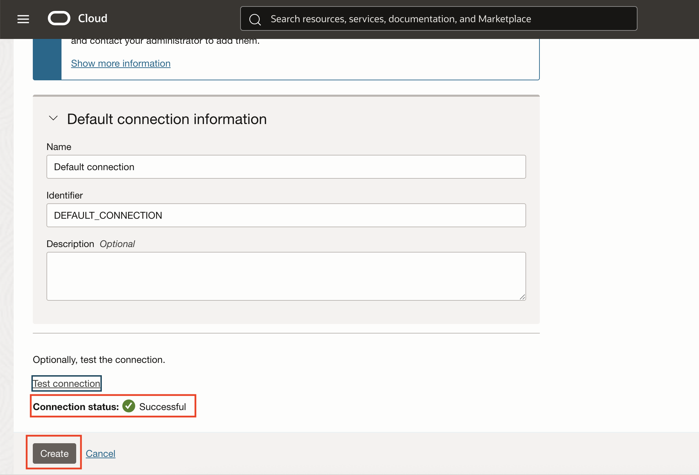

9. Go back to the **Home** Screen.

   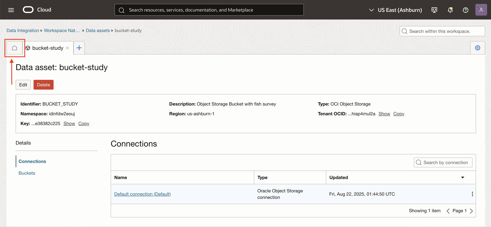

10. Click **Create Data Assets** again.

   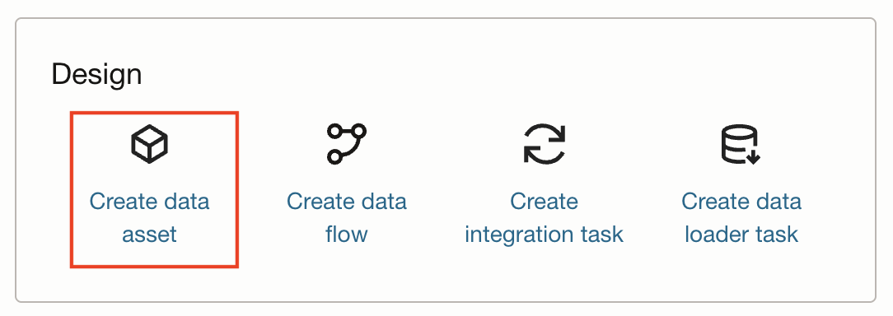

   This time we are going to create the **MySQL database asset** with the following values:

      - Name: `mysql-database`
      ```
      <copy>mysql-database</copy>
      ```
      - Description: `MySQL Database for Analytics`
      ```
      <copy>MySQL Database for Analytics</copy>
      ```
      - Type: `MySQL`
      - Host (you have to complete this field using your MySQL Private IP address): It should be similat to `10.0.1.xxx`
      - Port: `3306`
      ```
      <copy>3306</copy>
      ```
      - Database: `nature`
      ```
      <copy>nature</copy>
      ```
      - Username: `root`
      ```
      <copy>root</copy>
      ```
      - Password: `<your_password>`. Enter any password you wish to use following the specific requirements imposed by Oracle.
      
   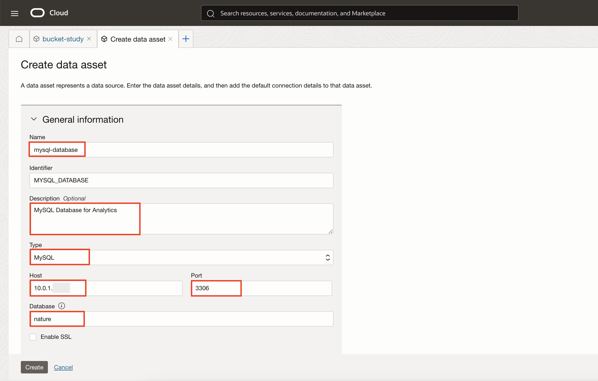

   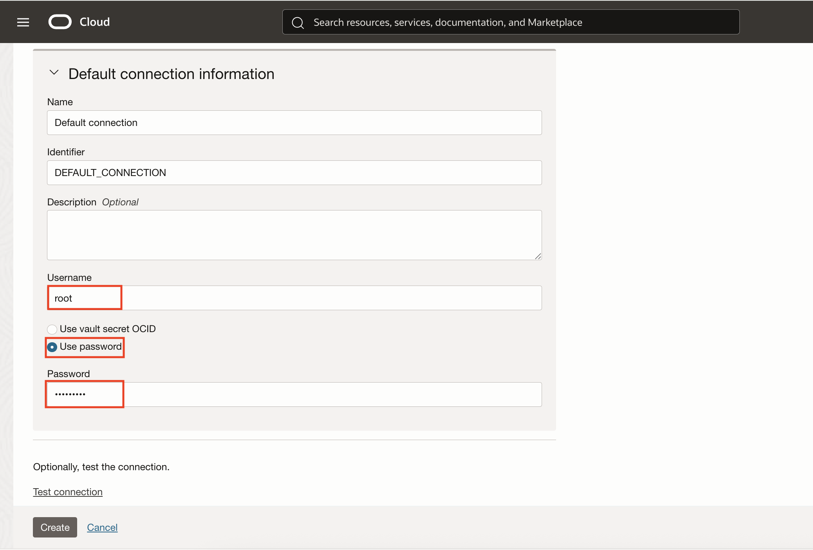

   You can test the **connection**.

11. After you get a **successful** test, click **Create**.
 
   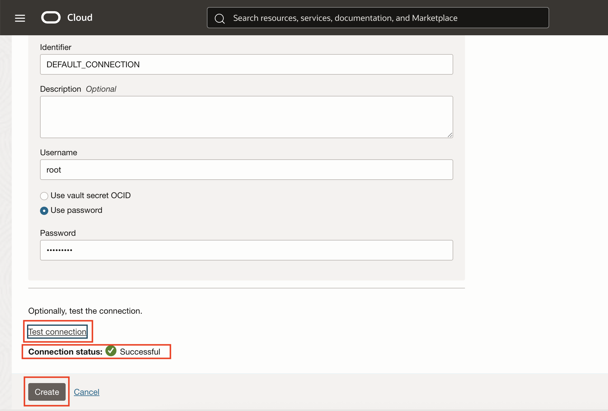

   When the data asset is created, go back to **Home**.

   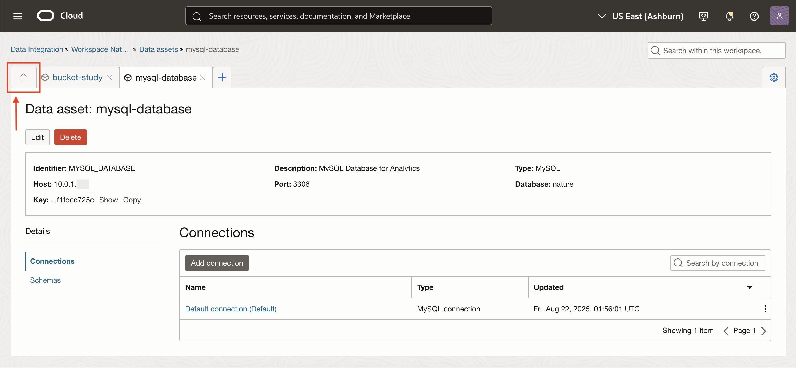

## Task 3: It Works

1. Go back to the **Home** Screen. You have just created the **two Data Assets** needed for the next Lab. Your **Recents** should look like this:

   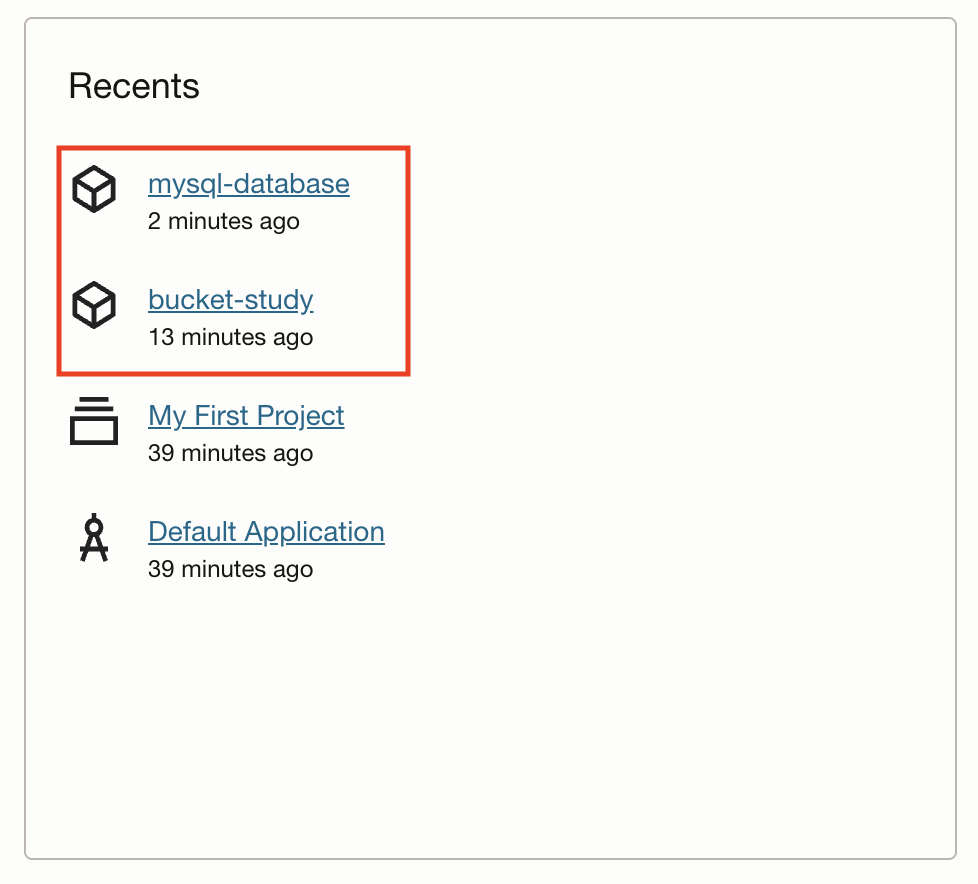

Congratulations, you are ready for the next Lab!

---

## **Acknowledgements**

- **Author** - Victor Martin, Technology Product Strategy Director
- **Contributors** - Priscila Iruela
- **Last Updated By/Date** - Priscila Iruela, June 2022
