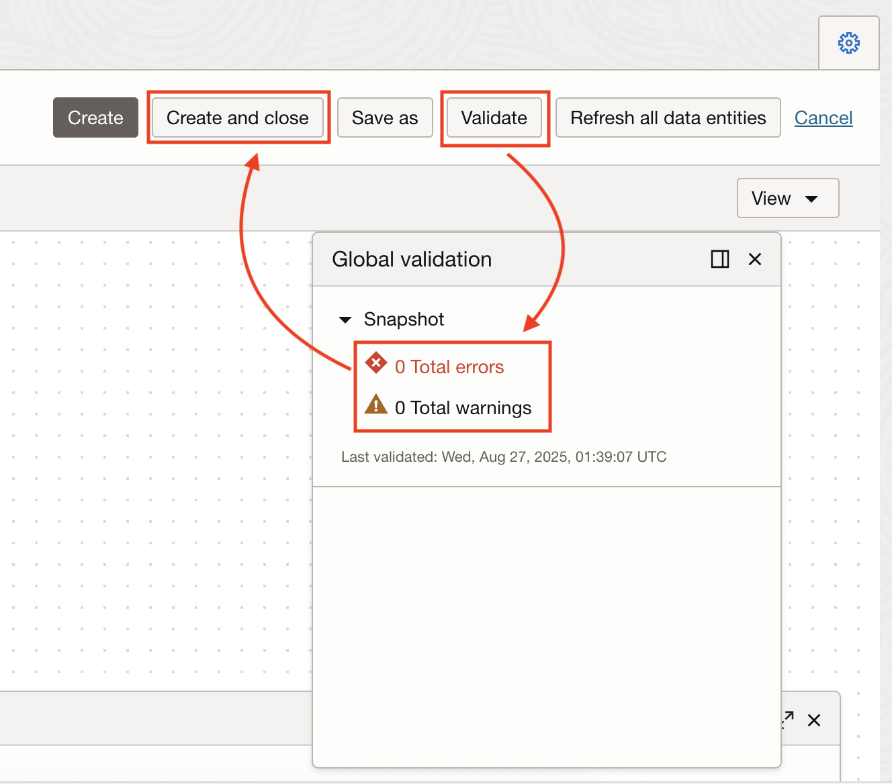
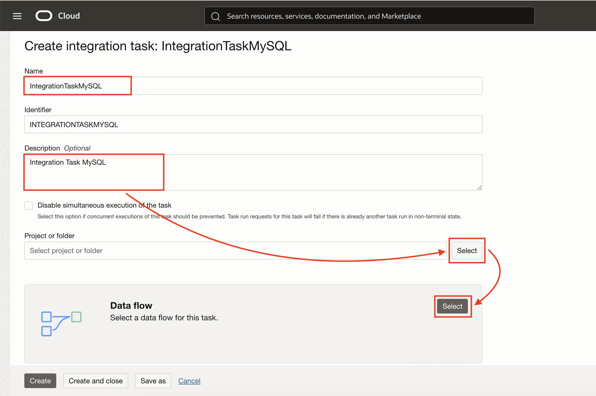
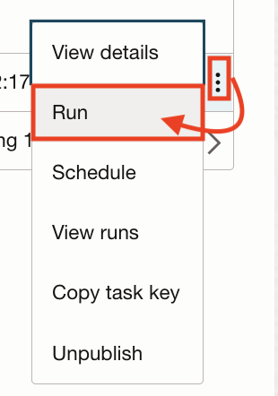

# Design and Run your ETL Pipeline


## Introduction

A **data flow** is a visual program representing the flow of data from source data assets, such as a database or flat file, to target data assets, such as a data lake or data warehouse.

The flow of data from source to target can undergo a series of transforms to aggregate, cleanse, and shape the data.

Data engineers and ETL developers can then analyze or gather insights and use that data to make business decisions.


Estimated Time: 30 minutes.

### Objectives

In this section, you will:

- Create the Data Flow.
- Create the Integration Task.
- Publish the Integration Task.
- Run the Task.

### Prerequisites

- All previous sections have been successfully completed.

## Task 1: Create the Data Flow

1. Click **Create Data Flow**.

   

2. Set the **Name**, **Project** and **Description** in the New Data Flow Panel:

      - Name: `CSV to MySQL` 
      ```
      <copy>CSV to MySQL</copy>
      ```
      - Project or Folder: click on the empty field and the projects that you have created will show up. Click on `My First Project` and **Select**.
      - Description: `Data Flow from CSV on Object Storage to MySQL Database`
      ```
      <copy>Data Flow from CSV on Object Storage to MySQL Database</copy>
      ```
      - Click **Create**

   

   It should look like this:

   

3. From the **Operators** panel, drag and drop the **Source** icon into the canvas.

   

4. Click **right mouse bottom** on top of **Source_1** and select **Details**.

   

5. Set the **Identifier** as `FISH_SURVEY` in the **Details** tab from the Source **Properties** panel. Then go to **Data Asset** and click **Select**.

   - Identifier: `FISH_SURVEY`
      ```
      <copy>FISH_SURVEY</copy>
      ```

   

6. From the **dropdown**, select `bucket-study` and click **Select**.

   

7. **Select** `Default Connection` in the Connection section. In the **Schema** section, select the **Compartment** that you have used to create for this workshop, `root`. Then click **Select** and pick the name of the bucket `bucket-study`. And finally, select the **Data Entity**.

   

8. Browse by **Name**:

   

9. **Select** `mds-di-ds-reef_life_survey_fish.csv` file.

   

10. And click **Select**.

   

11. On the dropdown for **File Type**, pick `CSV`.

   

12. Then click **Select**.

   

13. At this point, your source has access to the **Attributes**, where you can see the different fields of your dataset.

   

   **Confirm** you can see **Attributes** and **Data**.

   Let's move into the target for our **MySQL Database**.

14. Drag and Drop the **Target** icon into the canvas.

   

15. Set the **Identifier** as `MySQL_DB` in the **Target**, and leave **Integration Strategy** as `Insert`:

   - Identifier: `MySQL_DB`
      ```
      <copy>MySQL_DB</copy>
      ```

   

16. This time, pick the `mysql-database` **Data Asset**. Also select **Connection** as `Default Connection`.

   

17. For the **Schema**, select `nature`.

   

18. For **Data Entity**, we select the table `fish`.

   

   

19. At this point, we can see the fields of the table under the **Attributes** tab.

   

20. Time to **wire Source and Target**. Draw the link between `FISH_SURVEY` and `MYSQL_DB`. Starting from the circle in `FISH_SURVEY` source box and finishing over `MYSQL_DB` target box.

   

21. The **final result** should look like the following.

   

22. **Make sure** `MYSQL_DB` target is selected (green border) and click on the **Map** tab on the **Properties** panel. 
**Drag and drop** the fields with NO `Auto` in the mapping column (from left to right). **Do it until they are all mapped**. 
You can **expand / shrink** the Properties canvas.

   

23. Make sure the yellow indicator of `Not Mapped` contains **0**, meaning there is no left fields unmapped.

   

24. The **final step** is to **validate** the Data flow. Click **Validate**, check there are `O Total Warnings or/and  O Total Errors` and click **Save and Close**.

   

---

## Task 2: Create the Integration Task

1. Go back to **Home** and Click **Create Integration Task**.

   

2. Set the **Name** and the rest of the info as follows:

      - Name: `IntegrationTaskMySQL`
         ```
         <copy>IntegrationTaskMySQL</copy>
         ```
      - Description: `Integration Task MySQL`
         ```
         <copy>Integration Task MySQL</copy>
         ```
      - Project or Folder: `My First Project`. Be sure you have selected this Project or Folder, otherwise, you will have an error.
      - Data Flow: `CSV to MySQL`

   

3. Wait for the **Validation** to be **Successful** on the Data Flow and click **Create and Close**.

   

---

## Task 3: Publish the Integration Task

1. Go to **Projects** on the home screen.

   

2. Click on **My First Project**.

   

3. On the Details menu (left), click on **Tasks**.

   

4. Select **IntegrationTaskMySQL**, and click **Publish to Application**.

   

5. **Select** (if not selected by default) your **Default Application**. Click **Publish**.

   

---

## Task 4: Run the Task

1. Go back to the **Home** screen and click **Applications**.

   

2. Select **Default Application**, and you will see your task **IntegrationTaskMySQL**.

   

3. Click on the **Context Menu** (three dots) and click **Run**.

   

4. Wait few seconds and the **Status** will change from `Not Started` to `Queued`, and after to `Running`. 

   

   

   

5. Feel free to click **Refresh** from time to time until you see `Success` on the Status.

   

---

## Task 5: It Works

1. On the bastion host in **Cloud Shell** (reconnect from Cloud Shell to the bastion host if timed out: `ssh -i .ssh/bastion opc@PUBLIC_IP`), run the **MySQL Shell** in the `bash` **Terminal** with:

      ```
      <copy>mysqlsh --sql root@PRIVATE_IP</copy>
      ```

2. If requested, write the MySQL **Password**.

3. Set `nature` as the **Schema** in use.

      ```
      <copy>use nature;</copy>
      ```

      The result message says:
      `Default schema set to nature.`
      `Fetching table and column names from nature for auto-completion... Press ^C to stop.` You can continue.

4. Count the **number** of rows in the table `fish` by running the following query.

      ```sql
      <copy>select count(1) from fish;</copy>
      ```

   You should see 3493 as result.

5. **Exit** with:

      ```
      <copy>\exit</copy>
      ```

Congratulations, you are ready for the next Lab!

---

## **Acknowledgements**

- **Author** - Victor Martin, Technology Product Strategy Director
- **Contributors** - Priscila Iruela
- **Last Updated By/Date** - Priscila Iruela, June 2022