# Transform your Data into Insights


## Introduction

**Oracle Data Science**: Build high-quality models faster and easier. Automated machine learning capabilities rapidly examine the data and recommend the optimal data features and best algorithms. Additionally, automated machine learning tunes the model and explains the model’s results.

[](youtube:_Z5PdpdEklI)

Estimated Time: 15 minutes.

### Objectives

In this section, you will:

- Create Policies.
- Create Policies for Data Science.
- Create a Data Science Project.
- Install libraries.
- Create Jupyter Notebook environment.

### Prerequisites

- All previous sections have been successfully completed.

## Task 1: Create Policies

1. Create **Dynamic Group**, go to **Menu**, **Identity & Security** and then click **Dynamic Groups**.

> Note: If you can't see **Dynamic Groups** under **Identity & Security** section, please select **Domains**, **Default (Current domain)** and then click **Dinamycs Group** in the left side menu.
 
   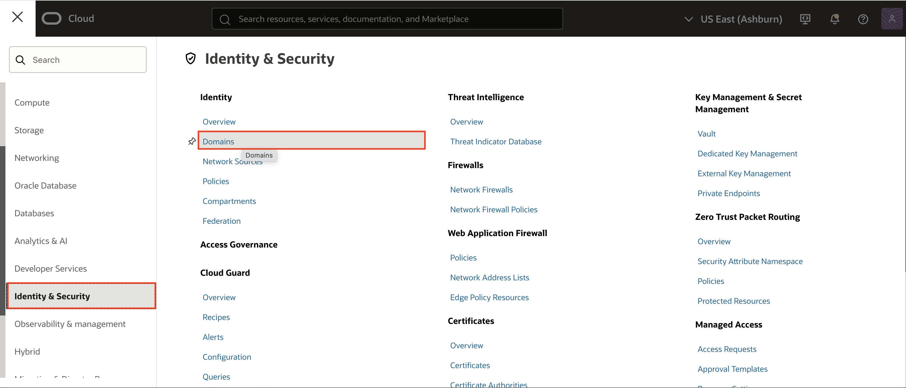

2. Click **Create Dynamic Group**.

   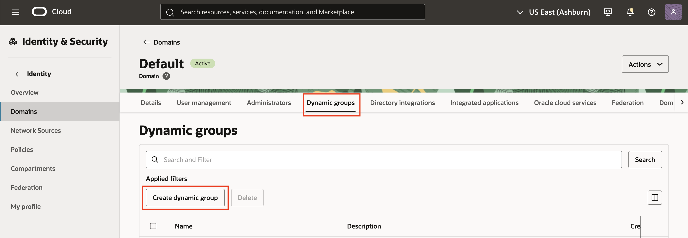

3. Set the following **Values**:

      - Name: `datascience`
         ```
         <copy>datascience</copy>
         ```
      - Description: `Data Science Dynamic Group`
         ```
         <copy>Data Science Dynamic Group</copy>
         ```
      - Rule 1 (Matching Rules):
         ```
         <copy>ALL { resource.type = 'datasciencenotebooksession' }</copy>
         ```

4. Click **Create**.

   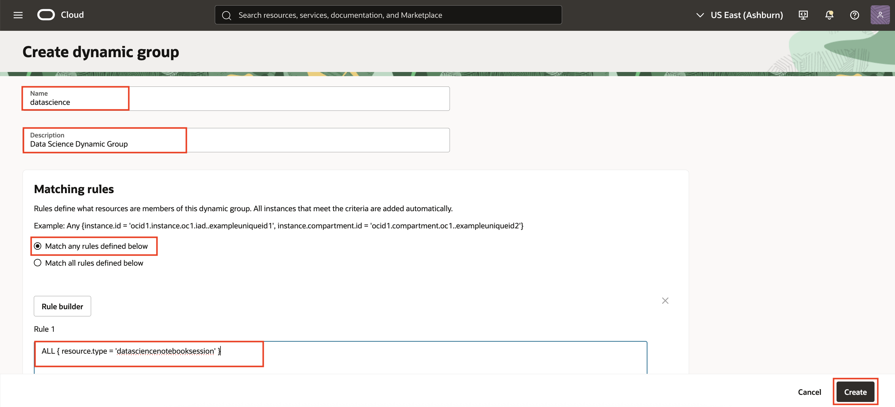

5. The **Dynamic Group** for Data Science has been created. Don't worry if the colour can vary from the picture, **Green** and **Blue** in this case mean the same.

   

---

## Task 2: Create Policies for Data Science

1. Go to **Menu**, **Identity & Security** and then click **Policies**.

   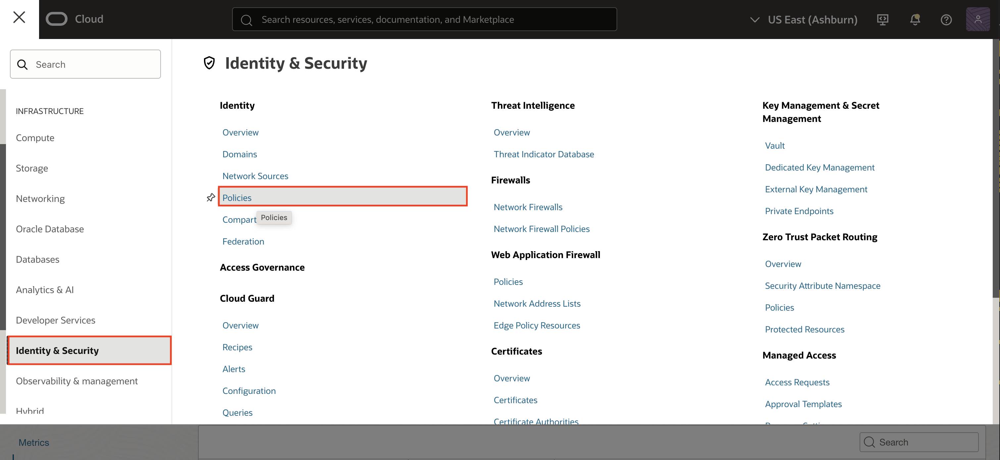

2. Click **Create Policy**.

   Make sure you are in the `root` compartment.

   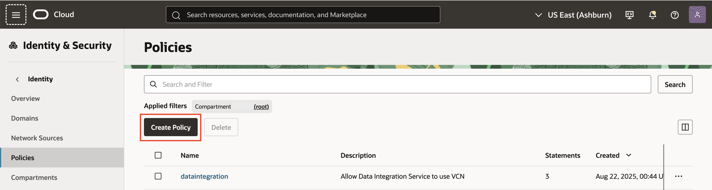

3. Use the following information:

      - Name: `datascience`
         ```
         <copy>datascience</copy>
         ```
      - Description: `Data Science to use network resources`
         ```
         <copy>Data Science to use network resources</copy>
         ```
      - Policy Builder:
      - Toggle **Show manual editor**

         ```
         <copy>allow service datascience to use virtual-network-family in tenancy</copy>
         ```

         ```
         <copy>allow dynamic-group datascience to manage data-science-family in tenancy</copy>
         ```

4. Click **Create**.

   

5. The **Policy** for Data Science has been created.

   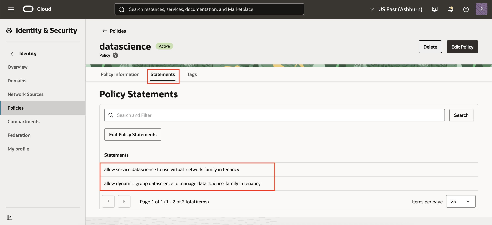

   > Note: If you have created an **Oracle Cloud Account** to do the workshop, you are already the Administrator. You DO NOT NEED TO DO THIS STEP.
   >
   > In case you are a **Non-admin user**, you will need to set up some more policies to allow the group you belong to. Ask your administrator.
   >
   > ```
    <copy>allow group [data-scientists] to use virtual-network-family in tenancy</copy>
   ```
   >
   > ```
    <copy>allow group [data-scientists] to manage data-science-family in tenancy</copy>
   ```

---

## Task 3: Create a Data Science Project

1. Go to **Menu**, **Analytics & AI** and then click **Data Science**.

   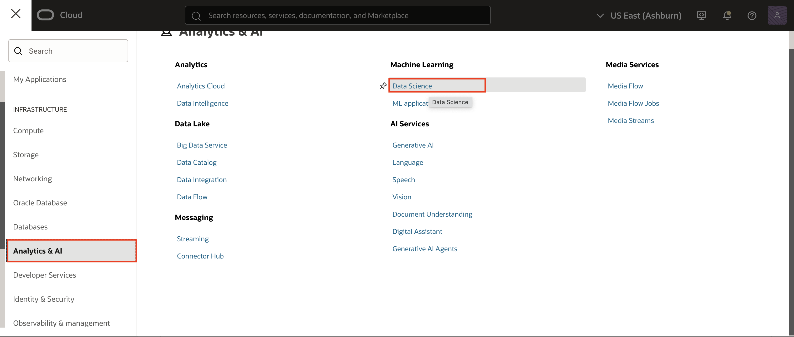

2. Click **Create Project**.

   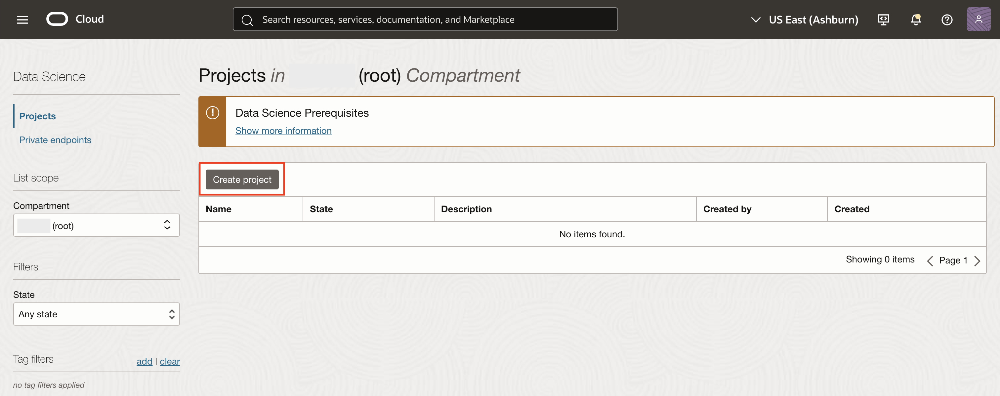

3. Set the **Name** and **Description** as follows:

      - Name: `Nature`
         ```
         <copy>Nature</copy>
         ```
      - Description: `Fish Survey notebook`
         ```
         <copy>Fish Survey notebook</copy>
         ```

4. Click **Create**.

   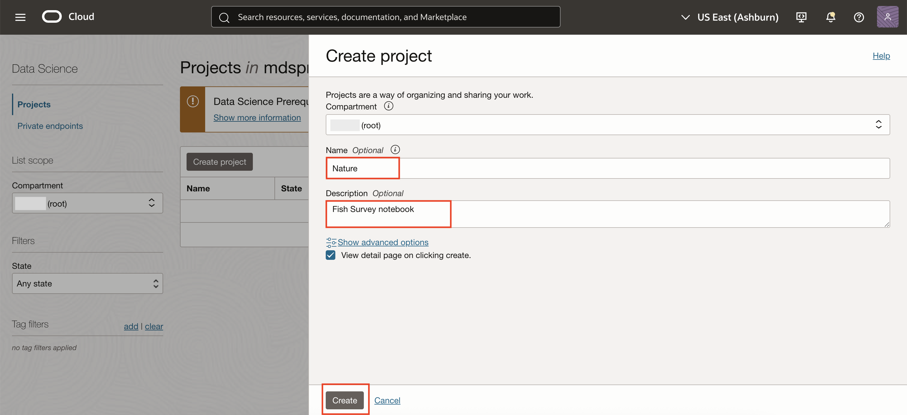

5. The next step is to create a **Notebook**, click **Create Notebook Session**.

   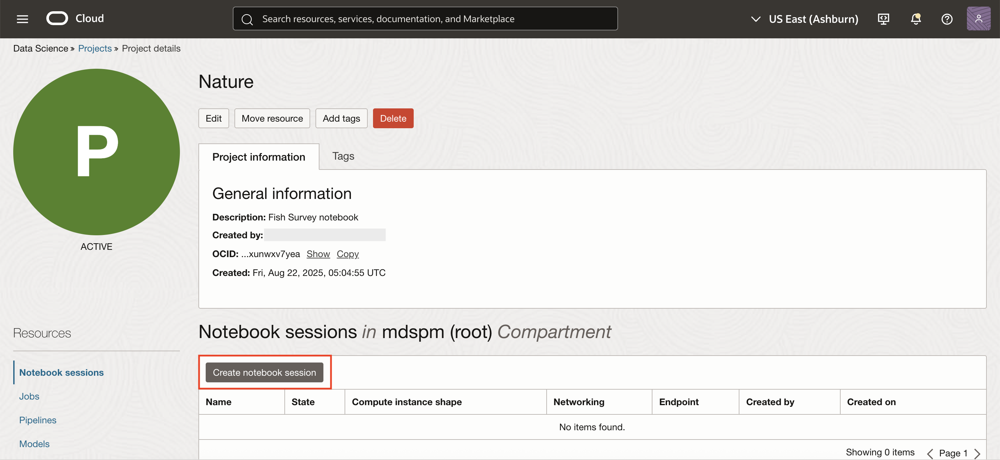

6. Set the following **Values**:

      - Name: `Fish Survey`
         ```
         <copy>Fish Survey</copy>
         ```
      - Compute Instance Shape (but other compatible shapes would work as well): `VM.Standard.E2.2`
      - Block Storage Size: `50`
         ```
         <copy>50</copy>
         ```
      - Networking resources > Custom networking
      - VCN: `nature`
      - Subnet: `Private Subnet-nature`

7. Click **Create**.

   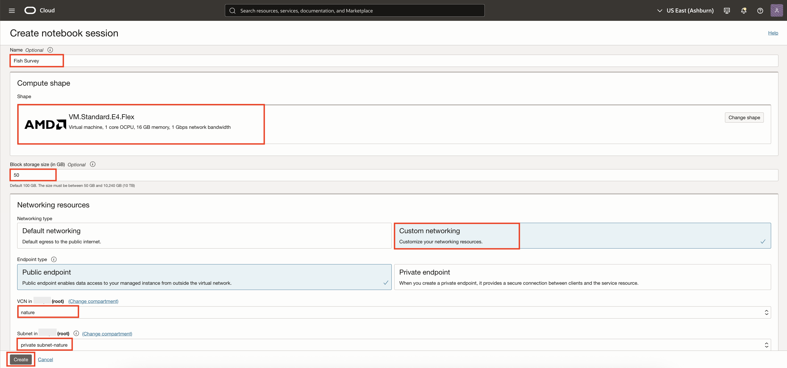

8. The **Status** icon will change from Creating to Active. Be patient, this process should take a few minutes.

   

   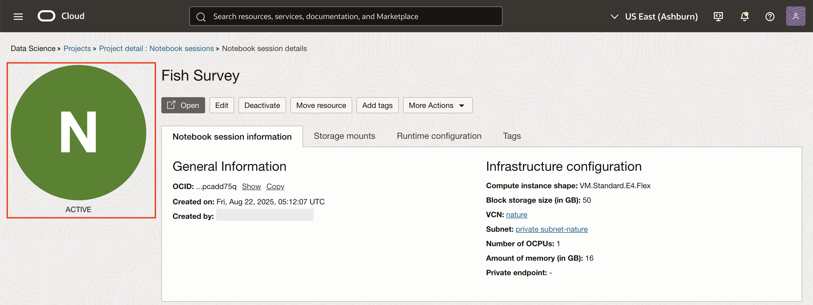

9. When the Notebook is active, click **Open**.

   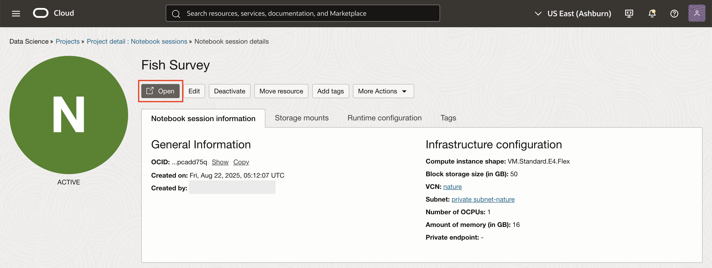

10. If you see your **Oracle Cloud Account** in the next screen, clik on it, otherwise follow the next steps to `Sign in with a different user account` and follow the next step.

   

11. Log-in into your Notebook. Click **Continue** and you should be in your notebook as you are using your same OCI Web Console user. Otherwise, log in with your specific user.

   

---

## Task 4: Install Libraries

1. Welcome to your **Jupyter Notebook**. Click **Terminal**.

   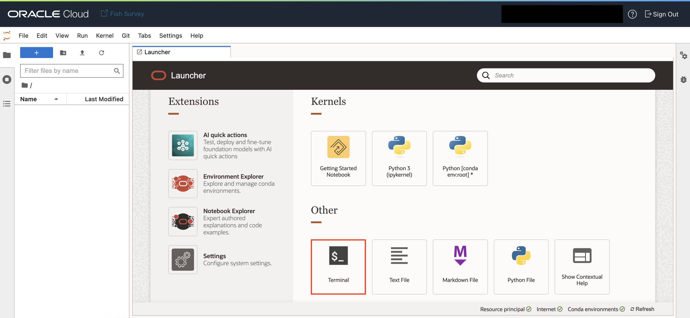

2. Type the following command:

   ```
      <copy>pip install mysql-connector-python pandas seaborn</copy>
   ```

   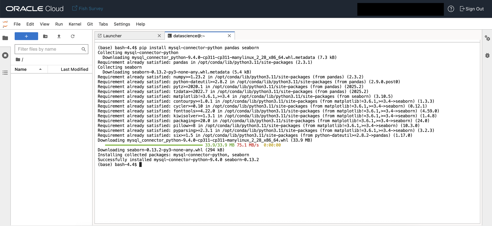

3. Wait for the installation to **complete**. It should take less than one minute.

---

## Task 5: Create Jupyter Notebook Environment

1. **Download** the Notebook <a href="https://objectstorage.eu-frankfurt-1.oraclecloud.com/p/accWutecVkW3_TtuapnHBzeCEGkAYiFijcU4slJLVBBZwoO00Bxicgreqs1mBFGQ/n/fruktknlrefu/b/workshop-marine-life/o/mds-di-ds-FishSurvey.ipynb" target="\_blank">here</a>.

2. Click **Upload files**.

   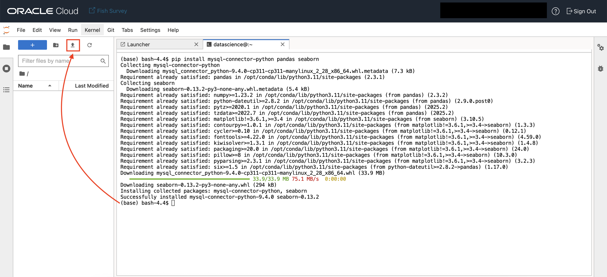

3. **Select** `mds-di-ds-FishSurvey.ipynb` from your disk. Wait for the upload to **complete**.

4. Your `mds-di-ds-FishSurvey.ipynb` will be **loaded** on the side panel.

   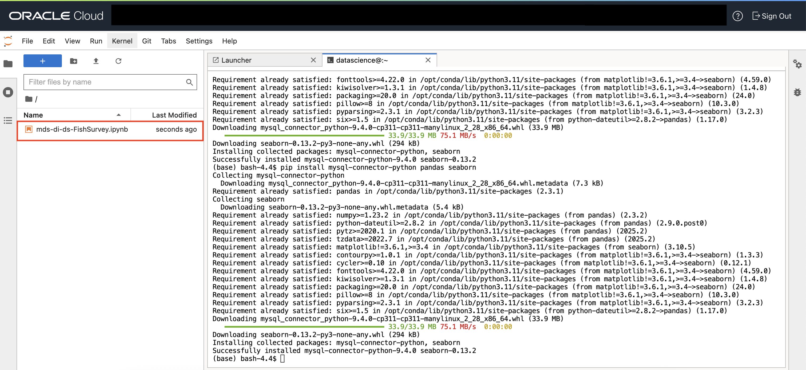

5. **Double click** on **mds-di-ds-FishSurvey.ipynb**.

6. Make sure you **modify** `PRIVATE_IP` and **passwd** on the following code in the **Notebook** with the **Private IP and Password from MySQL Database Service**.

   ```
   cnx = mysql.connector.connect(
      host="PRIVATE_IP",
      user="root",
      passwd="<your_password>",
      database="nature"
   )
   ```

   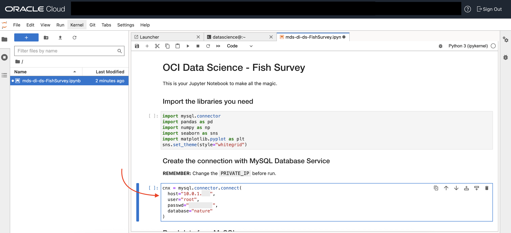

7. **Select** the first paragraph (called Cell) with all the `import` statements in the Notebook and run the **Notebook** cell by cell by clicking the **Play** icon over and over until you reach the end.

   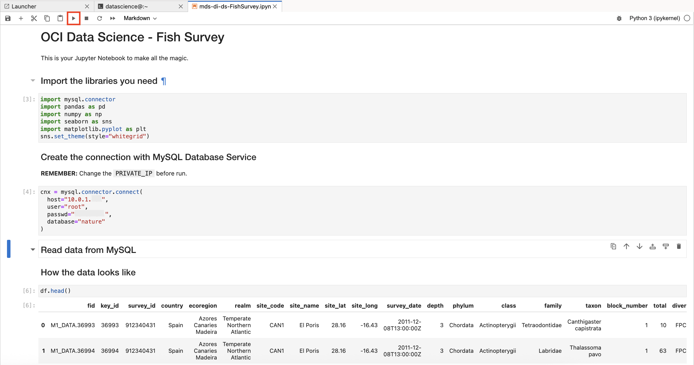

8. Check the **plot** where you can see the population of fish by water depth.

   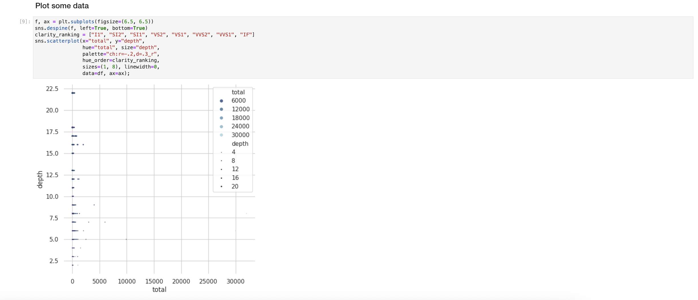

Congratulations! Well done!

Continue to the Next Steps for more information!

---

## **Acknowledgements**

- **Author** - Victor Martin, Technology Product Strategy Director
- **Contributors** - Priscila Iruela
- **Last Updated By/Date** - Priscila Iruela, June 2022