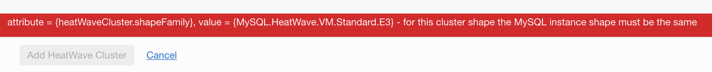

# Next Steps

## Want to learn more?

[Getting Started with Data Integration](https://docs.oracle.com/en-us/iaas/data-integration/using/preparing-for-connectivity.htm)

## Troubleshooting

### Lab Create MySQL Database Service
- Enable HeatWave

Error: `attribute = {heatWaveCluster.shapeFamily}, value = {MySQL.HeatWave.VM.Standard.E3} - for this cluster shape the MySQL instance shape must be the same`



> Note: You need to use HeatWave Shape when you created MySQL Database Service.
>
> Terminate your current MySQL Instance and create a new one with HeatWave valid shape, for example: `MySQL.HeatWave.VM.Standard.E3`.
>
> Enable HeatWave should work with the new shape.

---

### Lab Create Data Integration Instance

`java.io.IOException: Unable to determine if path is a directory`

Review Policy:

```
<copy>allow any-user to read objectstorage-namespaces at tenancy</copy>
```

---

### Lab Create Data Integration Instance


```
Following VCN not found or user not authorized: ocid1.vcn.oc1.uk-london-1...<unique_ID> ,or there might be missing network policies, please refer this link for more information https://docs.cloud.oracle.com/en-us/iaas/data-integration/using/
```

You forgot to create the policy for Data Integration to use Virtual Cloud Network.

```
<copy>allow service dataintegration to use virtual-network-family in tenancy</copy>
```

---

## **Acknowledgements**

- **Author** - Victor Martin, Technology Product Strategy Director
- **Contributors** - Priscila Iruela
- **Last Updated By/Date** - Priscila Iruela, June 2022