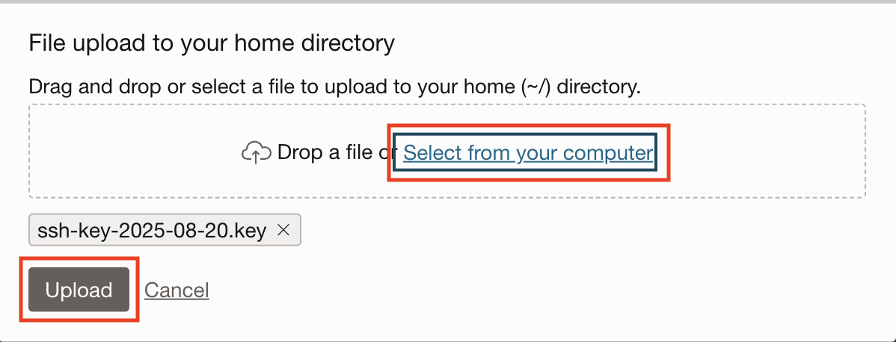

# Underlying Infrastructure


## Introduction

A **virtual private network** closely resembles a traditional network, with firewall rules and specific types of communication gateways that you can choose to use. A VCN resides in a single Oracle Cloud Infrastructure region and covers one or more CIDR blocks (IPv4 and IPv6, if enabled).

You can find more information about VCN configuration for Oracle Data Integration in this [Blog](https://blogs.oracle.com/dataintegration/post/understanding-vcn-configuration-for-oracle-cloud-infrastructure-oci-data-integration).

The **Oracle Cloud Infrastructure Object Storage service** is an internet-scale, high-performance storage platform that offers reliable and cost-efficient data durability. The Object Storage service can store an unlimited amount of unstructured data of any content type, including analytic data and rich content, like images and videos.


[](youtube:RHIfvO9aTQ0)

Estimated time: 15 minutes

### Objectives

In this section, you will:

- Create Virtual Cloud Network.
- Create Bastion Host.
- Create Object Storage and upload files.

### Prerequisites

- This section assumes you have logged into your to Oracle Cloud account.

## Task 1: Create Virtual Cloud Network (VCN)

1. We are going to **create a network with a public subnet** (with access from the Internet) and a **private subnet** (no direct access from the Internet).

   This **network** layout is interesting to protect those services that don't need to be exposed to the Internet (living in the Private subnet) meanwhile other services and virtual machines with **direct access from the internet**, like Bastion hosts or Web Servers (living in the Public Subnet).

2. Go to **Menu**, **Networking** and then click **Virtual Cloud Networks**.

   

   > Note: If you have not picked a compartment, pick the **root** compartment for this Lab.
   >
   > 

3. Click **Start VCN Wizard**.

   

4. Select **VCN with Internet Connectivity** and click **Start VCN Wizard**.

   

5. Change the **VCN name** and leave everything else as **default**.

      - VCN Name: `nature`
      ```
      <copy>nature</copy>
      ```

6. Click **Next**.

   

7. Review all the details and click **Create**.

   

   The creation process takes few seconds. Confirm everything is created (green tick on all resources) before you continue.

8. Click **View Virtual Cloud Network**.

   

9. Go to your new **Private Subnet-nature**.

   

10. Click **Security List for Private Subnet-nature**.

   

   We need to open the ports for MySQL and MySQL X protocols: `3306` and `33060`.

11. Click **Add Ingress Rules** and fill the form with the following information:

   

   We are adding an **ingress rule** on those ports from the internal VCN CIDR `10.0.0.0/16`.

      - Source CIDR: `10.0.0.0/16`
      ```
      <copy>10.0.0.0/16</copy>
      ```
      - Destination Port Range: `3306,33060`
      ```
      <copy>3306,33060</copy>
      ```
      - Description: `MySQL and MySQL X Protocol`
      ```
      <copy>MySQL and MySQL X Protocol</copy>
      ```
      - Leave the rest of the fields with default values.

   And click **Add Ingress Rule** to confirm the values.

   

12. You can **confirm** the rules are added.

   

## Task 2: Create Bastion Host

1. We are going to **create a compute instance** in the Public Subnet with a public IP; it will be our access point to public and private resources.

2. Go to **Menu**, **Compute** and then click **Instances**.

   

3. Click **Create Instance**.

   

4. Change the **name** to: bastion
      ```
      <copy>bastion</copy>
      ```

   Make sure the rest of the **properties** are like the following:

      - Image: `Oracle Linux 7.9` or Superior - `Oracle Linux 8`
      - Shape for Always Free: `VM.Standard.E2.1.Micro`
      - Alternative Shape could be: `VM.Standard.E2.Flex, VM.Standard.E3.Flex, VM.Standard.E4.Flex`
      - Virtual cloud network: `nature`
      - Subnet: `Public Subnet-nature`
      - Assign a public IPv4 address: `Yes`

   

5. On the section **Add SSH Keys**, make sure **Generate SSH Keypair** is checked.

6. Click **Save Private Key** and **Save Public Key**.

7. After the files are stored on your computer, click **Create**.

   

   The **provisioning** takes few minutes.

   

8. You can **copy** the assigned **Public IP** that we will use to SSH into the instance, also notice that the username is `opc`.

   Make sure the Icon turns **green**, and it says "RUNNING".

   

   To avoid install tools on your local computer, we are going to use **Cloud Shell**. Cloud Shell is a small and **free Linux virtual machine** with a lot of DevOps tools preinstalled that Oracle Cloud offers.

9. Click on the **Cloud Shell** icon on the top-right menu bar.

   

   It will provision this small virtual machine, and you will have access to its terminal from the **Oracle Cloud Web Console**.

   

10. Click on the Cloud Shell **menu** icon and then in **Upload**.

   

11. Click on **select from your computer**. And select the **private key** (`.key` file) you downloaded for the compute instance.

   > Note: You don't need to upload the public key (`.pub` file), but feel free to do it.

   

12. After you Upload the file you can **Hide** the message.

   

13. On **Cloud Shell terminal**, create `.ssh` folder for your SSH keys.

      ```
      <copy>mkdir -p .ssh</copy>
      ```

14. **Move** the key file to your `.ssh` folder with a different name, `bastion`.

      ```
      <copy>mv ssh-key-*.key .ssh/bastion</copy>
      ```

15. **Connect** with your bastion host with SSH. The `PUBLIC_IP` was copied when the bastion host was created.

      ```
      <copy>ssh -i ~/.ssh/bastion opc@PUBLIC_IP</copy>
      ```

16. To the question `Are you sure you want to continue connecting (yes/no/[fingerprint])?` type `yes` and ENTER.

   You will most likely get a `bad permissions` warning. Basically the permissions of the key are too open.

      ```
      Warning: Permanently added 'xxx.xxx.xxx.xxx' (ECDSA) to the list of known hosts.
      @@@@@@@@@@@@@@@@@@@@@@@@@@@@@@@@@@@@@@@@@@@@@@@@@@@@@@@@@@@
      @         WARNING: UNPROTECTED PRIVATE KEY FILE!          @
      @@@@@@@@@@@@@@@@@@@@@@@@@@@@@@@@@@@@@@@@@@@@@@@@@@@@@@@@@@@
      Permissions 0644 for '/home/it/.ssh/bastion' are too open.
      It is required that your private key files are NOT accessible by others.
      This private key will be ignored.
      Load key "/home/it/.ssh/bastion": bad permissions
      Permission denied (publickey,gssapi-keyex,gssapi-with-mic).
      ```

17. Security first, let's fix the **permissions** to `400` with the following command:

      ```
      <copy>chmod 400 .ssh/bastion</copy>
      ```

18. **Connect** with SSH again (remember to replace `PUBLIC_IP` with your bastion host IP):

      ```
      <copy>ssh -i ~/.ssh/bastion opc@PUBLIC_IP</copy>
      ```

   This time you should be inside of the bastion host. This is the machine we will use to access MySQL Database Service that lives in a private subnet.

19. **Update** your Linux (it might take few minutes):

      ```bash
      <copy>sudo yum update -y</copy>
      ```

20. **Install** MYSQL Shell with the following commands:

      ```bash
      <copy>wget https://dev.mysql.com/get/mysql80-community-release-el7-3.noarch.rpm</copy>
      ```

      ```
      <copy>sudo yum localinstall -y mysql80-community-release-el7-3.noarch.rpm</copy>
      ```

      ```
      <copy>sudo yum install mysql-shell</copy>
      ```
   > Note: If you get any confirmation message, please write `y` and wait until the installation has been completed.

21. Let's check the **version** of MySQL Shell:

      ```
      <copy>mysqlsh --version</copy>
      ```

## Task 3: Create Object Storage and Upload Files

1. Go to **Menu**, **Storage** and then click **Buckets**.

   

2. Click **Create Bucket**.

   

3. **Change** the bucket name, leave everything else by default.

      - Bucket Name: `bucket-study`
      ```
      <copy>bucket-study</copy>
      ```

4. Click **Create**.

   

5. Click on your **new** `bucket-study` bucket to see details.

   

6. On the section **Objects**, click **Upload**.

   

7. **Download** the dataset <a href="https://objectstorage.eu-frankfurt-1.oraclecloud.com/p/5Sf36_9IRucKBEPwsm-5Zq2QWOl57HK5DlZhIOhqfNBJBlXp53jD621PLjiWz-C_/n/fruktknlrefu/b/workshop-marine-life/o/mds-di-ds-reef_life_survey_fish.csv" target="\_blank">Reef Life Survey Fish</a>.

8. Drop the file on **Choose Files from your Computer**. Leave everything else by default.

   

9. Click **Upload**.

   

10. Click **Close**.

   You will see the new file in the Objects list. Click on the three dots contextual menu.

   

11. On the contextual menu, select **View Object Details**.

   

12. Take note of the URL you have. Only copy the part of the URL up to `oraclecloud.com`. For example, if you are in Frankfurt region should look like `https://objectstorage.eu-frankfurt-1.oraclecloud.com`. We will use the **OCI Region** part (in our case eu-frankfurt-1) in the Lab number 3, Create Data Integration Instance.

   

Congratulations! You are ready to go to the next Lab!

## **Acknowledgements**

- **Author** - Victor Martin, Technology Product Strategy Director
- **Contributors** - Priscila Iruela
- **Last Updated By/Date** - Priscila Iruela, June 2022
