# Connect to MySQL HeatWave With Cloud Shell Private Access and OCI Shell


## Introduction

When working in the cloud, there are often times when your servers and services are not exposed to the public internet. The Oracle Cloud Infrastructure (OCI) MySQL HeatWave is an example of a service that is only accessible through private networks. Since the service is fully managed, we keep it siloed away from the internet to help protect your data from potential attacks and vulnerabilities. It’s a good practice to limit resource exposure as much as possible, but at some point, you’ll likely want to connect to those resources. That’s where Cloud Shell Private Access enters the picture. Cloud Shell Private Access allows you to connect a Cloud Shell session to a private network so you can access  your MySQL HeatWave Database without having the network traffic flow over public networks

_Estimated Lab Time:_ 15 minutes

### Objectives

In this lab, you will be guided through the following tasks:

- Review the new HeatWave database
- Connect to Cloud Shell
- Setup Cloud Shell Private Access
- Use MySQL Shell to Connect to your Heatwave Database

### Prerequisites

- An Oracle Trial or Paid Cloud Account
- Some Experience with MySQL Shell
- Must Complete Lab 1

## Task 1: Review the new HeatWave database

1. Click on the Main Console Menu
    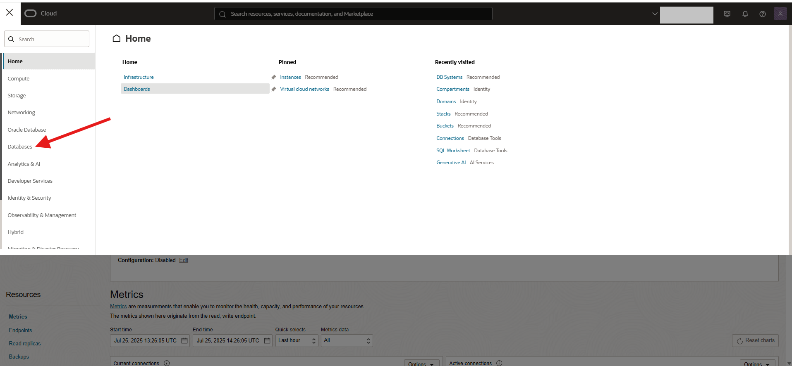

2. Click on the **Databases sub menu**
    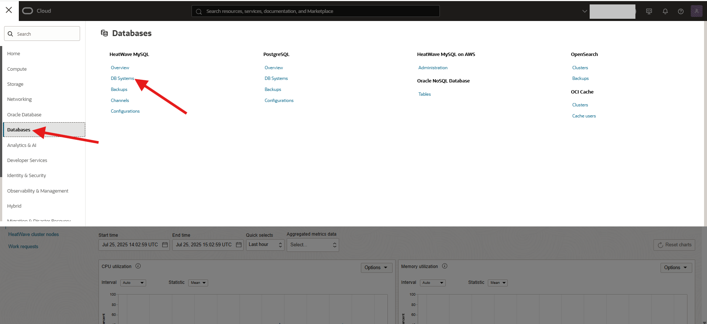

3. Click on the new **heatwave-db** link
    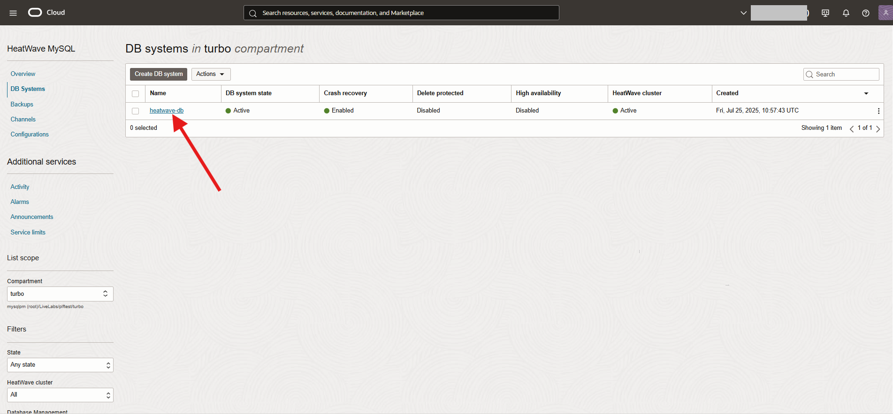

4. The new Heatwave system will appear. State **ACTIVE** indicates that the DB system is ready for use.

    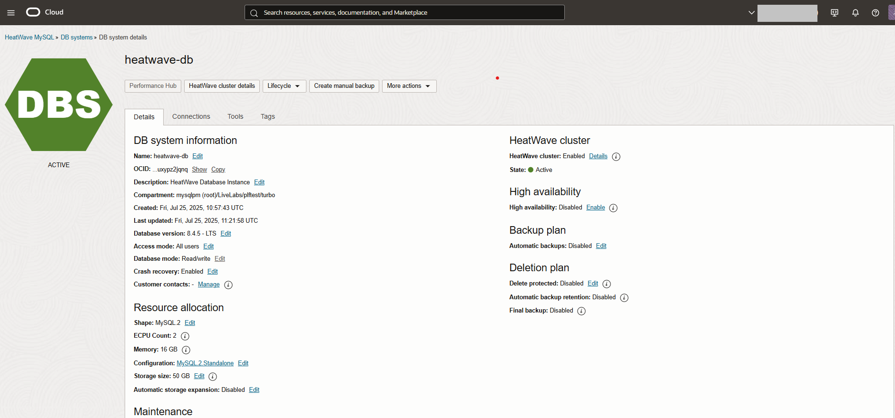

5. In the **Connections** tab, save the **Private IP address** of the DB system, which is the HeatWave endpoint.

    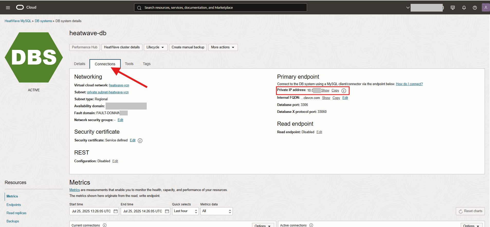

6. Click the **HeatWave cluster details** link to review the HeatWave cluster information.

    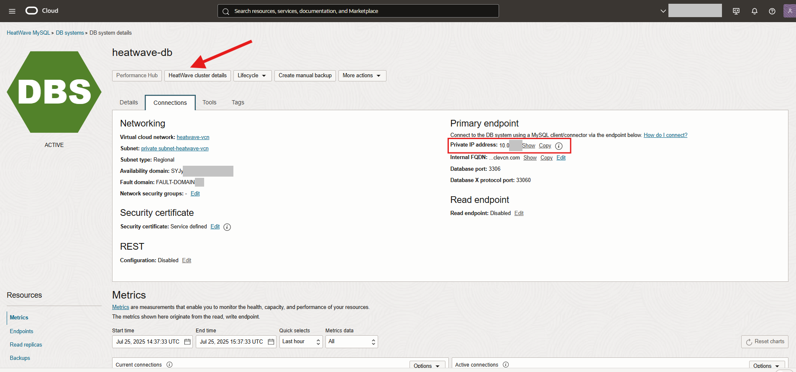

7. The HeatWave cluster should be ready for use.

    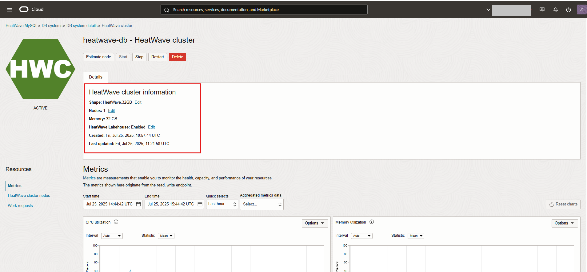

## Task 2: Access Cloud Shell via the Console

1. Click the Cloud Shell icon in the Console header. Note that the OCI CLI running in the Cloud Shell will execute commands against the region selected in the Console's Region selection menu when the Cloud Shell was started.

    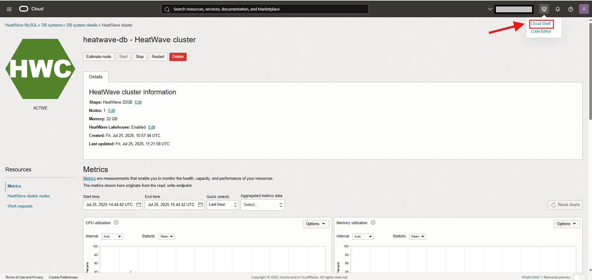

2. This displays the Cloud Shell in a "drawer" at the bottom of the console:

    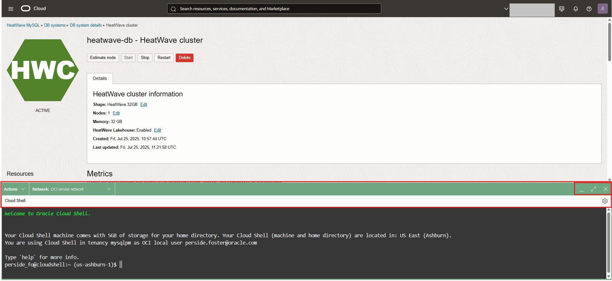

    You can use the icons in the upper right corner of the Cloud Shell window to minimize, maximize, restart, and close your Cloud Shell session.

## Task 3: Setup Cloud Shell Private Access

1. To change the network your Cloud Shell session is using to the HeatWave Database network, use the drop-down Network menu at the top of the Cloud Shell terminal window:

    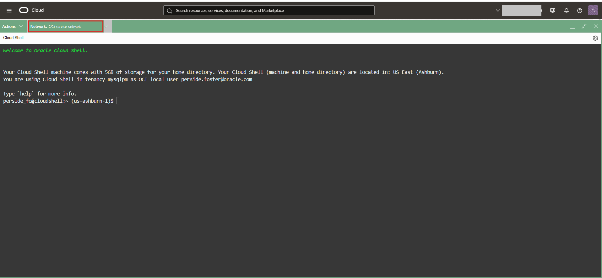

2. Select the Private Network Setup menu item. this will bring up the Private Network Setup panel. This panel allows you to select details for the private network you want to use:

    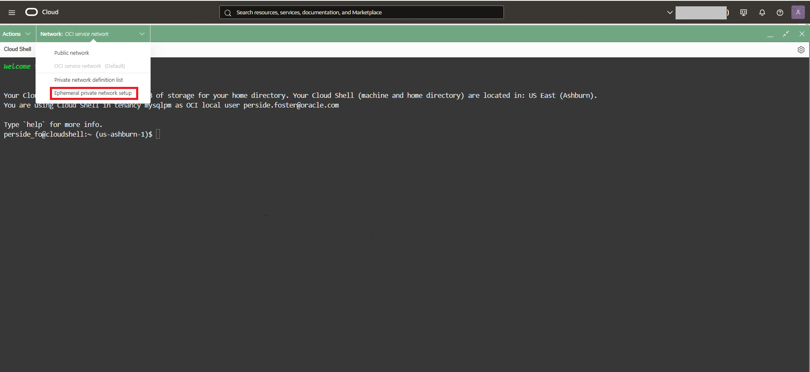

3. Select the VCN and the Subnet to use from the drop-down list boxes.

    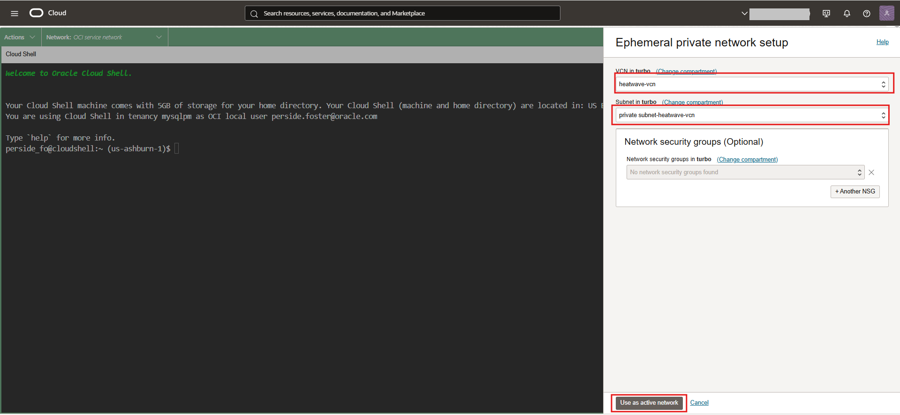

4. Click on the **Use as active network** button to switch your Cloud Shell network connection to the HeatWave Database network. Wait a few minutes for the connection to complete.

5. You can see details about your private network connection by clicking the Details link. Click the **Close** button to hide the details section

    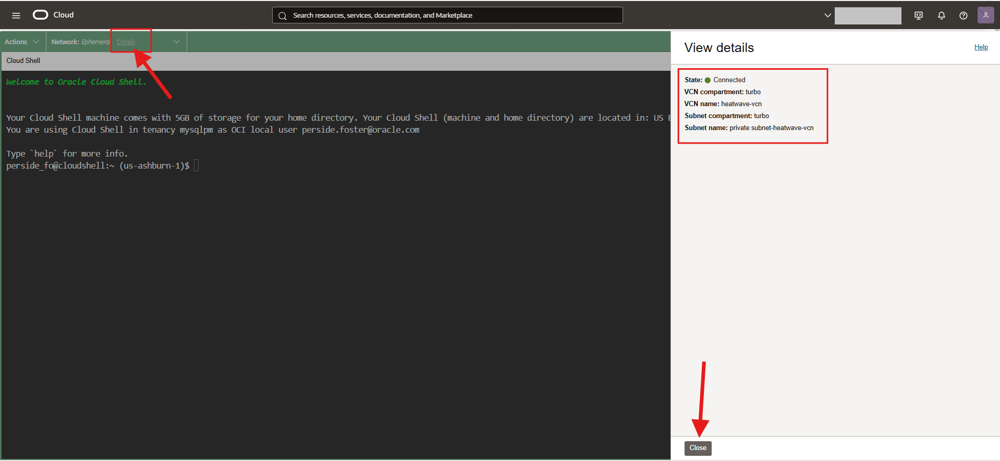

## Task 4: Install airportdb sample data

The installation procedure involves downloading the airportdb database to cloud shell and importing the data from cloud shell into the MySQL DB System using the MySQL Shell Dump Loading utility. For information about this utility, see Dump Loading Utility: [https://dev.mysql.com/doc/mysql-shell/8.0/en/mysql-shell-utilities-load-dump.htmly](https://dev.mysql.com/doc/mysql-shell/8.0/en/mysql-shell-utilities-load-dump.html)

 To install the airportdb database:

1. Download the airportdb sample database and unpack it. The airportdb sample database is provided for download as a compressed tar or Zip archive. The download is approximately 640 MBs in size.


    a. Get sample file

    ```bash
    <copy>wget https://objectstorage.us-ashburn-1.oraclecloud.com/p/9apiCx3kgtmGg6JpR62UzIK-licyuQLatZNJ_V_0Vv4iQFNiHZkdE_1pNvXbeker/n/mysqlpm/b/mysql_airport/o/airport-db.zip</copy>
    ```

    b. Unzip sample file

    ```bash
    <copy>unzip airport-db.zip</copy>
    ```

    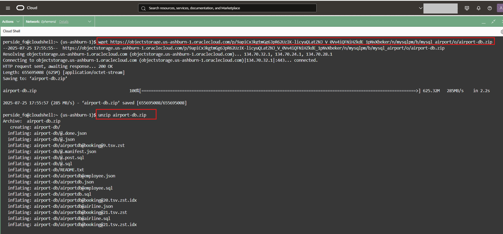

   **Connect to MySQL Database Service**

2. From your cloud shell, connect to **heatwave-db**  using the MySQL Shell client tool.

   Use the saved endpoint (IP Address). It  can be found in the **heatwave-db** System Details page. In the **Connection** tab, under the "Endpoint" "Private IP Address". 

    

3. Use the following command to connect to MySQL using the MySQL Shell client tool. Be sure to add the **heatwave-db** private IP address at the end of the command. Also enter the admin user and the db password created on Lab 1

    (Example  **mysqlsh -uadmin -p -h10.0.1..**)

    **[opc@...]$**

    ```bash
    <copy>mysqlsh -uadmin -p -h 10.0.1... </copy>
    ```

    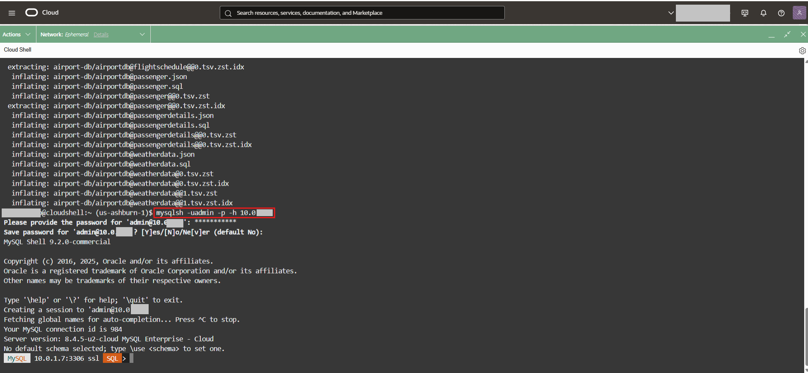

4. Load the airportdb database into the MySQL DB System using the MySQL Shell Dump Loading Utility.

    ```bash
    <copy>\js</copy>
    ```

    ```bash
    <copy>util.loadDump("airportdb", {threads: 16, deferTableIndexes: "all", ignoreVersion: true, loadIndexes:false})</copy>
    ```

    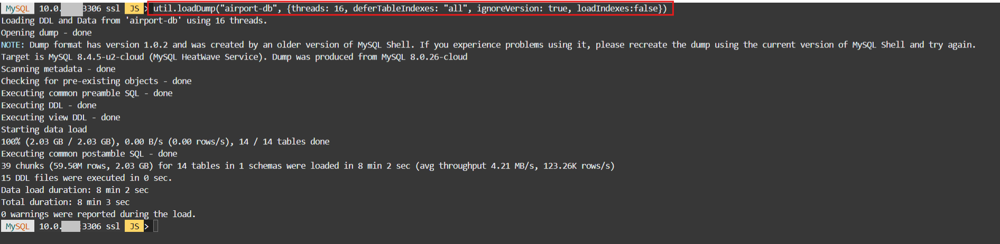

5. View  the airportdb total records per table

    ```bash
    <copy>\sql</copy>
    ```

    ```bash
    <copy>SELECT table_name, table_rows FROM INFORMATION_SCHEMA.TABLES WHERE TABLE_SCHEMA = 'airportdb';</copy>
    ```

    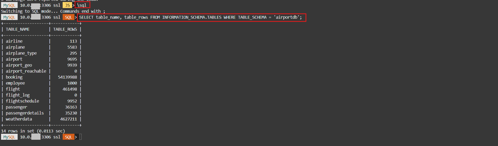 

6. Exit MySQL Shell

      ```bash
      <copy>\q</copy>
      ```

## Task 5: Load airportdb Data into HeatWave Cluster

1. On command Line, connect to the HeatWave Database using the MySQL Shell client tool with the following command:

     ```bash
    <copy>mysqlsh -uadmin -p -h 10.0.1... --sql </copy>
    ```

    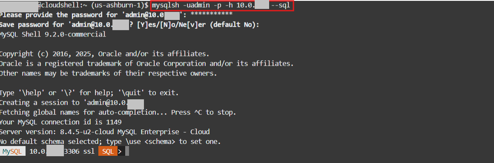

2. Run the following Auto Parallel Load command to load the airportdb tables into HeatWave..

     ```bash
    <copy>CALL sys.heatwave_load(JSON_ARRAY('airportdb'), NULL);</copy>
    ```

    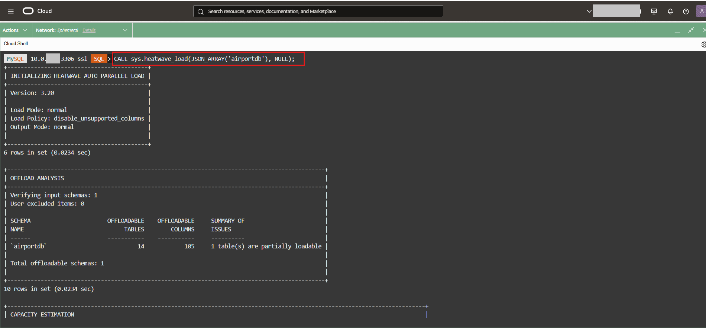

3. The completed load cluster screen should look like this:

    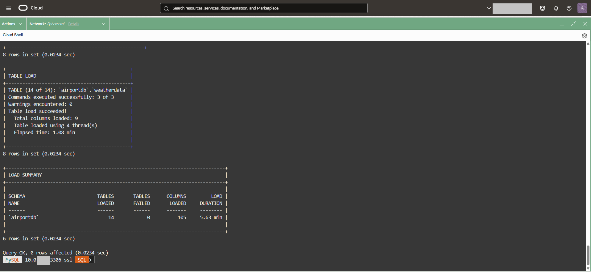

4. Auto provisioning feature highlights:
    - a. **Load analysis box:** shows the number of tables/columns being loaded
    - b. **Capacity estimation box:** showis estimated memory and load time
    - c. **Loading table boxes:** use different thread to load based on the table
    - d. **Load summary box:** shows the actual load time

5. Verify that the tables are loaded in the HeatWave cluster. Loaded tables have an AVAIL_RPDGSTABSTATE load status.

     ```bash
    <copy>USE performance_schema;</copy>
    ```

     ```bash
    <copy>SELECT NAME, LOAD_STATUS FROM rpd_tables,rpd_table_id WHERE rpd_tables.ID = rpd_table_id.ID;</copy>
    ```

    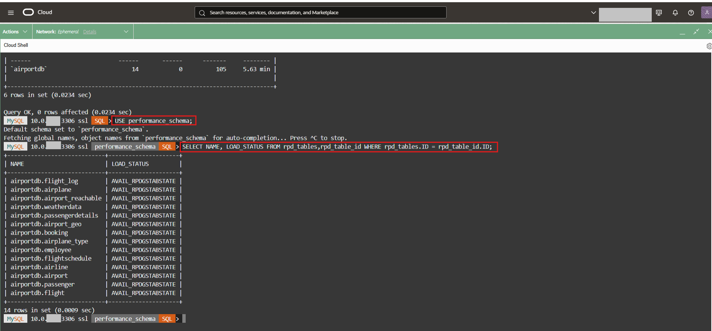

You may now **proceed to the next lab**

## Acknowledgements

- **Author** - Aijaz Fatima, Product Manager
- **Contributors** - Mandy Pang, Senior Principal Product Manager
- **Last Updated By/Date** - Aijaz Fatima, Product Manager, July 2025