# Build a LAMP application with MySQL HeatWave


## Introduction

MySQL HeatWave can easily be used for development tasks with existing Oracle services, such as Oracle Cloud Analytics. New applications can also be created with the LAMP or other software stacks.


_Estimated Lab Time:_ 10 minutes

### Objectives

In this lab, you will be guided through the following tasks:

- Create SSH Key on OCI Cloud
- Create Compute Instance
- Install MySQL Shell on the Compute Instance
- Test connection to MySQL Database System
- Install Apache and PHP
- Create PHP / MYSQL Connect Application
- Create Google Chart Application

### Prerequisites

- An Oracle Trial or Paid Cloud Account
- Some Experience with MySQL Shell
- Must Complete Lab 5

## Task 1: Create SSH Key on OCI Cloud Shell

The Cloud Shell machine is a small virtual machine running a Bash shell which you access through the Oracle Cloud Console (Homepage). You will start the Cloud Shell and generate a SSH Key to use  for the Bastion  session.

1. To start the Oracle Cloud shell, go to your Cloud console and click the cloud shell icon at the top right of the page. This will open the Cloud Shell in the browser, the first time it takes some time to generate it.

    cloudshell-main

    

    

    

    _Note: You can use the icons in the upper right corner of the Cloud Shell window to minimize, maximize, restart, and close your Cloud Shell session._

2. Once the cloud shell has started, create the SSH Key using the following command:

    ```bash
    <copy>ssh-keygen -t rsa</copy>
    ```

    Press enter for each question.

    Here is what it should look like.  

    

3. The public  and  private SSH keys  are stored in ~/.ssh/id_rsa.pub.

4. Examine the two files that you just created.

    ```bash
    <copy>cd .ssh</copy>
    ```

    ```bash
    <copy>ls</copy>
    ```

    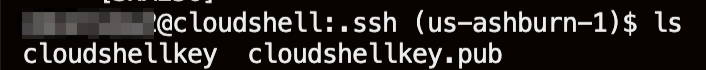

    Note in the output there are two files, a *private key:* `id_rsa` and a *public key:* `id_rsa.pub`. Keep the private key safe and don't share its content with anyone. The public key will be needed for various activities and can be uploaded to certain systems as well as copied and pasted to facilitate secure communications in the cloud.

## Task 2: Create Compute instance

You will need a compute Instance to connect to your brand new MySQL database.

1. Before creating the Compute instance open a notepad 

2. Do the followings steps to copy the public SSH key to the  notepad

    Open the Cloud shell
    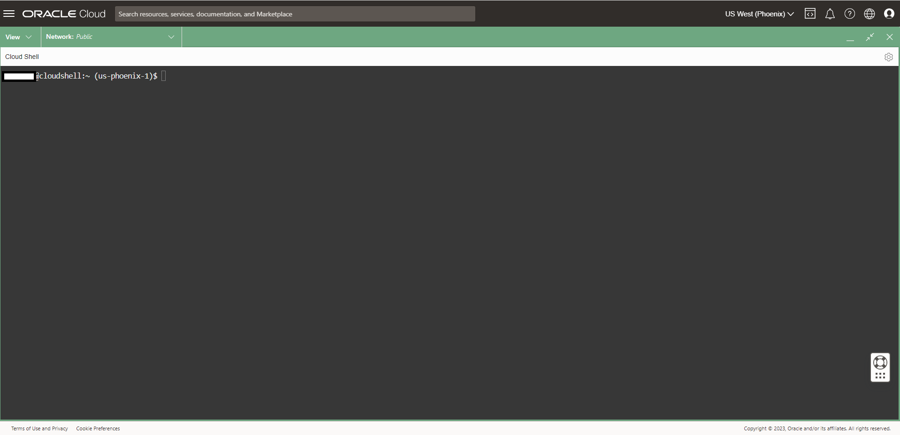

    Enter the following command  

    ```bash
    <copy>cat ~/.ssh/id_rsa.pub</copy>
    ```

     

3. Copy the id_rsa.pub content the notepad

    Your notepad should look like this
      

4. Minimize cloud shell

      

5. To launch a Linux Compute instance, go to 
    Navigation Menu
    Compute
    Instances
    

6. On Instances in **turbo** Compartment, click  **Create Instance**
    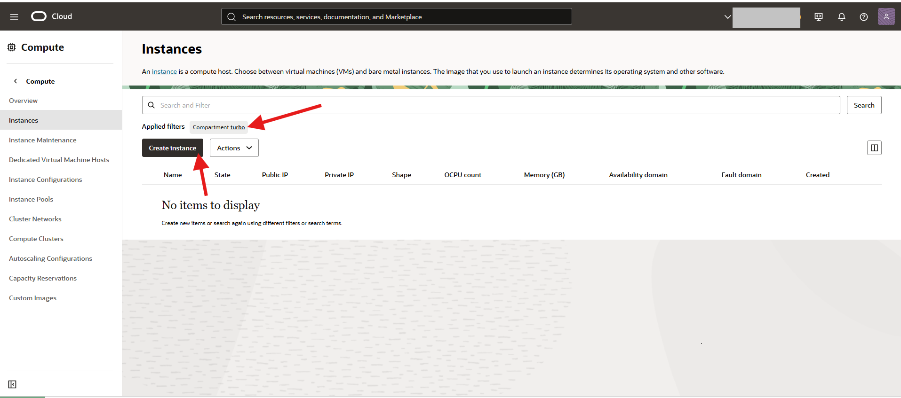

7. On Create Compute Instance 

    Enter Name

    ```bash
    <copy>HEATWAVE-Client</copy>
    ```

8. Make sure **turbo** compartment is selected 

9. On Placement, keep the selected Availability Domain

10. On Security, keep the default

    - Shielded instance: Disabled
    - Confidential computing:Disabled

      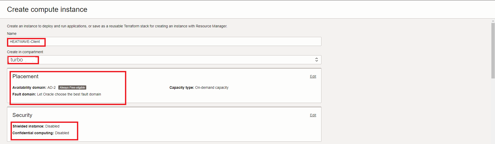 

11. On Image  keep the selected Image, Oracle Linux 8 and click Edit

      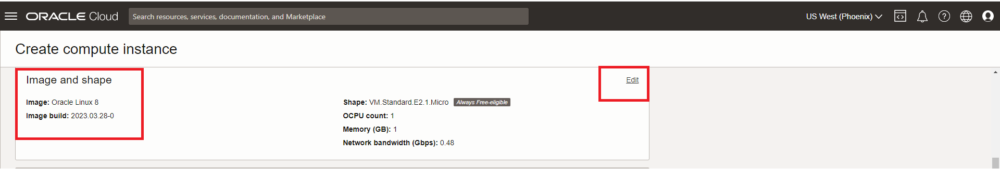  

12. Click Change Shape

      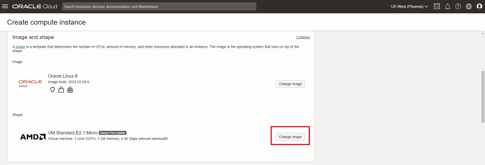  

13. Select Instance Shape: VM.Standard.E2.2

      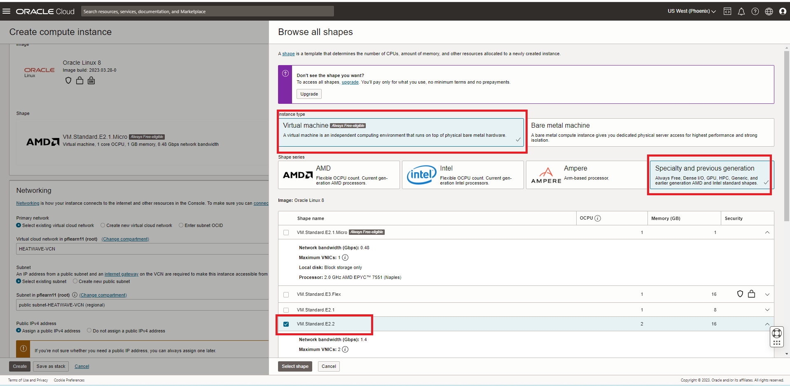  

14. On Networking, click Edit

      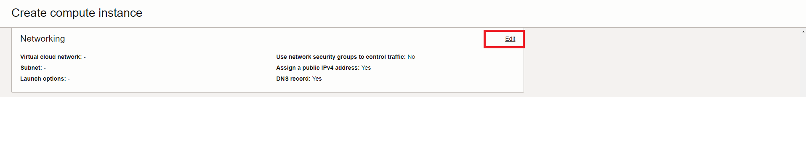  

15. Make sure **HEATWAVE-VCN**  and  and  **public subnet-HEATWAVE-VCN** are selected. Keep Public IPV4 address **Assign..** default

      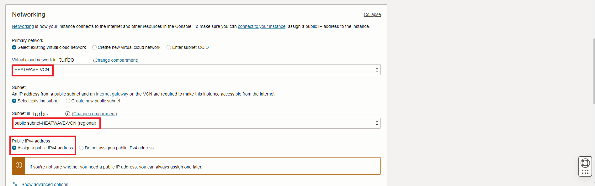

16. On Add SSH keys, paste the public key from the notepad.
  
    

17. Keep Boot Volume default and Click **Create** button to finish creating your Compute Instance.

    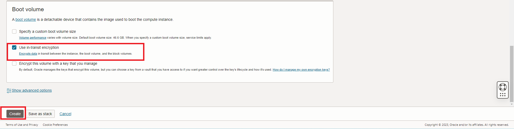

18. The New Virtual Machine will be ready to use after a few minutes. The state will be shown as 'Provisioning' during the creation
    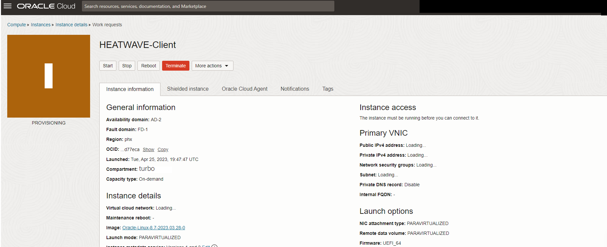

19. The state 'Running' indicates that the Virtual Machine is ready to use.

    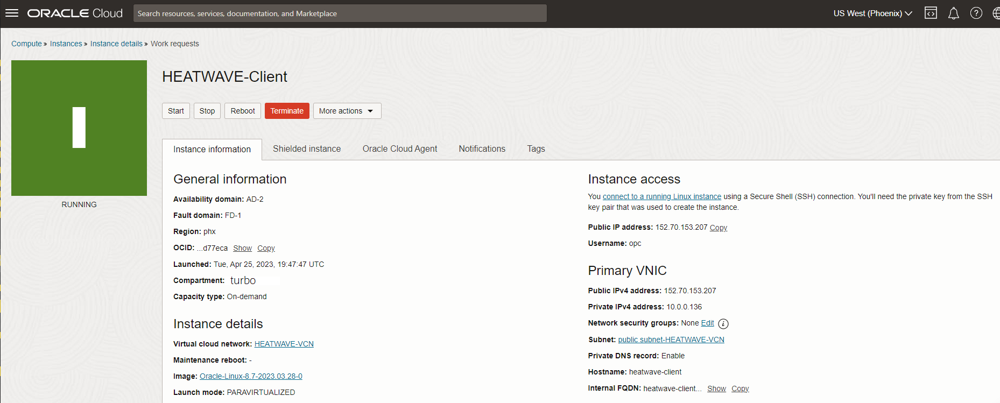

## Task 3: Connect to MySQL Database System

1. Copy the public IP address of the active Compute Instance to your notepad

    - Go to Navigation Menu
        - Compute
        - Instances
        - Copy **Public IP**
    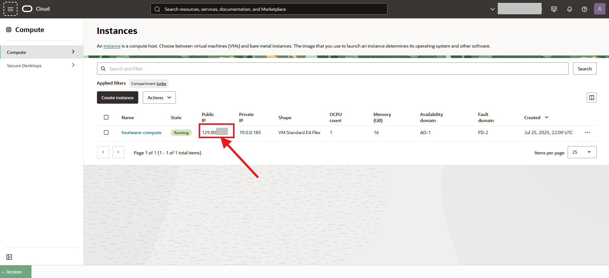

2. Copy the private IP address of the active MySQl Database Service Instance to your notepad

    - Go to Navigation Menu 
        - Databases 
        - MySQL
        - Click the `HEATWAVE-DB` Database System link
     

3. Copy the HEATWAVE-DB  `Private IP Address` to the notepad
     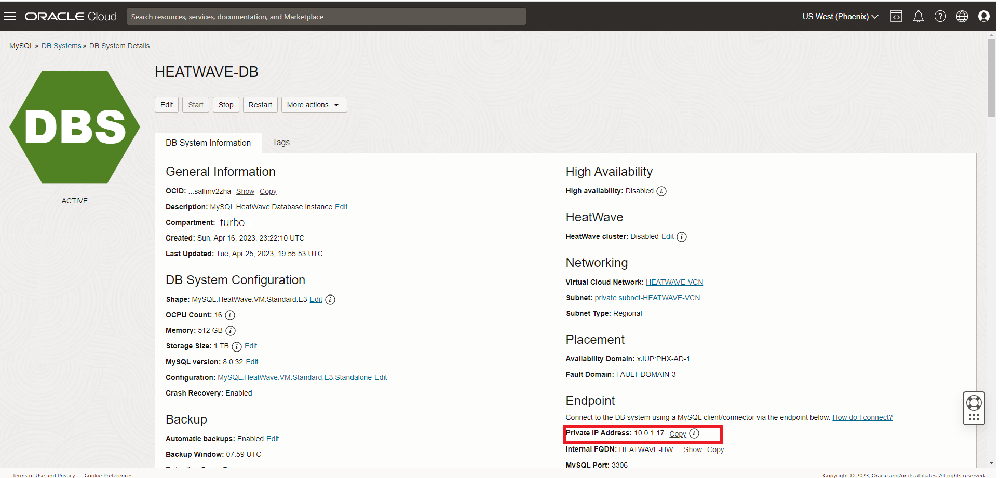

4. Your notepad should look like the following:
     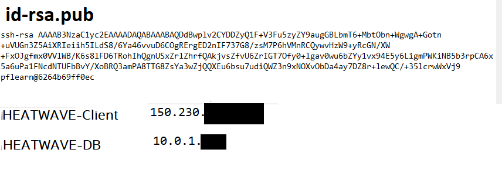

5. Go to Cloud shell to SSH into the new Compute Instance

    Enter the username **opc** and the Public **IP Address**.

    Note: The **HEATWAVE-Client**  shows the  Public IP Address as mentioned on TASK 5: #1

    (Example: **ssh -i ~/.ssh/id_rsa opc@132.145.170...**) 

    ```bash
    <copy>ssh -i ~/.ssh/id_rsa opc@<your_compute_instance_ip></copy>
    ```

    For the **Are you sure you want to continue connecting (yes/no)?**
    - answer **yes**

    

    **Install MySQL Shell on the Compute Instance**

6. You will need a MySQL client tool to connect to your new MySQL DB System from your client machine.

    Install MySQL Shell with the following command (enter y for each question)

    **[opc@…]$**

    ```bash
    <copy>sudo yum install mysql-shell -y</copy>
    ```

    

   **Connect to MySQL Database Service**

7. From your Compute instance, connect to HEATWAVE-DB  using the MySQL Shell client tool.

   The endpoint (IP Address) can be found in your notepad or  the MHEATWAVE-DB  System Details page, under the "Endpoint" "Private IP Address". 

    

8. Use the following command to connect to MySQL using the MySQL Shell client tool. Be sure to add the MDS-HW private IP address at the end of the command. Also enter the admin user and the db password created on Lab 1

    (Example  **mysqlsh -uadmin -p -h10.0.1..**)

    **[opc@...]$**

    ```bash
    <copy>mysqlsh -uadmin -p -h 10.0.1... </copy>
    ```

    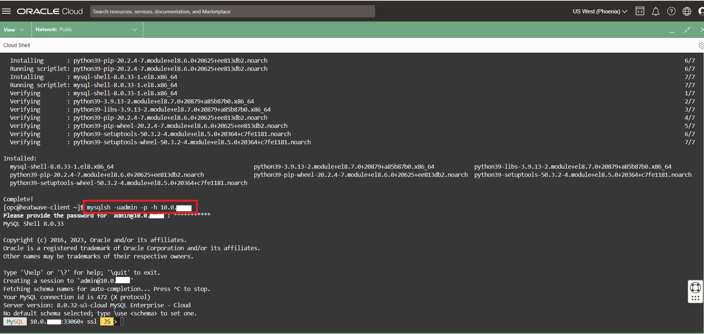

9. View  the airportdb total records per table

    ```bash
    <copy>\sql</copy>
    ```

    ```bash
    <copy>SELECT table_name, table_rows FROM INFORMATION_SCHEMA.TABLES WHERE TABLE_SCHEMA = 'airportdb';</copy>
    ```

    

10. Exit MySQL Shell

    ```bash
    <copy>\q</copy>
    ```

## Task 4: Install Apache

1. Install app server

    a. Install Apache

    ```bash
    <copy>sudo yum install httpd -y </copy>
    ```

    b. Enable Apache

    ```bash
    <copy>sudo systemctl enable httpd</copy>
    ```

    c. Start Apache

    ```bash
    <copy>sudo systemctl restart httpd</copy>
    ```

    d. Setup firewall

    ```bash
    <copy>sudo firewall-cmd --permanent --add-port=80/tcp</copy>
    ```

    e. Reload firewall

    ```bash
    <copy>sudo firewall-cmd --reload</copy>
    ```

2. From a browser test apache from your loacal machine using the Public IP Address of your Compute Instance

    **Example: http://129.213....**

## Task 5: Install PHP

1. Install php:

    a. Install php:7.4

    ```bash
    <copy> sudo dnf module install php:7.4 -y</copy>
    ```

    b. Install associated php libraries

    ```bash
    <copy>sudo yum install php-cli php-mysqlnd php-zip php-gd php-mbstring php-xml php-json -y</copy>
    ```

    c. View  php / mysql libraries

    ```bash
    <copy>php -m |grep mysql</copy>
    ```

    d. View php version

    ```bash
    <copy>php -v</copy>
    ```

    e. Restart Apache

    ```bash
    <copy>sudo systemctl restart httpd</copy>
    ```

2. Create test php file (info.php)

    ```bash
    <copy>sudo nano /var/www/html/info.php</copy>
    ```

3. Add the following code to the editor and save the file (ctr + o) (ctl + x)

    ```bash
    <copy><?php
    phpinfo();
    ?></copy>
    ```

4. From your local machine, browse the page info.php

   Example: http://129.213.167.../info.php

## Task 6: – Create HeatWave / PHP connect app

1. Security update"   set SELinux to allow Apache to connect to MySQL

    ```bash
    <copy> sudo setsebool -P httpd_can_network_connect 1 </copy>
    ```

2.	Create config.php

    ```bash
    <copy>cd /var/www/html</copy>
    ```

    ```bash
    <copy>sudo nano config.php</copy>
    ```

3. Add the following code to the editor and save the file (ctr + o) (ctl + x)

    ```bash
    <copy><?php
    // Database credentials
    define('DB_SERVER', '10.0.1...');// HeatWave server IP address
    define('DB_USERNAME', 'admin');
    define('DB_PASSWORD', 'Welcome#12345');
    define('DB_NAME', 'airportdb');
    //Attempt to connect to MySQL database
    $link = mysqli_connect(DB_SERVER, DB_USERNAME, DB_PASSWORD, DB_NAME);
    // Check connection
    if($link === false){
        die("ERROR: Could not connect. " . mysqli_connect_error());
    }
    // Print host information
    echo 'Successfull Connect.';
    echo 'Host info: ' . mysqli_get_host_info($link);
    ?>
    </copy>
    ```

    - Test Config.php on Web sever http://150.230..../config.php

4. Create dbtest.php

    ```bash
    <copy>cd /var/www/html</copy>
    ```

    ```bash
    <copy>sudo nano dbtest.php</copy>
    ```

5. Add the following code to the editor and save the file (ctr + o) (ctl + x)

    ```bash
    <copy><?php
    require_once "config.php";
    $query = "select firstname, lastname, count(booking.passenger_id) as count_bookings from passenger, booking
    where booking.passenger_id = passenger.passenger_id
    and passenger.lastname = 'Aldrin' or (passenger.firstname = 'Neil' and passenger.lastname = 'Armstrong')
    and booking.price > 400.00 group by firstname, lastname;";
    if ($stmt = $link->prepare($query)) {
    $stmt->execute();
    $stmt->bind_result($firstname,$lastname,$count_bookings);
    echo "<table>";
            echo "<tr>";
            echo "<th>Firstname</th>";
            echo "<th>Lastname</th>";
            echo "<th>Count</th>";
        echo "</tr>";

        while ($stmt->fetch()) {
            echo "<tr>";
            echo "<td>" . $firstname ."</td>";
            echo "<td>" . $lastname . "</td>";
            echo "<td>" . $count_bookings . "</td>";
            echo "</tr>";
        }

        $stmt->close();
    }
    ?>

    </copy>
    ```

6. From your local  machine connect to dbtest.php

    Example: http://129.213.167..../dbtest.php  

## Task 7: Create Google Chart Application

1. Go to the development folder

    ```bash
    <copy>cd /var/www/html</copy>
    ```

2. Create mydbchart.php file

    ```bash
    <copy>sudo nano mydbchart.php</copy>
    ```

3. Click on this link to **Download file [dbchart.php](files/dbchart.php)**  to your local machine
4. Open dbchart.php from your local machine

    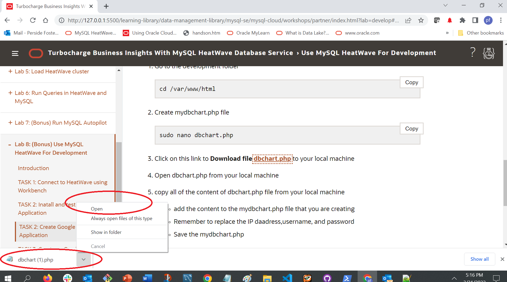

5. copy all of the content of dbchart.php file from your local machine
    - add the content to the mydbchart.php file that you are  creating

        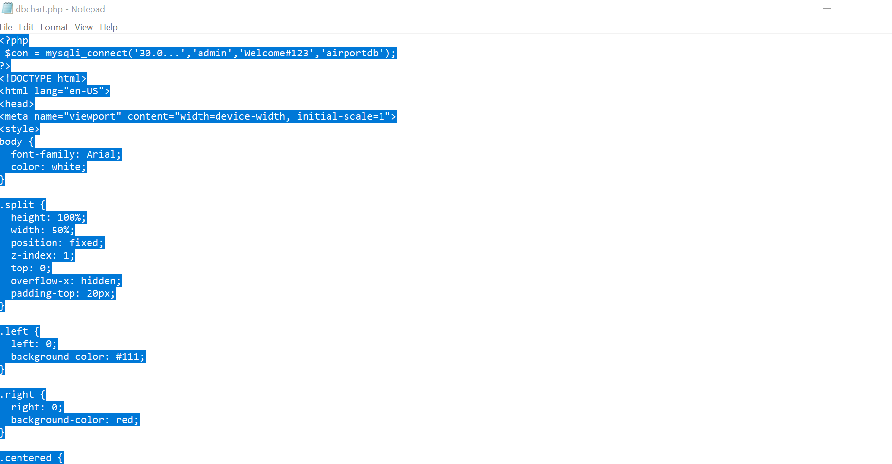
    - Remember to replace the IP daadress,username, and password (lines 2 and 98 )
        - $con = mysqli_connect('30.0...','admin','Welcome#123','airportdb');
        - $link = mysqli_connect('30.0...','admin','Welcome#123','airportdb');
        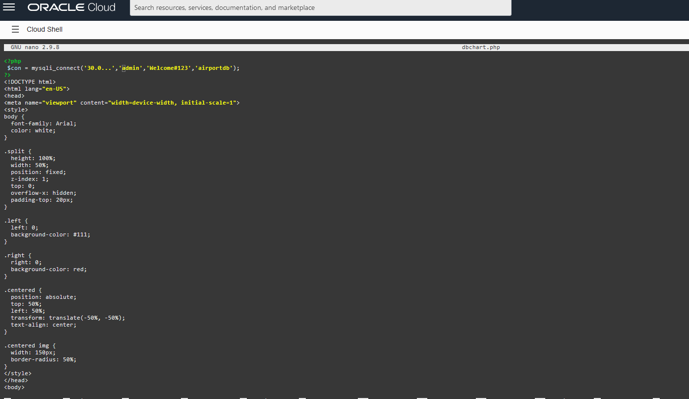
    - Save the mydbchart.php 

6. From your local  machine connect to dbtest.php

    Example: http://129.213.167..../mydbchart.php
    

You may now **proceed to the next lab**

## Acknowledgements

- **Author** - Perside Foster, MySQL Principal Solution Engineering
- **Contributors** - Mandy Pang, MySQL Principal Product Manager,  Nick Mader, MySQL Global Channel Enablement & Strategy Manager
- **Last Updated By/Date** - Perside Foster, MySQL Solution Engineering, July 2023