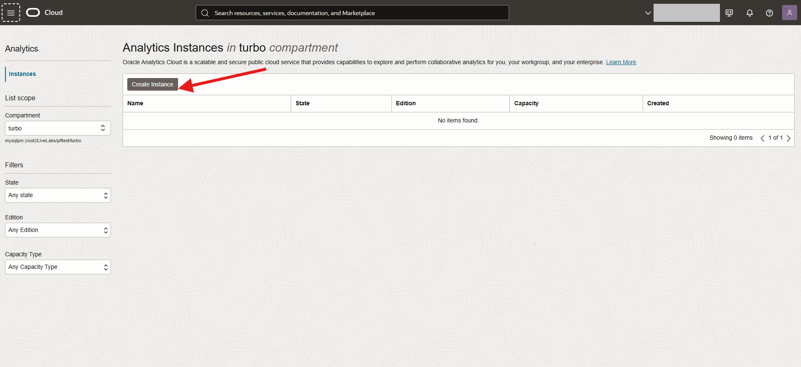
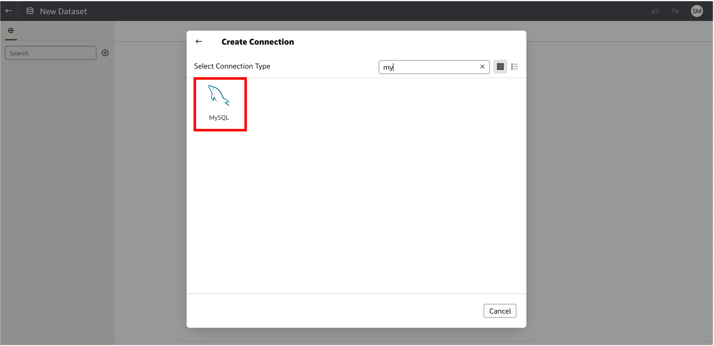

# Build a real-time dashboard in Oracle Analytics Cloud with MySQL HeatWave


## Introduction

MySQL HeatWave can easily be used for development tasks with existing Oracle services, such as Oracle Cloud Analytics. -> Oracle Analytics Cloud (OAC) provides the industry’s most comprehensive cloud analytics in a single unified platform, including self-service visualization and inline data preparation to enterprise reporting, advanced analytics, and self-learning analytics that deliver proactive insights.

Use MySQL HeatWave with OAC to explore and perform collaborative analytics with your MySQL data.

_Estimated Lab Time:_ 20 minutes

### Objectives

In this lab, you will be guided through the following tasks:

- Create Oracle Analytics Cloud and connect to MySQL HeatWave
- Create a dashboard on OAC for the airportdb

### Prerequisites

- An Oracle Trial or Paid Cloud Account
- Some Experience with MySQL Shell
- Completed Lab 5

## Task 1:  Create an Oracle Analytic Cloud Service

1. From the OCI console, navigate to Analytics & AI-> Analytics Clouds
 

2. Click Create Instance
 

3. On the Create Analytics Instance enter the required information as shown below

    Name:

    ```bash
    <copy>hwoac</copy> 
    ```

    Description:

    ```bash
        <copy>Oracle Analytics Cloud HeatWave Test</copy>
    ```

    Capacity: select **OCPU** and select **1**

    License Type: select **License Included**

4. Click the **Create** button

    

5. It takes about 12-15 mins for OAC instance creation to complete.

    

## Task 2: Configure Private Access Channel

1. Go down to the “Private Access Channel” resources page and click on the **Configure Private Access Channel**  button.

2. Click the create Private Access Channel button

3. On the create Private Access Channel page enter the following:

    Name:

    ```bash
         <copy>hwoacpac</copy>
    ```

    DNS Zones:
    **Check Virtual Cloud Network's domain name as DNS zone (hwvcn.oraclevcn.com)**

    Description:

    ```bash
        <copy>Testing</copy>
    ```

    **Remove second  DNS Zone entry**

4. Click the **Create** button

    

5. Wait 30 minutes for the process to finish, then continue to Task 3
    

## Task 3: Get HeatWave DB Hostname **

1. Before starting go to Menu Databases > DB Systems

2. Select HeatWave database: HeatWave-DB

3. Go to Resources and click on the Endpoinst Link and  copy the Internal FQDN and save it to notepad

    

4. Save the Hostname for use with OAC

    Example : **hwdb.sub09012.....hwvcn.oraclevcn.com**

## Task 4: - Build OAC Dashboard**

1. Navigate to hamburger->Analytics->Analytics Clouds

2. Select the OAC instance you provisioned to access the OAC console by clicking on Analytics Home Page

    

3. Create a Connection to HeatWave to build a dashboard

    

4. Search for mysql and select mysql as the database

    Example: **HEATWAVE-HW.sub0….heatwavevcn.oraclevcn.com**

    

5. Specify the connections details

    - Specify the hostname of HEATWAVE-DB in FQDN from Task 4.
    - Be sure to use mysql admin user name and password.

    

6. Select the MySQL Connection created earlier

7. Double click "Manual Query" on the left panel and click ”Manual Query” tab on the bottom

    

8. Add the following SQL query (find per-company average age of passengers from Switzerland, Italy and France) in the statement text box, and select “Live” in Data Access on the right, then click OK on the top

    ```bash  
    <copy> SELECT
        airline.airlinename,
        AVG(datediff(departure,birthdate)/365.25) as avg_age,
        count(*) as nbpeople
    FROM
        booking, flight, airline, passengerdetails
    WHERE
        booking.flight_id=flight.flight_id AND
        airline.airline_id=flight.airline_id AND
        booking.passenger_id=passengerdetails.passenger_id AND
        country IN ("SWITZERLAND", "FRANCE", "ITALY")
    GROUP BY
        airline.airlinename
    ORDER BY
        airline.airlinename, avg_age
    LIMIT 10;</copy>
    ```

9. Dataset screen
    

10. Click the  save button and set the DataSet name to Passengers then click Create workbook button
    

11. On new display page  click on the Dataset icon, select airline and nbrpeople
    
12. Right click and select "Create Best Visualization".
    

13. Click on the bottom + sign to add Canvas 2 , select airline and avg_age
14. Right click and select "Pick Visualization" and select pie chart.
    

15. Save Workbook as "passenger Workbook" and close OAC application

You may now **proceed to the next lab**

## Acknowledgements

- **Author** - Perside Foster, MySQL Principal Solution Engineering
- **Contributors** - Mandy Pang, MySQL Principal Product Manager,  Nick Mader, MySQL Global Channel Enablement & Strategy Manager
- **Last Updated By/Date** - Perside Foster, MySQL Solution Engineering, July 2023