# Load HeatWave cluster in MySQL Database System


## Introduction

A HeatWave cluster comprise of a MySQL DB System node and one or more HeatWave nodes. The MySQL DB System node includes a plugin that is responsible for cluster management, loading data into the HeatWave cluster, query scheduling, and returning query result.

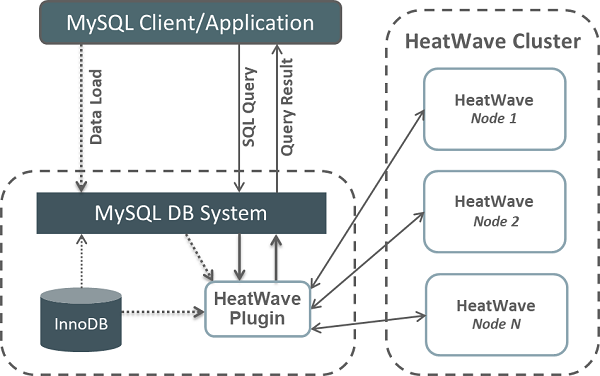

_Estimated Time:_ 10 minutes

### Objectives

In this lab, you will be guided through the following task:

- Add a HeatWave Cluster to MySQL Database System
- Load Airportdb Data into HeatWave

### Prerequisites

- An Oracle Trial or Paid Cloud Account
- Some Experience with MySQL Shell
- Completed Lab 2

## Task 1: Add a HeatWave Cluster to MDS-HW MySQL Database System

1. Open the navigation menu  
    - Databases
    - MySQL
    - DB Systems
2. Choose the **turbo** Compartment. A list of DB Systems is displayed.
    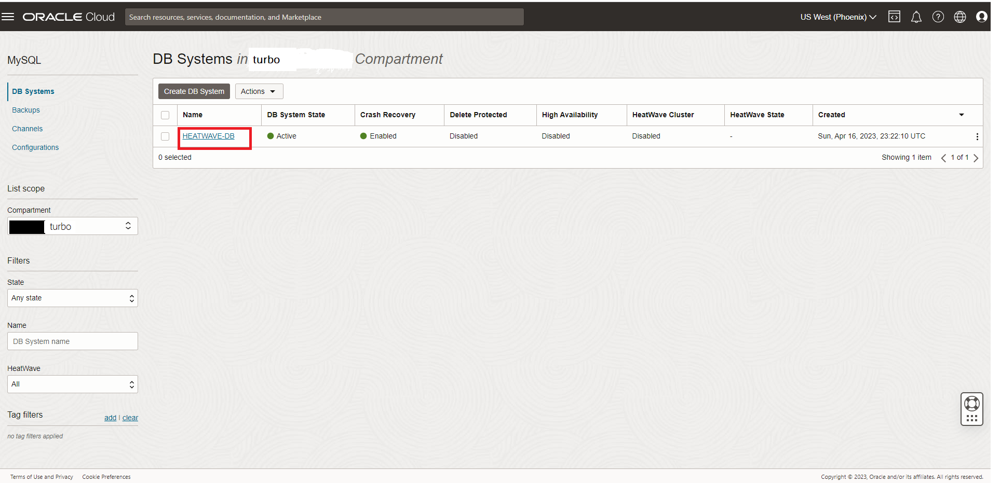

3. In the list of DB Systems, click the **HEATWAVE-DB** system. click **More Action ->  Add HeatWave Cluster**.
    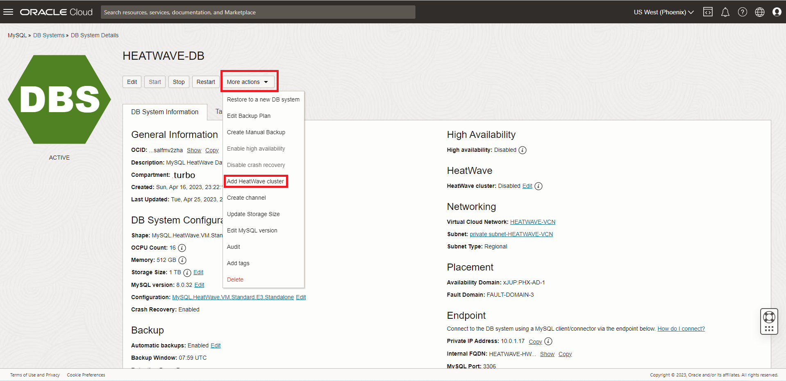

4. On the “Add HeatWave Cluster” dialog, select “HeatWave.512GB” shape
5. Click “Estimate Node Count” button
    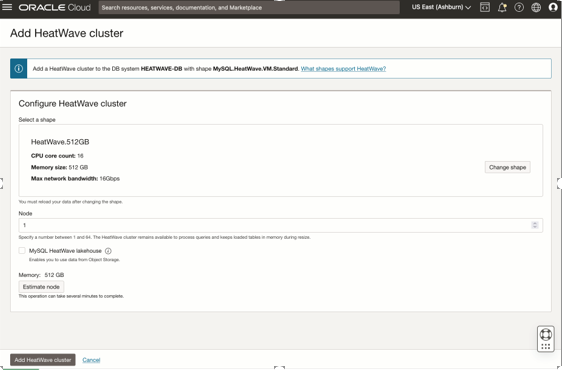

6. On the “Estimate Node Count” page, click “Generate Estimate”. This will trigger the auto provisioning advisor to sample the data stored in MySQL InnoDB and predict the number of HeatWave nodes needed.
    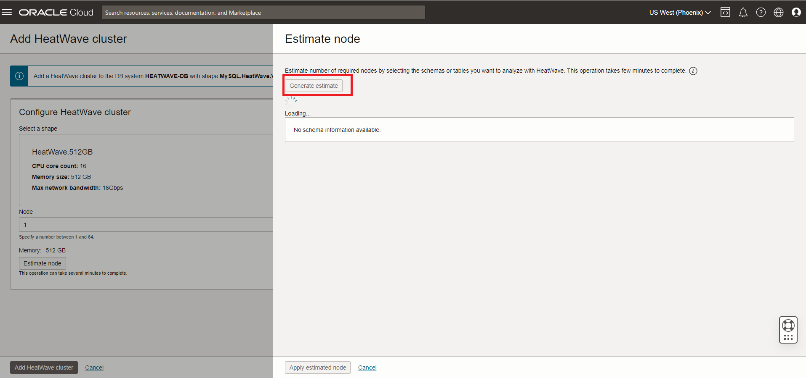

7. Once the estimations are calculated, it shows list of database schemas in MySQL node. If you expand the schema and select different tables, you will see the estimated memory required in the Summary box, There is a Load Command (heatwave_load) generated in the text box window, which will change based on the selection of databases/tables
8. Select the airportdb schema and click “Apply Node Count Estimate” to apply the node count
    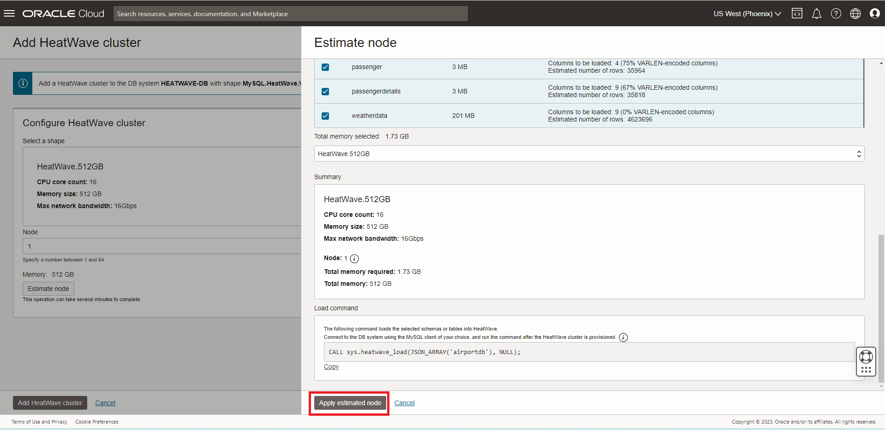

9. Click “Add HeatWave Cluster” to create the HeatWave cluster
    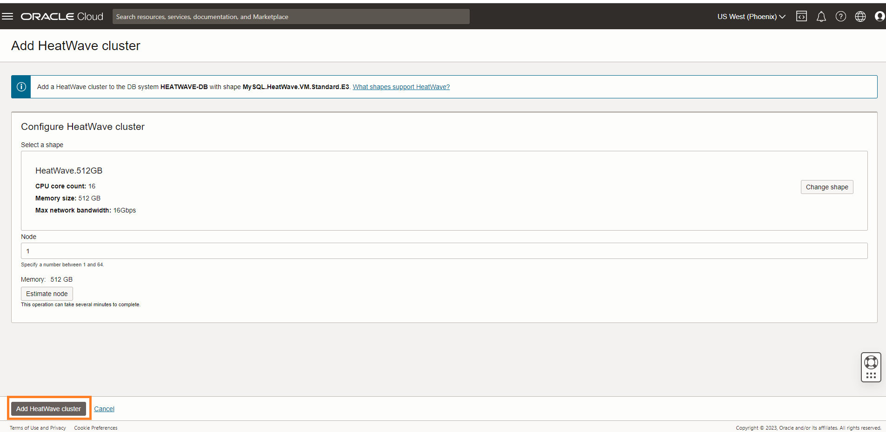

10. HeatWave creation will take about 10 minutes. From the DB display page scroll down to the Resources section. Click the **HeatWave** link. Your completed HeatWave Cluster Information section will look like this:
    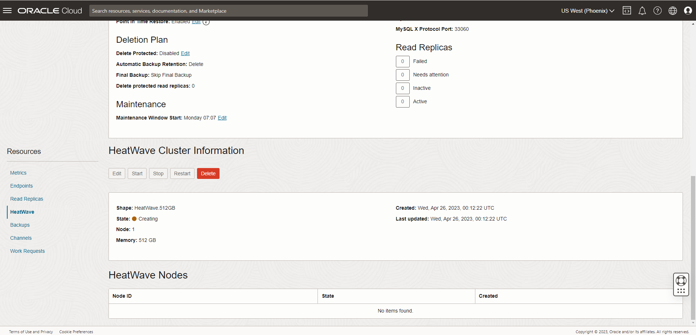

## Task 2: Load airportdb Data into HeatWave Cluster

1. Connect to OCI Cloud Shell
    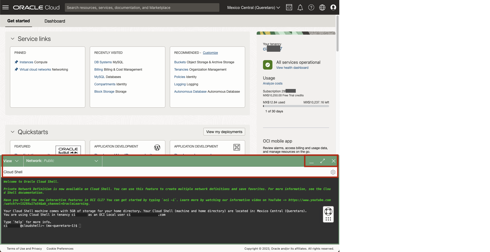

2. On command Line, connect to the HeatWave Database using the MySQL Shell client tool with the following command:

     ```bash
    <copy>mysqlsh -uadmin -p -h 10.0.1... --sql </copy>
    ```

    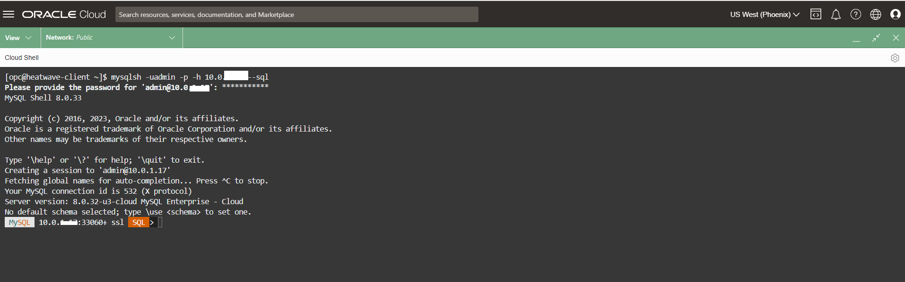

3. Run the following Auto Parallel Load command to load the airportdb tables into HeatWave..

     ```bash
    <copy>CALL sys.heatwave_load(JSON_ARRAY('airportdb'), NULL);</copy>
    ```

    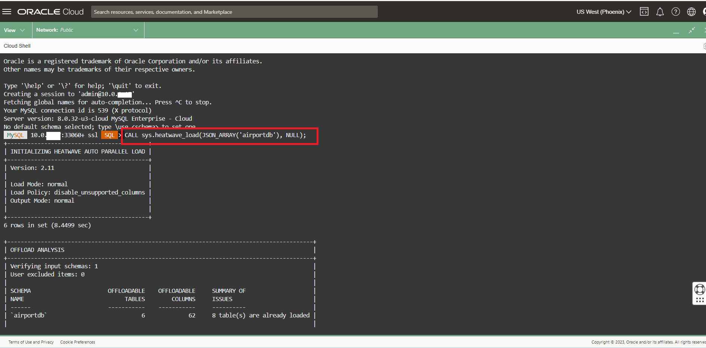

4. The completed load cluster screen should look like this:

    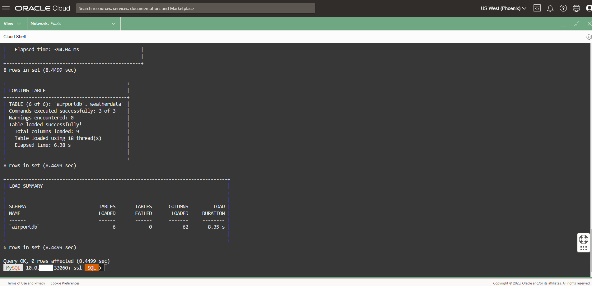

5. Auto provisioning feature highlights:
    - a. **Load analysis box:** shows the number of tables/columns being loaded
    - b. **Capacity estimation box:** showis estimated memory and load time
    - c. **Loading table boxes:** use different thread to load based on the table
    - d. **Load summary box:** shows the actual load time
    - 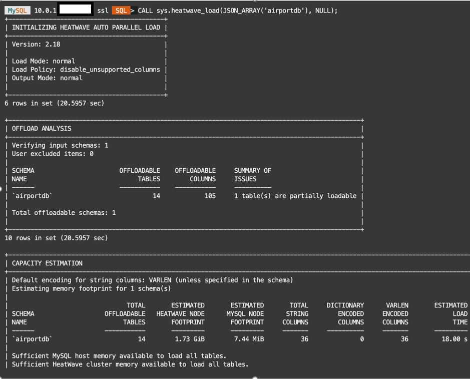

    - 

6. Verify that the tables are loaded in the HeatWave cluster. Loaded tables have an AVAIL_RPDGSTABSTATE load status.

     ```bash
    <copy>USE performance_schema;</copy>
    ```

     ```bash
    <copy>SELECT NAME, LOAD_STATUS FROM rpd_tables,rpd_table_id WHERE rpd_tables.ID = rpd_table_id.ID;</copy>
    ```

    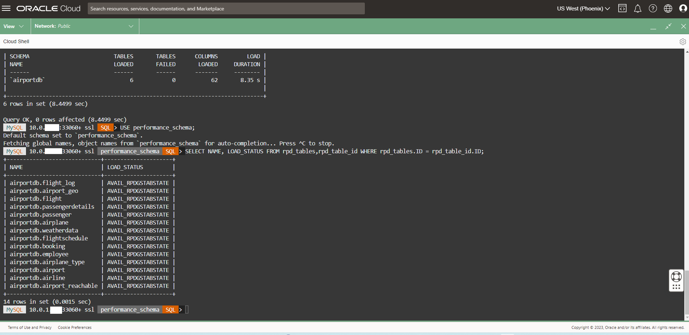

You may now **proceed to the next lab**

## Learn More

- [Oracle Cloud Infrastructure MySQL Database Service Documentation](https://docs.cloud.oracle.com/en-us/iaas/MySQL-database)
- [MySQL Database Documentation](https://www.MySQL.com)

You may now **proceed to the next lab**

## Acknowledgements

- **Author** - Aijaz Fatima, Product Manager
- **Contributors** - Mandy Pang, Senior Principal Product Manager
- **Last Updated By/Date** - Aijaz Fatima, Product Manager, July 2025