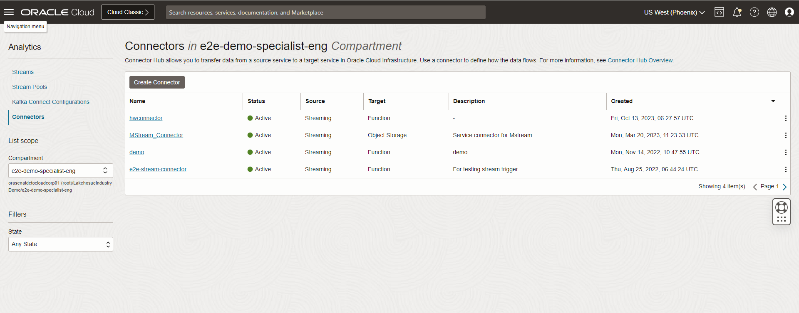

# Configuring and using OCI Functions to consume streamming data from OCI Streaming Topic.
# Connect to service connector Hub and trigger the Fn.
## Introduction

This lab focus on creating the Function ,deploying the function script and getting it connected to OCI service connector hub to get automatically triggered once the streaming data falls on the OCI streaming topic.
Estimated Time: 75 minutes

### Prerequisites

 Completetion of previous labs.

## Task 1: Create a Function Application

1. From the OCI services menu click **Policies** under **Identity**.

    

2. Make sure that the compartment you created your VCN in is selected and then click **Create Policy**.

    

3. Type "FunctionApplicationPolicies" into the name section and type "Allow functions to work" in the description section. Scroll down to the Policy statements section. Click the **+ Another Statement**.

    

    Copy and paste the following as your first policy statement.

    ```
    <copy>
    allow service FAAS to use virtual-network-family in tenancy
    </copy>
    ```

    Copy and paste the following as your second policy statement.

    ```
    <copy>
    allow service FAAS to read repos in tenancy
    </copy>
    ```

    Click **Create**.

    

    Verify that your policy has been added to the policy list.

    

4. Next we will create our first application.

5. From the OCI services menu click **Functions** under **Developer Services**.
    

6. Click **Create Application** and fill out the dialog box.

    - **NAME**: WorkshopFunctionApplication
    - **VCN in** : Choose the compartment where your VCN was created
    - **SUBNETS** : Choose your VCN's public subnet
    - **LOGGING POLICY**: None

    Click **Create**.

    

7. Scroll down and click on **Getting Started**.

    

    Scroll down until you see these commands.

    

## Task 2: Configure and Invoke a Function

1. Open the oracle cloud shell. If you are no longer connected to your instance use the following command to reconnect to your instance. Otherwise skip this command.

    ```
    <copy>
    cd ~/.ssh
    ssh -i SSH-KEY-NAME opc@PUBLIC-IP-OF-COMPUTE-1
    </copy>
    ```

2. Next we will install Fn CLI which is needed to execute function commands. Enter the command.
    ```
    <copy>
    curl -LSs https://raw.githubusercontent.com/fnproject/cli/master/install | sh
    </copy>
    ```

    

3. Confirm that the Fn CLI has been installed.
    ```
    <copy>
    fn version
    </copy>
    ```

    

4. Next create the new Fn Project CLI context. `CONTEXT-NAME` below can be a name that you can choose. For this workshop `CONTEXT-NAME` will be test-fn.

    ```
    <copy>
    fn create context CONTEXT-NAME --provider oracle
    </copy>
    ```
    

5. Specify that the Fn Project CLI is to use the new context.

    ```
    <copy>
    fn use context CONTEXT-NAME
    </copy>
    ```

    

6. Configure the new context with the api-url endpoint to use when calling the OCI API. Replace REGION-IDENTIFIER with your region identifier.

    ```
    <copy>
    fn update context api-url https://functions.REGION-IDENTIFIER.oraclecloud.com
    </copy>
    ```

    

    *For example: fn update context api-url https://functions.us-ashburn-1.oraclecloud.com*

7. Configure the new context with the name of the profile you've created for use with Oracle Functions.

    ```
    <copy>
    fn update context oracle.profile DEFAULT
    </copy>
    ```

    

8. Scroll down on the **Getting Started** section of your function application. Copy and paste command 3 into the oracle cloud shell.

    The command should be in the format of

    `fn update context oracle.compartment-id [COMPARTMENT-OCID]`.

    

    

9. Copy and paste command 4 into the oracle cloud shell.

    The command should be in the format of

    `fn update context registry [REGION-CODE].ocir.io/[TENANCY-NAMESPACE]/[YOUR-OCIR-REPO]`.

    `[YOUR-OCIR-REPO]` needs to be replaced with a name of your choosing. The name you choose needs to be all lowercase. For this workshop we will use `functionrepo`.

    *Note: [REGION-CODE] indicates the registry location. Region codes are listed at https://docs.cloud.oracle.com/iaas/Content/Registry/Concepts/registryprerequisites.htm#regional-availability*

    

    

10. Copy and paste command 6 into the oracle cloud shell.

    The command should be in the format of

    `docker login -u '[TENANCY-NAMESPACE]/[USERNAME]' [REGION-CODE].ocir.io`.

    *Note: If your tenancy is federated your username will be in the format of oracleidentitycloudservice/[USERNAME].*

    

    

11. When prompted for a password paste your auth token into the shell and press enter.

12. Next we will create our first function.

    ```
    <copy>
    fn invoke streamhw streamhw    
    fn update context registry phx.ocir.io/<tenancyid>/streamhwrepo
    fn init --runtime python streamhwfunc
    
    </copy>
    ```
    A directory called **streamhwrepo** is created, containing:

    * a function definition file called func.yaml*
    * a /src directory containing source files and directories for the streamhwrepo function*
    * a Maven configuration file called pom.xml that specifies the dependencies required to compile the function*

    
    * Function Script for function :
    script name - func.py 
    Download file [`MYSQLLakehouse_labfiles.zip`](https://objectstorage.us-ashburn-1.oraclecloud.com/p/RPka_orWclfWJmKN3gTHfEiv-uPckBJTZ3FV0sESZ3mm3PDCQcVDCT-uM2dsJNGf/n/orasenatdctocloudcorp01/b/MYSQLLakehouse_labfiles/o/MYSQLLakehouse_labfiles.zip)

    *** Download Referece -Lab4b 
    Path     \MYSQLLakehouse_labfiles\Lab5\OCI Function\func.py
    [Refer to downloadbled MYSQLLakehouse_labfiles.zip]
13. Change the directory to the streamhwrepo directory created in the previous step.

    ```
    <copy>
    cd streamhwrepo
    </copy>
    ```

14. Enter the following command to build the function and its dependencies as a Docker image called streamhwrepo, push the image to the specified Docker registry, and deploy the function to Oracle Functions.

    ```
    <copy>
    Line No -33 - In the endpoint replace the ML model deployment URL.
    endpoint = https://modeldeployment.us-phoenix-1.oci.customer-oci.com/ocid1..xyz/predict
    </copy>
    ```
    ```
    <copy>
    Line No -46 & 47 - Replace these lines with the OCI Streaming Enpoint URL and stream OCID.
    ociMessageEndpoint = https://cell-1.streaming.us-<xyz>.com
    ociStreamOcid = "ocid1.stream.oc1.phx.xyz" 
    </copy>
    ```

    

    *Note: You can also Confirm that the hello-java image has been pushed to Oracle Cloud Infrastructure Registry by logging in to the console. Under **Solutions and Platform**, go to **Developer Services** and click **Registry**.*

15. Change the func.py script in your local machine and copy and paste the code in func.py script .
     Location of reference code for function [MYSQLLakehouse_labfiles\Lab4\OCI Function]
     **** Refer to the MYSQLLakehouse_labfiles.zip file downloaded
    ```
    <copy>
    fn -v deploy --app WorkshopFunctionApplication
    </copy>
    ```
16.  Now lets invoke your first function. Enter the following command.

    ```
    <copy>
    fn invoke streamhw streamhwfunc
    </copy>
    ```

16. Verify "Hello World!" message is displayed.

    

Congratulations! You've just created, deployed, and invoked your first function using Oracle Functions!

### Connect to service connector Hub and trigger the Fn.
## Task 3: Create Service Connector

For simple archiving operations, we don’t need to write a single line of code. Instead, we just create a service connector and point it at the source (stream) and destination (bucket). Navigate to the Service Connector Hub via the burger menu (or by searching for it).

1. Open the navigation menu and click ***Analytics & AI***. Under ***Messaging***, click ***Service Connector Hub***.

2. You can choose a compartment you have permission to work in (on the left side of the page). The page updates to display only the resources in that compartment. For this lab, we will work in the tenancy root compartment.

3. Click ***Create Service Connector***. 


4. Name the connector ***streaming-to-Fn*** . 

5. Provide the description ***Moving streaming data to object storage using Fn***.

6. For the compartment, choose the demo compartment.


7. Now to configure your service connector, Choose  ’Streaming’ as the ***source***, and ‘function’ as the ***target***. Chose the compartment where the stream pool resides, choose the stream pool, and the stream. You can choose to read from either the ‘Latest’ offset or ’Trim Horizon’ (the oldest non-committed offset).

8. Click ***Create*** and the service connector is ready to collect the streams.

You may now **proceed to the next lab**

## Acknowledgements
* **Author** - Biswanath Nanda, Principal Cloud Architect, North America Cloud Infrastructure - Engineering
* **Contributors** -  Biswanath Nanda, Principal Cloud Architect,Bhushan Arora ,Principal Cloud Architect,Sharmistha das ,Master Principal Cloud Architect,North America Cloud Infrastructure - Engineering
* **Last Updated By/Date** - Biswanath Nanda, March 2024
