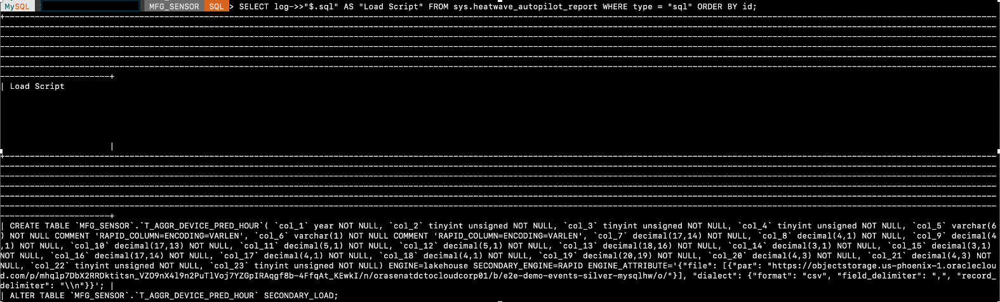
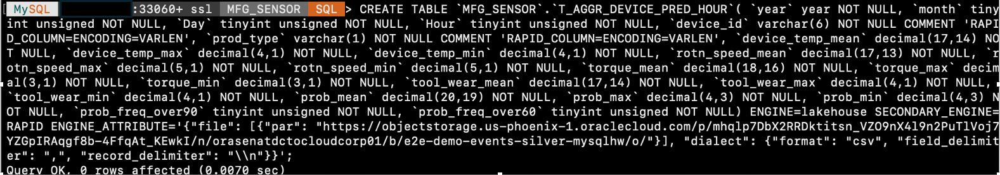

# Setting up Oracle Cloud Infrastructure Data Flow and load datasets from demo-events-silver-mysqlhw to MYSQL HW

The labs shows who we can set up the OCI Data Flow pyspark application and extract data from ***demo-events-raw-mysqlhw*** bucket ,consolidate the datasets and load the data to ***demo-events-silver-mysqlhw*** bucket .
Setting up OCI Data Flow
- Provision the OCI Data flow in the tenancy 
- Deploy the Pyspark application to run using Data flow.

Load the datasets from demo-events-silver-mysqlhw to MYSQL HW
- Create PAR Link for the bucket
- Run Autoload to infer the schema and estimate capacity
- Load complete T\_AGGR\_DEVICE\_PRED\_HOUR table from Object Store into MySQL HeatWave
*Estimated Lab Time*: 45 mins

### Objectives

In this lab you will learn about Oracle Cloud Infrastructure Data Flow, what it is, what you need to do before you begin using it, including setting up policies and storage, loading data, and how to import and bundle Spark applications. 

Before you can create, manage and execute applications in Data Flow, the tenant administrator (or any user with elevated privileges to create buckets and modify IAM) must create specific storage buckets and associated policies in IAM. These set up steps are required in Object Store and IAM for Data Flow to function. This lab will set the foundation for future labs to follow.

- Provision the OCI Data flow in the tenancy 
- Deploy the Pyspark application to run using Data flow.
- Create PAR Link for the bucket
- Run Autoload to infer the schema and estimate capacity
- Load complete T\_AGGR\_DEVICE\_PRED\_HOUR table from Object Store into MySQL HeatWave

  

### Prerequisites

Before you Begin with Data Flow lab, you must have:

* An Oracle Cloud Infrastructure account. Trial accounts can be used to demo Data Flow.
* A Service Administrator role for your Oracle Cloud services. When the service is activated, Oracle sends the credentials and URL to the designated Account Administrator. The Account Administrator creates an account for each user who needs access to the service.
* A supported browser, such as:
    * Microsoft Internet Explorer 11.x+
    * Mozilla Firefox ESR 38+
    * Google Chrome 42+
* Familiarity with Object Storage Service.


## Task 1: Object Store: Setting Up Storage

1. Before running the application in the Data Flow service, create two storage buckets that are required in object storage.

    * From the OCI Services menu, click `Storage` and then click `Buckets` under Object Storage

       

    * Click `Bucket`
       

      **NOTE:** Ensure the correct Compartment is selected under COMPARTMENT list

    * A bucket to store the logs (both standard out and standard err) for every application run.Create a standard storage tier bucket called `dataflow-logs` in the Object Store service.

      

    * A data warehouse bucket for Spark SQL applications. Create a standard storage tier bucket called `dataflow-warehouse` in the Object Store service.
        

## Task 2: Identity: Policy Set Up

A user's permissions to access services comes from the _groups_ to which they belong. The permissions for a group are defined by policies. Policies define what actions members of a group can perform, and in which compartments. Users can access services and perform operations based on the policies set for the groups of which they are members.

We'll create a user, a group, and policies to understand the concept.


1. **User Policies** : Data Flow requires policies to be set in IAM to access resources in order to manage and run applications. We categorize the Data Flow users into two groups for clear separation of authority administrator and users:

    * From the OCI Services menu, click `Identity and Security` and in identity click `Group`

        

    * Create a group in your identity service called `dataflow-admin`

        

    * Click on your new group to display it. Your new group is displayed.Add users to the groups

        

        

    * From the OCI Services menu, click `Identity and Security` and in identity click `Policies`

            

    * Create a policy called `dataflow-admin` in your `compartment` and add the following statements:

         

      ```
      <copy>
      ALLOW GROUP dataflow-admin TO READ buckets IN TENANCY
      </copy>
      ```

      ```
      <copy>
      ALLOW GROUP dataflow-admin TO MANAGE dataflow-family IN TENANCY
      </copy>
      ```
      ```
      <copy>
      ALLOW GROUP dataflow-admin TO MANAGE objects IN TENANCY WHERE ALL
          {target.bucket.name='dataflow-logs', any {request.permission='OBJECT_CREATE',
          request.permission='OBJECT_INSPECT'}}
      </copy>
      ```
    * Create a group in your identity service called dataflow-users and add users to this group.

      

    * Create a policy called dataflow-users and add the following statements:

      

      ```
      <copy>
      ALLOW GROUP dataflow-users TO READ buckets IN TENANCY
      </copy>
      ```
      ```
      <copy>
      ALLOW GROUP dataflow-users TO USE dataflow-family IN TENANCY
      </copy>
      ```
      ```
      <copy>
      ALLOW GROUP dataflow-users TO MANAGE dataflow-family IN TENANCY WHERE ANY {request.user.id = target.user.id, request.permission = 'DATAFLOW_APPLICATION_CREATE', request.permission = 'DATAFLOW_RUN_CREATE'}
      </copy>
      ```
      *Note: Replace <tenancy> with the name of your tenancy*

2. **Service Policies** : The Data Flow service needs permission to perform actions on behalf of the user or group on objects within the tenancy.To set it up, create a policy called `dataflow-service` and add the following statement:

      ```
      <copy>
      ALLOW SERVICE dataflow TO READ objects IN tenancy WHERE target.bucket.name='dataflow-logs'
      </copy>
 
     ```
## Task 2: Deploy the Pyspark Application to the data flow
In this task we will be deploying the Pyspark Application to OCI Objectstore and will be creating a Data flow application.
1. Modify the Pyspark script - Open the script locall
- Download the Labfiles and navigate to the below folder location to collect the codepump.zip file.

   Download file [`MYSQLLakehouse_labfiles.zip`](https://objectstorage.us-ashburn-1.oraclecloud.com/p/RPka_orWclfWJmKN3gTHfEiv-uPckBJTZ3FV0sESZ3mm3PDCQcVDCT-uM2dsJNGf/n/orasenatdctocloudcorp01/b/MYSQLLakehouse_labfiles/o/MYSQLLakehouse_labfiles.zip)

  *** Python Framework Location in the Zip file - MYSQLLakehouse_labfiles\_Lab6a

  

      ```
      <copy>
      line 26: change the namespace of the bucket path
      line36: change the namespace of the bucket path
      </copy>
 
     ```
     

2. Upload the main.py script to Objectstore bucket ***Dataflowbucket***

    

3. Create a Pyspark application on Data Flow.
  Navigate to DataFlow

  

  Create the Data Flow Application

  DataFlow Application Name - 
      ```
      <copy>
      dfPipeline
      </copy>
 
     ```
  *** Note - Select the parameters based on the below snapshot provided.
  

  

  

  

   
  

4. Run the Pyspark App
   

## Task 3: Create the PAR Link for the "e2e-demo-events-silver-mysqlhw" bucket 

1. Create a PAR URL for all of the **e2e-demo-events-silver-mysqlhw** objects with a prefix

    - a. From your OCI console, navigate to your e2e-demo-events-silver-mysqlhw bucket in OCI.

        
    - b. Click the three vertical dots of "e2e-demo-events-silver-mysqlhw" bucket 

        

    - c. Click on ‘Create Pre-Authenticated Request’
    - d. Click to select the ‘Objects with prefix’ option under ‘PreAuthentcated Request Target’.
    - e. Leave the ‘Access Type’ option as-is: ‘Permit object reads on those with the specified prefix’.
    - f. Click to select the ‘Enable Object Listing’ checkbox.
    - g. Click the ‘Create Pre-Authenticated Request’ button.

       

    - h. Click the ‘Copy’ icon to copy the PAR URL, it will not be shown again.
    - i. Save the generated PAR URL; you will need it later.
    - j. You can test the URL out by pasting it in your browser. It should return output like this:

        

2. Save the generated PAR URL; you will need it in the next task

## Task 4: Run Autoload to infer the schema and estimate capacity required to upload the aggregate device data 

1. Aggregated data information is the csv files in the object store for which we have created a PAR URL in the earlier task. Enter the following commands one by one and hit Enter.

2. This sets the schema, in which we will load table data into. Don’t worry if this schema has not been created. Autopilot will generate the commands for you to create this schema if it doesn’t exist.

    ```bash
    <copy>SET @db_list = '["MFG_SENSOR"]';</copy>
    ```
    


3. This sets the parameters for the table name we want to load data into and other information about the source file in the object store. Substitute the **PAR URL** below with the one you generated in the previous task:
    ```bash
    <copy>SET @dl_tables = '[{
    "db_name": "MFG_SENSOR",
    "tables": [{
    "table_name": "T_AGGR_DEVICE_PRED_HOUR",
    "dialect": 
       {
       "format": "csv",
       "field_delimiter": ",",
       "record_delimiter": "\\n"
       },
    "file": [{"par": "PAR URL"}]
    }] }]';</copy>
    ```
    Be sure to include the PAR URL inside the quotes " " and it should look like as in following:

    

4. This command populates all the options needed by Autoload:

    ```bash
    <copy>SET @options = JSON_OBJECT('mode', 'dryrun',  'policy', 'disable_unsupported_columns',  'external_tables', CAST(@dl_tables AS JSON));</copy>
    ```
    

5. Run this Autoload command:

    ```bash
    <copy>CALL sys.heatwave_load(@db_list, @options);</copy>
    ```


6. Once Autoload completes running, its output has several pieces of information:
    - a. Whether the table exists in the schema you have identified.
    - b. Auto schema inference determines the number of columns in the table.
    - c. Auto schema sampling samples a small number of rows from the table and determines the number of rows in the table and the size of the table.
    - d. Auto provisioning determines how much memory would be needed to load this table into HeatWave and how much time loading this data take.

    

    

7. Autoload also generated a statement lke the one below. Execute this statement now.

    ```bash
    <copy>SELECT log->>"$.sql" AS "Load Script" FROM sys.heatwave_autopilot_report WHERE type = "sql" ORDER BY id;</copy>
    ```

    

8. The execution result contains the SQL statements needed to create the table. As there was no header in the csv file generated,  Now execute the following **CREATE TABLE** command by replacing your **PAR Value**. In following create table we have used the required column name for this lab.
 
 **NOTE: Ensure to Replace you PAR VALUE after copying the following command**


    ```bash
    <copy>CREATE TABLE `MFG_SENSOR`.`T_AGGR_DEVICE_PRED_HOUR`( `year` year NOT NULL, `month` tinyint unsigned NOT NULL, `Day` tinyint   unsigned NOT NULL, `Hour` tinyint unsigned NOT NULL, `device_id` varchar(6) NOT NULL COMMENT 'RAPID_COLUMN=ENCODING=VARLEN',  `prod_type` varchar(1) NOT NULL COMMENT 'RAPID_COLUMN=ENCODING=VARLEN', `device_temp_mean` decimal(17,14) NOT NULL,  `device_temp_max` decimal(4,1) NOT NULL, `device_temp_min` decimal(4,1) NOT NULL, `rotn_speed_mean` decimal(17,13) NOT NULL,     `rotn_speed_max` decimal(5,1) NOT NULL, `rotn_speed_min` decimal(5,1) NOT NULL, `torque_mean` decimal(18,16) NOT NULL, `torque_max`     decimal(3,1) NOT NULL, `torque_min` decimal(3,1) NOT NULL, `tool_wear_mean` decimal(17,14) NOT NULL, `tool_wear_max` decimal(4,1)   NOT NULL, `tool_wear_min` decimal(4,1) NOT NULL, `prob_mean` decimal(20,19) NOT NULL, `prob_max` decimal(4,3) NOT NULL, `prob_min`    decimal(4,3) NOT NULL, `prob_freq_over90` tinyint unsigned NOT NULL, `prob_freq_over60` tinyint unsigned NOT NULL) ENGINE=lakehouse    SECONDARY_ENGINE=RAPID ENGINE_ATTRIBUTE='{"file": [{"par": "PAR_URL"}], "dialect": {"format": "csv", "field_delimiter": ",",   "record_delimiter": "\\n"}}';</copy>
    ```


9. The above create command and result should look like this

      

## Task 5: Load the data from Object Store into MySQL HeatWave Table


1. Now load the data from the Object Store into the ORDERS table.

    ```bash
    <copy> ALTER TABLE `MFG_SENSOR`.`T_AGGR_DEVICE_PRED_HOUR` SECONDARY_LOAD; </copy>
    ```
    


2. View a sample of the data in the table.

    ```bash
    <copy>select * from T_AGGR_DEVICE_PRED_HOUR limit 5;</copy>
    ```
    


You may now **proceed to the next lab**
## Acknowledgements
* **Author** - Biswanath Nanda, Principal Cloud Architect, North America Cloud Infrastructure - Engineering
* **Contributors** -  Biswanath Nanda, Principal Cloud Architect,Bhushan Arora ,Principal Cloud Architect,Sharmistha das ,Master Principal Cloud Architect,North America Cloud Infrastructure - Engineering
* **Last Updated By/Date** - Biswanath Nanda, March 2024

