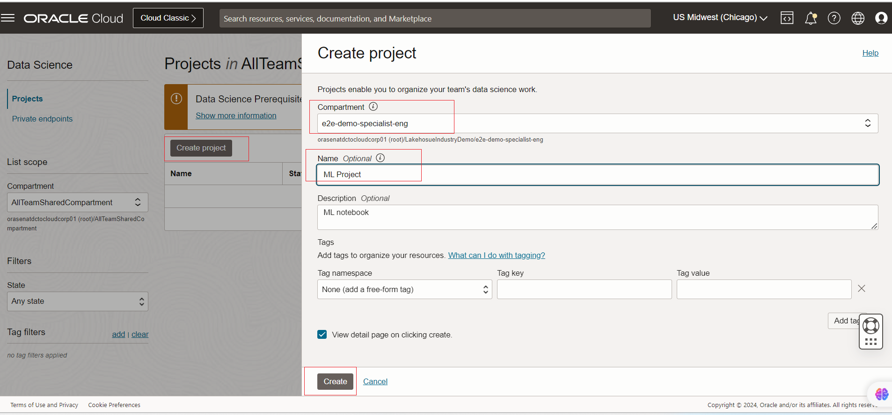
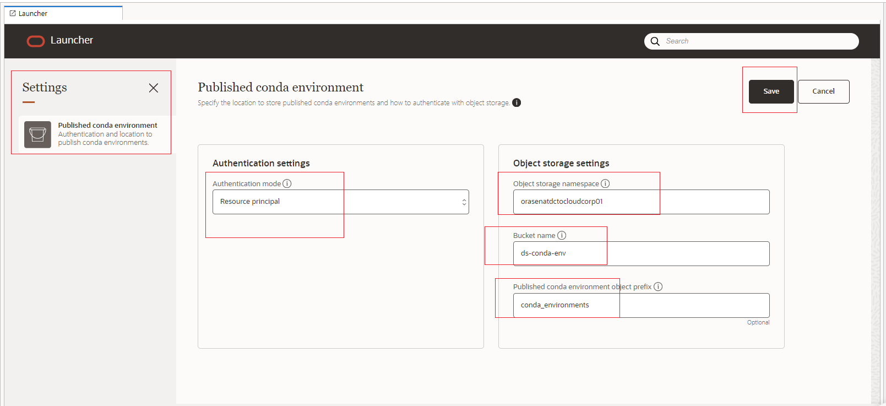
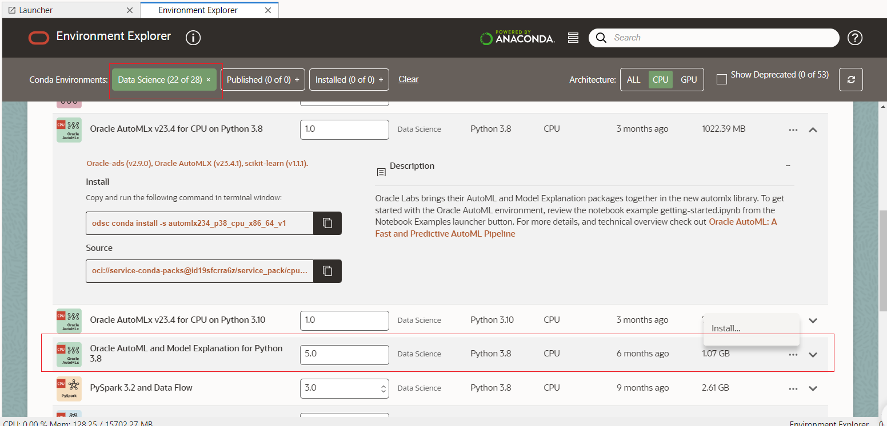
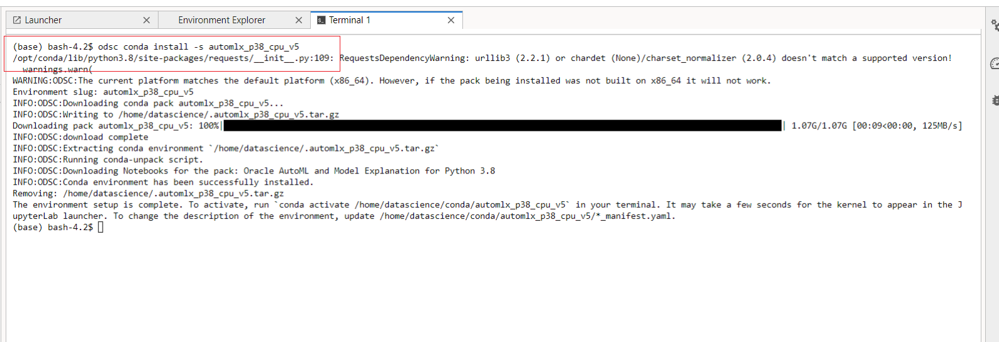
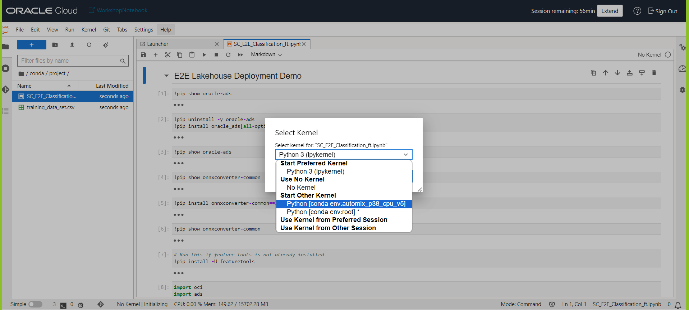
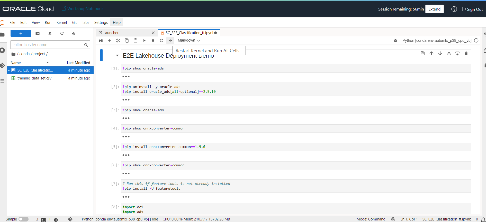

# Transform your Data into Insights


## Introduction

In this task we will be creating a OCI Data science Notebook and will be using the training data set 
to build and Deploy a predictive ML model on OCI platform which will identify the probablity of failure of a sensor device . The ML API URL once generated will be used by the FN function code to evaluate the probablity of device when exposed to Live sensor datasets from stereaming layer .


Estimated Time: 1 hour

### Objectives

In this section, you will:

- Create Policies.
- Create Policies for Data Science.
- Create a Data Science Project.
- Install libraries.
- Create and Publish Jupyter Notebook environment.
- Build and Deploy a ML model on OCI to evaluate the device failure probablities.
- Extract the Model Deployment REST API URL.

### Prerequisites

- All previous sections have been successfully completed.

## Task 1: Create Policies

1. Create **Dynamic Group**, go to **Menu**, **Identity & Security** and then click **Dynamic Groups**.

> Note: If you can't see **Dynamic Groups** under **Identity & Security** section, please select **Domains**, **Default (Current domain)** and then click **Dinamycs Group** in the left side menu.
 
   

2. Click **Create Dynamic Group**.

   

3. Set the following **Values**:

      - Name: `datascience`
         ```
         <copy>datascience</copy>
         ```
      - Description: `Data Science Dynamic Group`
         ```
         <copy>Data Science Dynamic Group</copy>
         ```
      - Rule 1 (Matching Rules):
         ```
         <copy>ALL { resource.type = 'datasciencenotebooksession' }</copy>
         ```

4. Click **Create**.

   

5. The **Dynamic Group** for Data Science has been created. Don't worry if the colour can vary from the picture, **Green** and **Blue** in this case mean the same.

   

---

## Task 2: Create Policies for Data Science

1. Go to **Menu**, **Identity & Security** and then click **Policies**.

   

2. Click **Create Policy**.

   Make sure you are in the `root` compartment.

   

3. Use the following information:

      - Name: `datascience`
         ```
         <copy>datascience</copy>
         ```
      - Description: `Data Science to use network resources`
         ```
         <copy>Data Science to use network resources</copy>
         ```
      - Policy Builder:
      - Toggle **Show manual editor**

         ```
         <copy>allow service datascience to use virtual-network-family in tenancy</copy>
         ```

         ```
         <copy>allow dynamic-group datascience to manage data-science-family in tenancy</copy>
         ```

4. Click **Create**.

   

5. The **Policy** for Data Science has been created.

   

   > Note: If you have created an **Oracle Cloud Account** to do the workshop, you are already the Administrator. You DO NOT NEED TO DO THIS STEP.
   >
   > In case you are a **Non-admin user**, you will need to set up some more policies to allow the group you belong to. Ask your administrator.
   >
   > ```
    <copy>allow group [data-scientists] to use virtual-network-family in tenancy</copy>
   ```
   >
   > ```
    <copy>allow group [data-scientists] to manage data-science-family in tenancy</copy>
   ```

---

## Task 3: Create a Data Science Project

1. Go to **Menu**, **Analytics & AI** and then click **Data Science**.

   

2. Click **Create Project**.

   

3. Set the **Name** and **Description** as follows:

      - Name: `WorkshopNotebook`
         ```
         <copy>WorkshopNotebook</copy>
         ```
      - Description: `Fish Survey notebook`
         ```
         <copy>WorkshopNotebook ML nodebook for model deployment</copy>
         ```

4. Click **Create**.

   

5. The next step is to create a **Notebook**, click **Create Notebook Session**.

   


6. The **Status** icon will change from Creating to Active. Be patient, this process should take a few minutes.

   

7. When the Notebook is active, click **Open**.

   

   

8. Log-in into your Notebook. Click **Continue** and you should be in your notebook as you are using your same OCI Web Console user. Otherwise, log in with your specific user.

   


## Task 4: Set up OCI Data science environment


1. Welcome to your **Jupyter Notebook**. Click **Terminal**.

   

2. Naviagte to ***Settings*** and change the below -
   Ensure the Authentication setting is ***resource principle*** and the environment is pointed to the bucket ***ds-conda-env***

   

3. Navigate to the the Conda Environment tab and install the conda package shown in the below screenshot.


   

    Once you hit Install .A terminal will be created and the installation will be started.

   

4. Publish the Condas environment .Navigate to the installed in environment as show in the below snapshot .

   

   Once you click publish ,another terminal will be created to publish the condas package .
   

Now you are all set to begin the notebook development with the training data set and build the ML model.

## Task 5: Deploy the ML Notebook

1. Open the data science notebook and create a folder "Project"
   
2. Upload the pre-built python notebook and training data set files to the created OCI Data science instance.
   

3. Select the Python execution Kernel for the notebook.
   

4. Run the notebook
   

Here using the ML notebook we are building the model ,testing and deploying the Model to OCI .
## Task 6: Check the Model Deployment and extract the ML model Rest API URL

1. Navigate to assocaited ML model created. 
   

2. Navigate to invoking your model and copy the REST API endpoint URL.
   


---
## Acknowledgements
* **Author** - Biswanath Nanda, Principal Cloud Architect, North America Cloud Infrastructure - Engineering
* **Contributors** -  Biswanath Nanda, Principal Cloud Architect,Bhushan Arora ,Principal Cloud Architect,Sharmistha das ,Master Principal Cloud Architect,North America Cloud Infrastructure - Engineering
* **Last Updated By/Date** - Biswanath Nanda, March 2024