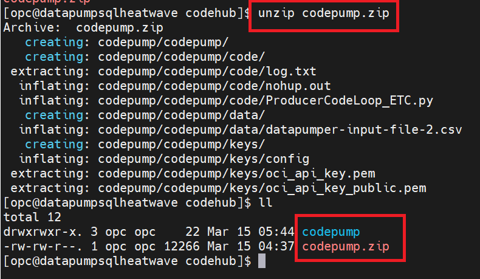
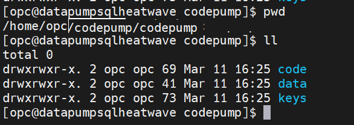

# Creating the OCI stream service and build the synthetic data generator.
Here we will be creating the OCI stream service and will be deploying the Python Streaming Simulator code base to the Compute VM created in ***Lab2B***

Estimated Time: 30 minutes

### Objectives
In this lab, you will:
- Create OCI stream service
- Deploy the generator codebase to compute VM
- Perform script refactoring and execute the code

## Pre-Requisites

* An Oracle Cloud Account - please view this workshop's LiveLabs landing page to see which environments are supported.
* Completed Lab 2B

## Task 1: Create an OCI Stream

1. Open the navigation menu and click ***Analytics & AI***. Under ***Messaging***, click ***Streaming***. A list of existing streams is displayed.


2. Click ***Create Stream*** at the top of the screen.Make sure to create the stream in the same demo compartment.


3. ***Stream Name:*** Specify a friendly name for the stream and create the streaming app using default pool option "Auto-Create a default stream pool" .
Streaming application name example - "e2e-stream-mysqlhw".


4.Click ***Create***.

5. In a few seconds the streaming application gets created .


## Task 2: Deploy the Python generator script on Compute VM
- Login to the compute VM using user ***OPC*** (Using and SCP tool like WINSCP or Mobaextern).
   
- Download the Labfiles and navigate to the below folder location to collect the codepump.zip file.

   Download file [`MYSQLLakehouse_labfiles.zip`](https://objectstorage.us-ashburn-1.oraclecloud.com/p/RPka_orWclfWJmKN3gTHfEiv-uPckBJTZ3FV0sESZ3mm3PDCQcVDCT-uM2dsJNGf/n/orasenatdctocloudcorp01/b/MYSQLLakehouse_labfiles/o/MYSQLLakehouse_labfiles.zip)

  *** Python Framework Location in the Zip file - \_MYSQLLakehouse_labfiles\_Lab4b\_ProducerCodebase  
  

- Upload the zip to the compute VM
  

- Ensure python 3.8 and OCI library is installed in the compute VM 


  Run the below commands to get the packages installed.

    ``` 
        <copy>    
        sudo yum install python38
        sudo yum install oci
        python3.8 --version
    ```
- unzip the zip file 

  
  
- Naviagte to the below location 
  

- Navigate to Keys directory and paste your OCI keys in the below directory 
  *** Flollow the below link ,which shows the steps to configure your private and public keys.
 
  **[Click here for key generation ]( https://docs.oracle.com/en-us/iaas/Content/API/Concepts/apisigningkey.htm)**
  
  

  

- Navigate to the ***Code*** directory. 
  Change the contents of the code - ProducerCodeLoop_ETC.py (in VI editor)
  
  
    ```
      <copy>
      device_file_path = '/home/opc/codepump/data/datapumper-input-file-2.csv' - Linux live lab
      ociMessageEndpoint = "https://cell-1.streaming.us-xyz" - stream OCID
      ociStreamOcid = "xyz" - get this from the streaming application
      ociConfigFilePath = "/home/opc/codepump/keys/config" - path to your config file
      ociProfileName = "DEFAULT"
    ```


- Save and run the pythn code

    ```
        <copy>
        python3 ProducerCodeLoop_ETC.py
    ```

You may now **proceed to the next lab**

## Acknowledgements
* **Author** - Biswanath Nanda, Principal Cloud Architect, North America Cloud Infrastructure - Engineering
* **Contributors** -  Biswanath Nanda, Principal Cloud Architect,Bhushan Arora ,Principal Cloud Architect,Sharmistha das ,Master Principal Cloud Architect,North America Cloud Infrastructure - Engineering
* **Last Updated By/Date** - Biswanath Nanda, March 2024