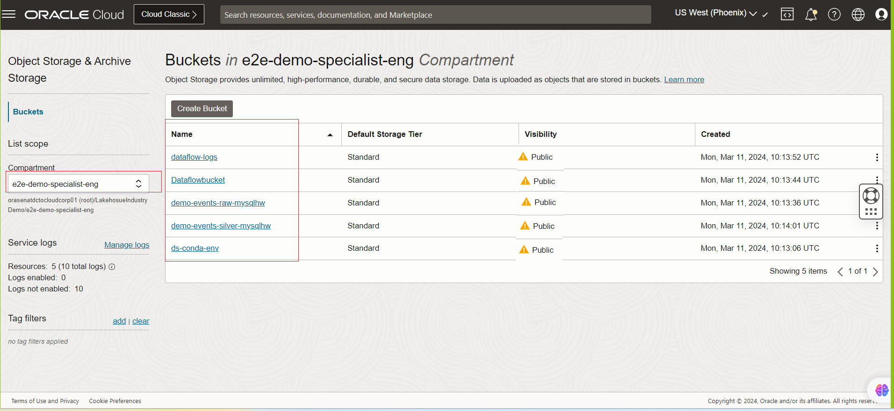

## Introduction

In this lab we be creating the object-storage buckets used for the workshop .

1. RAW Bucket :
   Bucket Name - **demo-events-raw-mysqlhw**
   
   Bucket Purpose - The the streaming payloads will be continously written to this bucket .
2. Silver Bucket - **demo-events-silver-mysqlhw**
   
   Bucket Purpose - This bucket is used by the Data flow to write the aggregated data from RAW bucket .
3. ML training Datasets - **ds-conda-env**
   
   Bucket Purpose - The file in the bucket is considered for training the ML model and will be hosting the published Anaconda package.
4. OCI Data flow buckets - **Dataflowbucket** and **dataflow-logs**
   
   Bucket Purpose - These buckets will be containing the pyspark script and data flow application logs respectively.

### Objectives

## Setting up OCI Object Storages for performing streaming data exchanges in the demo.
### Dataset Brief :
 * The below figure shows the feature vectors of manufacturing sensor data steams .The events are being generated by the producer code hosted in a compute VM. A single event contains features such as timestamp ,asset\_id,asset\_type ,process\_temp,rotation speed ,torque and tool\_wear . Based on the historical data sets and occucrance of failures, we have built a training data set which is used as a source for the ML model built on the OCI data science platform. 
       

### Setting up OCI Object Storage for performing streaming data exchanges in the demo.

## Estimated Lab Time:##      10 minutes

## Task 1: Object Store: Setting Up Storage
The below steps shows ,how to create the ObjectStorage buckets. In this task we will be creating the below ObjectStores .

1. Before running any applications the below storage buckets needs to be created in the demo compartment.
    
    * From the OCI Services menu, click `Storage` and then click `Buckets` under Object Storage

       

    * Click `Bucket`
       

      **NOTE:** Ensure the correct Compartment is selected under COMPARTMENT list
      **NOTE** Ensure for the workshop make the below buckets ***PUBLIC*** .For customized set up the buckets can be marked private .
1. Bucket lists
    * **Buckets for OCI Data Science**
         * **ds-conda-env**
    * **Buckets for OCI Streaming Sink** 
         * **demo-events-raw-mysqlhw** - Store raw data set.
      
    * **Buckets for OCI Dataflow set up**
         * **Dataflowbucket** - host the main.py file ( Spark Application file)
         * **dataflow-logs** - Store the dataflow Application log
    * **Bucket for storing Historical Data**
         * **demo-events-silver-mysqlhw** -Store the Aggregated streaming data sets 

You may now **proceed to the next lab**

## Acknowledgements
* **Author** - Biswanath Nanda, Principal Cloud Architect, North America Cloud Infrastructure - Engineering
* **Contributors** -  Biswanath Nanda, Principal Cloud Architect,Bhushan Arora ,Principal Cloud Architect,Sharmistha das ,Master Principal Cloud Architect,North America Cloud Infrastructure - Engineering
* **Last Updated By/Date** - Biswanath Nanda, March 2024