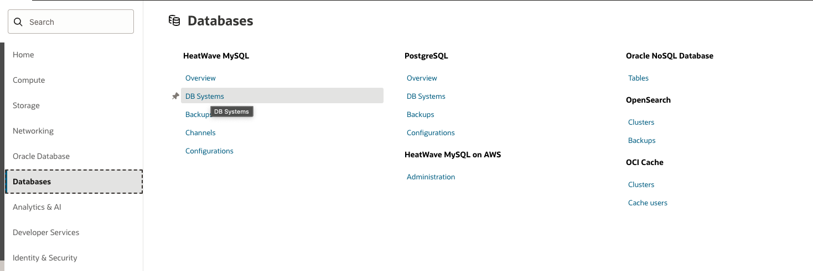

# Create MySQL Database System in Oracle Cloud

## Introduction

This lab walks you through the steps to create **MySQL Database System** in Oracle Cloud Infrastructure.

Estimated Time: 15 minutes

### Objectives

In this lab, you will:
* Be able to launch MySQL Database System in Oracle Cloud.

### Prerequisites

This lab assumes you have:
* An Oracle account
* Privileges to use Oracle Cloud resources

## Task 1: Create MySQL Database System in Oracle Cloud

1. Login into OCI console, Navigate to **Databases** menu and click on DB Systems under **MySQL**.

	

2. Click on "**Create MySQL DB System**"

  

3. Select **Compartment** and Provide information and select “**HeatWave**” from options.

	

4. Provide **username**/**password**, **confirm password** and select Virtual Cloud Network (**VCN**)

   

5. Select Availability Domain as per choice and select “**MySQL.HeatWave.VM.Standard.E3**’ Instance shape for MySQL HeatWave.
	 If you wish to change Instance shape, please click on “**Chane Shape**” button.

	

6. Specify Storage size and Enable Automated backups and click on “**Create**” to initiate creation process.

	 

7. Once Instance is launched, it will be Active in a minutes. However the HeatWave options will be **disabled**.

	 

> **Note:** At this stage we have learnt how to create MySQL Database System. However, HeatWave Engine is still disable. To enable HeatWave engine we will proceed to Lab 

You may now proceed to the next lab.

## Acknowledgements
* **Author** - Jitender Singh, Senior Cloud Engineer, NA Cloud Engineering
* **Contributors** -  Jitender Singh, Senior Cloud Engineer, NA Cloud Engineering
* **Last Updated By/Date** - Jitender Singh, September 2021
