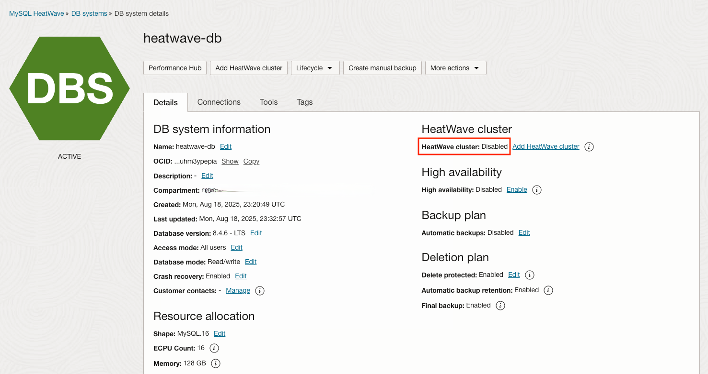
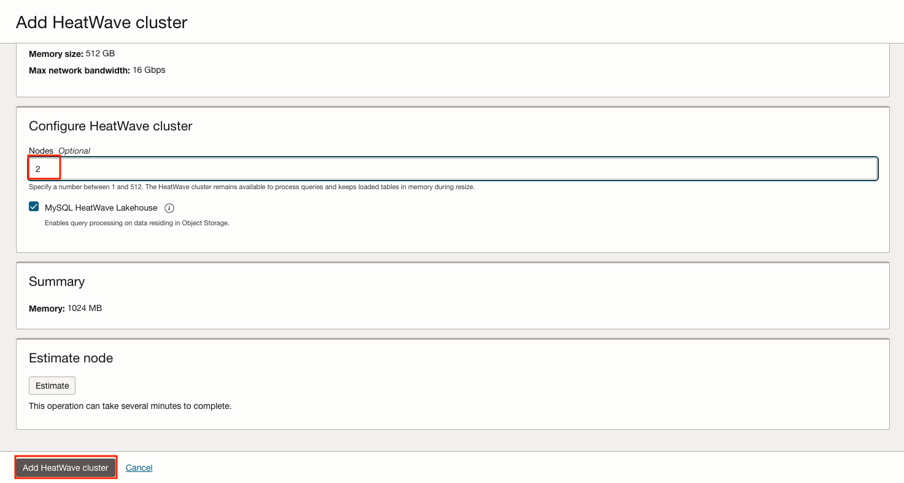
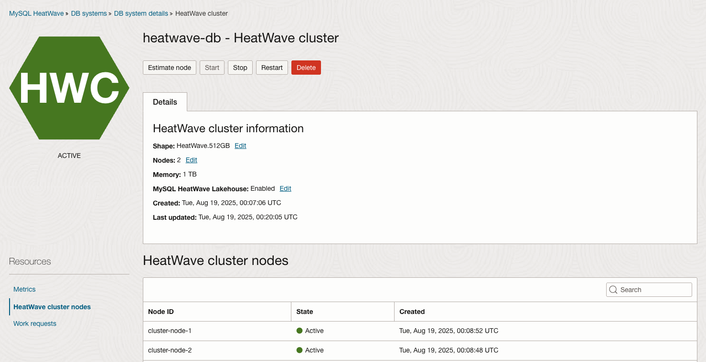

# Enable HeatWave Cluster in MySQL Database System

## Introduction

This lab walks you through the steps to enable **HeatWave** Cluster in MySQL Database System that we have created in **Lab 1**.

Estimated Time: 15 minutes

### Objectives

In this lab, you will:
* Be able to enable **HeatWave** Cluster to MySQL Database System in Oracle Cloud.

### Prerequisites

This lab assumes you have:
* An Oracle account
* You have enough privileges to use Oracle Cloud resources
* All previous labs successfully completed

## Task 1: Enable HeatWave Cluster in MySQL Database System

1. Since we have created MySQL Database System. **Navigate** to MySQL DB System under **Database** section
and you will see newly created MySQL DB System in **Active** state. Now **Click** on the DB System and you will see HeatWave is disabled. Now to enable **HeatWave** engine click on **Enable**.

	

2. Select **node** and click on “**Add HeatWave Cluster**”

  

3. Now to see the creation process, **Navigate** to “**Resource**” section and select “**HeatWave**” option to see the status of cluster node. You will see CLuster node as '**Active**'

	

4. Now from the **resource** section click on “**Endpoint**” section and note down the IP address. This IP address will be used to connect to MySQL Database System.

   

> **Note:** At this stage we have our MySQL Database System **Active** and **HeatWave** Cluster is also enabled.

You may now proceed to the next lab.

## Acknowledgements
* **Author** - Jitender Singh, Senior Cloud Engineer, NA Cloud Engineering
* **Contributors** -  Jitender Singh, Senior Cloud Engineer, NA Cloud Engineering
* **Last Updated By/Date** - Jitender Singh, September 2021
