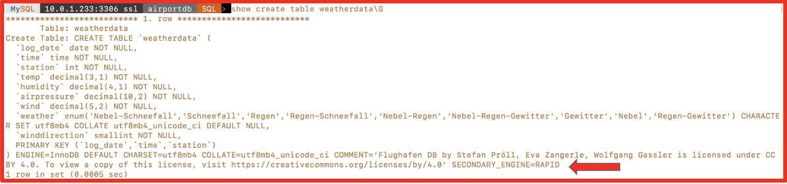
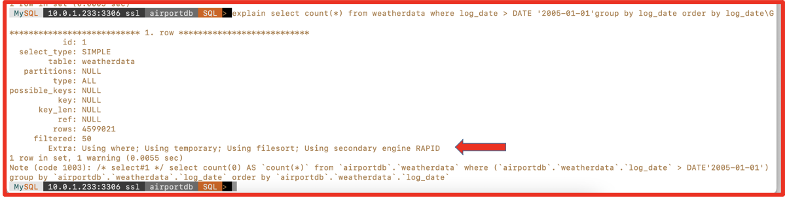
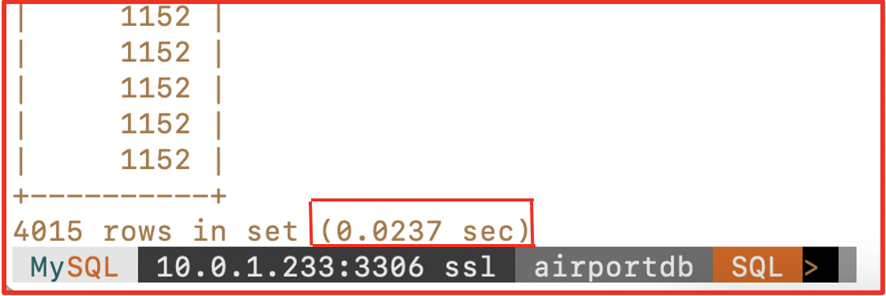
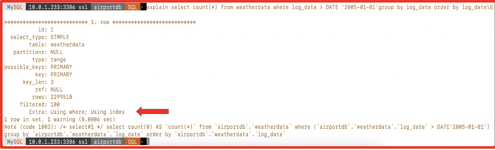
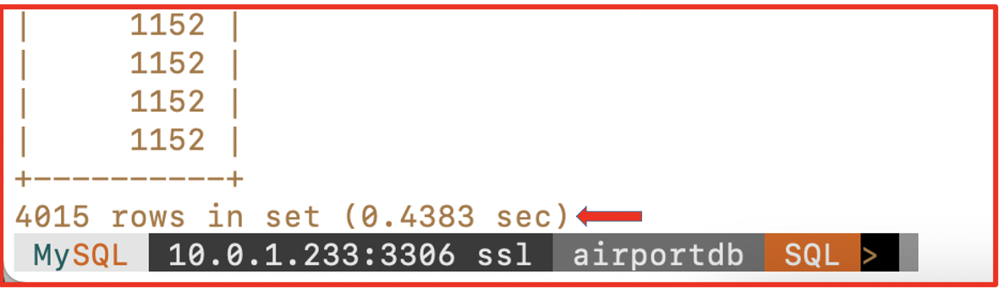

# Execute SQL Query to View the Performance Differences

## Introduction

This lab will help you in experiencing performance difference in MySQL HeatWave Cluster by executing SQL Query.

Estimated Time: 15 minutes

### Objectives

In this lab, you will:
* Be able to execute SQL queries to see performance difference.

### Prerequisites

This lab assumes you have:
* An Oracle account
* You have enough privileges to use OCI
* All previous labs successfully completed

## Task 1: Execute SQL Query to see the Performance Differences

1. Now we have **airportdb** database loaded into **HeatWave Cluster** engine. We will execute query on one of the table named **weatherdata** table to see the difference in execution time. Since the table is already loaded into HeatWave Cluster. You can see it from table defination.

	```
	<copy>use airportdb;
	show create table weatherdata\G</copy>
	```

	

2. I am going to run below SQL query and will verify from the explain plan first that this query is using **HeatWave** engine (secondary engine) “Rapid” which is our HeatWave clsuetr engine.

	```
	<copy>Explan select count(*) from weatherdata where log_date > DATE '2005-01-01'group by log_date order by log_date\G</copy>
	```

	

3. Now execute query to see execution time.

	```
	<copy>select count(*) from weatherdata where log_date > DATE '2005-01-01'group by log_date order by log_date;</copy>
	```

	

4. Now from above execution we can see that query took approx. **0.0237** seconds to complete. And to compare HeatWave query execution time with **Normal MySQL DB System** execution time, I am going to disable variable **use_secondary_engine** and run the query again to see how long it takes to execute on the MySQL DB System and **NOT** using HeatWave Cluster.

   

	 NOTE: When you disable **use\_secondary\_engine** and run query, the said query will not use **HeatWave** engine.

5.	To verify the same, we will again run **Explain** command to see that query is using normal MySQL engine and not HeatWave Cluster engine.

	```
	<copy>Explan select count(*) from weatherdata where log_date > DATE '2005-01-01'group by log_date order by log_date\G</copy>
	```

	

6.	Now execute SQL query to see actual execution time so that we can compare the difference in execution time.

	```
	<copy>select count(*) from weatherdata where log_date > DATE '2005-01-01'group by log_date order by log_date;</copy>
	```

	

> **Note:** As we can see time difference in execution time on **Normal** MySQL Database System, the same query took approx. **0.4383** seconds However the same query took **0.0237** when running with HeatWave Cluster enabled.

**This completes the Task here!**

**Conclusion :**
As you have experienced that HeatWave Engine accelerates MySQL performance for queries using HeatWave Engine. HeatWave can improve performance by **5400x** for analytics queries, scales out to thousands of cores, and is **6.5x** faster at **one-half** the cost of Amazon Redshift AQUA. MySQL Database Service, with HeatWave, is the only service for running OLTP and OLAP workloads directly from their MySQL database.

**Hope you enjoyed this Lab - Happy Learnning OCI**

## Acknowledgements
* **Author** - Jitender Singh, Senior Cloud Engineer, NA Cloud Engineering
* **Contributors** -  Jitender Singh, Senior Cloud Engineer, NA Cloud Engineering
* **Last Updated By/Date** - Jitender Singh, September 2021
