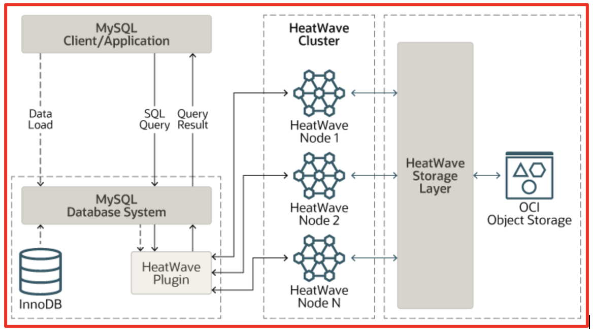

# Introduction

## About this Workshop

This workshop will basically walk you through stages where you will be spining a MySQL Database System with **HeatWave Cluster** on **Oracle Cloud** and experience how **HeatWave engine** increase performance as compare to **Normal MySQL** when running analytics queries or other queries which uses **HeatWave engine** to process.

Estimated Workshop Time: 60 minutes

### About Oracle MySQL Database Service

**Oracle MySQL Database Service** is a fully managed database service that lets developers quickly develop and deploy secure, cloud native applications using the world’s most popular open source database. MySQL Database Service is the only MySQL cloud service with an integrated, high performance, in-memory query accelerator—**HeatWave**. It enables customers to run sophisticated analytics directly against their operational MySQL databases—eliminating the need for complex, time-consuming, and expensive data movement and integration with a separate analytics database. **HeatWave** accelerates MySQL performance by orders of magnitude for analytics and mixed workloads. Optimized for Oracle Cloud Infrastructure (OCI), MySQL Database Service is 100% built, managed, and supported by the OCI and MySQL engineering teams.

### About HeatWave

HeatWave is a distributed, scalable, shared-nothing, in-memory, hybrid columnar, query processing engine designed for extreme performance. It is enabled when you add a HeatWave cluster to a MySQL DB System. To know more about HeatWave Cluster <a href="https://dev.mysql.com/doc/heatwave/en/heatwave-introduction.html" target="\_blank">**Click Here**</a>

**HeatWave Architecture**

  

### Objectives

In this workshop, you will learn how to:
* Provision MySQL Databse System in Oracle Cloud
* Enable HeatWave Cluster in MySQL Database
* Load Sample data into HeatWave Cluster
* Execute SQL Query to see the difference in performance and execution time.

### Prerequisites

This lab assumes you have:
* You have an Oracle account.
* You have one Compute instance having <a href="https://dev.mysql.com/doc/mysql-shell/8.0/en/mysql-shell-install.html" target="\_blank">**MySQL Shell**</a> installed on it.

## Acknowledgements
* **Author** - Jitender Singh, Senior Cloud Engineer, NA Cloud Engineering
* **Contributors** -  Jitender Singh, Senior Cloud Engineer, NA Cloud Engineering
* **Last Updated By/Date** - Jitender Singh, September 2021

