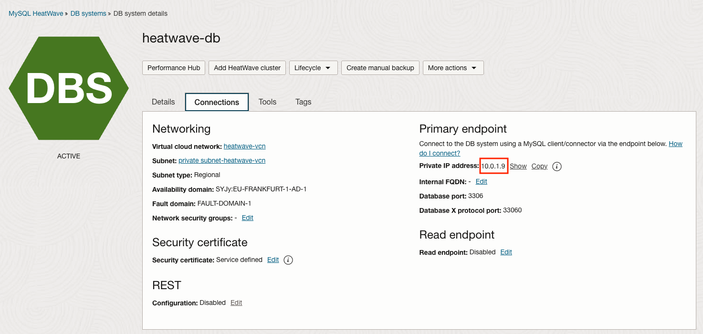
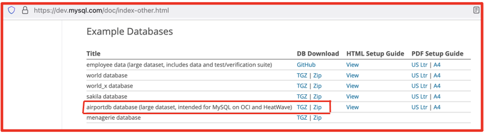
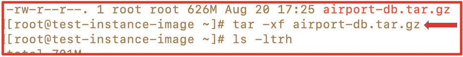
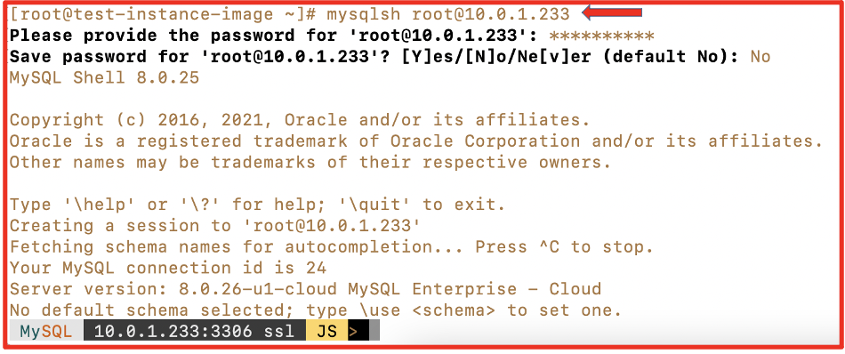
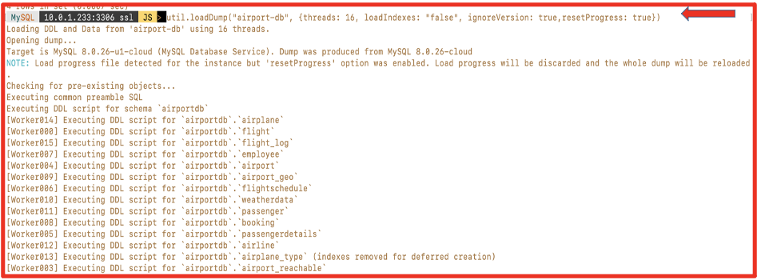
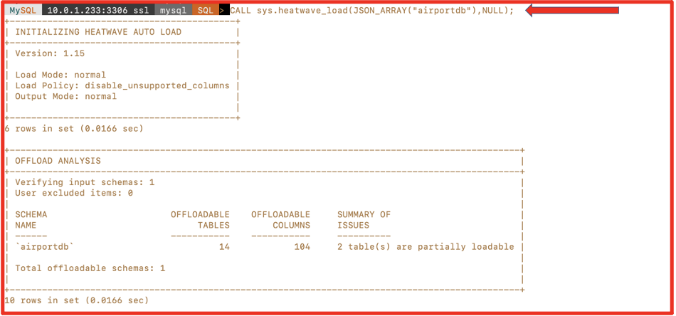
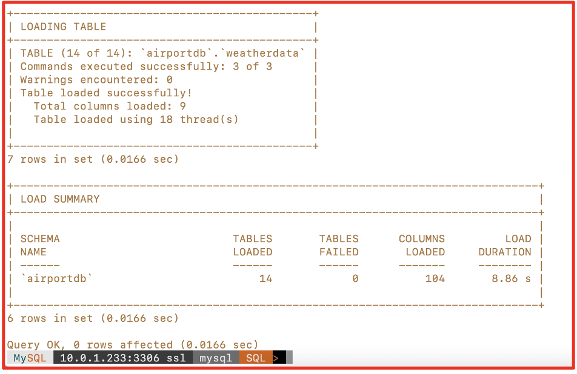

# Upload Data into MySQL HeatWave Cluster Engine

## Introduction

This lab walks you through the steps to upload data into HeatWave Cluster in MySQL Database System that we have enabled in Lab 2.

Estimated Time: 15 minutes

### Objectives

In this lab, you will:
* Be able to upload data into HeatWave Cluster in MySQL Database System in Oracle Cloud.

### Prerequisites

This lab assumes you have:
* An Oracle account
* You have enough privileges to use OCI
* You have one Compute instance having <a href="https://dev.mysql.com/doc/mysql-shell/8.0/en/mysql-shell-install.html" target="\_blank">**MySQL Shell**</a> installed on it.
* All previous labs successfully completed

## Task 1: Upload data into MySQL HeatWave Cluster Engine

1. Since we have already enabled **MySQL HeatWave Cluster** Database System and noted down the **Endpoint** IP address of our MySQL Database System.

   

2. To upload data on HeatWave cluster, download **airportdb database** from <a href="https://dev.mysql.com/doc/index-other.html" target="\_blank"> MySQL website </a> to a Compute Instance or local machine from where you have access to your **MySQL heatwave cluster**.

	**Alternatively**, you can also directly execute **wget https://downloads.mysql.com/docs/airport-db.tar.gz** command on your Compute instance to download “**airport-db.tar.gz**” file in specified location.

  

3. Now unzip/untar “**airport-db.tar.gz**” file by running command “**tar -xf airport-db.tar.gz**” from your Compuete machine where you have downloaded this file.

	```
	<copy>tar -xf airport-db.tar.gz</copy>
	```

	

4. Now login into MySQL Database using **MySQL Shell** and connect to the MySQL DB System using Endpoint.

	 ```
	 <copy>mysqlsh root@10.0.1.233</copy>
	 ```

   

5. Now load data into MySQL Database System using **util.loadDump** command.

  	```
		<copy>util.loadDump("airport-db", {threads: 16, loadIndexes: "false", ignoreVersion: true,resetProgress: true})</copy>
		```
  

6. Once data is loaded you can verify **Database** and **Tables**.

	```
	<copy>use airportdb;
	show tables;</copy>
	```

	 

	 **NOTE**: At this stage we have “**airportdb**” database in MySQL Database System and now we need to load the "**airportdb**" database into HeatWave cluster.

7. Now to load "**airportdb**" database into **HeatWave Cluseter** run below command from MySQL Shell.

	 ```
	 <copy>use mysql;
	 CALL sys.heatwave_load(JSON_ARRAY("airportdb"),NULL);</copy>
	 ```

	 

8. Post successful execution of above code, you will see summery of data loading.

	 

You may now proceed to the next lab.

## Acknowledgements
* **Author** - Jitender Singh, Senior Cloud Engineer, NA Cloud Engineering
* **Contributors** -  Jitender Singh, Senior Cloud Engineer, NA Cloud Engineering
* **Last Updated By/Date** - Jitender Singh, September 2021
