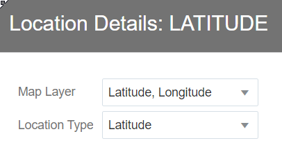

# SailGP Data Analysis - Maneuvers

## Introduction

In this lab, you will focus your attention on analyzing the **maneuvers** of of the Bermuda race. When a boat changes the side that's facing the wind, we call this a Tack or a Gybe. Although these maneuvers are necessary to reach the waypoints, in general teams try to minimize the **number of maneuvers**. The reason: Maneuvers will slow down the boat for a little while.

The **quality** of the maneuvers is also very important. Ideally, during a maneuver the team loses as little speed as possible. This requires very good technique and coordination between the team members.

In this lab, you will continue using **Oracle Analytics Cloud (OAC)** and **MySQL HeatWave Lakehouse** to analyze these manoevers.

Check out this video that shows how to Tack and Gybe an F50!

_Estimated Time:_ 20 minutes

<!---->

### Objectives
In this lab, you will:

- Learn how a SailGP Data Athlete extracts valuable insights from sensor data
- Learn how to use Oracle Analytics Cloud to prepare and analyze data

### Prerequisites
This lab assumes you have completed all the labs so far.

## Task 1: Enable the GPS data as found in the dataset

Our goal is to visualize the boats on a map so that we can see when they are making their maneuvers. Luckily, our sensor dataset on Object Storage contains the geographical coordinate (latitude + longitude) of each boat at each moment in the race. However, we first have to instruct Oracle Analytics Cloud to interpret our coordinates as such.

1. From the **Home Page** of Oracle Analytics Cloud, choose **Data**, then click the ribbon `Race Data` and select **Open**.

   

2. Find the `LATITUDE` column (towards the end), and change **Treat As** to **Attribute**.

   

3. Click on the ribbon next to the `LATITUDE` field and choose **Location Details**.

   

4. Make sure that the Location Details configuration is as follows. **It's important to press Ok, even if you don't make changes.**

   

   Next, do the same thing for the `LONGITUDE` column. Set the **Treat As** to **Attribute**.

   

   Change the Location Details to the following. **It's important to press Ok.**

   

5. Find the `TIME_IN_MANEUVER` column (towards the end) and set **Treat As** to **Attribute**. We don't want to calculate with the time, therefore Attribute is the best way to classify this attribute.

   

6. Find the `BDE_LEG_NUM_UNK` column (at the very end) and set **Treat As** to **Attribute**. This attribute holds the leg number (the "lap" number of the race). We don't want to calculate with the leg, therefore Attribute is the best way to classify this attribute.

   

7. Go back to the **Home Page**. Save the Data Set if you're being asked to.

   

## Task 2: Visualize the maneuvers on a map

1. Create a new workbook by clicking on **Data**, and then on **Race Data**.

   

2. Now we want to visualize our coordinates (comprised of Latitude and Longitude). **Select** the `LATITUDE` and `LONGITUDE` columns (use Control to select multiple columns). Then **drag** them to the right canvas.

   

   You should see the following:

   

3. We want to be able to distinguish the path of each team separately. Let's color-code each team. Drag the `B_NAME` column to the **Color** field.

   

4. Next, we want to focus on our two teams: France and Great Britain. We will look at how many maneuvers they each perform for the third leg ("leg" means one lap in SailGP).

    Add two new filters. Create a filter on `B_NAME` (team) to **include** France and Great Britain and `BDE_LEG_NUM_UNK` (Leg) to be **3**. Then, if needed, change the zoom on the map, so you can see the full leg.

   

   **Conclusion**: Count the number of places where each team changes direction. Notice how the French team makes one more maneuver compared to Great Britain?
	The French team could learn from this that they could improve the planning of how they navigate the leg. We have to be careful with this conclusion though, there may be tactical/strategical advantages in tacking/gybing more than strictly necessary (e.g. compete with other boats).

## Task 2: Investigate the quality of the maneuvers

1. Let's see how France's maneuvers compare to those of the winner of the race, GBR.

   **Change the filter** so we only look at leg **4**, and add a filter to only show the parts where teams are making a maneuver so `MANEUVER` is `Y` (Yes).

   

   Notice how you now only see the sections where the boats are changing their sailing course. Each of these sections is defined to be exactly 30 seconds, and at the centre of it,  the moment in which the boat passes exactly through the wind.

	Now, let's look into the quality of the maneuvers.

2. Create a new Line Chart by clicking on the **Graph icon** (second icon from the top left), then drag the **Line icon** to just left of the existing map visualization.

   

3. Go back to the fields by clicking on the **database icon**.

	

4. In this chart, we want to see how well the boats are able to keep out of the water during a maneuver. The boats try to not hit the water during a maneuver, to prevent losing speed. The column `LENGTH_RH_BOW_MM` indicates the "flying height", the distance that the boat is out of the water. The `TWA_SGP_DEG` column indicates the wind direction, so we can see exactly when the boat is at the middle of its maneuver.

	Configure the chart as follows by **dragging** the fields from the left to the chart configuration.

   

5. Currently we can hardly see the flying height because its values (between 0 and 1,4m) are much smaller than the wind angle (between 0 and 360). Let's add a secondary Y axis to solve that. You can find these settings on the bottom left of the screen.

   

6. Maximize the chart to see it better:

   

7. The way that the flight height has been configured, at a value of `0,4` the boat hits the water. Let's include a reference line to indicate this. Click the ribbon menu, select **Add Statistics** and click **Reference Line** as follows:

   

8. Configure the reference line as follows (bottom left of the screen):

   

9. Now, scroll through the resulting chart and compare how well each team manages to stay out of the water during maneuvers.

   

	**Conclusion:** Notice how the French team comes in contact with the water more often. So the tacking/gybing technique could be another point of attention to improve their next race.

10. Finally, save the workbook and name it "Maneuver Analysis".

   

Congratulations on completing this lab. You have learned to work with **MySQL HeatWave Lakehouse** and **Oracle Analytics Cloud**, and you have made the first steps towards being a **Data Athlete**! We hope you feel inspired to continue experimenting with this data, or even start with the analysis of your own data!

You may now *proceed to the next lab*.

## **Acknowledgements**

- **Author** - Jeroen Kloosterman - Technology Product Strategy Director
- **Last Updated By/Date** - Jeroen Kloosterman - Technology Product Strategy Director, October 2023