# Upload the SailGP data to Object Storage and add it to the Lakehouse

## Introduction

In this lab, you will prepare the data for the **SailGP** challenge. We will upload sensor data from the boats to Object Storage, where it will be accessed directly by **MySQL HeatWave Lakehouse**. This works by configuring an External Table in HeatWave that links to the data in Object Storage.

To any application, this external table can be accessed with SQL as normal. In the later labs we will see this, by using Oracle Analytics Cloud to access the data in the Lakehouse.

Estimated Time: 15 minutes

### Objectives

In this lab, you will:

- Create a new Object Storage bucket.
- Upload the SailGP data to the bucket.
- Install the MySQL Shell on the bastion server.
- Use MySQL Shell to configure the external table.

### Prerequisites

- Oracle Free Trial Account.
  
## Task 1: Create an Object Storage Bucket and upload the data

1. **Download** the file that contains the data that we'll use in our analysis:

   <a href="..." target="\_blank">SailGP data</a>

   Save the file on your local machine. Make sure that the file is saved with extension `.csv`.

2. From the Console navigation menu, click Storage, then Buckets.

  

3. Make sure you are in the same compartment where you created the other resources. Then click "Create" and name the new bucket "sailgp". Leave all the other options at default, then press Create.

  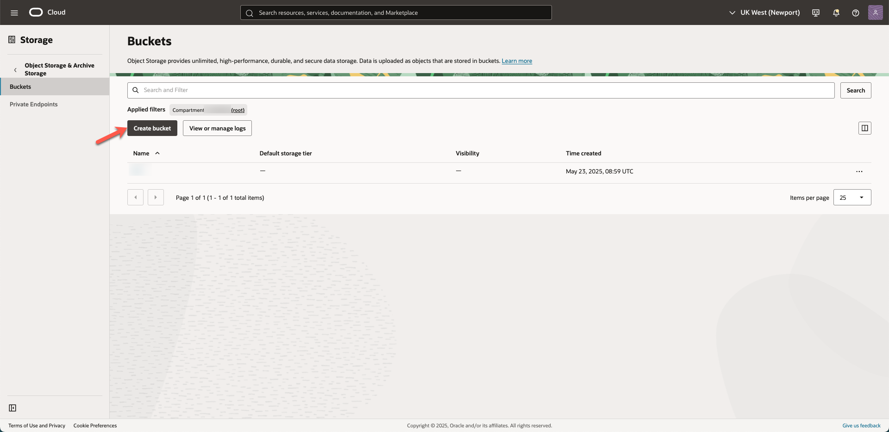

4. Open the bucket by clicking on its name.

  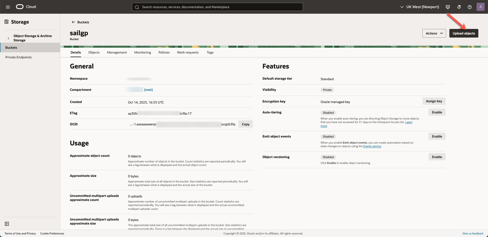

5. Click Upload. Drag the file that you just downloaded to the indicated box. Finally, press Upload.

  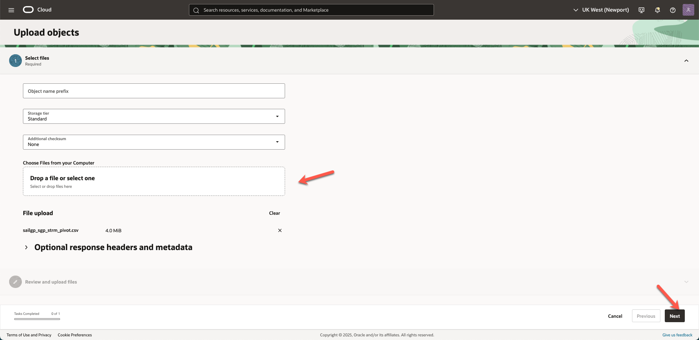

6. Next, we are going to create a URL to access the file. This is called a "Pre Authenticated Request". We will use this PAR later to access the file on Object Storage directly from MySQL. 

   Click on the 3 dots next to the file, select "Create Pre-authenticated Request", then click the button "Create Pre-Authenticated Request", and finally copy the URL with the indicated button.

  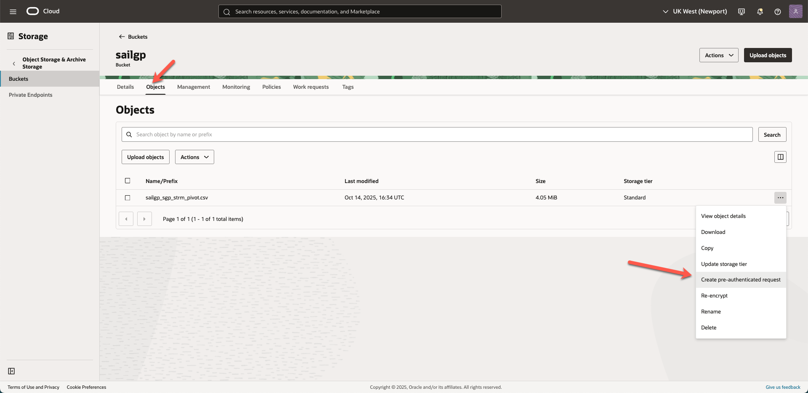

  

  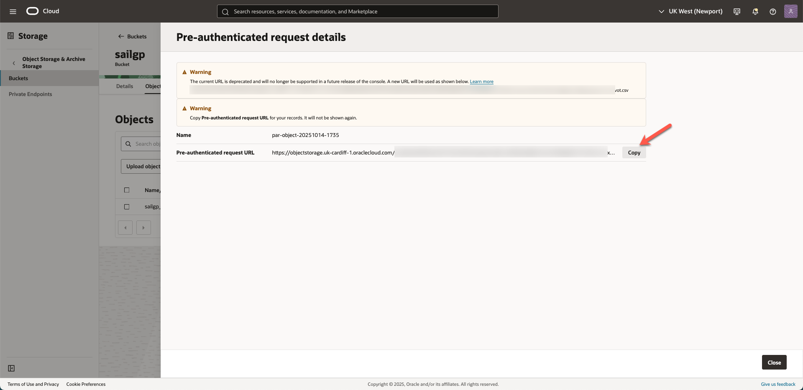

   Keep this PAR somewhere (e.g. place it in notepad), as you will need it later.

## Task 2: Connect to the Bastion Host and install MySQL Shell

1. In order to connect to the bastion host, we will use the cloud shell, a small linux terminal embedded in the OCI interface.
  
  	To access cloud shell, click on the shell icon next to the name of the OCI region, on the top right corner of the page.

  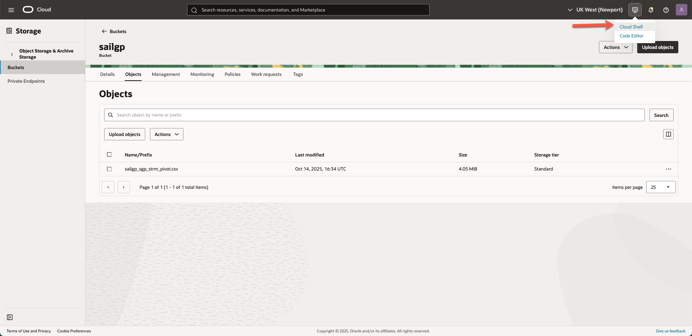

  	Once the cloud shell is opened, you will see the command line:
    
  

2. Drag and drop the previously saved private key into the cloud shell.   

  

  You can verify the key file name with the following command:
    
	```
    <copy>ll *.key </copy>
    ```
  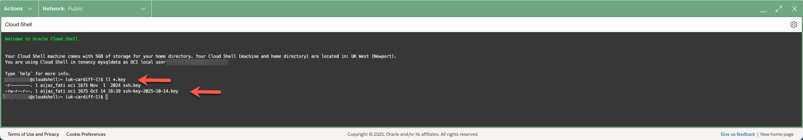

3. Copy the _**Public IP Address**_ of the compute instance you have just created. Remember, you can find this from the main menu by going to "Compute", "Instances", "mysql-analytics-bastion".

  	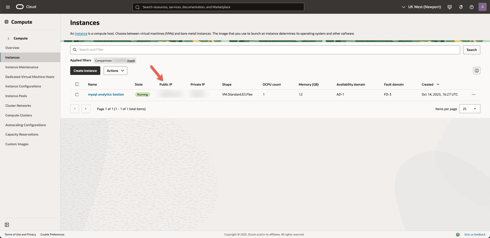

4. In Cloud Shell, give the right access to the key file:
	```
	<copy>
	chmod 400 *.key
	</copy>
	```

5. In order to establish an ssh connection with the bastion host using the Public IP, execute the following command in your Cloud Shell (first replace where indicated with the actual key filename and the public IP address of the Bastion compute instance):

	```
	<copy>
	ssh -i <private-key-file-name>.key opc@<compute_instance_public_ip>
	</copy>
	```
  	

  	If prompted to accept the finger print, type _**yes**_ and hit enter, then you will get a Warning.

6. Run the following command to install MySQL Shell on the compute instance.

	```
	<copy>
  sudo yum install mysql-shell -y
	```
	</copy>
  
  The result should look like this:
  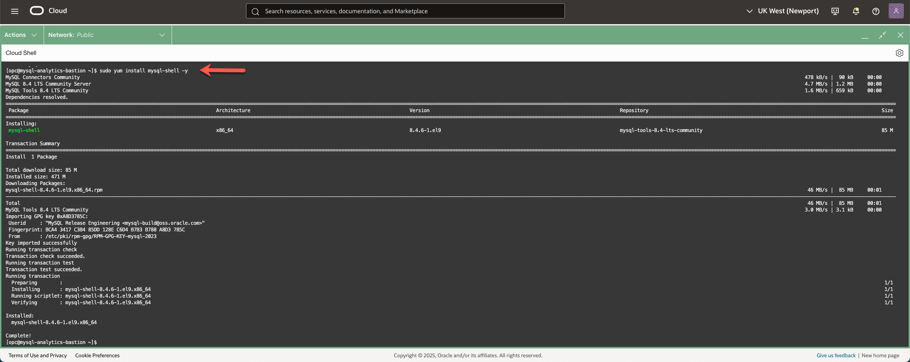

## Task 3: Connect to MySQL Shell and configure the External Table

1. First, get obtain the private IP address of the MySQL database. You can get this by going to "Databases", "DB Systems", "mysql-lakehouse", "Connections" and then copy the private IP address.

  

2. In your Cloud shell, login to MySQL shell. The following assumes that you already have an SSH session to the Bastion instance open (if not go back to the Task 2, Step 5). 

    First edit the following to insert the correct password and the private IP of the MySQL database, then run this on your Cloud Shell.

	```
	<copy>
	mysqlsh --user=admin --password=<your password> --host=<your private IP of MySQL DB> --port=3306 --sql
	</copy>
	```

  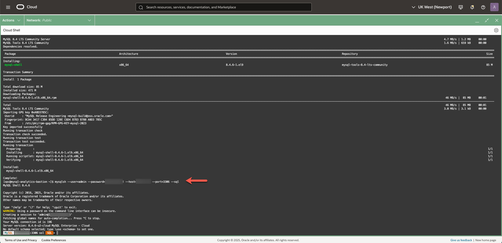

3. Create the database by typing the following in MySQL Shell.

	```
	<copy>
	create database SAILGP;
	</copy>
	```

	> **Important:** MySQL is case-sensitive on Linux systems. In this Hands-On-Lab we have chosen to use **uppercase** for database and table names. Please make sure you always type database and table names using the same case.

4. Use the database.

	```
	<copy>
	use SAILGP;
	</copy>
	```

5. The following command defines the External Table to access the SailGP data. **First modify it with your unique Pre-Authenticated Request as indicated**. Then, execute it.

	```
	<copy>
CREATE TABLE SAILGP.SAILGP_SGP_STRM_PIVOT(
    TIME_GRP int NOT NULL,
    B_NAME varchar(9) NOT NULL,
    LENGTH_RH_BOW_MM FLOAT,
    LENGTH_RH_P_MM FLOAT,
    LENGTH_RH_S_MM FLOAT,
    TWA_SGP_DEG FLOAT,
    TWS_MHU_TM_KM_H_1 FLOAT,
    BDE_BOAT_RACE_STATUS_UNK FLOAT,
    HEADING_DEG FLOAT,
    DB_STOW_STATE_P_UNK FLOAT,
    DB_STOW_STATE_S_UNK FLOAT,
    ANGLE_PILOT_P_R_DEG FLOAT,
    ANGLE_DB_CANT_P_DEG FLOAT,
    ANGLE_RUDDER_OFFSET_DEG FLOAT,
    ANGLE_RUDDER_DEG FLOAT,
    ANGLE_FLAP_4_TWIST_DEG FLOAT,
    ANGLE_FLAP_1_TWIST_DEG FLOAT,
    ANGLE_CA1_DEG FLOAT,
    ANGLE_JORAL_P_L_DEG FLOAT,
    ANGLE_CA5_DEG FLOAT,
    ANGLE_CA6_DEG FLOAT,
    ANGLE_FLAP_2_TWIST_DEG FLOAT,
    ANGLE_RUD_RAKE_P_DEG FLOAT,
    ANGLE_DB_RAKE_P_TARG_DEG FLOAT,
    ANGLE_DB_CANT_S_DEG FLOAT,
    ANGLE_RUD_AVG_DEG FLOAT,
    ANGLE_RUD_DIFF_TACK_DEG FLOAT,
    ANGLE_CA1_TARG_DEG FLOAT,
    ANGLE_RUD_DIFF_DEG FLOAT,
    ANGLE_CA4_TARG_DEG FLOAT,
    ANGLE_FLAP_3_TWIST_DEG FLOAT,
    ANGLE_JORAL_S_R_DEG FLOAT,
    ANGLE_DB_RAKE_S_DEG FLOAT,
    ANGLE_CA5_TARG_DEG FLOAT,
    ANGLE_DB_RAKE_S_TARG_DEG FLOAT,
    ANGLE_WING_TWIST_ABS_DEG FLOAT,
    ANGLE_CA2_DEG FLOAT,
    ANGLE_WING_TWIST_DEG FLOAT,
    ANGLE_RUD_RAKE_P_TARG_DEG FLOAT,
    ANGLE_CA6_TARG_DEG FLOAT,
    ANGLE_DB_RAKE_LIM_DEG FLOAT,
    ANGLE_CA4_DEG FLOAT,
    ANGLE_JORAL_S_L_DEG FLOAT,
    ANGLE_PILOT_P_L_DEG FLOAT,
    ANGLE_PILOT_S_R_DEG FLOAT,
    ANGLE_RUD_RAKE_S_TARG_DEG FLOAT,
    ANGLE_FLAP_5_TWIST_DEG FLOAT,
    ANGLE_JORAL_P_R_DEG FLOAT,
    ANGLE_DB_RAKE_S_AOA_DEG FLOAT,
    ANGLE_CA2_TARG_DEG FLOAT,
    ANGLE_WING_ROT_DEG FLOAT,
    ANGLE_PILOT_S_L_DEG FLOAT,
    ANGLE_DB_RAKE_P_DEG FLOAT,
    ANGLE_RUD_RAKE_S_DEG FLOAT,
    ANGLE_DB_RAKE_P_AOA_DEG FLOAT,
    ANGLE_CA3_TARG_DEG FLOAT,
    ANGLE_CA3_DEG FLOAT,
    PK VARCHAR(20) NOT NULL PRIMARY KEY,
    TIME_SAILED FLOAT,
    BOAT_SPEED_KNOTS FLOAT,
    FOILING VARCHAR(3),
    TIME_FOILING FLOAT,
    MANEUVER VARCHAR(1),
    MANEUVER_ID VARCHAR(20) NULL DEFAULT '-',
    TIME_IN_MANEUVER FLOAT NULL DEFAULT 0,
    LATITUDE FLOAT,
    LONGITUDE FLOAT,
    BDE_LEG_NUM_UNK FLOAT
) ENGINE=lakehouse SECONDARY_ENGINE=rapid ENGINE_ATTRIBUTE='{
	"file": [{
		"par": "<Your Pre-Authenticated Request>"
	}],
	"dialect": {
		"format": "csv",
		"field_delimiter": ",",
		"record_delimiter": "\\n",
                "skip_rows": 1
	}
}';
	</copy>
	```

    You will see the following result:
   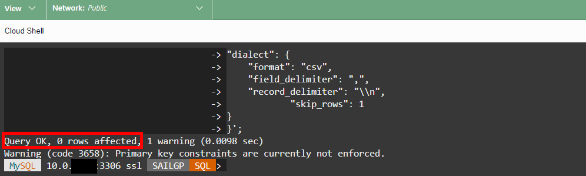

6. Until now, we've only told HeatWave where to find the data for the External Table. Next, we actually will instruct HeatWave to start loading the data from the CSV file.

	```
	<copy>
    ALTER TABLE SAILGP_SGP_STRM_PIVOT SECONDARY_LOAD;
	</copy>
	```

    You will see the following result:
   

Well done, you can now proceed to the next lab!

## Acknowledgements
- **Author** - Jeroen Kloosterman - Technology Product Strategy Director
- **Contributors** - Priscila Iruela - Technology Product Strategy Director, Victor Martin - Technology Product Strategy Manager, Rawan Aboukoura - Technology Product Strategy Manager
- **Last Updated By/Date** - Jeroen Kloosterman - Technology Product Strategy Director
