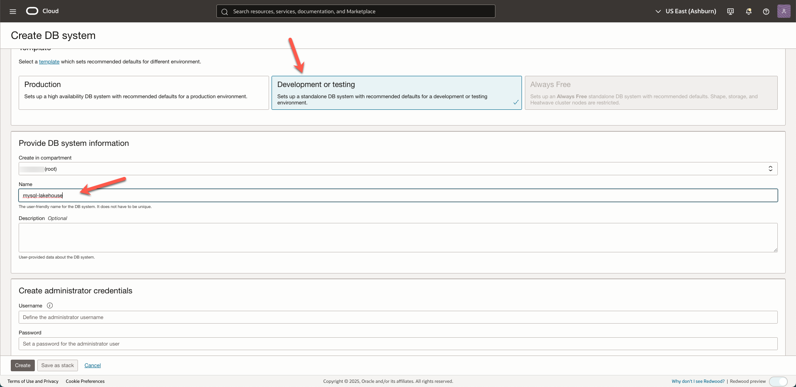
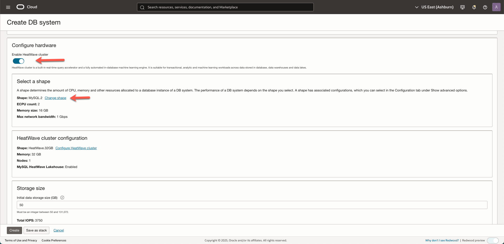
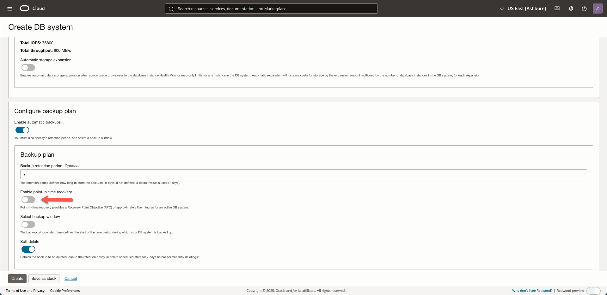
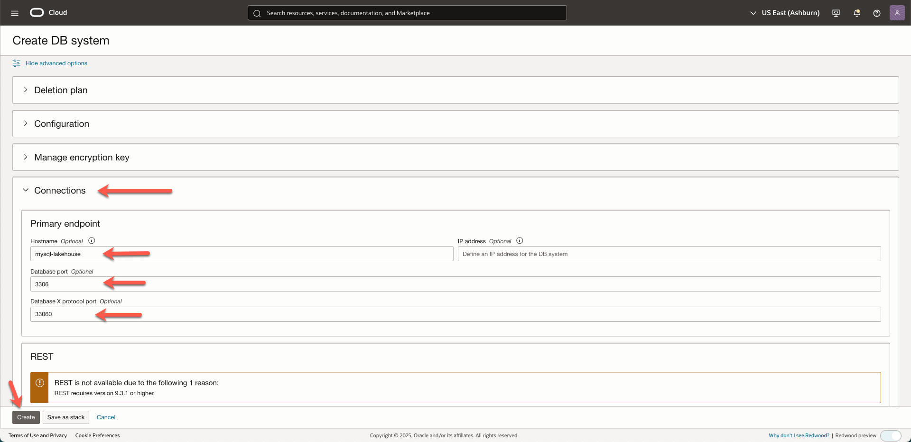
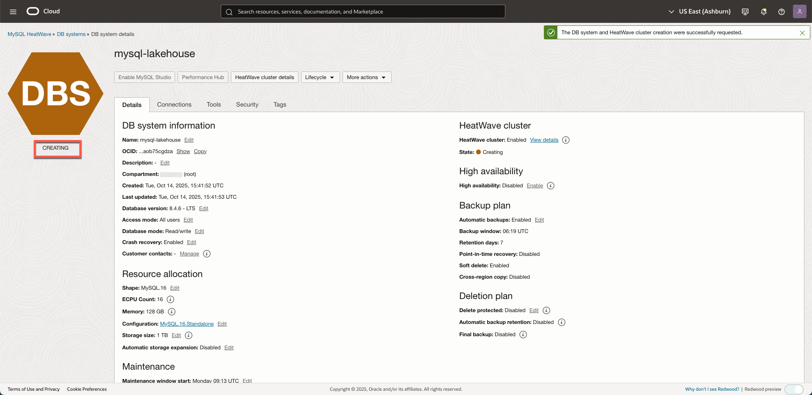

# Infrastructure Configuration

## Introduction

In this lab you will prepare the infrastructure that you need to run the rest of the workshop. We will create/configure the following elements: A Virtual Cloud Network, the MySQL Database, the HeatWave  Cluster, a Bastion host, Oracle Analytics Cloud and a Private Access Channel.

Estimated Time: 60 minutes

### Objectives

In this lab, you will:

- Create a VCN (Virtual Cloud Network) which helps you define your own data center network topology inside the Oracle Cloud.
- Create the MySQL Database itself.
- Create Bastion host. This is a small compute instance that will help us access the private network (with the MySQL Database) from the internet.
- Create Oracle Analytics Cloud. We will use this to create visual analysis of the data.
- Set up a Private Access Channel. This will allow OAC access to the MySQL database service.

### Prerequisites

- Oracle Free Trial Account.
  
[Lab 1 Demo](youtube:W4JaHA-Fzp8)

## Task 1: Create a Virtual Cloud Network and allow traffic through MySQL Database Service port

1. Login to your OCI tenancy. From the _**Navigation menu**_, select _**Networking > Virtual cloud networks**_.

  

2. Select your compartment from the list, and click _**Start VCN Wizard**_.

    > **Note:** If you have not selected a compartment, you can select the root compartment which was created by default when you created your tenancy (ie when you registered for the trial account). It is possible to create everything in the root compartment, but Oracle recommends that you create sub-compartments to help manage your resources more efficiently.

  

3. Select _**Create VCN with Internet Connectivity**_ and click _**Start VCN Wizard**_.

  

4. In the _**VCN name**_ field enter the value, 
  **`lakehouse-vcn`**, (or any name at your convenience), and make sure that the selected compartment is the right one. Leave the default settings, and click _**Next**_.

  

5. Review the information and click _**Create**_.

  

6. Once the VCN is created, under _**Subnets**_, click _**`private subnet-lakehouse-vcn`**_. 

  

7. Customize the default security list of the VCN to allow traffic through MySQL Database Service ports by clicking _**`security list for private subnet-lakehouse-vcn`**_.

  

8. Under _**Security rules**_, click _**Add Ingress Rules**_.

  

9. Add the necessary rule to the default security list to enable traffic through MySQL HeatWave Service port, and click _**Add Ingress Rules**_.

	```  
	Source CIDR:  <copy> 0.0.0.0/0 </copy>
	```
	```  
	Destination Port Range: <copy>3306,33060</copy>
	```
	```  
	Description:  <copy> MySQL Port </copy>
	```
	
  

## Task 2: Create MySQL Database

1. From the console, click _**Navigation menu > Databases > DB Systems**_.
    
  

2. Click _**Create DB System**_. 

   Since this is for experimentation, choose _**Development or testing**_. 

   Check the compartment, it should be the same as the compartment you created the VCN, and assign a name to the DB System:

    ```
    <copy>mysql-lakehouse</copy>
    ```
   
    

3. In the _**Create administrator credentials**_ section enter the username and choose a password, but make sure to note it as you will use it later:
    
    ```
    username: <copy>admin</copy>
	```	
  	```
    password: <copy>**PASSWORD**</copy>
    ```

4. In the _**Setup**_, select _**Standalone**_.

5. In _**Configure networking**_, make sure you select the same VCN, _**`lakehouse-vcn`**_, and the private subnet, _**`private subnet-lakehouse-vcn (Regional)`**_.

      


6. Confirm that in the _**Configure hardware**_ section, _**Enable HeatWave cluster**_ is enabled. Change the MySQL shape to **MySQL.16**.

  

7. Click _**Configure HeatWave cluster**_, and then click _**Change shape**_.

8. Select _**HeatWave.512GB**_, and click _**Select a shape**_.

  
 
 9. Update the Nodes to **2**.

  

  10. Update the _**Initial data storae size (GB)**_ to **1024**.

   

7. In the _**Configure backup plan**_ section leave the default backup window of **7** days. Disable _**Enable point-in-time recovery**_.

  

8. Scroll down and click on _**Show advanced options**_. 
    
  

9. Go to the _**Connections**_ tab, and enter the following:
    
  Hostname: **mysql-lakehouse**
		
	MySQL Port: **3306**

	MySQL X Protocol Port: **33060**

	Once done, click _**Create**_.

	

10. The MySQL DB System will be in _**CREATING**_ state. 
    
  	

## Task 3: Create an Oracle Analytics Cloud instance

In this task we will create an Oracle Analytics Cloud instance.

1. From the home page, click the _**Navigation menu**_ and click _**Analytics & AI > Analytics Cloud**_.

  

2. Click _**Create instance**_.

  

3. Enter/select the following details, and click _**Create**_.

   - Name: **SailGPMySQL**
   - Create in Compartment: Verify that the compartment is the same as the one you select for MySQL
   - Capacity Type: **OCPU**
   - OCPU Count: **2**
   - License Type: **License Included**
   - Edition: **Enterprise Edition**

  

4. It takes anywhere between 10-35 minutes to create the OAC instance. **Please proceed to the next task in the meantime**

  

## Task 4: Create a Bastion Host compute instance

By default, MySQL HeatWave on OCI is only accessible through private networks. This keeps it siloed away from the internet to help protect your data from potential attacks and vulnerabilities. 

To connect to MySQL, you have to create a Compute Instance, also known as a Bastion Host. This Bastion Host sits between the private resource and the endpoint which requires access to the private network and can act as a “jump box”.

FYI, once we have created the Bastion Host, accessing will be a two-step process: 1) Login to the Bastion Host and 2) From the Bastion Host, connect with MySQL (through MySQL Shell).

Now, let's create the Bastion Host.

1. From the _**Navigation menu**_, select _**Compute > Instances**_.
    
  

2. Select the same compartment where you created the VCN. Click _**Create instance**_.

  

3. In the **Name** field, insert _**mysql-analytics-bastion**_ (or any other name at your convenience). This name will be used also as internal FQDN. 
  	
	For the scope of this workshop leave _**Placement**_  as default.

  

4. Click _**Next**_, and then _**Next**_ again to see the _**Networking**_ section. Check that your previously created _**VCN**_ is selected, and select your public subnet _**`public subnet-lakehouse-vcn (regional)`**_ from the dropdown menu.
    
  

5. Scroll down and under _**Add SSH keys**_, select _**Generate a key pair for me**_, and click _**Download private key**_. You will use it to connect to the compute instance later on.
  Once done, click _**Next**_ and then _**Create**_.

  

5. Once the compute instance is up and running, you will see the icon turning green. However, you can proceed to the next **Task** until the provisioning is done.
    
  

  Well done, you can now proceed to the next lab!

## Task 5: Configure Private Access Channel - OAC

This task is necessary so that Oracle Analytics Cloud can access the data of MySQL HeatWave, that's connected to the private network.

1. From the home page, click the _**Navigation menu**_ and click _**Analytics & AI > Analytics Cloud**_.

  

2. By now the status of the instance should have changed to _Active_. 

   

3. Click on the instance _**SailGPMySQL**_ to go to the _**Instance Details**_ page.

   Under _**Private Access Channel**_, click _**Configure Private Access Channel**_ to create a private access to the MySQL HeatWave Service instance.

   

4. In _**Configure Private Access Channel**_, fill the name. Then, choose the VCN created earlier, _**`lakehouse-vcn`**_, and make sure you select the correct subnet, _**`Public Subnet-lakehouse-vcn`**_, otherwise you won't be able to connect!
   
5. Check _**Virtual Cloud Network's domain name as DNS zone**_, and remove the additional _**DNS Zone**_, using the X icon on the right side of the DNS Zone section, and finally click _**Configure**_.  

   	> **Note:** It will take up to _**50 minutes**_ to create the private channel. In the meantime you can go ahead and work on the next lab.

   	

   Well done, you can now proceed to the next lab!

## Acknowledgements
- **Author** - Jeroen Kloosterman - Technology Product Strategy Director
- **Contributors** - Priscila Iruela - Technology Product Strategy Director, Victor Martin - Technology Product Strategy Manager, Rawan Aboukoura - Technology Product Strategy Manager
- **Last Updated By/Date** - Aijaz Fatima, Product Manager, Oct 2025 
