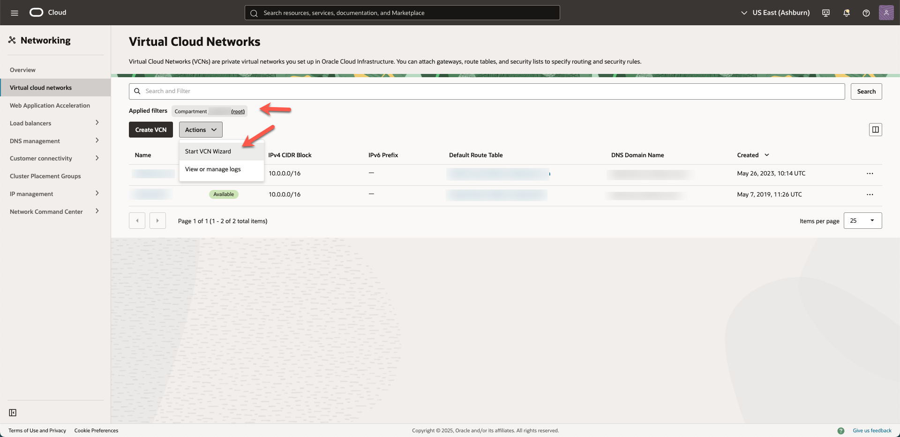
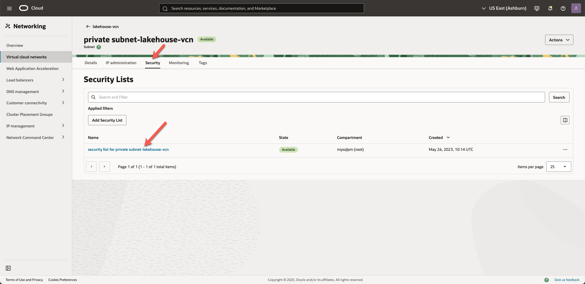
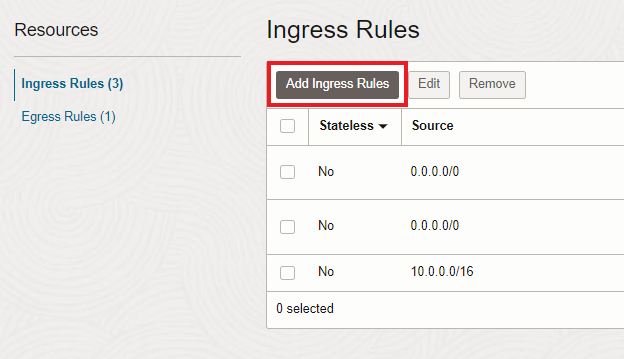
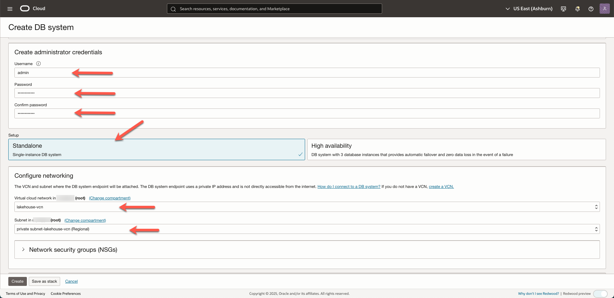
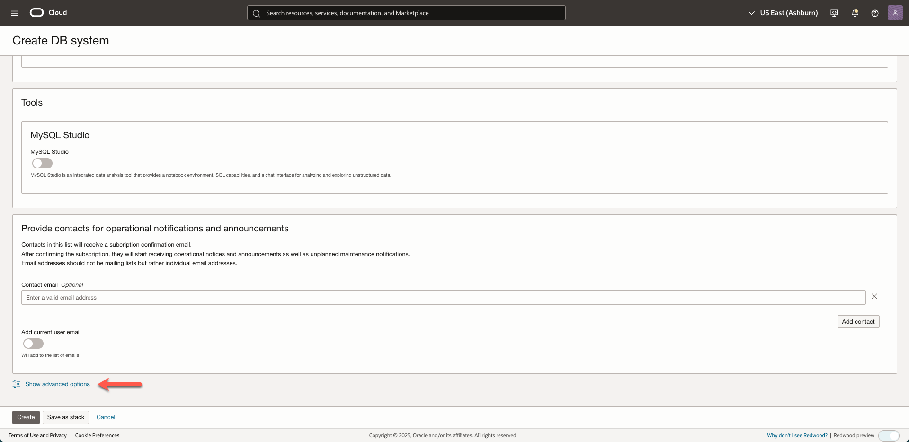
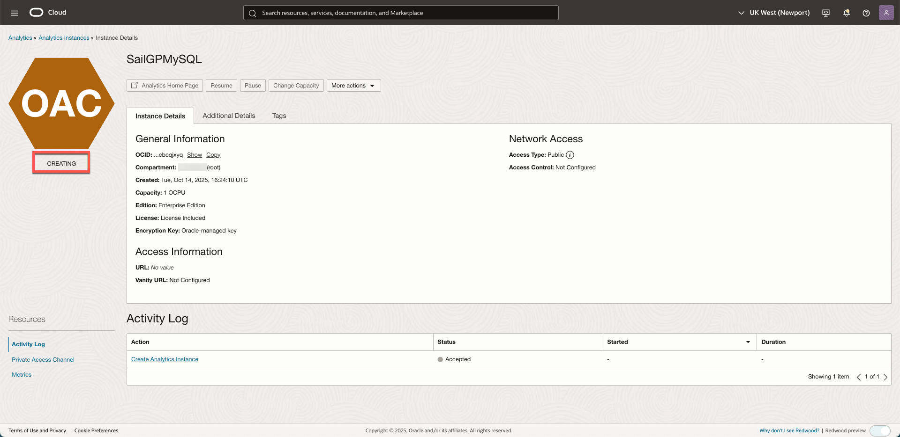
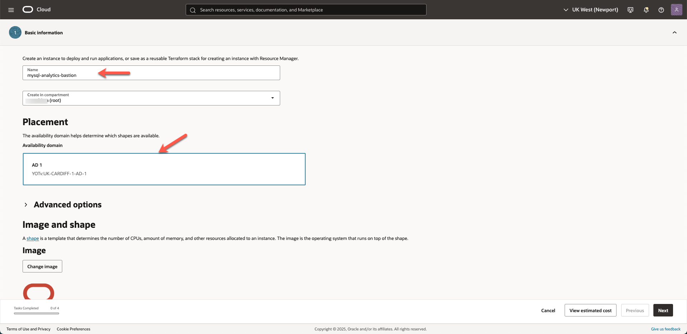
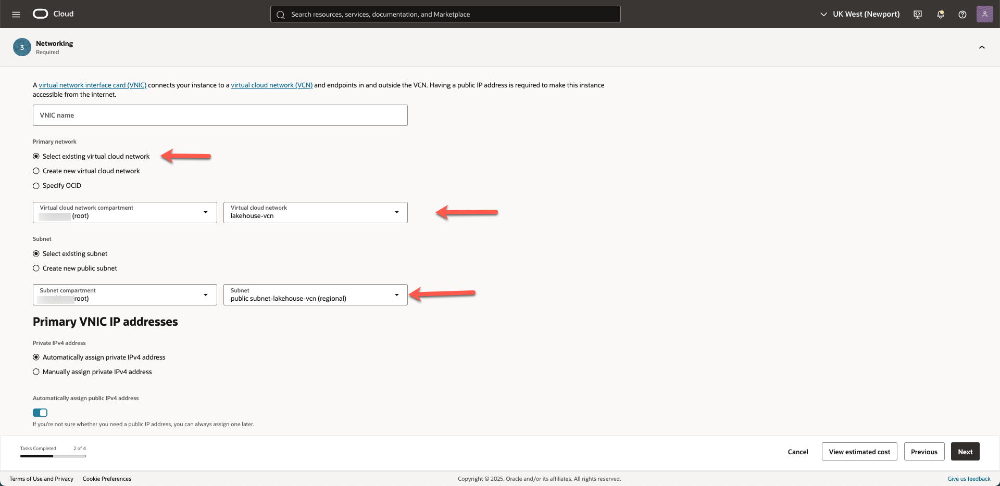
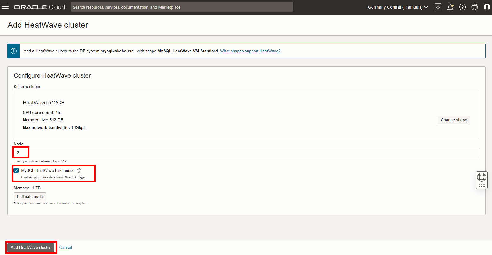

# Infrastructure Configuration

## Introduction

In this lab you will prepare the infrastructure that you need to run the rest of the workshop. We will create/configure the following elements: A Virtual Cloud Network, the MySQL Database, the HeatWave Lakehouse Cluster, a Bastion host, Oracle Analytics Cloud and a Private Access Channel.

Estimated Time: 60 minutes

### Objectives

In this lab, you will:

- Create a VCN (Virtual Cloud Network) which helps you define your own data center network topology inside the Oracle Cloud.
- Create the MySQL Database itself.
- Add the HeatWave Lakehouse Cluster.
- Create Bastion host. This is a small compute instance that will help us access the private network (with the MySQL Database) from the internet.
- Create Oracle Analytics Cloud. We will use this to create visual analysis of the data.
- Set up a Private Access Channel. This will allow OAC access to the MySQL database service.

### Prerequisites

- Oracle Free Trial Account.
  
[Lab 1 Demo](youtube:W4JaHA-Fzp8)

## Task 1: Create a Virtual Cloud Network and allow traffic through MySQL Database Service port

1. Log-in to your OCI tenancy. Once you have logged-in, select _**Networking >> Virtual Cloud Networks**_ from the _**menu icon**_ on the top left corner.

  

2. From the Compartment picker on the bottom left side, select your compartment from the list.

    > **Note:** If you have not picked a compartment, you can pick the root compartment which was created by default when you created your tenancy (ie when you registered for the trial account). It is possible to create everything in the root compartment, but Oracle recommends that you create sub-compartments to help manage your resources more efficiently.

  

3. To create a virtual cloud network, click on _**Start VCN Wizard**_.
    
  

4. Create _**VCN with Internet Connectivity**_ and click _**Start VCN Wizard**_.

  

5. Now you need to complete some information and set the configuration for the VCN. In the _**VCN Name**_ field enter the value 
  **`lakehouse_vcn`** (or any name at your convenience), and make sure that the selected compartment is the right one. Leave all the rest as per default, Click _**Next**_.

  

6. Review the information showed is correct and click _**Create**_.

  

7. Once the VCN will be created click _**View Virtual Cloud Network**_.

  

8. Click on the _**`private subnet-lakehouse_vcn`**_. 

  

9. Earlier we set up the subnet to use the VCN's default security list, that has default rules, which are designed to make it easy to get started with Oracle Cloud Infrastructure. 
   Now we will customize the default security list of the VCN to allow traffic through MySQL Database Service ports by clicking on  _**`Security List for private subnet-lakehouse_vcn`**_.

  

10. Click on _**Add Ingress Rules**_.

  

11. Add the necessary rule to the default security list to enable traffic through MySQL Database Service port. 

  Insert the details as below:
	```  
	Source CIDR:  <copy> 0.0.0.0/0 </copy>
	```
	```  
	Destination Port Range: <copy>3306,33060</copy>
	```
	```  
	Description:  <copy> MySQL Port </copy>
	```
	At the end click the blue button _**Add Ingress Rules**_.

  

## Task 2: Create MySQL Database

1. From the console main menu on the left side select _**Databases >> DB Systems**_.
    
  

2. Start creating the DB System. 

   Check the compartment, it should be the same as the compartment you created the network (VCN) in, and assign to the DB System the name:

   ```
   <copy>mysql-lakehouse</copy>
   ```
   
  

3. Select the Standalone option and the HeatWave box, this will allow to create a MySQL DB System which will be HeatWave-ready. 
    
  

4. In the _**Create Administrator Credentials**_ section enter the username and choose a password of your own, but make sure to note it as you will be using it later through the workshop:
    
    ```
    username: <copy>admin</copy>
	```	
  	```
    password: <copy>**PASSWORD**</copy>
    ```
	- In the _**Configure Networking**_ section make sure you select the same VCN, _**`lakehouse_vcn`**_ you have used to create the Compute Instance but for MySQL you will use a different subnet, the private one called _**`private subnet-lakehouse_vcn (Regional)`**_.

	- Leave the default availability domain and proceed to the _**Configure Hardware**_ section.
   
    

4. Confirm that in the _**Configure Hardware**_ section, the selected shape is **MySQL.HeatWave.VM.Standard.E3**, CPU Core Count: **16**, Memory Size: **512 GB**, Data Storage Size: **1024**.

  

5. In the _**Configure Backup**_ section leave the default backup window of **7** days. **UNCHECK** the Enable point in time restore option.

  

5. Scroll down and click on _**Show Advanced Options**_. 
    
  

  	- Go to the Connections tab, in the Hostname field enter (same as DB System Name):
		```
		<copy>mysql-lakehouse</copy> 
		```
		Check that port configuration corresponds to the following:


		MySQL Port: **3306**

		MySQL X Protocol Port: **33060**

		Once done, click the _**Create**_ button.

		


  	- The MySQL DB System will have _**CREATING**_ state (as per picture below). 
    
  	

## Task 3: Create an Oracle Analytics Cloud instance

In this task we will create an Oracle Analytics Cloud instance.

1. Go to main page click the _**hamburger menu**_ in the upper left corner and click on _**Analytics & AI -> Analytics Cloud**_.

  


2. Click _**Create instance**_ and in the new window, fill out the fields as shown in the image below. Verify that the compartment is the same as the one you select for MySQL.
Make sure to select 2 OCPUs, the Enterprise version and the _**License Included**_ button. Finally click _**Create**_ to start the provisioning of the instance.

  	

  	```
    Name: <copy>SailGPMySQL</copy>
  	```
  	```
    OCPU: 2
  	```	
  	```
    License Type: License Included
  	```
  	```
    Edition: Enterprise Edition
  	```

  

  	> **Note:** It takes anywhere between 10-35 minutes to create the OAC instance. **Please proceed to the next task in the meantime**.

## Task 4: Create a Bastion Host compute instance

By default, MySQL HeatWave on OCI is only accessible through private networks. This keeps it siloed away from the internet to help protect your data from potential attacks and vulnerabilities. 

To connect to MySQL, you have to create a Compute Instance, also known as a Bastion Host. This Bastion Host sits between the private resource and the endpoint which requires access to the private network and can act as a “jump box”.

FYI, once we have created the Bastion Host, accessing will be a two-step process: 1) Login to the Bastion Host and 2) From the Bastion Host, connect with MySQL (through MySQL Shell).

Now, let's create the Bastion Host.

1. From the main menu on the top left corner select _**Compute >> Instances**_.
    
  

2. In the compartment selector on the bottom left corner, select the same compartment where you created the VCN. Click on the _**Create Instance**_ blue button to create the compute instance.

  

3. In the **Name** field, insert _**mysql-analytics-bastion**_ (or any other name at your convenience). This name will be used also as internal FQDN. 
  	
	The _**Placement and Hardware section**_ is the section where you can change Availability Domain, Fault Domain, Image to be used, and Shape of resources. For the scope of this workshop leave everything as default.

  

  	As you scroll down you can see the **Networking** section, check that your previously created **VCN** is selected, and select your PUBLIC subnet _**`public subnet-lakehouse_vcn (regional)`**_ from the dropdown menu.
    
  

4. Scroll down and **MAKE SURE TO DOWNLOAD** the proposed private key. 
  You will use it to connect to the compute instance later on.
  Once done, click _**Create**_.

  

5. Once the compute instance will be up and running, you will see the square icon on the left turning green. However, you can proceed to the next **Task** until the provisioning is done.
    
  

  Well done, you can now proceed to the next lab!

## Task 5: Enable the HeatWave cluster (with Lakehouse option)

HeatWave is an in-memory query accelerator developed for Oracle MySQL Database Service. It's a massively parallel, hybrid, columnar, query-processing engine with state-of-art algorithms for distributed query processing which provide very high performance for queries.

In this task, we will Enable the HeatWave option on our MySQL database.

1. In the OCI Console, go back to the MySQL Database by clicking on "Databases", "DB Systems" and "mysql-lakehouse".

2. On the left bottom of the screen, select HeatWave, then click "Add HeatWave cluster".

  

3. Check that Shape looks as per picture below, make sure that Node Count is set to 2, **select the MySQL HeatWave Lakehouse** option and then click the button _**Add HeatWave Cluster**_.

   

   Adding the HeatWave option typically takes about 10 minutes, upon which the status will become _**Active**_.

   

## Task 6: Configure Private Access Channel - OAC

This task is necessary so that Oracle Analytics Cloud can access the data of MySQL HeatWave, that's connected to the private network.

1. Back to the Analytics Cloud from _**hamburger menu**_ in the upper left corner and click on _**Analytics & AI -> Analytics Cloud**_ by now the status of the instance should have changed to _Active_. 

   

   Click on the instance _**SailGPMySQL**_ to go to the details page.

   Click on the button _**Configure Private Access Channel**_ under the Private Access Channel section to create a private access to the MySQL Database Service Instance.

   

2. In the next window you first need to fill the name for the channel **PrivateChannel**. Then, choose the VCN created earlier **`analytics_vcn_test`**, and make sure you select the correct subnet, **`Public Subnet-analytics_vcn_test`**, otherwise you won't be able to connect!
   
    Check _**Virtual Cloud Network's domain name as DNS zone**_, and remove the additional _**DNS Zone**_, using the X icon on the right side of the DNS Zone section, and finally click _**Configure**_.  

   	> **Note:** It will take up to _**50 minutes**_ to create the private channel. In the meantime you can go ahead and work on the next lab.

   	

   Well done, you can now proceed to the next lab!

## Acknowledgements
- **Author** - Jeroen Kloosterman - Technology Product Strategy Director
- **Contributors** - Priscila Iruela - Technology Product Strategy Director, Victor Martin - Technology Product Strategy Manager, Rawan Aboukoura - Technology Product Strategy Manager
- **Last Updated By/Date** - Jeroen Kloosterman - Technology Product Strategy Director
