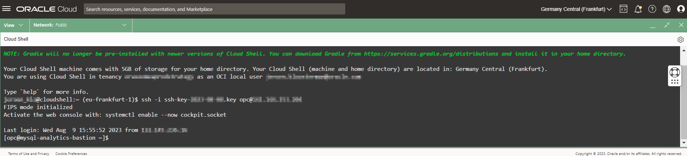
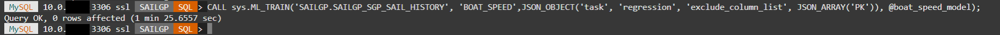
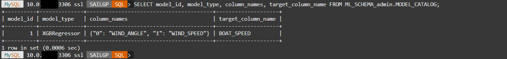
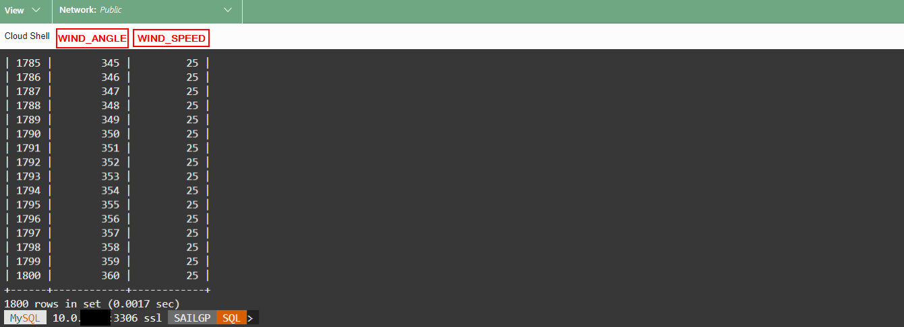
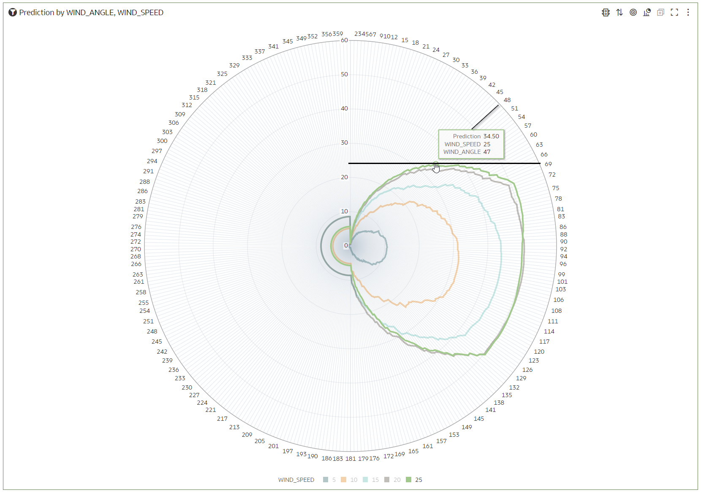

# Machine Learning On SailGP Data: Predicting the best sailing direction

## Introduction

The **AutoML** feature of **MySQL HeatWave** makes building machine learning models simple and quick, by automating many aspects of the machine learning lifecycle. 

We are going to see this technology in action through a very important challenge in sailing: finding the best direction to sail. With the optimal direction, we mean **which angle to the wind the boat must sail** to **obtain the highest boat speed** in the target direction, given a particular wind speed.

In this lab, you will use **MySQL HeatWave** **AutoML** to train a machine learning model that will find the relationship between wind speed, wind angle and boat speed. Once you have the ML model, you will visualize predictions that will help you predict the best sailing direction under all conditions.

_Estimated Time:_ 30 minutes


### Objectives

In this lab, you will:
- Learn basic machine learning principles, which you can apply to a myriad of (business) problems.
- Learn how you can perform machine learning in MySQL HeatWave, and analyze the results in Oracle Analytics Cloud, without having to be a data science expert!

### Prerequisites
This lab assumes you have completed the previous labs.

## Task 1: Plan your approach

For this case, we will imagine that our **goal is to try to sail upwind** (into the direction of the source of the wind) as fast as possible. Different angles result in different boat speeds, for example:
- Going directly upwind with angle 0 (straight into the wind) is not possible at all.
- Taking a wide angle of 60+ degrees (e.g. "Wind angle 2") will result in a high boat speed, but it will not bring us to our target as quickly as possible (going vertically "up").
- Taking a less wide angle (e.g. "Wind angle 1") will result in a less high boat speed, but may actually bring us to our target faster.

Therefore, there is an optimal wind angle, and it is up to us to find it. However, this is not so easy; every boat has its own characteristics and responds with a different speed to the wind angle and wind speed in a non-linear way. There's a complex relationship between these variables!


We will attack the problem in two phases:

1) Predict the actual boat speed (green) based on wind speed (red) and wind angle (blue). We will use machine learning to do this.

2) Decompose the boat speed and extract its "vertical" component (purple) towards the wind. This is the speed we're finally interested in. It's nice for the boat to go fast, but only the vertical speed (up towards the wind) is what counts.

## Task 2: Upload the data relevant for the Machine Learning exercise

1. Open cloud shell.
  
  	To access cloud shell, click on the shell icon next to the name of the OCI region, on the top right corner of the page.

  

2. In order to establish an ssh connection with the bastion host using the Public IP, execute the following command in your Cloud Shell (first replace where indicated with the actual key filename and the public IP address of the Bastion compute instance):

   **Refer to the Lab 2/Task 2 if you don't remember how to find the Public IP of the Bastion Host.**

	```
	<copy>
	ssh -i <private-key-file-name>.key opc@<compute_instance_public_ip>
	</copy>
	```
  	

3. In your Cloud shell, login to MySQL shell. First edit the following to insert the correct password and the private IP of the MySQL database, then run this on your Cloud Shell.

    **Refer to Lab 2/Task 3 if you don't remember how to obtain the Private IP of your MySQL DB.**

	```
	<copy>
	mysqlsh --user=admin --password=<your password> --host=<your private IP of MySQL DB> --port=3306 --sql
	</copy>
	```

  

5. Choose the SAILGP database. In this Hands-On-Lab we have chosen to use uppercase for database and table names.

	```
	<copy>
   use SAILGP;
   </copy>
	```

  

6. Create the placeholder tables that will hold the data (for now, they're empty).

   **Note: At the time of writing, Machine Learning is not yet available on the DataLake (on Object Storage), therefore we will load the data into normal MySQL tables.**

	```
	<copy>
CREATE TABLE SAILGP_SGP_SAIL_HISTORY (
  PK INT NOT NULL PRIMARY KEY,
  WIND_ANGLE FLOAT,
  WIND_SPEED FLOAT,
  BOAT_SPEED FLOAT
);
CREATE TABLE SAILGP_SGP_WINDSPEED_AND_WINDANGLES (
  PK INT NOT NULL PRIMARY KEY,
  WIND_ANGLE FLOAT,
  WIND_SPEED FLOAT
);
	</copy>
	```

  

7. Leave the SQL Shell session by pressing Ctrl-D.

  

8. Download the data to the Bastion server using wget.

   You should see that both files are downloaded successfully.

	```
	<copy>
wget https://objectstorage.eu-frankfurt-1.oraclecloud.com/p/3SXFHx0G3hdgxhqZbmCZ8fUbKHwQogOidDk-IHBa87rf8bCK4iHEUV-i45pXbvi-/n/fruktknlrefu/b/workshop-sailgp/o/sailgp_sgp_sail_history.csv
wget https://objectstorage.eu-frankfurt-1.oraclecloud.com/p/pFyfBL7qRYh9jY9iqnK34RBLF-SSiyHyBZGaIU04Sw3MT8hYaS4zLMZSnulv19L8/n/fruktknlrefu/b/workshop-sailgp/o/sailgp_sgp_windspeed_and_windangles.csv
	</copy>
	```

9. Reopen MySQL Shell, this time in Python mode. This will allow us to import data.As before, First edit the following to insert the correct password and the private IP of the MySQL database, then run this on your Cloud Shell.

    **Notice the --py parameter.**

	```
	<copy>
	mysqlsh --user=admin --password=<your password> --host=<your private IP of MySQL DB> --port=3306 --py
	</copy>
	```

  

10. Finally, import the download CSV files into the placeholder tables.

	```
	<copy>
util.import_table("/home/opc/sailgp_sgp_windspeed_and_windangles.csv", {"schema": "SAILGP", "table": "SAILGP_SGP_WINDSPEED_AND_WINDANGLES", "dialect": "csv-unix", "skipRows": 1, "showProgress": True})
util.import_table("/home/opc/sailgp_sgp_sail_history.csv", {"schema": "SAILGP", "table": "SAILGP_SGP_SAIL_HISTORY", "dialect": "csv-unix", "skipRows": 1, "showProgress": True})
	</copy>
	```

  

## Task 3: Explore the data (Prepare for Machine Learning)

In the past we've gone onto the water with our boat many times in different wind conditions, and we've measured wind speed, wind angle and the resulting boat speed. This has resulted in a data set with many measurements. Let's examine this data to see what we can learn from it.

1. Open Oracle Analytics Cloud. In the **Oracle Cloud Infrastructure console** click on the menu icon on the left. Navigate to **Analytics & AI** and then **Analytics Cloud**.

   

2. **Open** the Cloud Analytics **URL** associated with your instance (the one that we created in Lab 2) by using the dots menu button on the right-hand side of your instance information and selecting **Analytics Home Page**.

   

   The **Oracle Analytics** page will open in a new browser **window/tab**.

3. Let's have a look at our measurements.

   **Create** a new **Data Set**.

   

4. Select our database connection, `SAILGP`.

   

5. **Double click** the `SGP_SAIL_HISTORY` table in the `SAILOR` schema.

   

   Here you see the results of the measurements of our past trips with the boat; every measurement is a combinations of wind speed, wind angle and resulting boat speed.

6. Open the contents of the table by clicking on `SGP_SAIL_HISTORY` at the bottom of the screen.

   

7. Click on the PK column (this holds a simple counter for each measurement). On the bottom left of the screen, change **Treat As** to **Attribute**.

   

8. **Save** the Data Set and name it `Sail History`. Click **OK**.

   

9. From the **Home Page**. Click **Create Workbook** and select the **Sail History** data set that you created earlier.

   

10. Select the `PK`, `WIND_SPEED` and `BOAT_SPEED` columns (use control-click) and drag them to the canvas to create a new visualization.

   

   Conclusion: There appears to be some correlation between wind speed and boat speed, as you would expect. But it's not just a simple straight line!

   

11. Create a new visualization from `PK`, `WIND_ANGLE` and `BOAT_SPEED` and drag it to just above the original chart (the area will be highlighted in blue).

   

   Conclusion: There also appears to be a relationship between `WIND_ANGLE` and `BOAT_SPEED` as well. There's a clear concentration of points in the top of the chart. However, there are also many points further down.

   

12. Drag the `WIND_SPEED` to the **Color** component. With this we're trying to visualize the relationship between all three variables.

   

   Conclusion: We see correlation between wind speed, wind angle and boat speed. However, it's very difficult to find the exact relationship. As mentioned before, the relationship between wind speed, wind angle and boat speed is **non linear**.

   On top of that, it's fair to assume that there will be some amount of error in our readings, it's notoriously difficult to measure things like wind speed and wind angle accurately.

   These things together makes it pretty hard for us, human beings, to find these relationships.

   But luckily for us, Machine Learning is great at extracting these type of patterns! It is able to cut through the noise and find relationships between variables!

13. Finally, save the workbook as "Explore Boat Speed Factors".

   

## Task 4: Build the Machine Learning model

1. Assuming that you have your Cloud shell open and that you have connected to the Bastion compute instance, login to MySQL shell. 

    As before, first edit the following to insert the correct password and the private IP of the MySQL database, then run this on your Cloud Shell.

	```
	<copy>
	mysqlsh --user=admin --password=<your password> --host=<your private IP of MySQL DB> --port=3306 --sql
	</copy>
	```

  

2. Choose the SAILGP database. In this Hands-On-Lab we have chosen to use uppercase for database and table names.

	```
	<copy>
   use SAILGP;
   </copy>
	```

  

3. Now, let's build the Machine Learning model. We will use AutoML to automatically find the best algorithm and configuration. In the following, the first parameter is the table to train on (SAILGP\_SGP\_SAIL\_HISTORY), the second parameter is the target that we want to learn to predict (BOAT\_SPEED), and the third parameter indicates that we want to train on all other columns in the table apart from PK.

   Copy-paste this into the MySQL Shell. The training should take around 1-2 minutes.

	```
	<copy>
CALL sys.ML_TRAIN('SAILGP.SAILGP_SGP_SAIL_HISTORY', 'BOAT_SPEED',JSON_OBJECT('task', 'regression', 'exclude_column_list', JSON_ARRAY('PK')), @boat_speed_model);
	</copy>
	```

  

4. Run the following SQL to double-check that the model has been created.

    Notice how AutoML **automatically** has selected XGBRegressor as the best algorithm for the situation. It is using WIND\_ANGLE and WIND\_SPEED as features to predict BOAT\_SPEED. This is the power of AutoML!

	```
	<copy>
SELECT model_id, model_type, column_names, target_column_name FROM ML_SCHEMA_admin.MODEL_CATALOG;
	</copy>
	```

  

## Task 5: Predict Boat Speed using the model

Now it's time to make predictions with the model. We will make a prediction for a combination of wind speeds (5, 10, 15, 20 and 25 mph) and range of wind angles (0-180 degrees with 1 degree increments).

1. The table SAILGP\_SGP\_WINDSPEED\_AND\_WINDANGLES contains the combination of wind speeds and wind angles for which we want to predict boat speed. Run the following SQL to confirm the contents of the table.

    Notice how there's no Boat Speed in the table yet, we will predict this in the next step!

	```
	<copy>
   select * from SAILGP.SAILGP_SGP_WINDSPEED_AND_WINDANGLES;
	<copy>
	```

  

2. Load the model, so it's ready to make predictions.

	```
	<copy>
   CALL sys.ML_MODEL_LOAD(@boat_speed_model, NULL);
	<copy>
	```

  

3. Run the following command to use the Machine Learning model to predict Boat Speed for all the combinations of wind angle and wind speed as specified in the table.

	```
	<copy>
CALL sys.ML_PREDICT_TABLE('SAILGP.SAILGP_SGP_WINDSPEED_AND_WINDANGLES', @boat_speed_model,'SAILGP.SAILGP_SGP_BOAT_SPEED_PREDICTION',NULL);
	<copy>
	```

  

4. Let's check the contents of the target table SAILGP\_SGP\_BOAT\_SPEED\_PREDICTION. We'll just query the result for one particular wind angle and wind speed combination.

    Notice how the column PREDICTION contains the predicted value, in this case 17.0341.

	```
	<copy>
   select * from SAILGP_SGP_BOAT_SPEED_PREDICTION where WIND_ANGLE=45 and WIND_SPEED=10;
	<copy>
	```

  

## Task 6: Look for insights in the predicted data using Analytics Cloud

1. Add the MySQL table with predictions to Oracle Analytics Cloud. On the OAC Homepage, click "Create" and then "DataSet". 

    

2. Select the MySQL database connection.

    

3. Open "Schemas", "SAILGP" and then double-click on "SAILGP\_SGP\_BOAT\_SPEED\_PREDICTION".

    

4. Set the "Treat As" of WIND\_ANGLE and WIND\_SPEED to "Attribute".

    

5. Save the dataset as "Predicted Boat Speed".

    

6. Press the "Create Workbook" button to start analyzing the data.

    

7. Select `WIND_SPEED`, `WIND_ANGLE` and `Prediction` (control-click for multi-select) and Right Click. Then choose **Pick Visualization** and choose **Line** chart.

    

26. Make sure that the Line Chart is configured as indicated with the red boxes.

    

    > If you see a different chart be sure you have the correct order as showed in the picture.

    Conclusion: We can now see clear patterns in how boat speed changes as a result of wind speed and wind angle. The angles to reach the highest boat speed are different depending on the wind speed. You can ignore the predicted values above 180 degrees, as we didn't have any records in the training set with a WIND\_ANGLE of over 180 degrees.

## Task 7: Extract the Boat Speed towards Our Upwind Target

At this point, we can use the previous chart to pick the best angle to sail to obtain the highest boat speed for a certain wind speed. In other words, what we can now predict is the green line in this diagram, based on wind speed and wind angle.


However, this is not so useful by itself. Remember, what we -really- want to know, is not the absolute boat speed, but the boat speed towards our -goal-, which is going directly upwind in this case. What we want to do now, is to obtain the length of the -purple- line. The sailing term for this is "Velocity Made Good".

Luckily, we can easily do this by converting the chart into a polar diagram.

1. Change the visualization of the chart to **Radar Line**.

   

2. How to read this chart?

   Because of the circular projection, the vertical distance now effectively shows the Velocity Made Good (the speed that we're achieving towards the target).

   

   For example, imagine the current wind speed is 10 knots. This is the orange ellipse. Now find the point that's vertically in the highest position. This point indicates the maximum speed that we can obtain towards our target (upwind). The optimum angle to obtain this is 54 degrees (shown in the popup), the total boat speed will be 21.6 knots (shown in the popup), and the expected boat speed towards the target will be almost 14 knots (vertical axis).

   

   Another example, imagine the current wind speed is 25 knots. This is the green ellipse. Again, find the point that's vertically in the highest position. In this case the highest speed that we can obtain towards our target can be achieved by taking an angle of 47 degrees to the wind (shown in the popup), the total boat speed will be 34.5 knots (shown in the popup), and the expected boat speed towards the target will be around 24 knots (vertical axis).

## Task 8: Draw Conclusions
In this lab we predicted what the boat speed will be based on wind speed and wind angle. We did this by training a ML model directly with **AutoML** in **MySQL HeatWave**.

We used historical measurements of wind conditions and resulting boat speed. Machine Learning was able to find the complicated relationship that exists between these variables. Something that's not easy to do for human beings!

By displaying these predictions in a smart way in a radar chart, it allowed us to read the optimal angle to take with a certain wind speed, in order to reach our goal as fast as possible!

Congratulations on completing the lab! Now you've learned the basics of machine learning with **MySQL HeatWave**, hopefully you are inspired to apply it to many more challenges!

## **Acknowledgements**

- **Author** - Jeroen Kloosterman - Technology Product Strategy Director
- **Last Updated By/Date** - Jeroen Kloosterman - Technology Product Strategy Director, October 2023