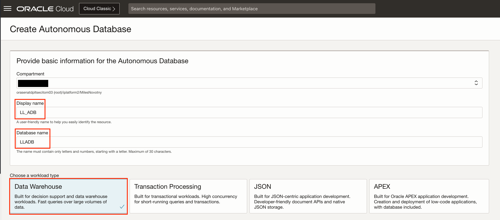

# Learn how to Load Data into a Database

## Introduction

You will learn how to load data into an Oracle Autonomous Database to be used later by Oracle Analytics Cloud and VisualBuilder.

Estimated time - 20 minutes

### Objectives

In this lab, you will:
* Provision an Oracle Autonomous Data Warehouse.
* Load data into the Database using the data load interface.
* Download the wallet file for use in connecting to Oracle Analytics Cloud.

### Prerequisites

* An OCI cloud account

## Task 1: Provision Autonomous Data Warehouse

1. From the OCI home page, click on the hamburger menu in the top right corner. Choose **Oracle Database** then **Autonomous Data Warehouse**.


2. Click the **Create Autonomous Database** button.


3. Enter a display name and database name, then make sure that **Data Warehouse** is selected as the workload type.



4. Leave all other options as their default and scroll down to the **Create administrator credentials** section. Enter and confirm an administrator password, then click **Create Autonomous Database**


3. Your Autonomous Database will now begin creation. It's status is initially set as **Provisioning**. After a couple minutes this will update to **Available** and your database will be ready to use.

## Task 2: Create User

1. Navigate to the SQL worksheet by clicking **Database Actions** and then **SQL** once the database is finished provisioning.


2. Copy and run this code in the SQL worksheet to create a user.

>>**Note:** Be sure to change the pasword on the first line if running in a production environmment.

	```
	<copy>
	CREATE USER nba IDENTIFIED BY "ThisLLR0cks123!";
	GRANT DWROLE TO nba;
	ALTER USER nba QUOTA UNLIMITED ON USERS;
	GRANT PDB_DBA TO nba;
	GRANT CONNECT TO nba;
	GRANT RESOURCE TO nba;
	GRANT DWROLE To nba;
	GRANT EXECUTE ON DBMS_CLOUD_AI TO NBA;
	BEGIN
		ORDS_ADMIN.ENABLE_SCHEMA(
			p_enabled => TRUE,
			p_schema => 'NBA',
			p_url_mapping_type => 'BASE_PATH',
			p_url_mapping_pattern => 'nba',
			p_auto_rest_auth => FALSE
		);

		-- ENABLE DATA SHARING
		C##ADP$SERVICE.DBMS_SHARE.ENABLE_SCHEMA(
			SCHEMA_NAME => 'NBA',
			ENABLED => TRUE
		);
		COMMIT;
	END;
	/
	</copy>
	```


3. Click the drop down button at the top right named **Admin** and select **Sign Out**.


## Task 2: Load Datasets into Database

1. Sign in using your new credentials **nba** and password.


2. Click on the **top menu button** then **Data Load** under the data studio options.


3. Choose **Load Data** then **Select Files**. Choose the lab files named **nba\_game\_summary\_stats\_2024\_regular\_season.csv** and **nba\_shotchart\_2024\_regular\_season.csv** from your desktop. This files can be downloaded from THIS link.


4. You may review the settings for either dataset before the data is loaded by pressing the edit icon at the right side of the page. Here details like the table name and column data types can be set. No updates are required for these two datasets. Press the **Start** button and the database tables will be created after a few moments.


## Task 3: Download Wallet File

1. Before we analyze this data to use in Oracle Analytics Cloud (OAC), we need to download the database wallet file so that we can access it from OAC. Back at the overview page for your database click **Database connection** and **Download wallet**.


2. You will be asked to give the wallet file a password. Do so, then hit the **Download** button


You may now **proceed to the next lab**.

## Acknowledgements

* **Authors:**
	* Nicholas Cusato - Cloud Engineer
	* Malia German - Cloud Engineer
	* Miles Novotny - Cloud Engineer
* **Last Updated by/Date** - Nicholas Cusato, August 2024
