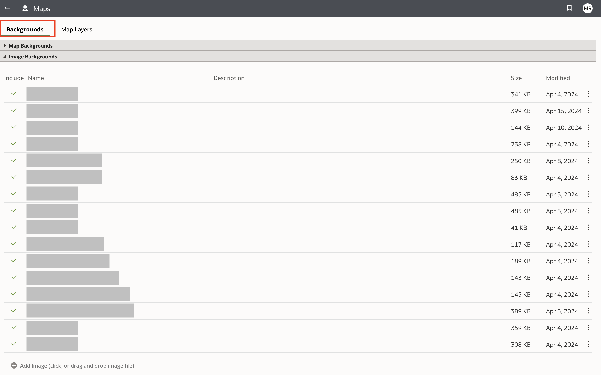
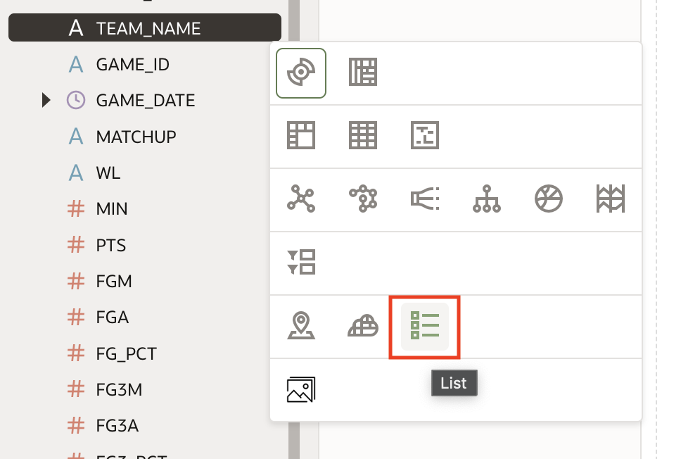

# Visualize your data in Oracle Analytic Cloud (OAC)

## Introduction
This lab walks you through the steps of creating self-service data visualizations in Oracle Analytics Cloud. You will learn the creation of custom visualizations using custom map backgrounds and custom map layers. 

Estimated time - 35 minutes

### Objectives
In this lab, you will learn how to:
* Upload custom map layers using the Oracle Analytics Cloud Console
* Get familiar with parameters and filter binding
* Get familiar creating custom calculations
* Create a variety of visualizations in OAC

### Prerequisites
* A provisioned Oracle Analytics Cloud Instance
* BIServiceAdministrator Role assigned
* Downloaded the lab files from lab 1

## Task 1: Provision an Oracle Analytics Cloud Instance

1. Navigate back to the OCI Console homepage.
2. In the OCI console, open up the navigation menu and navigate to **Analytics & AI** then **Analytics Cloud**
   
3. Using the dropdown, select the compartment you want to provision OAC in.
4. Click **Create Instance** to open the dialog to create an analytics instance.
5. In the form, input the following for the required fields:
   - **Name**: NBAOACLivelab
   - **Compartment**: Make sure this compartment matches your desired compartment for the instance
   - **Capacity Type:** OCPU
   - **Capacity OCPU Count**: 2
   - **License: License Included**
   - **Edition**: Enterprise Edition
   

6. Press **Create.** It may take a few moments for your instance to be provisioned.

## Task 2: Import Custom Maps in OAC

1. Locate the files downloaded in the first lab, unzip the directory `OAC_BACKGROUNDS` with the map layers and map backgrounds we will use in this task
2. From the OAC homepage, navigate to the console.
   
3. From the console, open **Maps** under **Visualizations and Sharing**.
   
4. In the Maps page, navigate to the **Backgrounds** tab and expand **Image Backgrounds**.
   
5. Add your images for **NBA shot zones** and **nba\_halfcourt**.
   

6. After uploading those images, hover over **nba\_halfcourt** and click the dots that appear on the right, then click **Inspect**

   

7. In the popup window set the **Coordiates** type to **Custom (lat, long)** and set the **Latitude** range as 60 to -60, and the **Longitude** range as 160 to -160. This is important for making visualizations using this map background display correctly. Click **Save** when you are done.

   

8. Navigate to the **Map Layers** tab and expand **Custom Map Layers**.
    
9. Upload your custom map layer **NBA Shot Zones**.
    

## Task 3: Create a Data Connection in OAC
1. From the OAC homepage, click on the **Create** button in the top right corner and select **Connection**

   

2. Select **Oracle Autonomous Data Warehouse** from the available connectors

   

3. In the window give the connection a name, upload the wallet file that you downloaded earlier from the Autonomous Database, and enter the database admin credentials. The username is **ADMIN** and the password is the admin password you input when creating your database.

   

4. With all required fields populated press **Save** to create your connection

## Task 4: Create a Data Set in OAC

1. Again, from the OAC homepage click **Create** and choose **Dataset** this time.

   

2. Select the connection that you made in the previous task.

   

3. Click the arrow next to **Schemas**, then the arrow next to **ADMIN**. You will see the **NBA\_SHOTCHART\_2024\_REGULAR\_SEASON** and **NBA\_GAME\_SUMMARY\_STATS\_2024\_REGULAR\_SEASON** datasets that we uploaded into the database. Shift-click these and drag them to the open area on the right.

   

4. Adjust the join conditions to include `TEAM_NAME` and `GAME_ID` by clicking the **conjoined circles**  between the two datasets. Click **Add Join Condition** to sync the datasets. Click **out of the dialog** to move to the next step.

   

5. Now we need to do some data preparation before visualizing this data. Click on **NBA\_SHOTCHART\_2024\_REGULAR\_SEASON** at the bottom of the screen.

   

6. We need to make sure that the **X** and **Y** columns are set as attributes. They can be set as so by clicking the icon to the left of the column name and choosing **Attribute**.

   

7. Hover over the **X** column, click the three dots that appear on its right side, then choose **Location Details**

   

8. In the box that appears, make sure that **Map Layer** is set to **Latitude, Longitude** and under **Location Type** select **Longitude**. Click **Okay**.

   

9.  Repeat exactly the same steps for the **Y** column, except choose **Latitude** as the **Location Type** this time. Now that the location details have been set for these columns they can be used to map out shot locations.

10. Click the save button in the top right corner, give your dataset a name, and click **OK**.

   

## Task 5: Use Self Service DV to Create a Workbook
We will now develop a workbook with 3 canvases that will be used throughout the lab.

1. From the OAC homepage, click on the **Create** button in the top right corner and select **Workbook**.
   
3. Add the dataset(s) you created in Task 3
4. Next we'll create two parameters. Create a **Team** parameter in the parameter tab with the following settings:
  - **Name**: Team
  - **Data Type**: Text
  - **Available Values**: Column - TEAM_NAME
  - **Initial Value**: First Available Value
    
5. Create a **Player** parameter in the parameter tab with the following settings:
  - **Name**: Player
  - **Data Type**: Text
  - **Available Values**: Column - PLAYER_NAME
  - **Initial Value**: First Available Value
    
6. Navigate to the new calculation by clicking the **database symbol** and then the **Plus Sign**. 

    

7. Create a calculation for **Field Goal %**. In the calculation field input **SHOT\_MADE\_FLAG/SHOT\_ATTEMPTED\_FLAG**.
   
8. Create a calculation to count the amount of games titled **Game Count**. In the calculation field input **count(GAME_ID)**.
    
   
9. Lastly, create a calculation titled **Shot Zone Map**. In the calculation field input **CONCAT(CONCAT(SHOT\_ZONE\_BASIC, ' '), SHOT\_ZONE\_AREA)**.
   
10.  Rename the canvas **Team Season Statistics** the first canvas we will make allows users to select a team and see their stats.
   
11. Add **TEAM_NAME** to the filter bar and bind the **Team** parameter you created. This will filter the entire canvas to show team data.
   
12. Right-click **TEAM_NAME** in the data column and select **Pick Visualization** then **List**. This will display the team name to users.
    
13. Right-click **MATCHUP** in the data column and select **Pick Visualization** then **Dashboard Filters**.
    
14. Add your Team parameter and the WL column to the dashboard filters by dragging and dropping it into the filter controls section.
    
15. Now add a treemap with your **Game Count** calculation and **WL** column.
    
16. Now add a table with **GAME\_DATE(day)**, **MATCHUP**, **WL**, **PTS**, **FGM**, **FGA**, **FG\_PCT**, and any additional statistics you would like.
    
17. You can now move on to another canvas, title this one **Player Statistics.**
    
18.  Add **PLAYER_NAME** to the filter bar and bind the **Player** parameter you created. This will filter the entire canvas to show team data.
    
19. Right-click **PLAYER_NAME** in the data column and select **Pick Visualization** then **List**. This will display the player name to users.
    
20. Right-click **MATCHUP** in the data column and select **Pick Visualization** then **Dashboard Filters**. Then add your Player parameter to the dashboard filters by dragging and dropping it into the filter controls section.
    
21. Add separate tiles for **Field Goal %** and **SHOT\_ATTEMPTED\_FLAG** by dragging and dropping them onto the canvas.
    
22. Now drag **Shot Zone Map** and **field Goal %** onto the canvas and pick the map visualization. Check the properties panel to make sure the correct map background is selected in the **Map** tab and correct map layer is selected in the **Data Layers Tab**.
    
23. Next drag **Shot Zone Map** and **SHOT\_ATTEMPTED\_FLAG** onto the canvas and pick the map visualization. Check the properties panel to make sure the correct map background is selected in the **Map** tab and correct map layer is selected in the **Data Layers Tab**.
    
24. Lastly, for this canvas we will create a pivot table. Bring **PERIOD**, **GAME_DATE (Day)**, **HTM**, **VTM**, and **Field Goal %** onto the canvas, make sure **PERIOD** is put into the columns category for the visualization.
    

25. To create your 3rd canvas click the plus icon at the bottom of the page. Then hover over the new canvas, hit the arrow that appears and choose **Rename**. Name the canvas **Shot Chart**

    

26. First you will create a set of filters that will adjust the data visible on this canvas. Select **TEAM\_NAME**, **PLAYER\_NAME**, **GAME\_DATE**, and **SHOT\_TYPE** from the **NBA\_SHOTCHART\_2024\_REGULAR\_SEASON** dataset. You can select these all at once by holding down shift as you choose each of them. With all of them selected right click, then choose **Pick Visualization** and choose the **Dashboard Filters** visualization.

    

27. Click on the **Properties** tab then choose the box icon and hit the arrow next to **PLAYER_NAME**. Change the option for **Default Value** from None to **First in List**. This is important because attempting to show too many shots at once makes the map difficult to view.

    

28. Next, you will create a few calculations that will be important for our shot chart visualization. Right click **My Calculations** and hit **Create Calculation**.

    

29. Name your calculation **FG% By Location** and paste in the following text into the calculation field. Then hit **Validate** and **Save**
>**Note:** you may have to reenter the column names manually into the calculation if they do not paste correctly.
```
<copy>AGGREGATE((AVG(SHOT_MADE_FLAG/SHOT_ATTEMPTED_FLAG)) BY SHOT_ZONE_BASIC, SHOT_ZONE_AREA)</copy>
```


30. Repeat the same process, this time naming the calculation **Attempts** and pasting the following text into the calculation field.

```
<copy>AGGREGATE(SHOT_ATTEMPTED_FLAG BY SHOT_ZONE_BASIC, SHOT_ZONE_AREA)</copy>
```

31. And one final time do the same process, naming the calculation **Makes** and pasting the following text.

```
<copy>AGGREGATE(SHOT_MADE_FLAG BY SHOT_ZONE_BASIC, SHOT_ZONE_AREA)</copy>
```

32. Now we can make our map visualization. Shift-click the columns **X** and **Y**. Right click, choose **Pick Visualization** and click the map visualization.

    

33. Now you need to enable the basketball court custom map background. Navigate to the **Properties** tab, choose the map icon then under **Background Map** choose ______.

    

34. Then you will add your custom calculations. Drag **FG% by Location** and put it under the **Color** tap. Shift-click **Attempts** and **Makes** and put them under the **Tooltips** tab.

    

35. For our final visualization, select **SHOT_TYPE**, **FG% by Location**, **Attempts**, and **Makes**. Right click and choose the table visualization. Move the table to be below the shot chart, as this will look best when displayed in the VisualBuilder app.

    

36. You now have an interactive shot chart that displays where shots were taken as well as FG% and the number of attempts/makes in different areas of the court. You can change the coloring to your liking to best show off the FG% differences, as well as play with the filters at the top of the canvas to look at shot charts for different players and teams, use the date filter to look at charts from specific games, and use the shot type filter to look at specific shots like step-backs, floaters, or hook shots. The table will also respond to these filters, giving you a granular view of the information shown in the shot chart.

    

37. Save the workbook by clicking the save icon at the top right and give it a memorable name, such as **NBA Analytics**.

    

38. Click the **back button** to navigate to the home page of the OAC instance.

    

39. Click the **ellipsis** for the workbook and select **Move to**.

    

40. Select **Shared Folder** and click **New Folder**. Give the new folder a name, such as `Shared NBA` and click **Create**. Select the new folder and click **Move**.

    


    

>>**Note:** Share the related artifacts so the workbook is usable.

You may now **proceed to the next lab**.

## Learn More

* [Apply Map Backgrounds and Map Layers to Enhance Visualizations](https://docs.oracle.com/en/cloud/paas/analytics-cloud/acubi/apply-map-backgrounds-and-map-layers-enhance-visualizations.html)

## Acknowledgements

* **Authors:**
	* Nicholas Cusato - Cloud Engineer
	* Malia German - Cloud Engineer
	* Miles Novotny - Cloud Engineer
* **Last Updated by/Date** - Nicholas Cusato, August 2024
