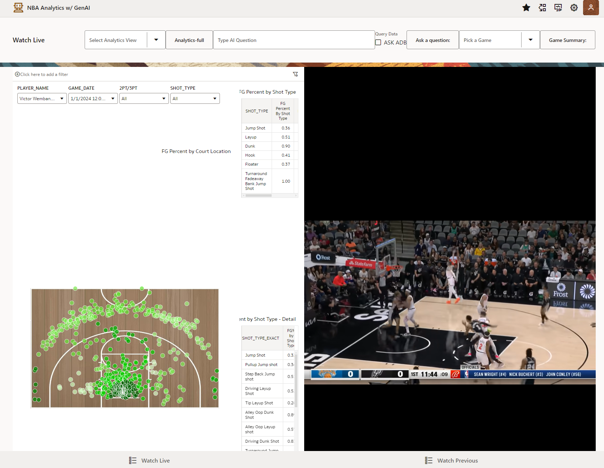

# Import a Visual Builder App quickly and easily

## Introduction

This lab will show you how to create a visual builder instance and import an app with Analytics Iframe to enhance your analysis of NBA gameplay.

Estimated time - 20 minutes

### Objectives

* Create a Visual Builder Instance
* Import the application
* Enable the Analytics iframe

### Prerequisites

* Your tenancy **must be subscribed to the US Midwest (Chicago)** region.
* Downloaded the previous lab files from lab 1.

## Task 1: Create a Visual Builder Instance

1. Navigating the OCI console, select the **menu button** in the top-left corner and navigate to **Developer Services** and scroll down to click **Visual Builder**. 

  

2. Click **Create Instance**.

  
   
3. Name your instance (for example *NBA_LL*), validate you are in your compartment, and click **Create Visual Builder Instance**. There will be a confirmation that it was successful and the status will say **CREATING**.

  

1. Notice the Status updates to Complete. Once complete, click on the **instance** and select **Service homepage**. 

  

## Task 2: Import the application

1. Click **Import Application**. 

  

2. Select **Application from file**.

  

3. Drag and drop the zip file downloaded in the first lab to update the fields and click **Import**.

  

## Task 3: Enable the Analytics iframe

1. Click the **side-menu** and click **settings**.

    

2. Click **New Origin** and paste in the **Origin Address**. Click the **check mark** to save.

    

>>**Note:** The Origin address can be copied from the URL of the OAC tab used in the previous lab. Be sure to copy the root url - up to the `.com/`

  

3. Copy the URL of the Visual Builder app - up to the `.com` root - and then navigate back to the Analytics Tab with the visual builder information for safe domains by navigating back to the Oracle Analyics Cloud dashboard,  selecting the **side menu button** and clicking the **Console** button.

  

4. Click **Safe Domains**.

  

5. Enter the domain of the visual builder app url in the empty field and clicked **Embedded**. 

>>**Note:** The URL can include *wildcard* syntax, which means if you want to approve all apps on OCI, you can simply put **\*oraclecloud.com**, however, since we only need the visual builder app, we will put the url link for the instance. Use only the root URL for the Visual Builder without the **https://** and terminating **/**.

   

6. Copy the URL of the instance for OAC again, excluding everything after the **oraclecloud.com/**.

7. Navigate back to the homepage of the Analytics by clicking the **side-menu button** and then **Home**. On the home page, the the **ellipsis** of the workbook just created and select **Inspect**.

   

8. Click **Copy** for the **Object ID** and save this in a notepad, since it will be used for Step 12. 

   

9.  Navigate back to the Visual builder webpage and then homepage using the side-menu and selecting **All Applications**. Click the **name** of the app to open the dashboard to begin editting.

  

10. Click the drop down arrow for the text **watch-live** and select the option **watch-live-start**.

  

11. Select the option **Oracle Analytics Project** from the structure tree.

  

12. Update the **Host** and **Project Path** from the information gathered from the previous lab on the right-side menu of the webpage. 

>>**Note:** The host is the URL of the analytics instance from step 6. The project path is the object id from the step 8.

>>**Note:** Make sure Compatability Mode is **no**. The iframe in the preview of the webpage will automatically update with the Analytics workbook. If it does not, the you will need to repeat steps the steps from the previous lab to ensure you have it correctly mapped.

  
  
>>**Note:** If the OAC visual is still not working, go to the app settings to **update the Runtime**

  

  

13. Repeat steps **11** and **12** for the page **watch-live-tiny** and confirm that the Analytics canvas is showing. 
  

>>**Note:** If the OAC canvas is not loading, verify the runtime version of the VB instance is up to date and adjust the compatability mode of the Analytics add-on.

14.   Confirm that the page loads the view of the canvas.

  

You may now **proceed to the next lab**.

## Learn More

* [Embedding Oracle Analytics Cloud Data Visualizations into Oracle Visual Builder Applications](https://blogs.oracle.com/analytics/post/embedding-oracle-analytics-cloud-data-visualizations-into-oracle-visual-builder-applications)

## Acknowledgements

* **Authors:**
	* Nicholas Cusato - Cloud Engineer
	* Malia German - Cloud Engineer
	* Miles Novotny - Cloud Engineer
* **Last Updated by/Date** - Nicholas Cusato, August 2024