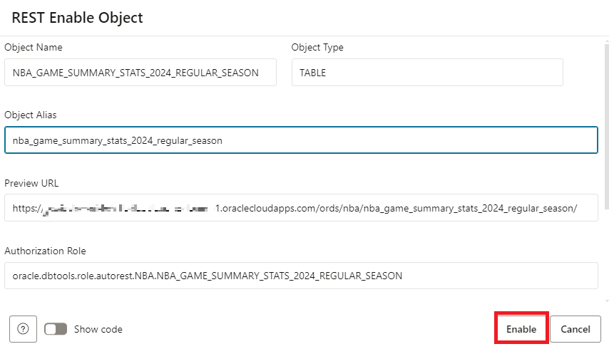
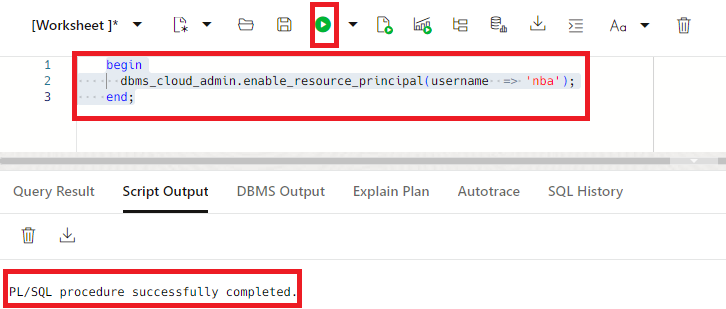
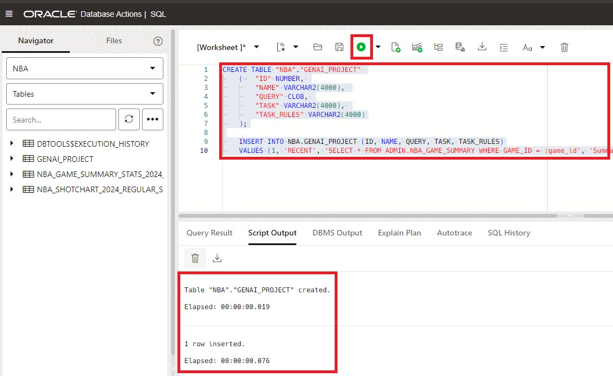

# Connect your data from the database

## Introduction

If you want more control over how your APIs are organized and structured, you can design your APIs using Autonomous Database's REST design tool. Start by creating an API module. See the [Getting Started with RESTful Services](https://docs.oracle.com/en/database/oracle/oracle-rest-data-services/23.4/orddg/developing-REST-applications.html#GUID-25DBE336-30F6-4265-A422-A27413A1C187) documentation for additional information.

In this lab, we will create Restful API modules to connect to the data and Generative AI backends.

Estimated time - 20 minutes


### Objectives

* Create policy to enable access to OCI Generative AI
* Create the Restful Modules
* Connect the Endpoints

### Prerequisites

* Your tenancy **must be subscribed to the US Midwest (Chicago)** region.
* Basic database and SQL knowledge.
* Familiarity with Oracle Cloud Infrastructure (OCI) is helpful.
* Familiarity with the role of REST services.

## Task 1: Create policy to enable access to OCI Generative AI

Create a policy that will allow you to use OCI Generative AI within your previously defined compartment. **Make sure your policy uses the compartment where your Autonomous Database is deployed.** The policy will be necessary for Autonomous Database to interact with OCI Generative AI.

1. From the **Console,** open the **Navigation** menu and click **Identity & Security.** Under **Identity,** click **Policies.**.

2. Click on **Create policy** and paste the following into the appropriate fields:

    >**Note:** Slide the **Show manual editor** control to display the text field in order to paste the policy.

    * **Name:** **`PublicGenAI`**
    * **Description:** **`Public Gen AI Policy`**
    * **Compartment:** **`select your own compartment`**
    * **Policy:** **`allow any-user to manage generative-ai-family in compartment <insert-compartment-name>`**
    
3. Click **Create**.

    
    
>**Note:** This policy allows any Autonomous Database in the specified compartment to access OCI Generative AI. In a production environment, ensure your policy's scope is minimally inclusive.

## Task 2: Create the Restful Modules

1. Navigate to the Autonomous Database previously created in lab and click **Database Actions** to select **SQL**.

  

2. Right click **NBA_GAME_SUMMARY** and enable **REST** by selecting **Enable**. Select **Enable** on the popup dialogue. 

  

  

3. Enable the use of the resource principal by the Admin user. Copy and paste the following code into your SQL Worksheet, and then click the **Run Script** icon.

    ```
    <copy>
    begin
      dbms_cloud_admin.enable_resource_principal(username  => 'nba');
    end;
    /
    </copy>
    ```

  


>**Note:** if you experience errors in the api for GenAI, it may be because the policy hasn't updated for the new schema user - try to disable and re-enable the resource principal.

4. Sign out from admin and sign back in as **nba** user that was created in lab 1.

4. Create an AI profile for the **Meta Llama 2 Chat model**. Copy and paste the following code into your SQL Worksheet, and then click the **Run Script** icon.

    ```
    <copy>
    BEGIN
        -- drops the profile if it already exists
        DBMS_CLOUD_AI.drop_profile(
            profile_name => 'ociai_llama',
            force => true
        );     
                                                            
        DBMS_CLOUD_AI.create_profile (                                              
            profile_name => 'ociai_llama',
            attributes   => 
            '{"provider": "oci",
                "credential_name": "OCI$RESOURCE_PRINCIPAL",
                "object_list": [
                    {"owner": "NBA"}
                ],
                "model": "meta.llama-3-70b-instruct"
                }');
    END;           
    /
    </copy>
    ```
    

5. Create the GENAI_PROJECT table and a row insert by copying and pasting the following SQL statement in the SQL Worksheet, and then click the **Run Script** icon.

	```
	<copy>
	CREATE TABLE "NBA"."GENAI_PROJECT" 
	(	"ID" NUMBER, 
		"NAME" VARCHAR2(4000), 
		"QUERY" CLOB, 
		"TASK" VARCHAR2(4000), 
		"TASK_RULES" VARCHAR2(4000)
	);

	INSERT INTO NBA.GENAI_PROJECT (ID, NAME, QUERY, TASK, TASK_RULES)
	VALUES (1, 'RECENT', 'WITH NumberedGameSummary AS (
    SELECT 
        SEASON_ID,
        GAME_DATE,
        TEAM_ID,
        TEAM_ABBREVIATION,
        GAME_ID,
        TEAM_NAME,
        MATCHUP,
        WL,
        MIN,
        PTS,
        FGM,
        FGA,
        FG_PCT,
        FG3M,
        FG3A,
        FG3_PCT,
        FTM,
        FTA,
        FT_PCT,
        OREB,
        DREB,
        REB,
        AST,
        STL,
        BLK,
        TOV,
        PF,
        PLUS_MINUS,
        UNIQUE_ROW_IDENTIFIER,
        ROW_NUMBER() OVER (ORDER BY UNIQUE_ROW_IDENTIFIER) AS row_num
    FROM NBA_GAME_SUMMARY_STATS_2024_REGULAR_SEASON
    WHERE GAME_ID = :game_id )
    SELECT 
      MAX(CASE WHEN row_num = 1 THEN SEASON_ID ELSE NULL END) AS SEASON_ID_1,
      MAX(CASE WHEN row_num = 1 THEN GAME_DATE ELSE NULL END) AS GAME_DATE_1,
      MAX(CASE WHEN row_num = 1 THEN TEAM_ID ELSE NULL END) AS TEAM_ID_1,
      MAX(CASE WHEN row_num = 1 THEN TEAM_ABBREVIATION ELSE NULL END) AS TEAM_ABBREVIATION_1,
      MAX(CASE WHEN row_num = 1 THEN TEAM_NAME ELSE NULL END) AS TEAM_NAME_1,
      MAX(CASE WHEN row_num = 1 THEN MATCHUP ELSE NULL END) AS MATCHUP_1,
      MAX(CASE WHEN row_num = 1 THEN WL ELSE NULL END) AS WL_1,
      MAX(CASE WHEN row_num = 1 THEN MIN ELSE NULL END) AS MIN_1,
      MAX(CASE WHEN row_num = 1 THEN PTS ELSE NULL END) AS PTS_1,
      MAX(CASE WHEN row_num = 1 THEN FGM ELSE NULL END) AS FGM_1,
      MAX(CASE WHEN row_num = 1 THEN FGA ELSE NULL END) AS FGA_1,
      MAX(CASE WHEN row_num = 1 THEN FG_PCT ELSE NULL END) AS FG_PCT_1,
      MAX(CASE WHEN row_num = 1 THEN FG3M ELSE NULL END) AS FG3M_1,
      MAX(CASE WHEN row_num = 1 THEN FG3A ELSE NULL END) AS FG3A_1,
      MAX(CASE WHEN row_num = 1 THEN FG3_PCT ELSE NULL END) AS FG3_PCT_1,
      MAX(CASE WHEN row_num = 1 THEN FTM ELSE NULL END) AS FTM_1,
      MAX(CASE WHEN row_num = 1 THEN FTA ELSE NULL END) AS FTA_1,
      MAX(CASE WHEN row_num = 1 THEN FT_PCT ELSE NULL END) AS FT_PCT_1,
      MAX(CASE WHEN row_num = 1 THEN OREB ELSE NULL END) AS OREB_1,
      MAX(CASE WHEN row_num = 1 THEN DREB ELSE NULL END) AS DREB_1,
      MAX(CASE WHEN row_num = 1 THEN REB ELSE NULL END) AS REB_1,
      MAX(CASE WHEN row_num = 1 THEN AST ELSE NULL END) AS AST_1,
      MAX(CASE WHEN row_num = 1 THEN STL ELSE NULL END) AS STL_1,
      MAX(CASE WHEN row_num = 1 THEN BLK ELSE NULL END) AS BLK_1,
      MAX(CASE WHEN row_num = 1 THEN TOV ELSE NULL END) AS TOV_1,
      MAX(CASE WHEN row_num = 1 THEN PF ELSE NULL END) AS PF_1,
      MAX(CASE WHEN row_num = 1 THEN PLUS_MINUS ELSE NULL END) AS PLUS_MINUS_1,
      MAX(CASE WHEN row_num = 1 THEN UNIQUE_ROW_IDENTIFIER ELSE NULL END) AS UNIQUE_ROW_IDENTIFIER_1,

      MAX(CASE WHEN row_num = 2 THEN SEASON_ID ELSE NULL END) AS SEASON_ID_2,
      MAX(CASE WHEN row_num = 2 THEN GAME_DATE ELSE NULL END) AS GAME_DATE_2,
      MAX(CASE WHEN row_num = 2 THEN TEAM_ID ELSE NULL END) AS TEAM_ID_2,
      MAX(CASE WHEN row_num = 2 THEN TEAM_ABBREVIATION ELSE NULL END) AS TEAM_ABBREVIATION_2,
      MAX(CASE WHEN row_num = 2 THEN TEAM_NAME ELSE NULL END) AS TEAM_NAME_2,
      MAX(CASE WHEN row_num = 2 THEN MATCHUP ELSE NULL END) AS MATCHUP_2,
      MAX(CASE WHEN row_num = 2 THEN WL ELSE NULL END) AS WL_2,
      MAX(CASE WHEN row_num = 2 THEN MIN ELSE NULL END) AS MIN_2,
      MAX(CASE WHEN row_num = 2 THEN PTS ELSE NULL END) AS PTS_2,
      MAX(CASE WHEN row_num = 2 THEN FGM ELSE NULL END) AS FGM_2,
      MAX(CASE WHEN row_num = 2 THEN FGA ELSE NULL END) AS FGA_2,
      MAX(CASE WHEN row_num = 2 THEN FG_PCT ELSE NULL END) AS FG_PCT_2,
      MAX(CASE WHEN row_num = 2 THEN FG3M ELSE NULL END) AS FG3M_2,
      MAX(CASE WHEN row_num = 2 THEN FG3A ELSE NULL END) AS FG3A_2,
      MAX(CASE WHEN row_num = 2 THEN FG3_PCT ELSE NULL END) AS FG3_PCT_2,
      MAX(CASE WHEN row_num = 2 THEN FTM ELSE NULL END) AS FTM_2,
      MAX(CASE WHEN row_num = 2 THEN FTA ELSE NULL END) AS FTA_2,
      MAX(CASE WHEN row_num = 2 THEN FT_PCT ELSE NULL END) AS FT_PCT_2,
      MAX(CASE WHEN row_num = 2 THEN OREB ELSE NULL END) AS OREB_2,
      MAX(CASE WHEN row_num = 2 THEN DREB ELSE NULL END) AS DREB_2,
      MAX(CASE WHEN row_num = 2 THEN REB ELSE NULL END) AS REB_2,
      MAX(CASE WHEN row_num = 2 THEN AST ELSE NULL END) AS AST_2,
      MAX(CASE WHEN row_num = 2 THEN STL ELSE NULL END) AS STL_2,
      MAX(CASE WHEN row_num = 2 THEN BLK ELSE NULL END) AS BLK_2,
      MAX(CASE WHEN row_num = 2 THEN TOV ELSE NULL END) AS TOV_2,
      MAX(CASE WHEN row_num = 2 THEN PF ELSE NULL END) AS PF_2,
      MAX(CASE WHEN row_num = 2 THEN PLUS_MINUS ELSE NULL END) AS PLUS_MINUS_2,
      MAX(CASE WHEN row_num = 2 THEN UNIQUE_ROW_IDENTIFIER ELSE NULL END) AS UNIQUE_ROW_IDENTIFIER_2
    FROM NumberedGameSummary', 'Summarize the basketball game and follow the task rules.', '1. Summarize the data. 2. Provide insight into game statistics. 3. Use the perspective of an NBA fan');
	</copy>
	```

    

1.  Copy and paste the following to create the modules for both **`question\`** and **`summary\:game_id`**. Click the **run button** to run the PL/SQL.

  ```
  <copy>

  -- Generated by ORDS REST Data Services 24.2.3.r2011847
  -- Schema: NBA  Date: Fri Aug 23 11:15:01 2024 
  --

  BEGIN
    ORDS.ENABLE_SCHEMA(
        p_enabled             => TRUE,
        p_schema              => 'NBA',
        p_url_mapping_type    => 'BASE_PATH',
        p_url_mapping_pattern => 'nba',
        p_auto_rest_auth      => FALSE);
      
    ORDS.DEFINE_MODULE(
        p_module_name    => 'nba',
        p_base_path      => '/nba/',
        p_items_per_page => 25,
        p_status         => 'PUBLISHED',
        p_comments       => NULL);

    ORDS.DEFINE_TEMPLATE(
        p_module_name    => 'nba',
        p_pattern        => 'summary/:game_id',
        p_priority       => 0,
        p_etag_type      => 'HASH',
        p_etag_query     => NULL,
        p_comments       => NULL);

    ORDS.DEFINE_HANDLER(
        p_module_name    => 'nba',
        p_pattern        => 'summary/:game_id',
        p_method         => 'GET',
        p_source_type    => 'plsql/block',
        p_mimes_allowed  => NULL,
        p_comments       => NULL,
        p_source         => 
  'begin
      :summary := genai.get_response ( 
            query_parameter => :game_id,
            project_id => 1,
            profile_name => ''ociai_llama'' );
    end;');

    ORDS.DEFINE_PARAMETER(
        p_module_name        => 'nba',
        p_pattern            => 'summary/:game_id',
        p_method             => 'GET',
        p_name               => 'game_id',
        p_bind_variable_name => 'game_id',
        p_source_type        => 'URI',
        p_param_type         => 'STRING',
        p_access_method      => 'IN',
        p_comments           => NULL);

    ORDS.DEFINE_PARAMETER(
        p_module_name        => 'nba',
        p_pattern            => 'summary/:game_id',
        p_method             => 'GET',
        p_name               => 'summary',
        p_bind_variable_name => 'summary',
        p_source_type        => 'RESPONSE',
        p_param_type         => 'STRING',
        p_access_method      => 'OUT',
        p_comments           => NULL);

    ORDS.DEFINE_TEMPLATE(
        p_module_name    => 'nba',
        p_pattern        => ':question',
        p_priority       => 0,
        p_etag_type      => 'HASH',
        p_etag_query     => NULL,
        p_comments       => NULL);

    ORDS.DEFINE_HANDLER(
        p_module_name    => 'nba',
        p_pattern        => ':question',
        p_method         => 'GET',
        p_source_type    => 'plsql/block',
        p_items_per_page => 25,
        p_mimes_allowed  => NULL,
        p_comments       => NULL,
        p_source         => 
  'declare
      l_result sys_refcursor;
      begin
      genai.ask_question (
          question => :question,
          message => :message,
          sqlquery => :sql,
          resultset => l_result
      );
      :result := l_result;

      end;');

    ORDS.DEFINE_PARAMETER(
        p_module_name        => 'nba',
        p_pattern            => ':question',
        p_method             => 'GET',
        p_name               => 'question',
        p_bind_variable_name => 'question',
        p_source_type        => 'RESPONSE',
        p_param_type         => 'STRING',
        p_access_method      => 'INOUT',
        p_comments           => NULL);

    ORDS.DEFINE_PARAMETER(
        p_module_name        => 'nba',
        p_pattern            => ':question',
        p_method             => 'GET',
        p_name               => 'sql',
        p_bind_variable_name => 'sql',
        p_source_type        => 'RESPONSE',
        p_param_type         => 'STRING',
        p_access_method      => 'OUT',
        p_comments           => NULL);

    ORDS.DEFINE_PARAMETER(
        p_module_name        => 'nba',
        p_pattern            => ':question',
        p_method             => 'GET',
        p_name               => 'result',
        p_bind_variable_name => 'result',
        p_source_type        => 'RESPONSE',
        p_param_type         => 'RESULTSET',
        p_access_method      => 'OUT',
        p_comments           => NULL);

    ORDS.DEFINE_PARAMETER(
        p_module_name        => 'nba',
        p_pattern            => ':question',
        p_method             => 'GET',
        p_name               => 'message',
        p_bind_variable_name => 'message',
        p_source_type        => 'RESPONSE',
        p_param_type         => 'STRING',
        p_access_method      => 'OUT',
        p_comments           => NULL);

      
          
  COMMIT;

  END;
  </copy>
  ```

  

7. Copy and paste the following statement in the SQL Worksheet to create the package that allows you to execute multiple functions to interact with the Generative AI services

  ```
  <copy>
  CREATE OR REPLACE EDITIONABLE PACKAGE "NBA"."GENAI" AS
      FUNCTION get_response(
          query_parameter varchar2, 
        project_id number,
        profile_name varchar2 default 'genai') RETURN CLOB;

      FUNCTION get_prompt(
          query_parameter varchar2, 
        project_id number default 1) RETURN CLOB;

      PROCEDURE ask_question ( 
          question in out varchar2, 
          sqlquery out clob,
          message out clob,
          resultset out SYS_REFCURSOR,
          profile_name in varchar2 default 'genai'
          );

  END genai;
  /
  CREATE OR REPLACE EDITIONABLE PACKAGE BODY "NBA"."GENAI" AS

      FUNCTION get_prompt_sql ( 
          project_id number default 1) return clob IS

          l_query clob;
          l_complete_query clob;

      BEGIN
              -- For the selected GenAI project - get the query that selects data that will be used by the model to create a custom response            
              SELECT query
              INTO l_query
              FROM genai_project
              WHERE id = project_id;

              l_complete_query := 
                  'select g.task, g.task_rules, genai_dataset.* 
                  from genai_project g, 
                  (' || l_query || ' 
                  ) genai_dataset
                  where g.id = ' || project_id;

              -- Return the generated prompt
              return l_complete_query;

              exception
                  when others then
                      return null;
      END;

      FUNCTION get_response (	
          query_parameter varchar2, 
        project_id number,
        profile_name varchar2 default 'genai') RETURN CLOB IS

          v_response clob; 
        l_prompt clob;
          l_response clob;

          BEGIN
              -- Get the prompt from the project + the query parameter
              l_prompt := get_prompt(
                      query_parameter => query_parameter,
                      project_id => project_id
              );
              -- Pass the prompt to the model and return the response
              l_response := DBMS_CLOUD_AI.GENERATE(
                  prompt => l_prompt,
                  profile_name => profile_name,
                  action => 'chat' 
              );

              RETURN l_response;

              EXCEPTION
                  WHEN OTHERS THEN
                      RETURN 'Error generating response.' || chr(10) || sqlerrm;
          END;


      FUNCTION get_prompt (
          query_parameter varchar2, 
        project_id number DEFAULT 1)
          RETURN CLOB IS

          l_prompt clob;
          l_query clob;
          l_complete_query clob;


          BEGIN
              -- For the selected GenAI project - get the query that selects data that will be used by the model to create a custom response
              l_query := get_prompt_sql ( project_id => project_id);

              -- Add to the query the instructions for the task
              -- Structure it as a JSON doc

              l_complete_query := 
                  'select json_serialize(json_object(* returning clob format json) pretty) as prompt
                  from
                  (' || l_query || ' 
                  )';

              -- Generate the prompt
              execute immediate l_complete_query INTO l_prompt USING query_parameter;

              -- Return the generated prompt
              return l_prompt;

              EXCEPTION
                  when others then
                      return 'Error generating prompt.' || chr(10) || l_query || chr(10) || sqlerrm;
          END;


      PROCEDURE ask_question ( 
              question in out varchar2, 
              sqlquery out clob,
              message out clob,
              resultset out SYS_REFCURSOR,
              profile_name in varchar2 default 'genai'
              ) is
          BEGIN
              -- Generate the sql for the query
              sqlquery := dbms_cloud_ai.generate (
                          prompt => question,
                          profile_name => profile_name,
                          action => 'showsql'
                          );    

              -- Clean up the results. Get rid of new lines and multiple spaces
              sqlquery := replace(sqlquery, chr(10), ' ');
              sqlquery := regexp_replace(sqlquery, ' +', ' ');

              OPEN resultset FOR sqlquery;

              message := 'success';

              EXCEPTION
                  -- this will pick up a bad sql statement (or a statement that could not be generated)
                  WHEN OTHERS THEN
                      message := sqlquery;
                      sqlquery := null;            
                      open resultset for 'select ''unable to generate valid sql'' as item from dual';

          END;

  END genai;
  </copy>
  ```

  

8. Navigate to the REST modules by clicking the **side-menu button** and click **REST**.

  

8. Click **MODULES** to navigate to the newly created module.

  

9. Click **nba** to navigate to the endpoints.

  

10. Notice each endpoint has a similar root URL. Copy one of them and erase the endpoint up to the first **`nba`**. This will be used as the root endpoint for the next task, where the endpoints are predifed in the app, accordingly. 
    
  

## Task 2: Connect the Endpoints

1. Navigate back to the Visual Builder App and select the icon on the left that resembles a **circle** (represents services). Click the **Backends** option and then, **nba2**. Click **Servers** and then edit for **NBA Question**

  

2. Paste the **URL from the previous task** in the **`Instance URL`** and click **Save**.

  

You may now **proceed to the next lab**.

## Learn More
* [DBMS\_NETWORK\_ACL\_ADMIN PL/SQL Package](https://docs.oracle.com/en/database/oracle/oracle-database/19/arpls/DBMS_NETWORK_ACL_ADMIN.html#GUID-254AE700-B355-4EBC-84B2-8EE32011E692)
* [DBMS\_CLOUD\_AI Package](https://docs.oracle.com/en-us/iaas/autonomous-database-serverless/doc/dbms-cloud-ai-package.html)
* [Using Oracle Autonomous Database Serverless](https://docs.oracle.com/en/cloud/paas/autonomous-database/adbsa/index.html)
* [Overview of Generative AI Service](https://docs.oracle.com/en-us/iaas/Content/generative-ai/overview.htm)

## Acknowledgements

* **Authors:**
	* Nicholas Cusato - Cloud Engineer
	* Malia German - Cloud Engineer
	* Miles Novotny - Cloud Engineer
* **Last Updated by/Date** - Nicholas Cusato, August 2024