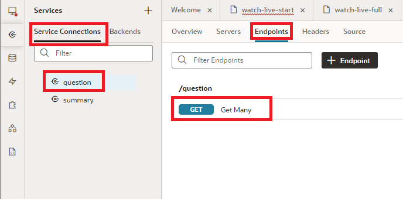
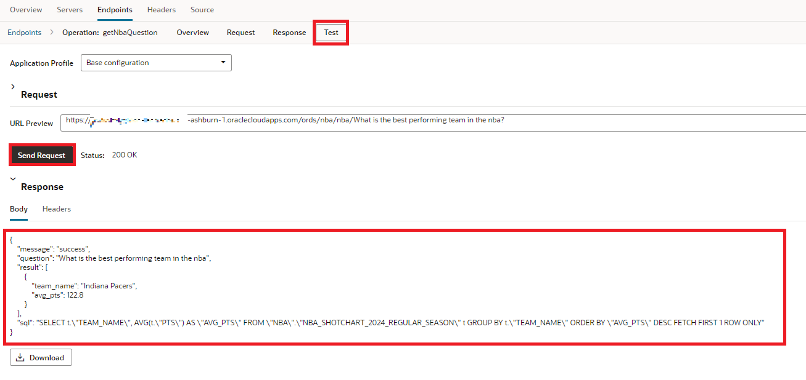
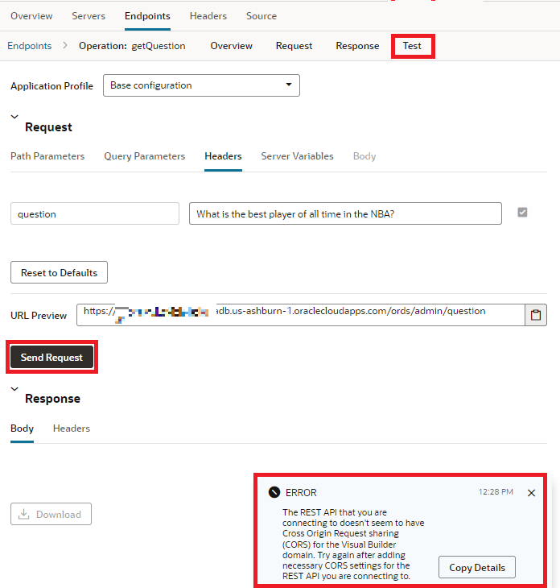
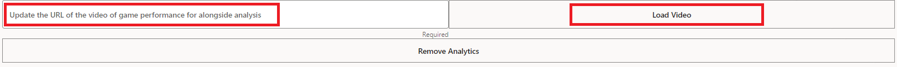
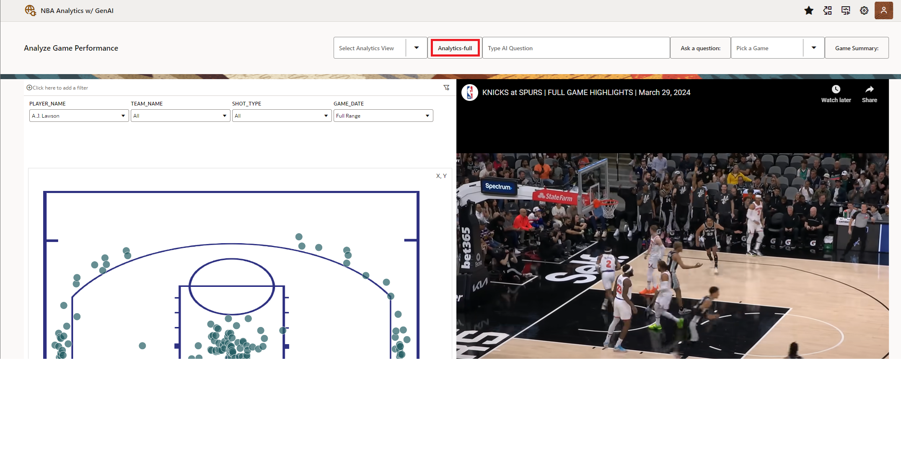
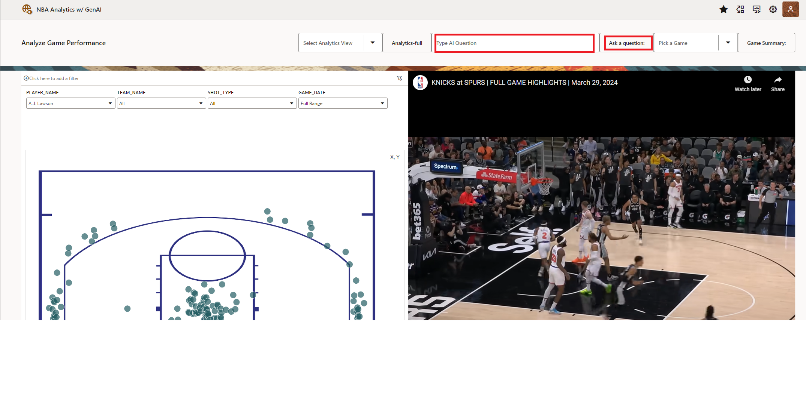
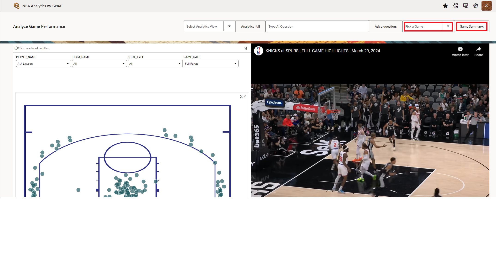
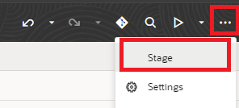
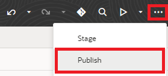
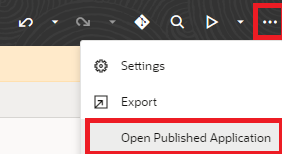

# Use application to analyze player performance with Generative AI

## Introduction

This lab walks the user through the basics of the app - providing insights to how the analytics can help aid in NBA performance analysis. The optional final lab will show how to deploy the lab for public consumption.

Estimated time - 20 minutes

### Objectives

* Test the Application Endpoint
* Analyze NBA Performance using the Application
* Deploy the application (Optional)

## Task 1: Test the Application Endpoint

1. Test the endpoints in the app by navigating to the service connections. Select **`question`**, then **`Endpoints`**, and select ther

  

2. Test the endpoint by selecting **Test** from the header tabs. Verify 

  

>>**Note:** If you experience an error, such as shown below (CORS), validate the following: Policy is set correctly, subscribed to `Chicago region`, root URL for API is set correctly (verify schema name - `NBA`), and connection type is set to `Dynamic, the service supports CORS`.

  

## Task 2: Analyze NBA Performance using the Application

1. Find a video on Youtube of an NBA game that you would like to analyze along with the data.

2. Scroll to the bottom of the page and update the video using the **Update video text box** and press the button **Load Video** to submit.

  

3. Select an option from the toggle button **Select Analytics View** to view the different dashboards.

  

4. Select **Analytics-full** to view full screen analytics and use the same button to return to the start view.

  

5. Type in a question to the text input box **Type AI Question** and select **Ask a question** to submit. 

  

6. Select **Pick a Game** toggle button to pick a game from the list and select **Game Summary** to display the summary.

  

## Task 3: Deploy the Application (Optional)

1. Return to the previous tab and select the **options (ellipsis)** at the top right and select **Stage**.

  

2. Select the ellipsis and select **publish**.

  

3. Select the ellipsis and select **Open Published Application**.

  

4. This new tab will be a published version of the app that you can share with your co-workers who are subscribed to the tenancy.

Thank you for completing this lab.

## Acknowledgements

* **Authors:**
	* Nicholas Cusato - Cloud Engineer
	* Malia German - Cloud Engineer
	* Miles Novotny - Cloud Engineer
* **Last Updated by/Date** - Nicholas Cusato, August 2024