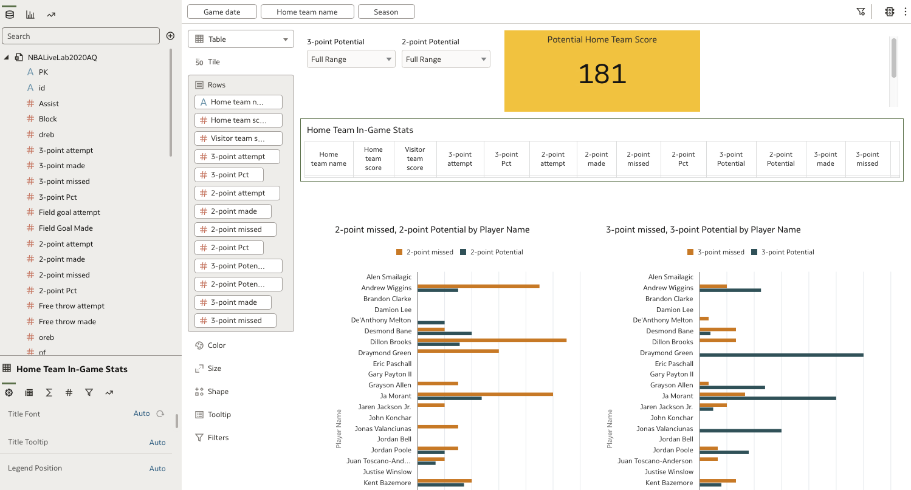

# Build the Dashboard

## Introduction

The data visualization endeavor is invaluable. The tools and mechanisms available in Oracle Analytics Cloud allow for users to tell data stories with clarity and deep insights. This lab will walk through the steps to construct a dashboard which will facilitate the what-if analysis of this data. 

Estimated Time: 20 minutes

### Objectives

In this lab, you will:
* Use Oracle Analytics Cloud to build a dashboard 
* Begin to see the relationships in the data 

### Prerequisites 

This lab assumes you have:
* An Oracle Cloud account
* All previous labs successfully completed

*This is the "fold" - below items are collapsed by default*

## Task 1: Establish the Filters

(optional) Task 1 opening paragraph.

1. Select the Filter Elements 
    - Ctrl + Click to select Season, Game Date, and Home Team Name 
    - Drag the selection to the filter bar. 

	

2. Modify the Filters 
    - Hover the mouse over Game Date in the filter bar 
    - Click the 3 dots 
    - Select “Filter Type” and change selection to **List** 

  

3. Set the Filters 
    - Change Season to 2020
    - Select Golden State Warriors in Home Team Name 
    - In Game Date, select 05/21/2021

## Task 2: Build the Table 

1. Build the Table

    - CTRL click to Select:
    - Home Team Name 
    - Home Team Score 
    - Visitor Team Score
    - 3-point Pct
    - 3-point attempt 
    - 3-point Made 
    - 3-Point Missed 
    - 3-Point Potential 
    - 2-Point Pct
    - 2-point attempt 
    - 2-point Made 
    - 2-point missed
    - 2-point potential 
    - Drag the selections to the visualizations pane and select “Table” as Visualization type 

  

2. Modify the Table 

    - With the table selected, navigate to the bottom left of the page to the Gear shaped “General” icon 
    - Click on “Auto” next to “Title”, select “Custom” and change the title to “Home Team In-Game Stats”

  

## Task 3: Add Bar Charts 

1. Develop Bar Charts 
    -	Select 
    - 3-Point Missed
    - 3-Point Potential 
    - Player Name 
    -	Drag to visualization pane above the table 
    - A green bar will appear indicating that a new visualization is being created 

  

2. Change Visualization Type
    - Change visualization type to Horizontal Bar 
    - 3-Point Missed and 3-Point Potential should be in the Values (X-Axis) and Player Name should be in the Category (Y-Axis)
    - Select and Move the following to Tooltips
    - 3-point Pct
    - 2-point Pct
    - 3-point Potential 
    - 2-point Potential 

3. Complete the 2nd Bar Chart 
    -	Repeat the step 1 process in a second Horizontal Bar with 
    - 2-Point Missed
    -	2-Point Potential 
    - Player Name 

## Task 4: Add a Tile

1. Add a Tile 
    -	Select and drag Potential Home Team Score to the visualization pane to create a tile 
    -	With the tile selected navigate to the bottom left corner of the screen and click on the numeric symbol “#” 
    -	Click on “Auto” next to Number Format 
    -	Select “Number”
    -	Scroll to “Decimal Places” 
    - Change “2” to “O”

  

2. Establish Conditional Formatting 
    - Right click on the tile and select “Conditional “Formatting”
    - Select “New Rule”
    - Create a rule that changes the color of the tile to: Gold - # FFC72C
    - When Potential Home Team Score > Visitor Team Score 
    - Click Save

  

  

## Task 5: Set Filter Controls

1. Establish Filter Controls on the Dashboard 

    -	Select and Drag 3-point Potential and 2-point Potential to the visualization pane 
    - Select “filter controls” as the visualization type. 

  

This concludes the Build a Dashboard lab. You may proceed to the next lab.

## Acknowledgements
* **Author** - <Andres Quintana, Senior Product Manager, Analytics Product Strategy>
* **Contributors** -  <Carrie Nielsen, Analytics Product Strategy>
                   -  <Luke Wheless, Data Analyst BI-SCF>
* **Last Updated By/Date** - <Andres Quintana, September 2022>
