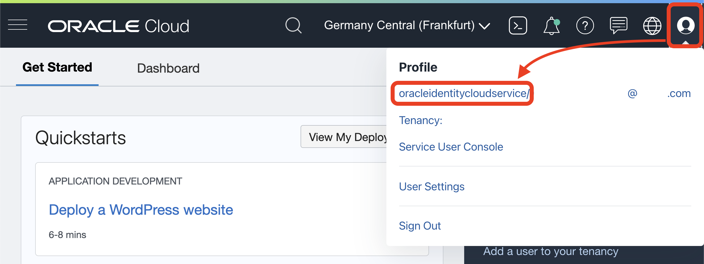
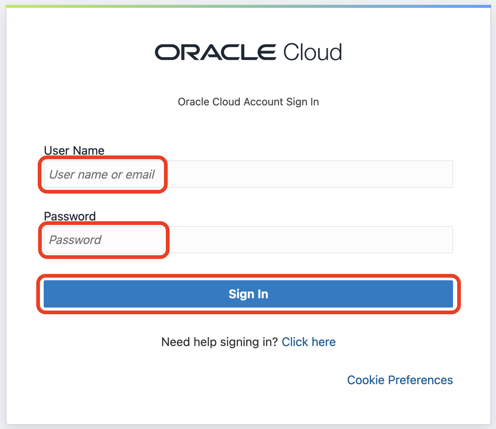
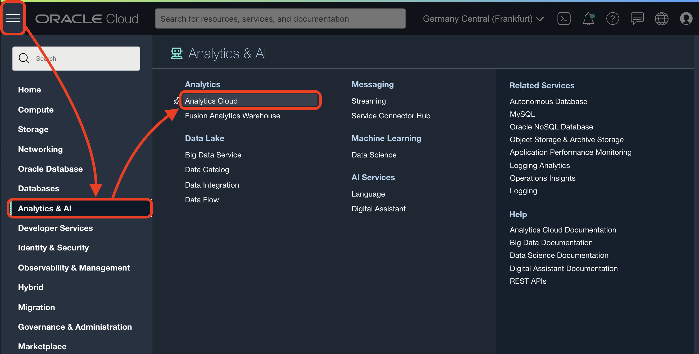
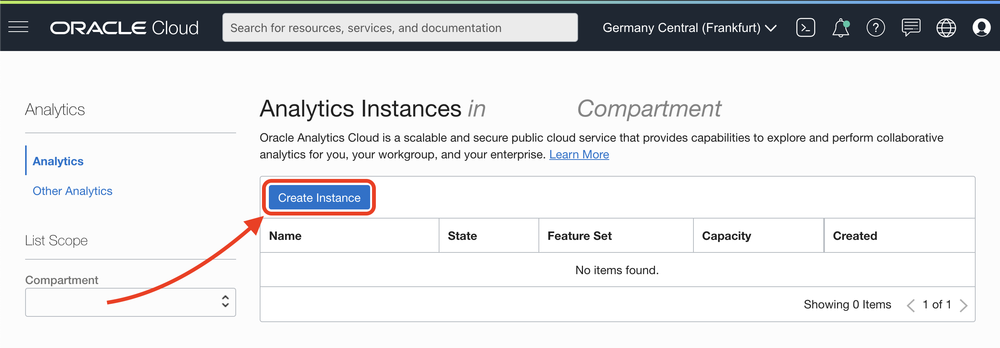

# Provision Analytics Cloud

## Introduction

In this lab, you will deploy an Oracle Analytics Cloud instance on Oracle Cloud Infrastructure.

> Provisioning Oracle Analytics Cloud can take up to 40 minutes.

<!--

-->

_Estimated Time:_ 5 minutes

### Objectives

In this lab, you will:

- Login as a federated user
- Create an Oracle Analytics Cloud Instance

### Prerequisites
This lab assumes you have:

- An Oracle Free Trial Account

## Task 1: Understand the Types of Users in Oracle Cloud

1. Oracle Cloud has two types of users:

   - **OCI Native users**: represent users like you, or applications that can perform operations on OCI native services
   - **OCI Federated users**: users with Identity Cloud Service (IDCS). IDCS is an Identity Provider included with Oracle Cloud to manage Identity services beyond basic users, groups and roles capabilities. For example, OAuth2.0, Multi Factor Authentication, etc

   > **Note:** Oracle Analytics Cloud (OAC) requires a Federated user.

2. Go to **Profile** on the top-right corner and make sure your user has the name **oracleidentitycloudservice/** appended before your email, like in the picture:

   

3. Don't you see **oracleidentitycloudservice/** before your email? Then, you need to Sign out and log in as a federated user, following these steps.

4. Go to cloud.oracle.com, type your **Cloud Account Name** and click **Next**.

   

5. Login with user and password.

   

6. At this point, you should have **oracleidentitycloudservice/** before your email on the Profile popup, on the top-right corner.

   For more information about federated users, see [User Provisioning for Federated Users](https://docs.cloud.oracle.com/en-us/iaas/Content/Identity/Tasks/usingscim.htm).

## Task 2: Create an Oracle Analytics Cloud (OAC) Instance

1. Return to the Home Page and go to the **Menu** > **Analytics & AI** > **Analytics Cloud**.

   

2. Make sure you select the `root` compartment (unless you have permissions and experience selecting a different one) and click **Create Instance**.

   

3. Fill the web form with the following information and click **Create**:

   - **Name**: `NBAWhatIf`
   - **Description**: `Analytics Instance for NBA What If Analysis`
   - **Create in Compartment**: `root` compartment, unless you have permissions and experience selecting a different one
   - **Feature Set**: `Enterprise Analytics`
   - **Capacity**: `OCPU` and `1 - Non Production`
   - **License Type**: `License Included`

    > **Note:** **1 OCPU** OAC instance is for **Trials Only;** please be aware that you cannot scale up an 1 OCP instance and also there are [Limits for Querying, Displaying, Exporting Data](https://docs.oracle.com/en/cloud/paas/analytics-cloud/acoci/create-services.html#GUID-7D6DB4EE-8DD5-44C5-9B6E-9FA847463A5F)

   Your Analytics Instance will start provisioning.

   

   > **Note:** Provisioning an Oracle Analytics Cloud instance can take from 10 (most likely) to 40 minutes.

   We will get back to your Oracle Analytics Cloud instance later in the workshop.

You may now *proceed to the next lab*.

## **Acknowledgements**

- **Author** - Jeroen Kloosterman (Technology Product Strategy Director), Victor Martin (Technology Product Strategy Manager)
- **Contributors** - Priscila Iruela, Arabella Yao
- **Last Updated By/Date** - Andres Quintana, October 2022
