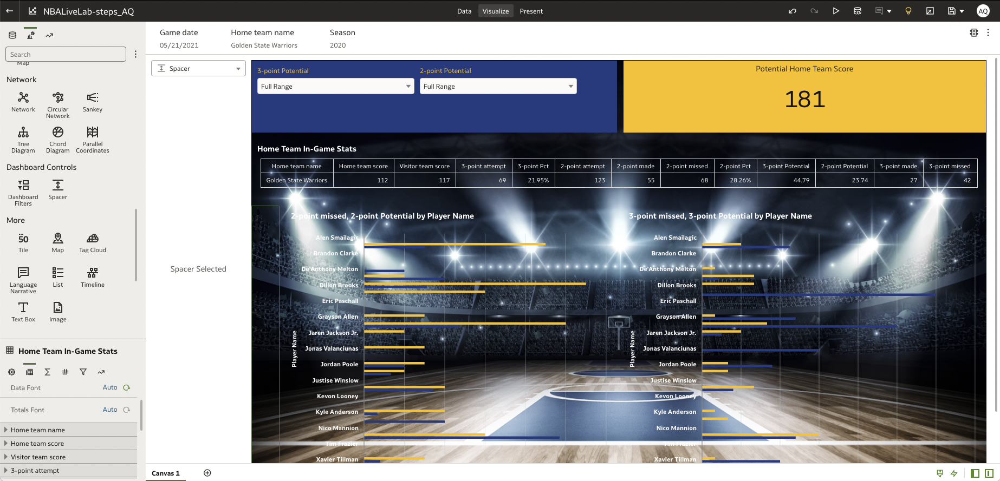

# Optional: Customize Dashboard

## Introduction

Let's have some fun with the design and layout of this dashboard. Oracle Analytics Cloud is a powerful tool and OAC dashboards can be customized to cater to individual presentation and display needs. The steps in this lab will teach you how to customize your dashboard to maximize the visual impact of your analysis.   

Estimated Time: 30 minutes

### Objectives

In this lab, you will:
* Download [background image](files/basketballcourt.jpg " ") file 
* Customize the background and layout of the dashboard you have already created. 

### Prerequisites

This lab assumes you have:
* An Oracle Cloud account

## Task 1: Concise Task Description

A visually impactful dashboard is captivating. Customizing your dashboard can make the insights from your presentation far more memorable. Follow these steps to develop a customized dashboard. 

1. Modify Filter Controls

2. Select filter controls visualization

3. Navigate to the bottom left of the page in the “General” (Gear Icon) tab. 

4. Scroll to “Background” 

5. Change “Auto” to “Custom”

6. Scroll to and click “Fill Color”

   

7. Change the Color Pallet 

8. Change color pallet to Golden State Warriors colors. Blue - # 1D428A, Gold - # FFC72C
  
9. In the same bottom left panel scroll up to “Label Font” 

10. Change “Auto” to “Custom" and change the font color. 

11. Adjust Colors: Select 2-Point Missed, 2-Point Potential by Player Name visualization. Right click and select Color > Manage Assignments 
     
12. Click on one of the color icons and change the colors to the Golden State Warriors colors 
  

## Task 2: Background Image

1. Add a Background Image (Image file is linked above under Objectives) 
    - **This will require reformatting all text on the dashboard**

2. Right click on Canvas 1

3. Select “Canvas Properties”

  

4. Upload the Image

5. Scroll to background and click on “Auto”, click on “Custom”, and select “None” next to Image Source 

  

6. Modify the Image

7. Select “File” and Upload the image file 

8. Next to “Image Align” Click the center square in the grid, click on “Locked” next to Image Aspect Ratio, change to “Unlocked”.

9. Click on “Original" next to Image Width

10. Change to “Auto Fit” 

## Task 3: Change the Fonts 

1. Change the Text Style, click on the 2-point missed, 2-point potential visualization 
  
2. Change the style and color of the title font to Bold and White (# ffffff)

3. Do the same for: Legend Labels, Axis Titles, Axis Labels 

  

4. Repeat this process for the 3-point missed, 3-point potential
   
5. Change the Table Font and Style 

6. Click on the table, drag it to above the two bar charts

7. Change the colors in the table. Make sure to change the font colors in all attributes: Title, Headers, Data

8. Add a Spacer to the dashboard. A spacer is needed to ensure that the Axis Labels are legible and not washed out by the background image. 

9. Click on visualizations 

  

  

10. Scroll to Spacer (under Dashboard Controls). Click and drag to the left of the bar graph on the left side of your dashboard

  

11. Adjust the size of the spacer so that all the Axis Labels are clearly legible. At the end your dashboard should look like this 

  

You have now completed all of the steps in this lab! 

## Acknowledgements
* **Author** - <Andres Quintana, Senior Product Manager, Analytics Product Strategy>
* **Contributors** -  <Carrie Nielsen, Senior Director, Analytics Product Strategy>
                   -  <Luke Wheless, Data Analyst BI-SCF>
* **Last Updated By/Date** - <Andres Quintana, September 2022>
