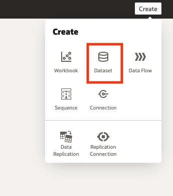
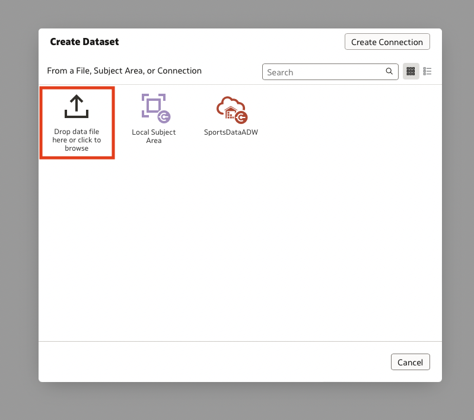
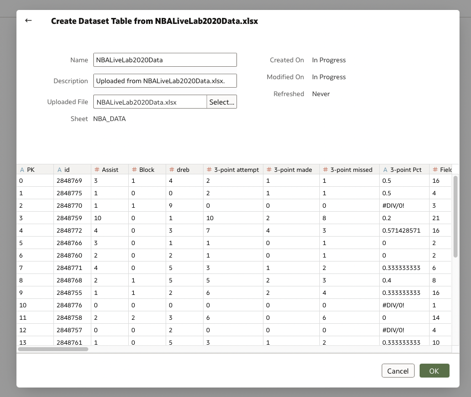
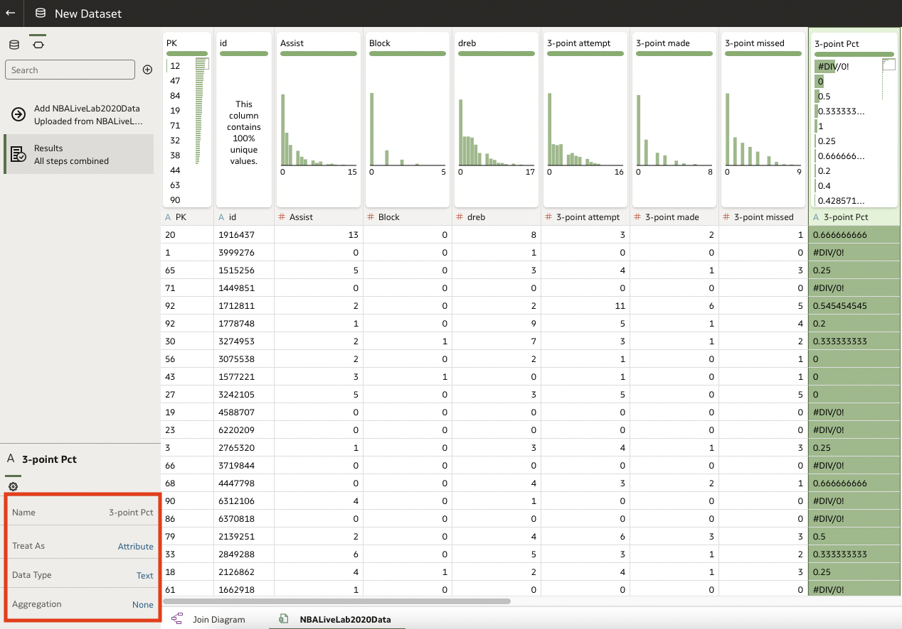
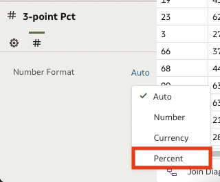
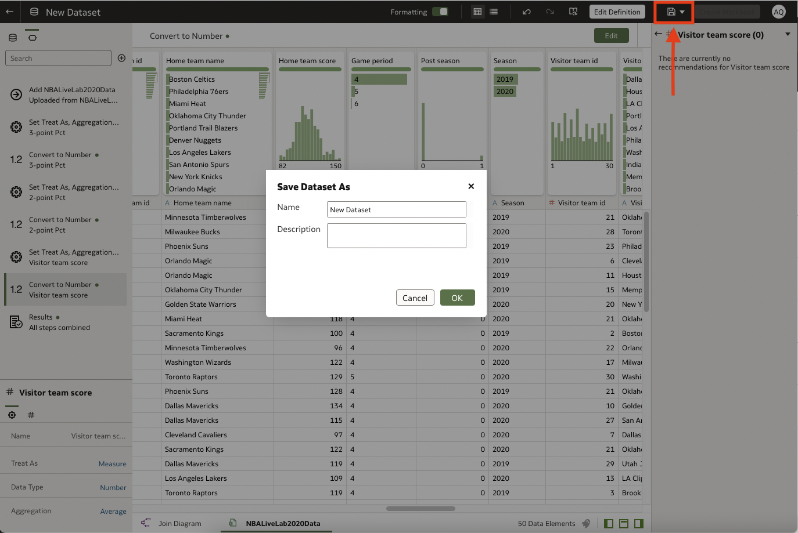
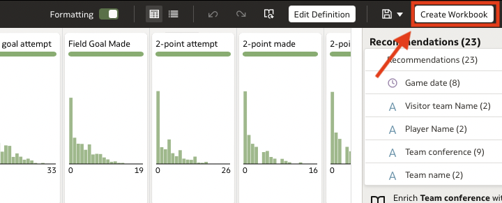
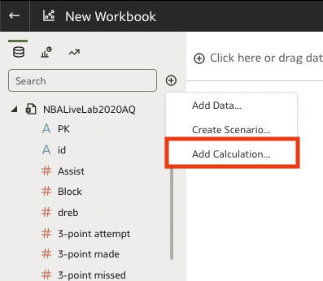
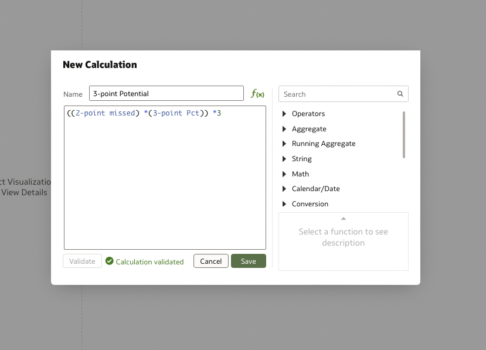

# Setup Data and Workbook

## Introduction

In this lab you will upload a dataset to Oracle Analytics Cloud, clean and format the data, and create the workbook environment from which the analyses will be completed. 

Estimated Lab Time: 10 minutes

### Objectives

In this lab, you will:
* Upload a provided dataset 
* Clean and format the data
* Create the analytics workbook

### Prerequisites 

This lab assumes you have:
* An Oracle Cloud account
* Downloaded the attached dataset: [NBA Data](files/nbalivelab2020data.xlsx)

## Task 1: Upload Dataset 

To begin this lab you will upload the provided dataset, and format the data. These steps are essential in ensuring that the future analyses are successful. The data format steps are the foundation that supports all analytic processes. 

1. Create the Dataset by navigating to the top right corner of the screen and clicking Create 

2. Select Create Dataset

	

3. Browse to Upload the Data on the option screen displayed, click on Drop Data File Here or Click to Browse. Select the excel file you downloaded called nbalivelab2020data. 

  

4. Preview the Data once the file is uploaded and click OK

  

## Task 2: Prepare the Data 

1. Prepare the Data. Start by clicking on nbalivelab2020data at the bottom left of the page. 

2. Click on the 3-point Pct column to select and convert to Measure by navigating to the bottom left corner of the page. Look for the label that says *Treat As*. Click on Attribute and change the selection to Measure.

3. Below that in Data Type change the selection to Number and Aggregation to Average from Count. 

  

4. Format Shooting Percentages by clicking on the numeric symbol in that menu "#" and change Number Format from Auto to Percent.

  

5. Repeat those steps for the 2-point Pct Column. 
  
6. Convert Visitor Team Score column to a Measure from an attribute -by selecting- the Visitor Team Score column and change the treat as selection (in the bottom left menu) from Attribute to Measure. 
    - Change the Data Type from Text to Number
    - Change Aggregation to Average
    - Repeat these steps for the Home Team Score column. 

## Task 3: Create the Workbook 

1. Save the Dataset. Click the save icon to save and name the dataset to NBAWhatIf

  

2. Create the Workbook. Click on Create Workbook. This will bring you to a blank workbook page. 

  

## Task 4: Create Calculations 

1. Create Calculations. To accomplish the analysis in later labs you will need to create three custom calculations. These calculations will be the foundation upon which the scenarios are tested. 

2. Click on the + sign to the right of the search field at the top left of the workbook. 

3. Select Add Calculation this will bring up a calculation box. 

  

4. First Calculation. The first will be the Potential 3 point shots based on missed 2 point shots. 

5. Title the calculation *3-point Potential*. In the calculation dialog box type two open parentheses "((". Click select 2-point missed and drag it to the calculation dialog box and type one closed parentheses ")" and an asterisk "*" followed by an open parentheses "(" click and drag 3-point PCT and drag it to the open parentheses and type two closed parentheses "))" followed by asterisk "*" 3. 
    
    **((2-point missed)*(3-point Pct)) *3**
    
6. Click validate. Click Save 

  

7. Repeat that process for the next calculations. 

8. **2-point Potential**
    
    ((3-point missed)*(2-point Pct)) *2
    
9. **Potential Home Team Score** 
    - To create this calculation you will follow the above steps and drag the previous calculations from the calculations tab. This calculation will show the previous two formulas within the dialog box.  
     
    ((2-point Potential) + (3-point Potential)) + home team score
    
This concludes the setup and preparation lab. You may proceed to the next lab.

## Acknowledgements
* **Author** - Andres Quintana, Senior Product Manager, Analytics Product Strategy
* **Contributors** -  Carrie Nielsen, Senior Director, Analytics Product Strategy
                   -  Luke Wheless, Data Analyst BI-SCF
* **Last Updated By/Date** - Andres Quintana, October 2022