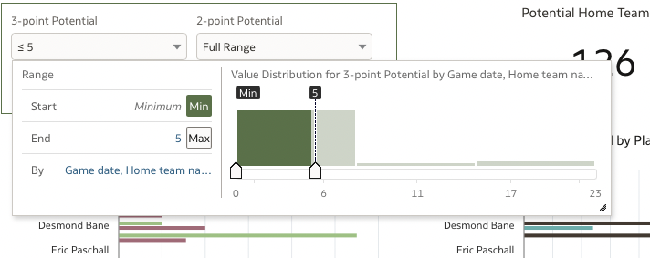

# What If Scenario Analysis

## Introduction

How does coaching strategy change to optimize game outcome using in-game player 2-point and 3-point shooting percentages? Do you have players shoot for more 3-pointers instead of 2-points? Or vice-versa? What If analysis is the process of adjusting known values to observe how those changes affect an outcome. 

Estimated Lab Time: 15 minutes

### Objectives

In this lab, you will:
* Use the Oracle Analytics Cloud dashboard you built in the previous lab to perform the What If Analysis 
* Advance your understanding of What If analysis techniques

### Prerequisites 

This lab assumes you have:
* An Oracle Cloud account
* All previous labs successfully completed

*This is the "fold" - below items are collapsed by default*

## Task 1: Perform What If Analysis 
A what-if analysis is the process of adjusting known values to observe how those small changes can affect an outcome. These scenario tests have a variety of real-world applications. To be successful in the what-if analysis you must have certain questions that you are trying to answer. 

1. Keep the following questions in mind as you work through the next steps of this lab: Does your lineup strategy change if you choose to recover more 2-point opportunities? What happens if you tell your players to recover more 3-point chances? Does your coaching strategy change as you look at potential point recovery?

2. Perform the Analysis. Select the 3-point and 2-point Potential filters and set both values to minimum. 

  

3. See the potential home team score tile change back to white with the conditional format settings. 

4. Reset the filters by clicking on “Max”

5. Select the 3-Point Potential filter and lower the top end to 5.
    
6. Select the 2-point Potential filter, change the top end to 6.

7. What are the Results? What has changed? Is having those players each shoot for 2 more 3-point and 3 more 2-point shots a strong strategy? 

8. Now, move the 3-point Potential slider to 9 possible recovered points. Knowing that you can only play 5 players, which 5 players give you the best chance to recover the most points by shooting more 3-point shots?

## Acknowledgements
* **Author** - <Andres Quintana, Senior Product Manager, Analytics Product Strategy>
* **Contributors** -  <Carrie Nielsen, Senior Director, Analytics Product Strategy>
                   -  <Luke Wheless, Data Analyst BI-SCF>
* **Last Updated By/Date** - <Andres Quintana, September 2022>
