# Create a Dataset

## Introduction

In this lab, you will create and prepare a dataset in Oracle Analytics Cloud that serves as the foundation for your AI agent. You’ll ensure the data is clean, well-structured, and uses business-friendly naming so it can be easily understood by both users and AI. This is a critical step, as the quality and clarity of your dataset directly impact the accuracy of insights generated later.

Estimated Time: 20 minutes

### Objectives

In this lab, you will:
* Create a Dataset from a File
* Enrich and Transform the Dataset using AI Assistant
* Make the Dataset available for AI Assistant

### Prerequisites 

This lab assumes you have:
* Basic understanding of data wrrangling conccepts

## Task 1:  Create a Dataset from a File

In this step you shall load a file dataset provided here **Sales Data for AI** from your local machine into the OAC.

1. Navigate to **Create** menu then **Dataset**.

	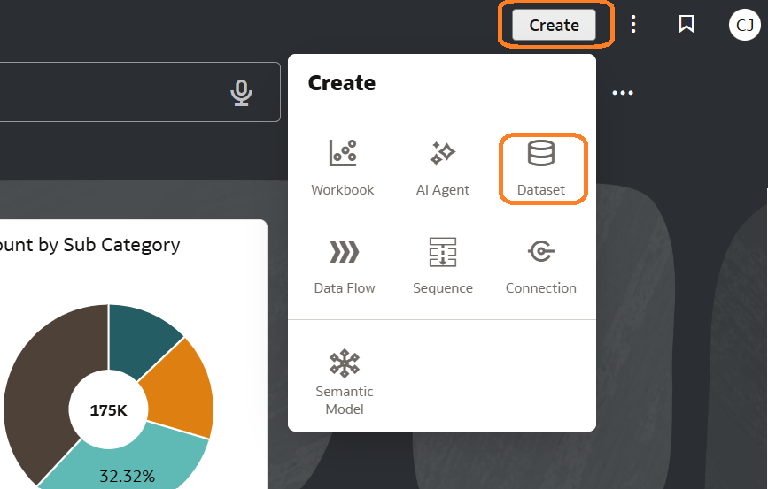

2. Click Upward Arrow **Drop data file here or click to browse** then select the file

  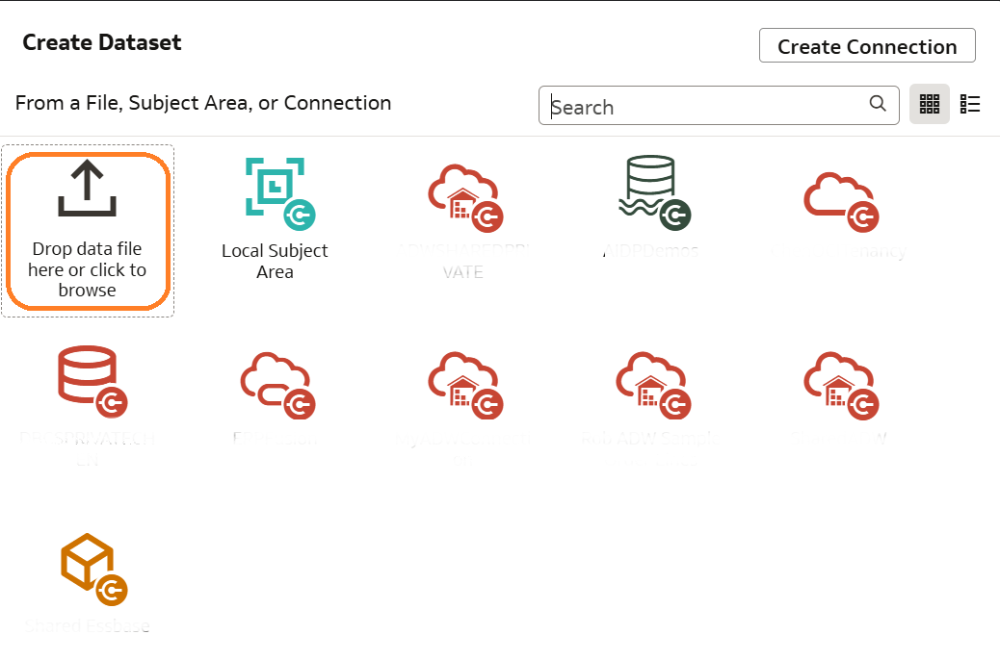

3. Verify the correct tab is loaded then **Click** OK

 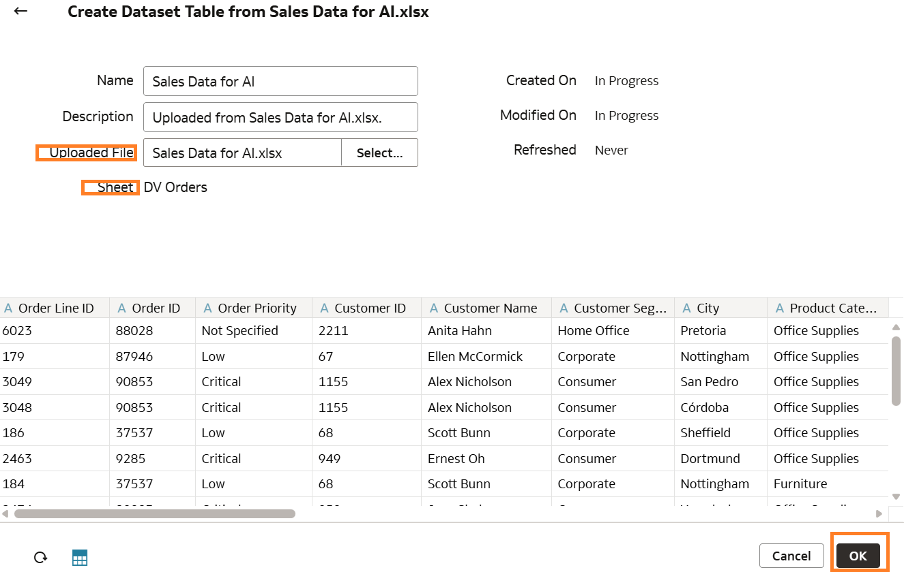

 > **Note:** The page opens to the Dataset Editor pane which shows quality insights tile for each column, dataset table page tabs and toggle buttons at the bottom.  

       
## Task 2:  Enrich and Transform the Dataset

In this task we will discover the powerful data enrichment and transformation capabilities such as recommendations, auto column naming and etc. You'll ensure the data is clean, well-structured and uses business friendly names so the AI can easily understand it to improve accuracy.

1. Click **Sales Data for AI** tab to navigate to the transform editor.

 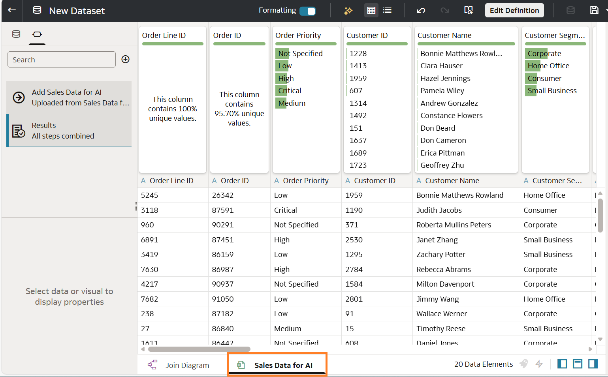

2. **Save** the Dataset

 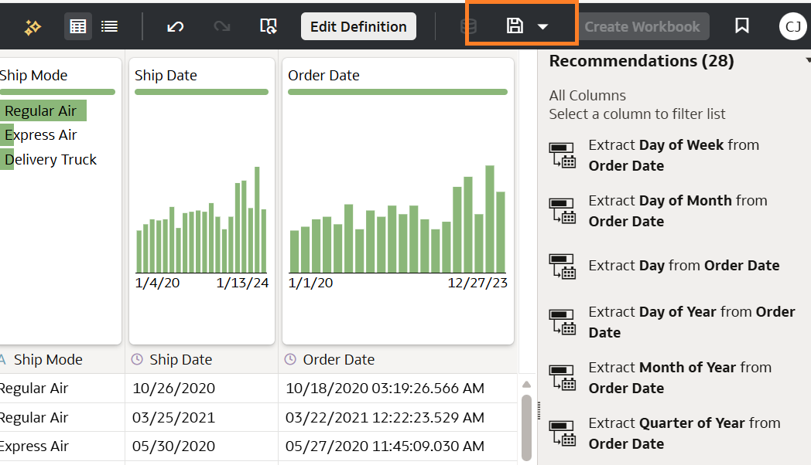

 > **Note:** OAC recently released unified catalog experience to manage not just workbooks and dashboards but also datasets, data flows, connections, sequences, and more within clearly structured catalog folders.

3. Switch the view from data to **Metadata** to verify each column data type and aggregation 

 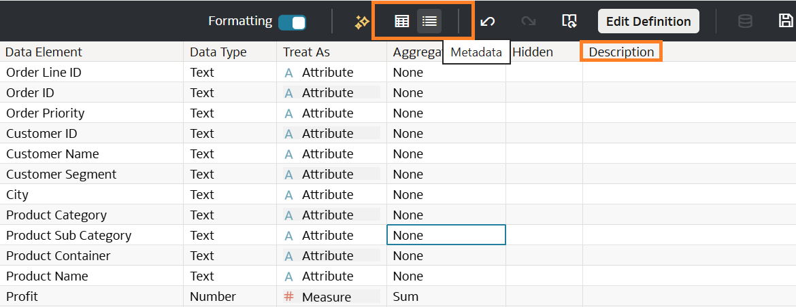

   > **Note:** You can also add business descrptions to each column that helps the LLMs and also Hide any columns that are not needed

4. Switch back to Data view, then **Click Recommendations** , scoll down and **Click** Extract Year from Order Date

  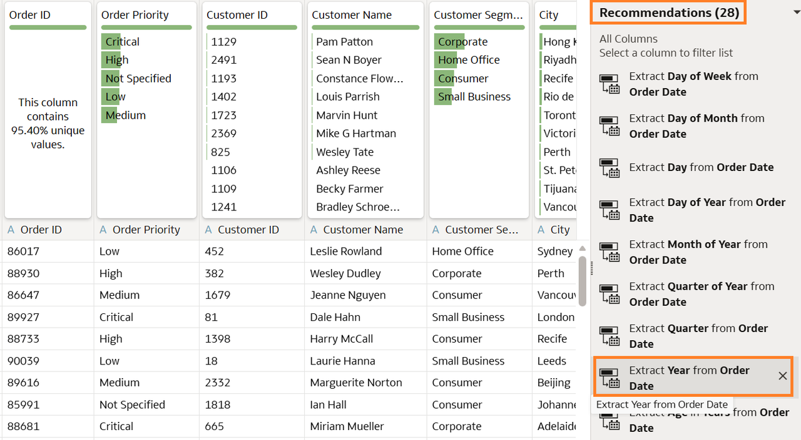

5. Verify the new step is added to **Preparation Script**, and the new column Order Date Year 1 is added to the table. **Click** 3 dots next to Order Date Year 1, then **Rename**

  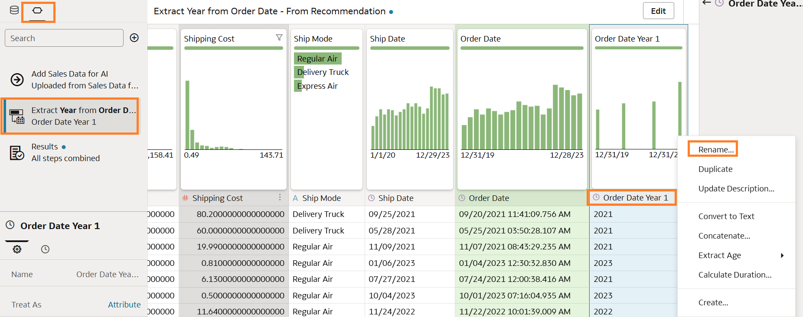

> **Note:** Enrichment and Transformation does not change data in your source system. You can build your columns using a wide range of functions and expressions from the Oracle Analytics functions library. For example, aggregates, strings, expressions, and math functions.

6. You can also use **AI Assistant** to transform your data. **Click** AI Assistant, under Column Rename **Click** Generate Column Names

  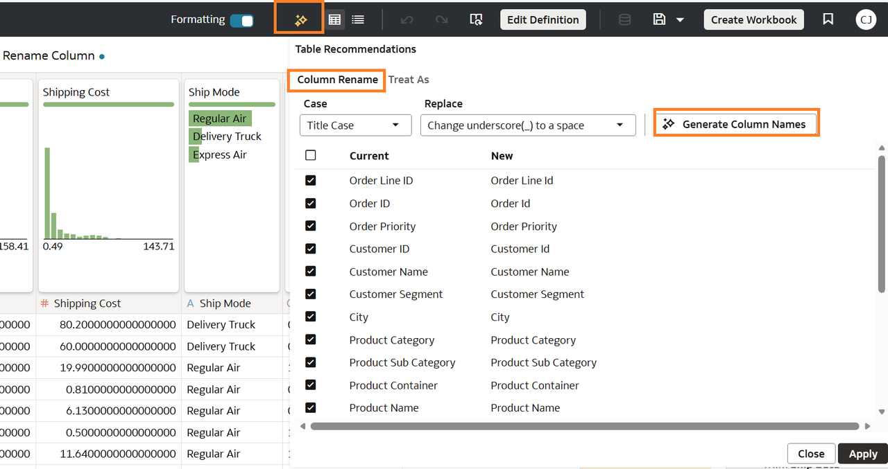

> **Note:** For Column Rename you can change the Case, Replace underscores as an example or Generate Column Names. For Treat As you can update the column types.

7. Notice the new names generated by the AI Assistant. **Click** Apply , then **Save** your dataset.

  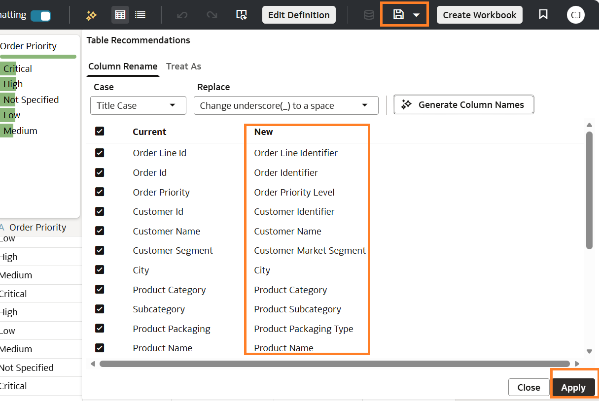

## Task 3:  Make the Dataset available for AI Assistant

In this step you shall index a dataset to make its data attributes available to Oracle Analytics AI Assistant within workbooks or from your home page. You can index all or some of the dataset's attributes and apply synonyms to make the attributes easier to search.

1. Go to **Navigator** on the left side, **Click** Data

	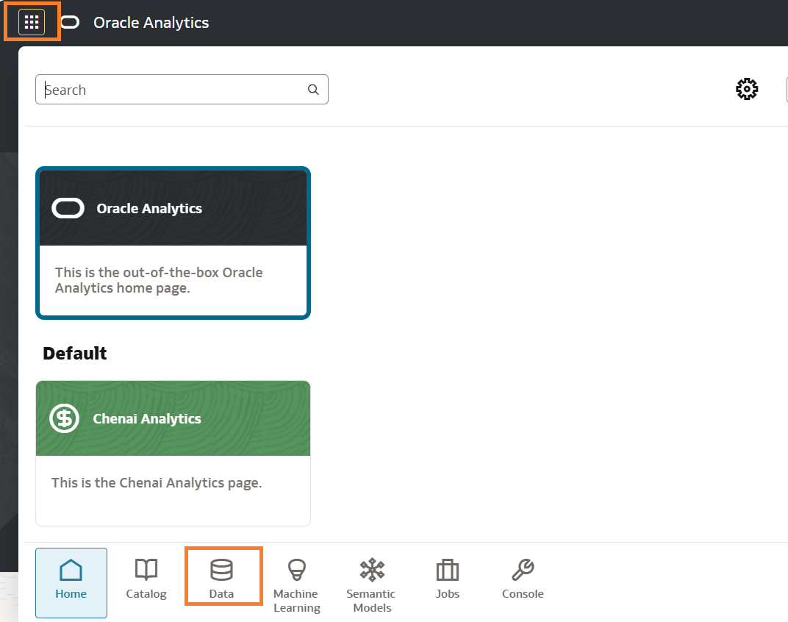

2. Choose the Sales AI Data, then under **Actions** Click Inspect

  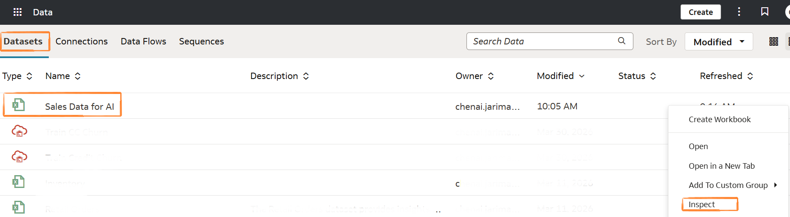

3. Click **Search** , then **Assistants and Homepage Search** under Index Dataset For, Click **Save** then **Run Now**

  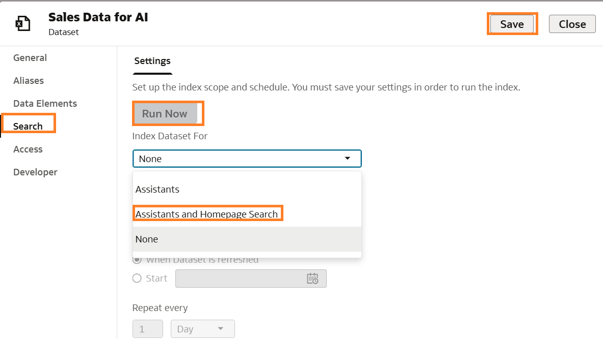

  > **Note:** If successful, a message Dataset index successfully initiated is displayed at the bottom, just click OK and Close

## Learn More
* [Enrich and Tranform Data](https://docs.oracle.com/en/cloud/paas/analytics-cloud/acubi/enrich-and-transform-data.html)
* [Unified Catalog in OAC](https://www.youtube.com/watch?v=fp9F80-wyTQ)

## Acknowledgements
* **Author** - Chenai Jarimani, Cloud Architect, ONA
* **Last Updated By/Date** - Chenai Jarimani, May 2026
